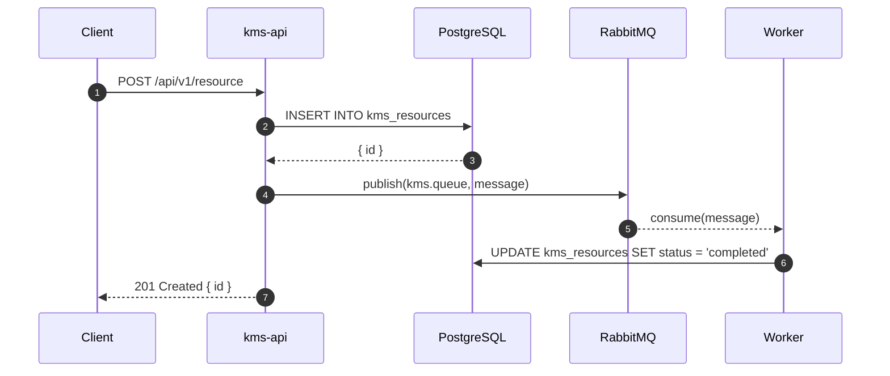

# KMS Engineering Standards

> **Status**: Authoritative — all new code MUST conform to this document.
> **Last Updated**: 2026-03-17
> **Owner**: Architecture Team

This document is the single source of truth for technology choices, folder structures, naming conventions, coding patterns, observability, documentation, and quality standards across the entire KMS monorepo. Read this **before** writing any service code.

---

## Table of Contents

1. [Final Tech Stack Decisions](#1-final-tech-stack-decisions)
2. [Monorepo Layout](#2-monorepo-layout)
3. [NestJS Service Standards (kms-api, search-api)](#3-nestjs-service-standards)
4. [Python Service Standards (workers, voice-app, rag-service)](#4-python-service-standards)
5. [Shared Packages](#5-shared-packages)
6. [Logging Standards](#6-logging-standards)
7. [Error Handling Standards](#7-error-handling-standards)
8. [Observability Standards](#8-observability-standards)
9. [API Documentation Standards](#9-api-documentation-standards)
10. [Testing Standards](#10-testing-standards)
11. [Naming Conventions](#11-naming-conventions)
12. [SOLID / DRY / KISS Enforcement](#12-solid--dry--kiss-enforcement)
13. [ADR Process](#13-adr-process)
14. [Sequence Diagram Standards](#14-sequence-diagram-standards)
15. [Git & PR Standards](#15-git--pr-standards)

---

## 1. Final Tech Stack Decisions

### 1.1 Decision Table (NON-NEGOTIABLE)

| Concern | Chosen | Rejected | Rationale ADR |
|---|---|---|---|
| **NestJS HTTP adapter** | Fastify (`NestFastifyApplication`) | Express | ADR-001 |
| **NestJS ORM** | Prisma 5 | TypeORM, Drizzle | ADR-002 |
| **NestJS logging** | `nestjs-pino` + `pino` | Winston, built-in Logger | ADR-003 |
| **NestJS compiler** | SWC | tsc | ADR-004 |
| **NestJS CQRS** | Skip — standard service layer | CQRS pattern | ADR-005 |
| **Python AMQP** | `aio-pika` with `connect_robust()` | Celery, Dramatiq, arq | ADR-006 |
| **Python logging** | `structlog` with contextvars | loguru, python-json-logger | ADR-007 |
| **Python DB (API tier)** | SQLAlchemy async + asyncpg | psycopg2, raw asyncpg | ADR-008 |
| **Python DB (worker tier)** | raw `asyncpg` | SQLAlchemy | ADR-008 |
| **Embedding model** | `BAAI/bge-m3` (BGE-M3) | nomic-embed-text, all-MiniLM-L6-v2 | ADR-009 |
| **Vector database** | Qdrant | pgvector, Weaviate, Pinecone | ADR-010 |
| **Graph database** | Neo4j (official `neo4j` async driver) | ArangoDB, TigerGraph, py2neo | ADR-011 |
| **Agent protocol** | ACP (IBM/Linux Foundation REST) | JSON-RPC, gRPC, custom | ADR-012 |
| **Agent orchestrator** | Custom NestJS HTTP orchestrator | LangGraph, CrewAI, AutoGen | ADR-013 |
| **RAG internal pipeline** | LangGraph (inside rag-service only) | Custom chain | ADR-013 |
| **LLM streaming** | SSE (Server-Sent Events) | WebSocket, polling | ADR-014 |
| **ADR format** | MADR (Markdown Any Decision Records) | Michael Nygard, Y-Statements | ADR-015 |
| **Sequence diagrams** | Mermaid | PlantUML (only C4 architecture) | ADR-015 |
| **TypeScript docs** | TSDoc | JSDoc | ADR-015 |
| **Python docs** | Google-style docstrings | NumPy, Sphinx | ADR-015 |
| **API contracts** | OpenAPI 3.1 YAML (code-generated) | Manual DTO-first | ADR-016 |
| **Shared error codes** | `error-codes.json` → TS enum + Python StrEnum | Per-service codes | ADR-017 |

### 1.2 Service Port Map

| Service | Language | Port | Role |
|---|---|---|---|
| `kms-api` | NestJS 11 | 8000 | Core REST API — auth, files, sources, users |
| `search-api` | NestJS 11 | 8001 | Read-only hybrid search (Postgres FTS + Qdrant) |
| `rag-service` | FastAPI | 8002 | RAG pipeline, SSE streaming chat |
| `voice-app` | FastAPI | 8003 | Transcription microservice |
| `scan-worker` | Python | — | File discovery worker (RabbitMQ consumer) |
| `embed-worker` | Python | — | Embedding generation worker |
| `dedup-worker` | Python | — | Deduplication worker |
| `graph-worker` | Python | — | Neo4j relationship builder |

### 1.3 Infrastructure

| Component | Technology | Version |
|---|---|---|
| Database | PostgreSQL | 16 |
| Vector store | Qdrant | Latest |
| Graph store | Neo4j Community | 5.x |
| Cache | Redis | 7 |
| Queue | RabbitMQ | 3.13 |
| Object storage | MinIO | Latest |
| Tracing | Jaeger | Latest |
| Metrics | Prometheus + Grafana | Latest |
| OTel Collector | OpenTelemetry Collector | Latest |

---

## 2. Monorepo Layout

```
knowledge-base/
├── kms-api/                    # NestJS — core API
├── search-api/                 # NestJS — read-only search
├── services/
│   ├── rag-service/            # FastAPI — RAG + streaming
│   ├── voice-app/              # FastAPI — transcription
│   ├── scan-worker/            # Python — file scanner
│   ├── embed-worker/           # Python — embedding generator
│   ├── dedup-worker/           # Python — deduplication
│   └── graph-worker/           # Python — Neo4j builder
├── packages/                   # Shared TypeScript packages
│   ├── errors/                 # @kb/errors — AppException hierarchy
│   ├── logger/                 # @kb/logger — nestjs-pino wrapper
│   ├── tracing/                # @kb/tracing — OTel init + helpers
│   └── contracts/              # @kb/contracts — generated types from OpenAPI
├── contracts/
│   └── openapi.yaml            # SINGLE SOURCE OF TRUTH for all API contracts
├── docs/
│   ├── architecture/
│   │   ├── ENGINEERING_STANDARDS.md   ← this file
│   │   ├── decisions/                 # ADR files (NNNN-title.md)
│   │   └── sequence-diagrams/         # Mermaid .md files per flow
│   └── ...
├── infra/
│   ├── otel/
│   ├── prometheus/
│   └── grafana/
├── scripts/
├── docker-compose.kms.yml
└── .kms/config.json
```

---

## 3. NestJS Service Standards

Applies to: `kms-api`, `search-api`

### 3.1 Folder Structure (Feature-First)

```
src/
├── instrumentation.ts          # OTel init — MUST be imported first in main.ts
├── main.ts                     # Bootstrap only — no business logic
├── app.module.ts               # Root module
├── config/
│   └── config.schema.ts        # Zod schema for env validation
├── common/
│   ├── decorators/             # @Public(), @CurrentUser(), @Roles()
│   ├── filters/                # AllExceptionsFilter, PrismaExceptionFilter
│   ├── guards/                 # JwtAuthGuard, RolesGuard
│   ├── interceptors/           # LoggingInterceptor, TimeoutInterceptor
│   ├── middleware/             # RequestIdMiddleware, CorrelationMiddleware
│   └── pipes/                  # ZodValidationPipe
├── modules/
│   ├── auth/                   # Feature module
│   │   ├── auth.module.ts
│   │   ├── auth.controller.ts
│   │   ├── auth.service.ts
│   │   ├── auth.service.spec.ts
│   │   ├── dto/
│   │   │   ├── login.dto.ts
│   │   │   └── register.dto.ts
│   │   ├── entities/           # Prisma model wrappers (if needed)
│   │   └── strategies/         # Passport strategies
│   ├── files/
│   ├── sources/
│   ├── users/
│   └── search/                 # search-api specific
├── health/
│   ├── health.module.ts
│   └── health.controller.ts    # /health/live, /health/ready, /health/startup
└── prisma/
    ├── prisma.module.ts
    └── prisma.service.ts
```

**Rules:**
- One folder per domain feature inside `src/modules/`
- No global `services/`, `repositories/`, `controllers/` folders at root level
- Each module exports only what other modules need — everything else is private
- `common/` is for truly cross-cutting infrastructure (guards, filters, pipes) — NOT for shared business logic

### 3.2 main.ts Template

```typescript
// CRITICAL: OTel instrumentation MUST be first import
import './instrumentation';

import { NestFactory } from '@nestjs/core';
import {
  FastifyAdapter,
  NestFastifyApplication,
} from '@nestjs/platform-fastify';
import { Logger } from 'nestjs-pino';
import { SwaggerModule, DocumentBuilder } from '@nestjs/swagger';
import { AppModule } from './app.module';

async function bootstrap() {
  const app = await NestFactory.create<NestFastifyApplication>(
    AppModule,
    new FastifyAdapter({ logger: false }),
    { bufferLogs: true },
  );

  // Use pino logger (replaces NestJS built-in)
  app.useLogger(app.get(Logger));

  // Global prefix
  app.setGlobalPrefix('api/v1');

  // Swagger (auto-generated API docs)
  const config = new DocumentBuilder()
    .setTitle('KMS API')
    .setVersion('1.0')
    .addBearerAuth()
    .build();
  const document = SwaggerModule.createDocument(app, config);
  SwaggerModule.setup('api/v1/docs', app, document);

  await app.listen(process.env.PORT ?? 8000, '0.0.0.0');
}

bootstrap();
```

### 3.3 Logging — nestjs-pino

**NEVER use** `new Logger(ServiceName.name)` or `console.log`.

```typescript
// ✅ CORRECT
import { InjectPinoLogger, PinoLogger } from 'nestjs-pino';

@Injectable()
export class FilesService {
  constructor(
    @InjectPinoLogger(FilesService.name)
    private readonly logger: PinoLogger,
  ) {}

  async findAll(userId: string): Promise<File[]> {
    this.logger.info({ userId }, 'Fetching files');
    // ...
  }
}

// ❌ WRONG — do not do this
private readonly logger = new Logger(FilesService.name);
```

**LoggerModule registration in AppModule:**

```typescript
LoggerModule.forRootAsync({
  imports: [ConfigModule],
  inject: [ConfigService],
  useFactory: (config: ConfigService) => ({
    pinoHttp: {
      level: config.get('LOG_LEVEL', 'info'),
      transport:
        config.get('NODE_ENV') === 'development'
          ? { target: 'pino-pretty' }
          : undefined,
      serializers: {
        req: (req) => ({
          method: req.method,
          url: req.url,
          requestId: req.id,
        }),
      },
    },
  }),
}),
```

### 3.4 Error Handling Chain

Register filters in **this exact order** (most specific first):

```typescript
// main.ts or app.module.ts providers
app.useGlobalFilters(
  new PrismaExceptionFilter(),   // Catches Prisma errors → maps to HTTP codes
  new AllExceptionsFilter(),     // Catches everything else
);
```

`PrismaExceptionFilter` must map:
- `P2002` (unique constraint) → 409 Conflict
- `P2025` (not found) → 404 Not Found
- `P2003` (foreign key) → 409 Conflict

### 3.5 DTO Validation — Zod Only

```typescript
// dto/create-file.dto.ts
import { z } from 'zod';
import { createZodDto } from 'nestjs-zod';
import { ApiProperty } from '@nestjs/swagger';

export const CreateFileSchema = z.object({
  name: z.string().min(1).max(255),
  sourceId: z.string().uuid(),
  mimeType: z.string(),
});

export class CreateFileDto extends createZodDto(CreateFileSchema) {
  @ApiProperty({ description: 'File display name', example: 'report.pdf' })
  name: string;

  @ApiProperty({ description: 'Source UUID' })
  sourceId: string;

  @ApiProperty({ description: 'MIME type' })
  mimeType: string;
}
```

### 3.6 Swagger Decorator Checklist

Every controller endpoint MUST have:
- `@ApiTags('domain-name')`
- `@ApiOperation({ summary: '...' })`
- `@ApiResponse({ status: 200, type: ResponseDto })`
- `@ApiResponse({ status: 400, description: 'Validation error' })`
- `@ApiResponse({ status: 401, description: 'Unauthorized' })`
- `@ApiBearerAuth()` on protected routes
- `@ApiBody({ type: CreateDto })` on POST/PUT
- `@ApiParam({ name: 'id', type: 'string' })` on parameterized routes

### 3.7 TSDoc on All Exported Symbols

```typescript
/**
 * Retrieves paginated files for a user.
 *
 * @remarks
 * Results are sorted by `createdAt DESC`. Soft-deleted files are excluded.
 *
 * @param userId - The authenticated user's UUID
 * @param page - 1-based page number
 * @param limit - Max 100 items per page
 * @returns Paginated file list with total count
 * @throws {@link NotFoundException} When user does not exist
 */
async findAll(userId: string, page: number, limit: number): Promise<PaginatedFiles>
```

### 3.8 SWC Configuration

`.swcrc` must include:

```json
{
  "jsc": {
    "parser": {
      "syntax": "typescript",
      "decorators": true
    },
    "transform": {
      "legacyDecorator": true,
      "decoratorMetadata": true
    },
    "keepClassNames": true,
    "baseUrl": ".",
    "paths": { "@/*": ["src/*"] }
  }
}
```

`nest-cli.json`:

```json
{
  "compilerOptions": {
    "builder": { "type": "swc" },
    "typeCheck": true
  }
}
```

---

## 4. Python Service Standards

Applies to: `voice-app`, `rag-service`, `scan-worker`, `embed-worker`, `dedup-worker`, `graph-worker`

### 4.1 Folder Structure (Domain-Driven)

```
services/scan-worker/
├── src/
│   ├── config.py               # pydantic-settings BaseSettings
│   ├── main.py                 # FastAPI app + startup/shutdown lifespan
│   ├── worker.py               # AMQP consumer entrypoint
│   ├── connectors/             # Domain: file source adapters
│   │   ├── __init__.py
│   │   ├── base.py             # ABC BaseConnector
│   │   ├── local.py
│   │   └── registry.py
│   ├── handlers/               # Domain: message handlers
│   │   └── scan_handler.py
│   ├── models/                 # Domain: data models (Pydantic)
│   │   └── messages.py
│   ├── exceptions/             # Domain: typed exceptions
│   │   └── scan_exceptions.py
│   └── utils/                  # Cross-cutting utilities
│       └── checksum.py
├── tests/
│   ├── unit/
│   └── integration/
├── Dockerfile
├── pyproject.toml
└── requirements.txt
```

**Rules:**
- Group by **domain** (connectors, handlers, models), NOT by file type (routers, models, services)
- Each domain folder has an `__init__.py` that exports the public interface
- `utils/` is only for stateless functions with no side effects
- No `services/` folder — use domain-specific names (`connectors/`, `handlers/`, `pipelines/`)

### 4.2 Configuration — pydantic-settings v2

```python
# src/config.py
from pydantic import Field, SecretStr
from pydantic_settings import BaseSettings, SettingsConfigDict


class Settings(BaseSettings):
    """Application configuration loaded from environment variables.

    Attributes:
        rabbitmq_url: AMQP connection URL including credentials.
        postgres_dsn: Async PostgreSQL DSN for asyncpg.
        log_level: Logging verbosity. Defaults to INFO.
    """

    model_config = SettingsConfigDict(
        env_file=".env",
        env_file_encoding="utf-8",
        case_sensitive=False,
    )

    rabbitmq_url: SecretStr = Field(..., description="AMQP connection URL")
    postgres_dsn: SecretStr = Field(..., description="Async PostgreSQL DSN")
    log_level: str = Field("INFO", description="Log level")
    queue_name: str = Field("kms.scan", description="Input queue name")
    prefetch_count: int = Field(1, ge=1, le=10)


settings = Settings()
```

### 4.3 Logging — structlog

**NEVER use** `logging.getLogger(__name__)` or `print()`.

```python
# src/main.py — configure at startup
import structlog
from structlog.contextvars import merge_contextvars

structlog.configure(
    processors=[
        merge_contextvars,                           # Injects trace_id, request_id
        structlog.stdlib.add_log_level,
        structlog.stdlib.add_logger_name,
        structlog.processors.TimeStamper(fmt="iso"),
        structlog.processors.JSONRenderer(),         # JSON in production
    ],
    wrapper_class=structlog.make_filtering_bound_logger(logging.INFO),
    context_class=dict,
    logger_factory=structlog.PrintLoggerFactory(),
)
```

```python
# In any module
import structlog

logger = structlog.get_logger(__name__)

async def process_file(file_id: str, user_id: str) -> None:
    """Process a file and emit structured logs.

    Args:
        file_id: UUID of the file to process.
        user_id: UUID of the owning user (for correlation).

    Raises:
        FileNotFoundError: When file_id does not exist in storage.
    """
    log = logger.bind(file_id=file_id, user_id=user_id)
    log.info("file_processing_started")
    # ...
    log.info("file_processing_completed", duration_ms=elapsed)
```

**FastAPI middleware to inject `request_id` into structlog context:**

```python
from structlog.contextvars import clear_contextvars, bind_contextvars

@app.middleware("http")
async def structlog_middleware(request: Request, call_next):
    clear_contextvars()
    bind_contextvars(
        request_id=request.headers.get("x-request-id", str(uuid4())),
        path=request.url.path,
        method=request.method,
    )
    response = await call_next(request)
    return response
```

### 4.4 AMQP — aio-pika

```python
# src/worker.py
import aio_pika
from aio_pika.abc import AbstractIncomingMessage


async def run_worker(settings: Settings) -> None:
    """Start the AMQP consumer with automatic reconnection.

    Uses connect_robust() for transparent reconnection on broker restarts.
    prefetch_count=1 ensures one message at a time per worker instance.
    """
    connection = await aio_pika.connect_robust(
        settings.rabbitmq_url.get_secret_value(),
        heartbeat=60,
    )
    async with connection:
        channel = await connection.channel()
        await channel.set_qos(prefetch_count=settings.prefetch_count)

        queue = await channel.declare_queue(
            settings.queue_name,
            durable=True,
            arguments={
                "x-dead-letter-exchange": "kms.dlx",
                "x-queue-type": "quorum",    # Quorum queues for durability
            },
        )

        async for message in queue:
            async with message.process(requeue_on_error=True):
                await handle_message(message)
```

### 4.5 FastAPI App Template

```python
# src/main.py
from contextlib import asynccontextmanager
from fastapi import FastAPI
from .config import settings
from .observability import configure_telemetry  # OTel MUST be configured before routes


@asynccontextmanager
async def lifespan(app: FastAPI):
    """Manage application lifecycle: startup and shutdown."""
    # Startup
    configure_telemetry(app)          # OTel init — before anything else
    await startup_tasks()
    yield
    # Shutdown
    await shutdown_tasks()


app = FastAPI(
    title="Scan Worker",
    version="1.0.0",
    lifespan=lifespan,
)
```

### 4.6 Google-Style Docstrings (MANDATORY)

All public functions, classes, and methods must have docstrings:

```python
def chunk_text(text: str, chunk_size: int = 512, overlap: int = 64) -> list[str]:
    """Split text into overlapping chunks for embedding.

    Snaps chunk boundaries to word edges to avoid splitting mid-word.
    The last chunk may be shorter than chunk_size.

    Args:
        text: Raw text content to chunk. Must be non-empty.
        chunk_size: Target character count per chunk. Defaults to 512.
        overlap: Character overlap between consecutive chunks. Defaults to 64.

    Returns:
        List of text chunks. Empty list if text is empty.

    Raises:
        ValueError: If chunk_size <= 0 or overlap >= chunk_size.

    Example:
        >>> chunks = chunk_text("Hello world", chunk_size=5, overlap=1)
        >>> len(chunks)
        3
    """
```

### 4.7 Exception Hierarchy

```python
# src/exceptions/base.py
class KMSWorkerError(Exception):
    """Base exception for all worker errors.

    Attributes:
        code: Machine-readable error code (e.g., SCN1001).
        message: Human-readable description.
        retryable: Whether the job should be re-queued.
    """
    code: str
    retryable: bool = False

    def __init__(self, message: str, *, retryable: bool = False):
        super().__init__(message)
        self.retryable = retryable


class ConnectorError(KMSWorkerError):
    """Raised when a file source connector fails."""
    code = "SCN1001"
    retryable = True


class ExtractionError(KMSWorkerError):
    """Raised when text cannot be extracted from a file."""
    code = "EMB2001"
    retryable = False
```

---

## 5. Shared Packages

### 5.1 `@kb/errors`

**Location**: `packages/errors/`
**Dependency**: Plain TypeScript only — NO NestJS, NO FastAPI
**Purpose**: Define `AppException` hierarchy that both NestJS and Python (via generated Python enum) share.

```
packages/errors/
├── src/
│   ├── index.ts
│   ├── app-exception.ts        # Base AppException class
│   ├── domain/
│   │   ├── auth.errors.ts      # AUTH_001, AUTH_002...
│   │   ├── file.errors.ts      # FILE_001, FILE_002...
│   │   ├── search.errors.ts
│   │   └── worker.errors.ts
│   └── error-codes.ts          # Generated from error-codes.json
└── package.json                # { "name": "@kb/errors" }
```

```typescript
// src/app-exception.ts
export class AppException extends Error {
  constructor(
    public readonly code: string,
    public readonly message: string,
    public readonly statusCode: number = 500,
    public readonly details?: Record<string, unknown>,
  ) {
    super(message);
    this.name = 'AppException';
  }
}
```

### 5.2 `@kb/logger`

**Location**: `packages/logger/`
**Purpose**: NestJS module that configures `nestjs-pino` with standard KMS fields.

```typescript
// Exported usage
import { KbLoggerModule } from '@kb/logger';

@Module({
  imports: [KbLoggerModule.forRoot()],
})
export class AppModule {}
```

### 5.3 `@kb/tracing`

**Location**: `packages/tracing/`
**Purpose**: OTel SDK setup + helper functions for custom spans.

```typescript
// instrumentation.ts in each service
import { initTracing } from '@kb/tracing';
initTracing({ serviceName: 'kms-api' });

// Custom span helper
import { withSpan } from '@kb/tracing';
const results = await withSpan('kb.vector_search', async (span) => {
  span.setAttribute('qdrant.collection', collection);
  return qdrantClient.search(collection, query);
});
```

### 5.4 `contracts/openapi.yaml`

The **single source of truth** for all REST API contracts. TypeScript types and Python Pydantic models are **generated** from this file — never write them by hand.

```bash
# Generate TypeScript types
openapi-typescript contracts/openapi.yaml --output packages/contracts/src/generated.ts

# Generate Python models
datamodel-code-generator --input contracts/openapi.yaml --output services/rag-service/src/generated
```

---

## 6. Logging Standards

### 6.1 Mandatory Log Fields

Every log entry MUST include these fields:

| Field | Type | Source |
|---|---|---|
| `timestamp` | ISO 8601 | Logger config |
| `level` | string | Logger config |
| `service` | string | `SERVICE_NAME` env var |
| `trace_id` | string | OTel context |
| `span_id` | string | OTel context |
| `request_id` | string | `X-Request-Id` header |
| `user_id` | string \| null | JWT claim |
| `duration_ms` | number | Only on terminal log per request |

### 6.2 Log Levels

| Level | When to use |
|---|---|
| `error` | Unhandled exceptions, failed health dependencies |
| `warn` | Recoverable issues: rate limits, retries, degraded state |
| `info` | Request lifecycle start/end, significant state changes |
| `debug` | Detailed flow (disabled in production) |

### 6.3 Log Event Naming

Use `snake_case` noun-verb event names for `info` logs:

```
file_scan_started
file_scan_completed
file_scan_failed
embedding_generation_started
search_query_executed
chat_completion_streamed
```

---

## 7. Error Handling Standards

### 7.1 HTTP Error Response Schema

All services return this exact shape:

```json
{
  "error": {
    "code": "FILE_NOT_FOUND",
    "message": "File with id 'abc-123' not found",
    "statusCode": 404,
    "timestamp": "2026-03-17T10:00:00Z",
    "requestId": "req-xyz",
    "details": {}
  }
}
```

### 7.2 NestJS Filter Chain

```typescript
// Registered in this ORDER (most specific → least specific):
// 1. PrismaExceptionFilter
// 2. AllExceptionsFilter
```

**PrismaExceptionFilter must map:**

| Prisma Code | HTTP Status |
|---|---|
| P2002 (unique constraint) | 409 Conflict |
| P2025 (record not found) | 404 Not Found |
| P2003 (foreign key violation) | 409 Conflict |

### 7.3 Python FastAPI Exception Handlers

```python
from fastapi import Request
from fastapi.responses import JSONResponse

@app.exception_handler(KMSWorkerError)
async def kms_error_handler(request: Request, exc: KMSWorkerError):
    return JSONResponse(
        status_code=exc.status_code,
        content={
            "error": {
                "code": exc.code,
                "message": str(exc),
                "statusCode": exc.status_code,
                "timestamp": datetime.utcnow().isoformat(),
                "requestId": request.headers.get("x-request-id"),
            }
        },
    )

@app.exception_handler(Exception)
async def generic_error_handler(request: Request, exc: Exception):
    logger.error("unhandled_exception", exc_info=exc)
    return JSONResponse(status_code=500, content={...})
```

### 7.4 Worker Error Handling

```python
async def handle_message(message: AbstractIncomingMessage) -> None:
    try:
        await process(message)
        await message.ack()
    except KMSWorkerError as exc:
        logger.warning("worker_error", code=exc.code, retryable=exc.retryable)
        if exc.retryable:
            await message.nack(requeue=True)  # Will retry up to maxRetries
        else:
            await message.reject(requeue=False)  # Route to DLQ
    except Exception as exc:
        logger.error("unexpected_worker_error", exc_info=exc)
        await message.nack(requeue=False)
```

---

## 8. Observability Standards

### 8.1 OTel Initialization Order

**NestJS**: `instrumentation.ts` MUST be the first import in `main.ts`:

```typescript
// main.ts — LINE 1
import './instrumentation';
```

**Python FastAPI**: Configure before any route registration:

```python
# main.py lifespan startup
configure_telemetry(app)   # Before route imports
```

### 8.2 Mandatory Custom Span Names

| Span Name | Service | Key Attributes |
|---|---|---|
| `kb.search` | search-api | `kb.query`, `kb.search_type` |
| `kb.embed_query` | search-api, rag-service | `kb.model`, `kb.dimensions` |
| `kb.vector_search` | search-api, rag-service | `kb.collection`, `kb.top_k`, `kb.score_threshold` |
| `kb.graph_traversal` | rag-service, graph-worker | `kb.start_node`, `kb.depth`, `kb.edge_types` |
| `kb.llm_generate` | rag-service | `gen_ai.system`, `gen_ai.model`, `gen_ai.usage.input_tokens`, `gen_ai.usage.output_tokens` |
| `kb.extract_text` | embed-worker | `kb.mime_type`, `kb.file_size_bytes` |
| `kb.chunk_text` | embed-worker | `kb.chunk_count`, `kb.chunk_size`, `kb.overlap` |
| `kb.vector_upsert` | embed-worker | `kb.collection`, `kb.upserted_count` |

### 8.3 W3C Trace Propagation Over RabbitMQ

Inject W3C `traceparent` into AMQP message headers when publishing:

```python
from opentelemetry.propagate import inject

headers = {}
inject(headers)   # Injects traceparent + tracestate

await exchange.publish(
    aio_pika.Message(
        body=payload,
        headers=headers,           # W3C traceparent propagated
        delivery_mode=aio_pika.DeliveryMode.PERSISTENT,
    ),
    routing_key=routing_key,
)
```

Extract on consumer side:

```python
from opentelemetry.propagate import extract
from opentelemetry import trace

ctx = extract(message.headers)
with tracer.start_as_current_span("kb.process_message", context=ctx):
    await handle(message)
```

### 8.4 Health Check Endpoints

All services expose:

| Endpoint | Purpose | Response Fields |
|---|---|---|
| `GET /health/live` | Kubernetes liveness | `{ status, service, timestamp }` |
| `GET /health/ready` | Kubernetes readiness (checks deps) | `{ status, checks: { db, redis, ... } }` |
| `GET /health/startup` | Kubernetes startup | `{ status, service, version }` |

**Ready check format:**

```json
{
  "status": "ok",
  "checks": {
    "database": { "status": "ok", "latency_ms": 2 },
    "redis": { "status": "ok", "latency_ms": 1 },
    "rabbitmq": { "status": "degraded", "error": "connection timeout" }
  }
}
```

Status values: `"ok"` | `"degraded"` | `"error"`
HTTP 200 for ok/degraded, HTTP 503 for error.

### 8.5 RED Method Metrics (Prometheus)

All services expose these metric types:

- **Rate**: `http_requests_total` counter with labels `{method, route, status_code}`
- **Errors**: `http_request_errors_total` with labels `{method, route, error_code}`
- **Duration**: `http_request_duration_seconds` histogram with labels `{method, route}`

Worker-specific:
- `worker_messages_processed_total{queue, status}`
- `worker_message_processing_duration_seconds{queue}`
- `worker_queue_depth{queue}` (gauge)

---

## 9. API Documentation Standards

### 9.1 OpenAPI 3.1 as Source of Truth

The file `contracts/openapi.yaml` is the canonical definition. It is **generated** into:

- `packages/contracts/src/` — TypeScript types (`openapi-typescript`)
- `services/*/src/generated/` — Python Pydantic models (`datamodel-code-generator`)

Do NOT manually write types that match API contracts — generate them.

### 9.2 Swagger on All NestJS Services

Every NestJS service exposes Swagger UI at `/api/v1/docs`. Decorators are NOT optional — missing them means missing documentation.

### 9.3 TSDoc Rules

- Every `export`ed function, class, interface, type alias MUST have TSDoc
- `@remarks` for non-obvious behavior
- `@param` for every parameter
- `@returns` for non-void return types
- `@throws` for every exception type that can be thrown
- `@example` for complex functions

### 9.4 Google Docstrings Rules

- Every `def` and class MUST have a docstring
- `Args:` section for parameters (omit only for `self`)
- `Returns:` for non-None return values
- `Raises:` for all exceptions that propagate out
- `Attributes:` on class-level docstrings
- `Example:` for complex functions

---

## 10. Testing Standards

### 10.1 NestJS Testing

```typescript
// Unit test — mock dependencies
describe('FilesService', () => {
  let service: FilesService;

  beforeEach(async () => {
    const module = await Test.createTestingModule({
      providers: [
        FilesService,
        { provide: PrismaService, useValue: mockPrismaService },
        { provide: getLoggerToken(FilesService.name), useValue: mockLogger },
      ],
    }).compile();
    service = module.get(FilesService);
  });
});
```

### 10.2 Python Testing

- Use `pytest` + `pytest-asyncio`
- Use `anyio` backend for async tests
- Integration tests hit real database (never mock `asyncpg`)
- Unit tests use `pytest-mock` / `unittest.mock`

```python
# pyproject.toml
[tool.pytest.ini_options]
asyncio_mode = "auto"
testpaths = ["tests"]
```

### 10.3 Coverage Targets

| Service | Min Coverage |
|---|---|
| kms-api | 80% |
| search-api | 80% |
| Python workers | 70% |
| rag-service | 70% |

---

## 11. Naming Conventions

### 11.1 TypeScript / NestJS

| Item | Convention | Example |
|---|---|---|
| File | `kebab-case.ts` | `create-file.dto.ts` |
| Class | `PascalCase` | `FilesService` |
| Interface | `PascalCase` (no `I` prefix) | `FileRepository` |
| Enum | `PascalCase` | `FileStatus` |
| Enum value | `SCREAMING_SNAKE_CASE` | `FileStatus.IN_PROGRESS` |
| Method | `camelCase` | `findAllByUser()` |
| Variable | `camelCase` | `fileCount` |
| Constant | `SCREAMING_SNAKE_CASE` | `MAX_FILE_SIZE` |
| Test file | `*.spec.ts` (unit), `*.e2e-spec.ts` (E2E) | `files.service.spec.ts` |
| DTO suffix | `Dto` | `CreateFileDto` |
| Module suffix | `Module` | `FilesModule` |
| Controller suffix | `Controller` | `FilesController` |
| Service suffix | `Service` | `FilesService` |
| Guard suffix | `Guard` | `JwtAuthGuard` |
| Filter suffix | `Filter` | `AllExceptionsFilter` |
| Pipe suffix | `Pipe` | `ZodValidationPipe` |
| Decorator factory | `camelCase` | `@currentUser()` |

### 11.2 Python

| Item | Convention | Example |
|---|---|---|
| File | `snake_case.py` | `scan_handler.py` |
| Class | `PascalCase` | `LocalFileConnector` |
| Function | `snake_case` | `chunk_text()` |
| Variable | `snake_case` | `file_count` |
| Constant | `SCREAMING_SNAKE_CASE` | `MAX_CHUNK_SIZE` |
| Private | `_single_underscore` | `_parse_message()` |
| Type alias | `PascalCase` | `ChunkList = list[str]` |
| Pydantic model | `PascalCase` | `ScanJobMessage` |
| Exception | `PascalCase + Error` | `ConnectorError` |
| Test file | `test_*.py` | `test_scan_handler.py` |

### 11.3 Database

| Item | Convention | Example |
|---|---|---|
| Table | `snake_case`, plural, domain prefix | `kms_files`, `auth_users` |
| Column | `snake_case` | `created_at`, `source_id` |
| Index | `idx_{table}_{columns}` | `idx_kms_files_source_id` |
| Foreign key (cross-domain) | UUID reference only, NO DB FK | — |
| Primary key | `id UUID DEFAULT gen_random_uuid()` | — |

### 11.4 RabbitMQ

| Item | Convention | Example |
|---|---|---|
| Exchange | `kms.{type}` | `kms.direct`, `kms.dlx` |
| Queue | `kms.{domain}` | `kms.scan`, `kms.embed` |
| Routing key | `{domain}.{action}` | `file.discovered`, `job.failed` |
| Dead letter queue | `kms.{domain}.dlq` | `kms.scan.dlq` |

### 11.5 OpenTelemetry

| Item | Convention |
|---|---|
| Service name | `kms-{service}` (e.g., `kms-api`, `kms-scan-worker`) |
| Custom span | `kb.{noun}_{verb}` (e.g., `kb.vector_search`) |
| Span attribute | `kb.{noun}` or `gen_ai.{field}` for LLM |

---

## 12. SOLID / DRY / KISS Enforcement

### 12.1 SOLID Rules

**Single Responsibility Principle:**
- One class = one reason to change
- `FilesService` handles file CRUD only — not search, not auth, not notifications
- If a service has > 300 lines, split it

**Open/Closed Principle:**
- Use strategy pattern for provider implementations (embedding, LLM, transcription)
- New provider = new file, no modification to existing code

```python
# Open for extension, closed for modification
class EmbeddingProvider(ABC):
    @abstractmethod
    async def embed(self, texts: list[str]) -> list[list[float]]: ...

class BGEEmbeddingProvider(EmbeddingProvider): ...
class OllamaEmbeddingProvider(EmbeddingProvider): ...
```

**Liskov Substitution Principle:**
- Subclasses must be substitutable for their base class
- Never override a method to raise `NotImplementedError` — use ABCs

**Interface Segregation Principle:**
- NestJS: One interface per consumer — don't force clients to depend on methods they don't use
- Python: Keep ABCs minimal (2-4 methods max per ABC)

**Dependency Inversion Principle:**
- Depend on abstractions, not concretions
- NestJS: Inject services via constructor DI, not `new ServiceClass()`
- Python: Pass dependencies as function arguments or via `Depends()`

### 12.2 DRY Rules

- Shared validation logic → `@kb/errors` or shared utility module
- Shared HTTP response shapes → `@kb/contracts` generated types
- Duplicate error codes → `error-codes.json` single source
- Do NOT copy-paste utility functions across services

### 12.3 KISS Rules

- Default to simple loops before complex abstractions
- No premature optimization — profile before adding caches
- Avoid deep inheritance chains (> 2 levels)
- If a function needs a comment to explain WHAT it does (not WHY), simplify the logic

---

## 13. ADR Process

### 13.1 MADR Format (MANDATORY)

All significant technical decisions use MADR format stored in `docs/architecture/decisions/NNNN-title.md`.

**Template:**

```markdown
# NNNN — Title of Decision

- **Status**: Proposed | Accepted | Deprecated | Superseded by [ADR-NNNN]
- **Date**: YYYY-MM-DD
- **Deciders**: [Name, Name]
- **Tags**: [nestjs, python, database, ai, observability]

## Context and Problem Statement

[1-3 paragraphs describing the problem, constraints, and what decision needs to be made]

## Decision Drivers

- [Driver 1: e.g., type safety]
- [Driver 2: e.g., maintenance burden]

## Considered Options

- Option A: [name]
- Option B: [name]
- Option C: [name]

## Decision Outcome

Chosen: **Option X** — [one sentence rationale]

### Consequences

**Good:**
- [Positive outcome 1]

**Bad / Trade-offs:**
- [Trade-off 1]

## Pros and Cons of the Options

### Option A: [Name]

- ✅ [Pro]
- ❌ [Con]

### Option B: [Name]

- ✅ [Pro]
- ❌ [Con]
```

### 13.2 When to Write an ADR

- Choosing a library or framework (ORM, logging, queuing)
- Choosing a data store
- Introducing a new protocol or communication pattern
- Any decision that is hard to reverse
- Any decision that will surprise a new team member

### 13.3 Existing ADRs Index

| ADR | Title | Status |
|---|---|---|
| ADR-001 | Fastify over Express for NestJS | Accepted |
| ADR-002 | Prisma over TypeORM and Drizzle | Accepted |
| ADR-003 | nestjs-pino over Winston | Accepted |
| ADR-004 | SWC compiler for NestJS | Accepted |
| ADR-005 | Skip CQRS for REST API services | Accepted |
| ADR-006 | aio-pika over Celery for Python workers | Accepted |
| ADR-007 | structlog over loguru for Python | Accepted |
| ADR-008 | SQLAlchemy async for API tier, raw asyncpg for workers | Accepted |
| ADR-009 | BGE-M3 over nomic-embed-text | Accepted |
| ADR-010 | Qdrant as vector database | Accepted |
| ADR-011 | Neo4j with official Python driver | Accepted |
| ADR-012 | ACP protocol for agent communication | Accepted |
| ADR-013 | Custom NestJS orchestrator + LangGraph inside rag-service | Accepted |
| ADR-014 | SSE over WebSocket for LLM streaming | Accepted |
| ADR-015 | MADR + Mermaid + TSDoc + Google docstrings | Accepted |
| ADR-016 | OpenAPI 3.1 YAML as single source of truth | Accepted |
| ADR-017 | Shared error-codes.json | Accepted |

---

## 14. Sequence Diagram Standards

All flows MUST have a Mermaid sequence diagram in `docs/architecture/sequence-diagrams/`.

### 14.1 Naming

```
docs/architecture/sequence-diagrams/
├── 01-user-registration.md
├── 02-user-login.md
├── 03-source-connect-scan.md
├── 04-file-embedding-pipeline.md
├── 05-keyword-search.md
├── 06-semantic-search.md
├── 07-rag-chat.md
├── 08-voice-transcription.md
└── 09-deduplication.md
```

### 14.2 Template

```markdown
# Flow: [Flow Name]

## Overview
[1-2 sentence description]

## Sequence Diagram



## Error Flows
[Describe what happens on failure at each step]

## Dependencies
- [List services, queues, stores involved]
```

---

## 15. Git & PR Standards

### 15.1 Commit Convention

Format: `type(scope): description`

Types: `feat`, `fix`, `refactor`, `docs`, `test`, `chore`, `perf`

```
feat(kms-api): add file deduplication endpoint
fix(scan-worker): handle missing connector gracefully
docs(adr): add ADR-009 BGE-M3 decision
test(search-api): add keyword search integration tests
```

### 15.2 PR Checklist

Before merging, every PR must:

- [ ] Have a linked ADR if a significant decision was made
- [ ] Have updated sequence diagram if a flow changed
- [ ] Have TSDoc / Google docstrings on all new exports/functions
- [ ] Have Swagger decorators on all new NestJS endpoints
- [ ] Have structlog calls instead of print/logging.getLogger
- [ ] Have health check updated if a new dependency was added
- [ ] Pass all linting: `eslint`, `ruff`, `mypy`
- [ ] Pass test coverage thresholds

### 15.3 Branch Naming

```
feat/kms-api-file-dedup
fix/scan-worker-connector-error
docs/adr-009-bge-m3
refactor/embed-worker-structlog
```

---

*This document supersedes all previous standards documents. For questions, raise an issue tagged `engineering-standards`.*
