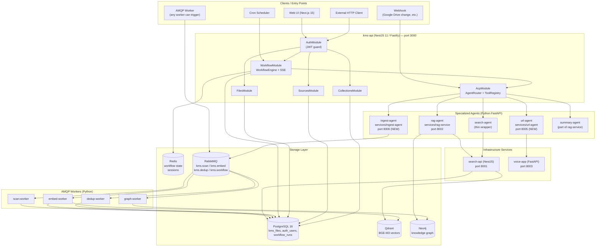

# KMS Agentic Platform — Master Architecture

**Version**: 1.1
**Date**: 2026-03-17
**Status**: North Star Reference — read this before writing any agentic code
**Owner**: Architecture Team
**Supersedes**: v1.0 — adds bidirectional ACP integration, external agent registry, and RAG + external agent context pipeline

---

## Table of Contents

1. [Vision and Evolution](#1-vision-and-evolution)
2. [Scope and Integration Model](#2-scope-and-integration-model)
3. [The Six Architecture Layers](#3-the-six-architecture-layers)
4. [Full System Component Diagram](#4-full-system-component-diagram)
5. [Layer 1 — Trigger Layer](#5-layer-1--trigger-layer)
6. [Layer 2 — Workflow Engine](#6-layer-2--workflow-engine)
7. [Layer 3 — Agent Router](#7-layer-3--agent-router)
8. [Layer 4 — ACP Tool Layer](#8-layer-4--acp-tool-layer)
9. [Layer 5 — Specialized Agents](#9-layer-5--specialized-agents)
10. [Layer 6 — Infrastructure Backends](#10-layer-6--infrastructure-backends)
11. [End-to-End Example: YouTube URL Ingest + Summarize](#11-end-to-end-example-youtube-url-ingest--summarize)
12. [Sub-Agent Spawning Patterns](#12-sub-agent-spawning-patterns)
13. [The kms_spawn_agent Tool](#13-the-kms_spawn_agent-tool)
14. [New Services to Build](#14-new-services-to-build)
15. [Agent Registry Reference](#15-agent-registry-reference)
16. [Tool Registry Reference](#16-tool-registry-reference)
17. [State Management and Event Streaming](#17-state-management-and-event-streaming)
18. [Feature Flag Gating](#18-feature-flag-gating)
19. [Observability and Tracing](#19-observability-and-tracing)
20. [How to Add a New Agent (4 Steps)](#20-how-to-add-a-new-agent-4-steps)
21. [Bidirectional ACP Integration](#21-bidirectional-acp-integration)
22. [External Agent Registry](#22-external-agent-registry)
23. [RAG + External Agent: Context Pipeline](#23-rag--external-agent-context-pipeline)
24. [Architecture Decision Cross-Reference](#24-architecture-decision-cross-reference)

---

## 1. Vision and Evolution

### Where KMS Started

KMS began as a document ingestion and search system: ingest files from Google Drive / Obsidian / local FS, embed them with BGE-M3, store vectors in Qdrant, build a Neo4j knowledge graph, and answer questions via a RAG pipeline. The system was linear: user query → retrieve → generate → respond.

### Where KMS Is Going

KMS evolves into an **Agentic Knowledge Platform** — a system where any event can trigger a multi-step, multi-agent workflow that composes specialized agents to accomplish complex knowledge tasks.

The critical shift is:

| Before (RAG chatbot) | After (Agentic platform) |
|---------------------|--------------------------|
| One entry point: HTTP POST /chat | Any entry point: HTTP, UI, AMQP, webhook, cron |
| One pipeline: retrieve → generate | Multi-step workflows with parallel branches |
| One agent: rag-service | Registry of specialized agents |
| LLM for every response | LLM only when genuinely needed for generation |
| Fixed pipeline | Dynamic: agents can spawn sub-agents |
| Push query, pull answer | SSE stream of all workflow events in real time |

### The Core Principle

**LLM invocation is expensive and slow. Use it only for generation and reasoning. All deterministic operations (search, embed, ingest, graph traversal, URL fetch, transcription) are executed as tools — not via LLM inference.**

This principle keeps workflows fast, predictable, and auditable. A workflow that ingests a YouTube video, builds a summary, and stores it in the knowledge base should invoke the LLM exactly once (for the summary generation step) — not for transcript extraction, not for embedding, not for graph construction.

---

## 2. Scope and Integration Model

KMS is a knowledge management platform. It does NOT replace external agents — it GROUNDS them.

### KMS's role in an agentic ecosystem

| Role | Description |
|---|---|
| **ACP Server** | External agents (Claude Code, Codex, Gemini) call KMS tools to access private knowledge |
| **ACP Client** | KMS builds optimal context from the knowledge base and delegates generation to external agents |
| **MCP Server** | Claude Code (and other MCP-compatible tools) can call KMS tools live during sessions |
| **Workflow Orchestrator** | KMS orchestrates multi-step workflows using both internal and external agents |

### What KMS does NOT build

| Out of Scope | Why |
|---|---|
| Custom reasoning/generation models | Use Claude, Ollama, or OpenRouter — KMS focuses on retrieval and orchestration |
| IDE UI plugins | Let Zed / Cursor / VS Code handle UI; KMS exposes ACP and MCP endpoints they connect to |
| Agent harness management | yt-dlp, Whisper etc. are tools invoked deterministically — not autonomous agents |
| General-purpose agent framework for coding tasks | Focus is knowledge management; KMS can delegate to external agents for generation/reasoning, but does not build its own coding assistant |
| Marketplace / third-party agent plugins | Static declarative tool registry (ADR-0019). All tools are known at design time. |
| Blockchain / token-gated agent commerce | Virtuals Protocol ACP is unrelated. KMS uses the KMS REST run-lifecycle protocol (ADR-0012). |
| General-purpose ReAct agent loop | LLM should not decide which tools to call for deterministic operations. Tool selection for known workflows is explicit in the WorkflowDefinition. |

---

## 3. The Six Architecture Layers

```
┌─────────────────────────────────────────────────────────────────────────┐
│  LAYER 1 — TRIGGER LAYER                                                 │
│  HTTP API  |  Web UI  |  AMQP Queue  |  Webhook  |  Cron                │
└──────────────────────────────┬──────────────────────────────────────────┘
                               │ WorkflowTriggerMessage
                               ▼
┌─────────────────────────────────────────────────────────────────────────┐
│  LAYER 2 — WORKFLOW ENGINE  (kms-api: modules/workflow/)                 │
│  State machine  |  Run ID  |  Redis state  |  SSE event stream           │
└──────────────────────────────┬──────────────────────────────────────────┘
                               │ step dispatch
                               ▼
┌─────────────────────────────────────────────────────────────────────────┐
│  LAYER 3 — AGENT ROUTER  (kms-api: modules/acp/)                        │
│  Agent registry  |  ACP HTTP session  |  Feature-flag gating            │
└──────────────────────────────┬──────────────────────────────────────────┘
                               │ ACP run-lifecycle HTTP
                               ▼
┌─────────────────────────────────────────────────────────────────────────┐
│  LAYER 4 — ACP TOOL LAYER  (kms-api: modules/acp/acp-tool.registry.ts)  │
│  11 tools  |  JSON Schema validated  |  Permission kinds                │
└──────────────────────────────┬──────────────────────────────────────────┘
                               │ tool execution
                               ▼
┌─────────────────────────────────────────────────────────────────────────┐
│  LAYER 5 — SPECIALIZED AGENTS  (Python FastAPI services)                │
│  rag-agent  |  url-agent  |  summary-agent  |  ingest-agent             │
│  search-agent  |  classify-agent (future)                               │
└──────────────────────────────┬──────────────────────────────────────────┘
                               │ service calls
                               ▼
┌─────────────────────────────────────────────────────────────────────────┐
│  LAYER 6 — INFRASTRUCTURE BACKENDS  (unchanged)                         │
│  search-api  |  embed-worker  |  graph-worker  |  scan-worker           │
│  Qdrant  |  Neo4j  |  PostgreSQL  |  Redis  |  RabbitMQ                 │
└─────────────────────────────────────────────────────────────────────────┘
```

---

## 4. Full System Component Diagram



---

## 5. Layer 1 — Trigger Layer

Any of these entry points can start a workflow. The Workflow Engine receives a `WorkflowTriggerMessage` regardless of source.

### 5.1 HTTP (External API)

```
POST /api/v1/workflows/run
Content-Type: application/json

{
  "type": "url_ingest_summarize",
  "input": {
    "url": "https://youtube.com/watch?v=abc123"
  },
  "config": {
    "stream": true,
    "timeout_seconds": 600
  }
}
```

Response: `{ run_id: "wf_abc123", status: "pending" }`

SSE stream available at: `GET /api/v1/workflows/run/wf_abc123/stream`

### 5.2 Web UI

The UI sends the same `POST /api/v1/workflows/run` call when:
- User types a URL into the "Process URL" field
- User drags and drops a file onto the upload zone
- User clicks "Re-summarize" on an existing file

The UI opens an SSE connection immediately after receiving `run_id` and renders streaming events in real time.

### 5.3 AMQP (Worker-to-Workflow)

Any worker can publish a `WorkflowTriggerMessage` to the `kms.workflow` queue. The Workflow Engine consumes this queue and creates a workflow run.

```typescript
// packages/@kb/contracts/src/messages/workflow-trigger.message.ts
export interface WorkflowTriggerMessage {
  workflow_type: string;
  input: Record<string, unknown>;
  source: 'worker' | 'webhook' | 'cron';
  correlation_id?: string;      // For tracing back to originating job
  priority?: number;            // 1-10, default 5
}
```

Example: `scan-worker` finishes discovering files from Google Drive and publishes:
```json
{
  "workflow_type": "batch_ingest",
  "input": { "file_ids": ["f_1", "f_2", "f_3"] },
  "source": "worker",
  "correlation_id": "scan_job_xyz"
}
```

### 5.4 Webhook

External services POST change notifications to `/api/v1/webhooks/{provider}`. The webhook handler validates the payload, maps it to a workflow type, and publishes to `kms.workflow`.

```
POST /api/v1/webhooks/google-drive
→ GoogleDriveWebhookHandler validates X-Goog-Channel-Token
→ Determines changed file IDs
→ Publishes WorkflowTriggerMessage { type: "drive_file_changed", input: { file_id } }
```

### 5.5 Scheduled (Cron)

Cron definitions live in `kms-api/src/modules/workflow/cron-schedules.ts`. Each cron entry maps a schedule expression to a workflow type and default input.

```typescript
export const WORKFLOW_CRON_SCHEDULES: CronSchedule[] = [
  {
    name: 'nightly_graph_refresh',
    cron: '0 2 * * *',              // 02:00 UTC daily
    workflow_type: 'graph_rebuild',
    input: {},
    feature_flag: 'ENABLE_GRAPH',
  },
  {
    name: 'hourly_drive_sync',
    cron: '0 * * * *',
    workflow_type: 'drive_incremental_sync',
    input: {},
    feature_flag: 'ENABLE_GOOGLE_DRIVE',
  },
];
```

---

## 6. Layer 2 — Workflow Engine

**Location**: `kms-api/src/modules/workflow/`

The Workflow Engine is the central coordinator. It accepts a `WorkflowDefinition`, manages the execution lifecycle as a state machine, and streams events to subscribers via SSE.

### 6.1 WorkflowDefinition Schema

```typescript
// kms-api/src/modules/workflow/dto/workflow-definition.dto.ts

export interface WorkflowStep {
  id: string;                          // "step_1", "step_2", etc.
  agent_id: AgentId;                   // from agent registry
  task: string;                        // Natural language task description
  input_from?: 'parent' | `step_${string}`;  // Where to source input
  input_override?: Record<string, unknown>;   // Static overrides
  timeout_seconds?: number;            // Default: 300
  retry_max?: number;                  // Default: 2
}

export interface WorkflowDefinition {
  type: string;                        // Workflow type identifier
  steps: WorkflowStep[];
  parallel_steps?: string[][];         // Groups of step IDs to run in parallel
  on_failure?: 'abort' | 'continue';  // Default: abort
}
```

### 6.2 Workflow Run State Machine

```
            ┌──────────────────────────────────────────┐
            │              State Machine                │
            │                                          │
            │   PENDING → RUNNING → WAITING_FOR_AGENTS │
            │                              │           │
            │                         AGGREGATING      │
            │                         /         \      │
            │                   COMPLETED       FAILED │
            └──────────────────────────────────────────┘
```

| State | Description |
|---|---|
| `pending` | WorkflowRun created, not yet started |
| `running` | Engine dispatching steps sequentially or in parallel |
| `waiting_for_agents` | All parallel steps dispatched, waiting for all to complete |
| `aggregating` | All steps complete, merging results |
| `completed` | Final result available |
| `failed` | One or more steps failed and `on_failure: abort` |

### 6.3 Redis State Storage

```
kms:workflow:{run_id}           → WorkflowRunState (JSON, TTL: 24h)
kms:workflow:{run_id}:step_{n}  → StepState (JSON, TTL: 24h)
kms:workflow:active             → SET of active run_ids
```

```typescript
export interface WorkflowRunState {
  run_id: string;
  workflow_type: string;
  status: WorkflowStatus;
  created_at: string;           // ISO 8601
  started_at?: string;
  completed_at?: string;
  steps: Record<string, StepState>;
  result?: Record<string, unknown>;
  error?: string;
}

export interface StepState {
  step_id: string;
  agent_id: string;
  status: 'pending' | 'running' | 'completed' | 'failed';
  acp_run_id?: string;          // The ACP run ID returned by the agent
  input?: Record<string, unknown>;
  output?: Record<string, unknown>;
  error?: string;
  started_at?: string;
  completed_at?: string;
}
```

### 6.4 SSE Event Stream

The workflow engine emits structured events throughout execution. The frontend subscribes to:
`GET /api/v1/workflows/run/{run_id}/stream`

```
event: workflow_started
data: {"run_id":"wf_abc","workflow_type":"url_ingest_summarize","steps":["step_1","step_2a","step_2b"]}

event: agent_spawned
data: {"run_id":"wf_abc","step_id":"step_1","agent_id":"url-agent","acp_run_id":"run_xyz"}

event: tool_call
data: {"run_id":"wf_abc","step_id":"step_1","agent_id":"url-agent","tool":"kms_extract_transcript","input":{"url":"..."}}

event: agent_message_chunk
data: {"run_id":"wf_abc","step_id":"step_1","agent_id":"url-agent","chunk":"Extracting transcript...","delta":true}

event: step_completed
data: {"run_id":"wf_abc","step_id":"step_1","output":{"transcript":"...","metadata":{...}}}

event: workflow_completed
data: {"run_id":"wf_abc","result":{"file_id":"f_123","summary":"...","key_points":["..."]}}
```

### 6.5 Relationship to LangGraph

The `rag-service` already uses LangGraph StateGraph for its internal retrieve → grade → rewrite → generate pipeline (ADR-0013). The WorkflowEngine at Layer 2 is **above** LangGraph — it orchestrates across multiple agents, each of which may internally use LangGraph for their own pipelines. The WorkflowEngine does not use LangGraph directly; it is a custom NestJS state machine appropriate for multi-agent coordination where agents are separate HTTP services.

---

## 7. Layer 3 — Agent Router

**Location**: `kms-api/src/modules/acp/`

The Agent Router is the bridge between the Workflow Engine and individual agents. It maintains the agent registry and dispatches ACP run requests.

### 7.1 Agent Registry

```typescript
// kms-api/src/modules/acp/agent-registry.service.ts

export interface AgentRegistration {
  id: AgentId;
  display_name: string;
  version: string;
  base_url: string;               // e.g. http://url-agent:8005
  capabilities: string[];         // Tool IDs this agent can invoke
  input_schema: JSONSchema;
  output_schema: JSONSchema;
  feature_flag?: string;          // If set, agent is only registered when flag is enabled
  health: 'healthy' | 'degraded' | 'unavailable';
  streaming: boolean;
  max_concurrency: number;
}
```

Agents are registered at `kms-api` startup from a static registry configuration. There is no dynamic plugin registration (ADR-0019). If a feature flag is disabled, the agent is not registered and the Workflow Engine will fail fast if a step references it.

### 7.2 ACP Run-Lifecycle Protocol

The Agent Router communicates with each agent using the KMS REST run-lifecycle protocol (ADR-0012). Every agent service exposes:

```
POST   /runs                      → Start a run; returns { run_id, status: "pending" }
GET    /runs/{run_id}             → Poll status and final result
GET    /runs/{run_id}/stream      → SSE stream of run output chunks
DELETE /runs/{run_id}             → Cancel a running job
```

The Workflow Engine step is mapped to an ACP run request:

```typescript
// step → ACP run request
const acpRequest: ACPRunRequest = {
  input: {
    task: step.task,
    ...resolvedInput,             // from parent output or step_N output
  },
  config: {
    timeout_seconds: step.timeout_seconds ?? 300,
  },
  session_id: `wf_${runId}_${step.id}`,  // step-scoped session
};
```

### 7.3 Session Model

Two session models are supported:

| Model | Session ID | Use Case |
|---|---|---|
| **Session-per-step** (default) | `wf_{run_id}_{step_id}` | Each step runs in isolation; no shared context between steps |
| **Session-per-workflow** | `wf_{run_id}` | Steps share a persistent context; LLM can see prior step outputs as conversation history |

The session model is specified in the `WorkflowDefinition`:
```typescript
{ session_mode: 'per_step' | 'per_workflow' }  // default: per_step
```

---

## 8. Layer 4 — ACP Tool Layer

**Location**: `kms-api/src/modules/acp/acp-tool.registry.ts`

Tools are the atomic operations agents can invoke. They are statically declared, feature-flag gated, and always execute deterministic operations — no LLM inference at the tool level.

### 8.1 Tool Permission Kinds

| Permission Kind | Meaning |
|---|---|
| `read` | Does not modify any state |
| `write` | Creates or modifies data in the knowledge base |
| `execute` | Triggers an external process or sub-workflow |

### 8.2 Complete Tool Registry

| # | Tool Name | Description | Permission | Feature Flag | Backing Service |
|---|---|---|---|---|---|
| 1 | `kms_search` | Hybrid semantic + keyword search | read | always | search-api |
| 2 | `kms_retrieve` | Fetch full document chunks by ID | read | always | search-api + Qdrant |
| 3 | `kms_embed` | Generate BGE-M3 embeddings for text | read | `ENABLE_EMBEDDING` | embed-worker |
| 4 | `kms_graph_expand` | Expand a concept node in the knowledge graph | read | `ENABLE_GRAPH` | graph-worker / Neo4j |
| 5 | `kms_ingest` | Ingest a file into the knowledge base pipeline | write | always | kms-api → scan-worker |
| 6 | `kms_extract_transcript` | Extract transcript from audio/video URL (yt-dlp + Whisper) | execute | `ENABLE_VOICE` | url-agent |
| 7 | `kms_summarize` | LLM summarization of long text | execute | `ENABLE_LLM` | rag-service (summary mode) |
| 8 | `kms_classify` | Classify document type and extract tags | execute | `ENABLE_LLM` | classify-agent (future) |
| 9 | `kms_spawn_agent` | Spawn a sub-agent within the current workflow | execute | always | Workflow Engine |
| 10 | `kms_fetch_url` | Fetch and parse HTML content from a URL | execute | always | url-agent |
| 11 | `kms_web_search` | Search the public web for context | execute | `ENABLE_WEB_SEARCH` | url-agent |

### 8.3 Tool Definitions (TypeScript)

```typescript
// packages/@kb/contracts/src/tools/tool-definitions.ts

export const KMS_ACP_TOOLS: AcpToolDefinition[] = [
  {
    name: 'kms_search',
    description: 'Hybrid semantic + keyword search over the knowledge base. Returns ranked chunks with scores.',
    permission: 'read',
    always: true,
    inputSchema: {
      type: 'object',
      properties: {
        query: { type: 'string', description: 'Search query' },
        limit: { type: 'number', default: 10, maximum: 50 },
        collection_ids: { type: 'array', items: { type: 'string' } },
        search_type: { enum: ['hybrid', 'semantic', 'keyword'], default: 'hybrid' },
      },
      required: ['query'],
    },
    outputSchema: {
      type: 'object',
      properties: {
        results: {
          type: 'array',
          items: {
            type: 'object',
            properties: {
              chunk_id: { type: 'string' },
              file_id: { type: 'string' },
              content: { type: 'string' },
              score: { type: 'number' },
              metadata: { type: 'object' },
            },
          },
        },
        total: { type: 'number' },
      },
    },
  },
  {
    name: 'kms_extract_transcript',
    description: 'Extract a full transcript from a YouTube URL or audio/video file URL using yt-dlp and Whisper.',
    permission: 'execute',
    featureFlag: 'ENABLE_VOICE',
    inputSchema: {
      type: 'object',
      properties: {
        url: { type: 'string', format: 'uri' },
        language: { type: 'string', default: 'auto', description: 'ISO 639-1 language code or "auto"' },
      },
      required: ['url'],
    },
    outputSchema: {
      type: 'object',
      properties: {
        transcript: { type: 'string' },
        language: { type: 'string' },
        duration_seconds: { type: 'number' },
        metadata: {
          type: 'object',
          properties: {
            title: { type: 'string' },
            author: { type: 'string' },
            source_url: { type: 'string' },
          },
        },
      },
    },
  },
  {
    name: 'kms_spawn_agent',
    description: 'Spawn a sub-agent to perform a task. Use sequential mode to wait for the result; parallel mode to fire-and-forget.',
    permission: 'execute',
    always: true,
    inputSchema: {
      type: 'object',
      properties: {
        agent_id: {
          enum: ['rag-agent', 'url-agent', 'ingest-agent', 'search-agent', 'summary-agent'],
        },
        task: { type: 'string' },
        input: { type: 'object' },
        mode: { enum: ['sequential', 'parallel'], default: 'sequential' },
        parent_session_id: { type: 'string' },
        timeout_seconds: { type: 'number', default: 300 },
      },
      required: ['agent_id', 'task', 'input', 'parent_session_id'],
    },
    outputSchema: {
      type: 'object',
      properties: {
        sub_run_id: { type: 'string' },
        result: { type: 'object', description: 'Present only when mode=sequential' },
      },
    },
  },
  // ... remaining tools follow the same pattern
];
```

---

## 9. Layer 5 — Specialized Agents

All agents are Python FastAPI services. Each exposes the KMS run-lifecycle REST contract (ADR-0012) and implements one or more ACP tools.

### 9.1 rag-agent (existing, extended)

**Service**: `services/rag-service/`
**Port**: 8002

The existing RAG service, extended to also handle:
- Summary requests (when invoked with `task: "summarize"`)
- Multi-document synthesis
- Citation-tracked answers

Internal architecture uses LangGraph StateGraph:

```
retrieve → grade_documents → [rewrite_query | generate]
                ↑ (loop max 2x if docs are irrelevant)
```

The rag-agent calls tools directly via HTTP to backing services — it does not go through the ACP tool layer. This is intentional: the tool layer is for orchestrator → agent communication. Agent → backing service calls are direct HTTP.

### 9.2 url-agent (new)

**Service**: `services/url-agent/`
**Port**: 8005

Responsible for all URL-based content extraction. This agent does not use an LLM — it calls deterministic tools.

Tools it implements:
- `kms_extract_transcript` — yt-dlp audio download → Whisper transcription (delegates to voice-app)
- `kms_fetch_url` — httpx + BeautifulSoup HTML parsing → structured content
- `kms_web_search` — web search API integration (e.g., SerpAPI or Brave Search)

```python
# services/url-agent/app/handlers/run_handler.py

async def handle_run(request: RunRequest) -> RunResponse:
    """Route run to appropriate tool based on task type."""
    if request.input.get("url"):
        url = request.input["url"]
        if is_youtube_url(url) or is_audio_url(url):
            return await extract_transcript_tool.execute(url=url)
        else:
            return await fetch_url_tool.execute(url=url)
    elif request.input.get("query") and request.config.get("web_search"):
        return await web_search_tool.execute(query=request.input["query"])
    else:
        raise ValueError("url-agent requires either 'url' or 'query' in input")
```

### 9.3 ingest-agent (new)

**Service**: `services/ingest-agent/`
**Port**: 8006

Orchestration layer over the existing scan/embed/graph pipeline. Accepts a file or content blob and manages the full ingest workflow: create DB record → publish to scan-worker queue → wait for embed completion → return `file_id`.

This agent bridges the synchronous ACP world (caller expects a result) with the asynchronous AMQP world (actual processing is queue-based). It uses polling against PostgreSQL to detect when embedding is complete.

Tools it implements:
- `kms_ingest` — full pipeline ingest

```python
# services/ingest-agent/app/handlers/run_handler.py

async def handle_run(request: RunRequest) -> RunResponse:
    """
    Create file record, publish scan message, poll for completion.
    """
    # 1. Create file record in PostgreSQL
    file_id = await db.create_file_record(
        content=request.input["content"],
        metadata=request.input.get("metadata", {}),
    )

    # 2. Publish to scan-worker queue
    await amqp.publish("kms.scan", ScanMessage(file_id=file_id))

    # 3. Poll until embed status is complete (max timeout_seconds)
    await poll_until_embedded(file_id, timeout=request.config.get("timeout_seconds", 300))

    return RunResponse(output={"file_id": file_id, "status": "embedded"})
```

### 9.4 search-agent

**Service**: Thin wrapper — may be part of `search-api` or a minimal FastAPI adapter
**Port**: 8001 (reuse search-api port if wrapper is in search-api)

Exposes the `kms_search` and `kms_retrieve` tools via the run-lifecycle protocol. Handles intelligent query reformulation before calling the underlying search endpoint.

The main value added over calling search-api directly: the search-agent can decompose a complex query into multiple sub-queries, run them in parallel, and merge results — logic that does not belong in the Workflow Engine or the tool layer.

### 9.5 summary-agent

Not a separate service. This capability lives inside `rag-service` as an alternate run mode. When the `rag-agent` receives a task description of `"summarize"`, it activates a different LangGraph route that skips retrieval and goes directly to generation with the provided text.

### LLM-Optional Design

KMS is designed to be fully functional without any LLM configured. The Tiered Retrieval system (ADR-0024) means:
- ~90% of queries are answered by retrieval tiers (cache → BM25 → hybrid → hybrid+graph) — no LLM needed
- ~10% of queries that require synthesis/generation use Claude API (if configured) or Ollama (if running)
- `llm.enabled: false` (the default) disables Ollama but leaves all retrieval tiers fully operational
- External agents (Claude API) are the preferred generation path — better quality, no local GPU needed

The LLM Guard checks provider availability in order: Claude API → Ollama → skip generation (return Tier 3 result).

### 9.6 classify-agent (future)

Not built in the current phase. Intended to:
- Classify document type (meeting notes, technical spec, research paper, etc.)
- Extract structured tags and metadata
- Suggest collection membership

Will be added as `services/classify-agent/` when the document classification feature is prioritized.

---

## 10. Layer 6 — Infrastructure Backends

These services are **unchanged** by the agentic platform. They become backends that tools call — they are no longer direct service dependencies of `kms-api`.

| Service | Role in Agentic Platform | Called By |
|---|---|---|
| `search-api` | Executes `kms_search` and `kms_retrieve` tools | search-agent, rag-agent |
| `embed-worker` | Executes embedding when `kms_embed` tool triggers AMQP publish | ingest-agent (via AMQP) |
| `graph-worker` | Executes `kms_graph_expand` tool | rag-agent (via direct HTTP) |
| `scan-worker` | File discovery and metadata extraction | ingest-agent (via AMQP) |
| `dedup-worker` | Deduplication on new file ingestion | scan-worker (via AMQP chain) |
| `voice-app` | Whisper transcription backend | url-agent (via HTTP) |

**Key principle**: `kms-api` never calls these infrastructure services directly. All calls go through the agent layer. This keeps `kms-api` as a clean API gateway with no AI/ML logic.

---

## 11. End-to-End Example: YouTube URL Ingest + Summarize

This is the canonical example for the agentic platform. Trace through every layer.

### 11.1 Request

```
POST /api/v1/workflows/run
{
  "type": "url_ingest_summarize",
  "input": { "url": "https://youtube.com/watch?v=dQw4w9WgXcQ" },
  "config": { "stream": true }
}
```

### 11.2 Workflow Definition (registered in WorkflowEngine)

```typescript
const URL_INGEST_SUMMARIZE: WorkflowDefinition = {
  type: 'url_ingest_summarize',
  steps: [
    {
      id: 'step_1',
      agent_id: 'url-agent',
      task: 'Extract transcript and metadata from the provided URL',
      input_from: 'parent',         // uses { url } from the workflow trigger input
      timeout_seconds: 300,
    },
    {
      id: 'step_2a',
      agent_id: 'rag-agent',
      task: 'Summarize the transcript into key points and a short paragraph summary',
      input_from: 'step_1',         // uses { transcript, metadata } from step_1 output
      timeout_seconds: 120,
    },
    {
      id: 'step_2b',
      agent_id: 'ingest-agent',
      task: 'Ingest the transcript into the knowledge base',
      input_from: 'step_1',
      timeout_seconds: 300,
    },
  ],
  parallel_steps: [['step_2a', 'step_2b']],  // steps 2a and 2b run in parallel
  on_failure: 'abort',
};
```

### 11.3 Execution Trace

```
t=0ms    WorkflowEngine creates run_id="wf_abc123"
         Redis: kms:workflow:wf_abc123 → { status: "running" }
         SSE: event=workflow_started

t=1ms    Agent Router dispatches step_1 to url-agent
         POST http://url-agent:8005/runs
         { input: { url: "https://youtube.com/..." }, session_id: "wf_abc123_step_1" }
         SSE: event=agent_spawned { step_id: "step_1", agent_id: "url-agent" }

         Inside url-agent:
         → kms_extract_transcript tool invoked
           → SSE: event=tool_call { tool: "kms_extract_transcript" }
           → url-agent calls voice-app: POST http://voice-app:8003/transcribe
             → yt-dlp downloads audio (15s)
             → Whisper transcribes audio (30s)
             ← { transcript: "...", language: "en", duration_seconds: 1847 }
           ← url-agent returns transcript + metadata

t=46s    step_1 completed
         Redis: kms:workflow:wf_abc123:step_1 → { status: "completed", output: {...} }
         SSE: event=step_completed { step_id: "step_1" }

t=46s    WorkflowEngine triggers step_2a AND step_2b in parallel

         step_2a: POST http://rag-service:8002/runs
         { task: "summarize", input: { text: "<transcript>" }, session_id: "wf_abc123_step_2a" }
         SSE: event=agent_spawned { step_id: "step_2a", agent_id: "rag-agent" }

         step_2b: POST http://ingest-agent:8006/runs
         { task: "ingest", input: { content: "<transcript>", metadata: {...} }, session_id: "wf_abc123_step_2b" }
         SSE: event=agent_spawned { step_id: "step_2b", agent_id: "ingest-agent" }

         Inside rag-agent (step_2a):
         → LangGraph route: summarize (skips retrieval)
         → kms_summarize tool: Anthropic API call
           → SSE: event=agent_message_chunk (streaming tokens)
           → "The video covers..." (token stream)

         Inside ingest-agent (step_2b):
         → Creates PostgreSQL file record: file_id="f_789"
         → Publishes to kms.scan AMQP queue
         → scan-worker picks up, extracts metadata
         → Publishes to kms.embed queue
         → embed-worker generates BGE-M3 vectors, stores in Qdrant
         → graph-worker extracts entities, stores in Neo4j
         → ingest-agent polls DB until status=embedded

t=62s    step_2a completed: { summary: "...", key_points: [...] }
t=91s    step_2b completed: { file_id: "f_789", status: "embedded" }

         WorkflowEngine detects both parallel steps complete
         Status: running → aggregating

t=91s    WorkflowEngine aggregates results:
         {
           "file_id": "f_789",
           "summary": "The video covers...",
           "key_points": ["Point 1", "Point 2", "Point 3"],
           "transcript_length": 18473,
           "duration_seconds": 1847
         }

         Redis: kms:workflow:wf_abc123 → { status: "completed", result: {...} }
         SSE: event=workflow_completed { result: {...} }
```

### 11.4 SSE Stream (what the UI receives)

```
event: workflow_started
data: {"run_id":"wf_abc123","type":"url_ingest_summarize"}

event: agent_spawned
data: {"step_id":"step_1","agent_id":"url-agent"}

event: tool_call
data: {"step_id":"step_1","tool":"kms_extract_transcript","input":{"url":"..."}}

event: step_completed
data: {"step_id":"step_1","duration_ms":46000}

event: agent_spawned
data: {"step_id":"step_2a","agent_id":"rag-agent"}

event: agent_spawned
data: {"step_id":"step_2b","agent_id":"ingest-agent"}

event: agent_message_chunk
data: {"step_id":"step_2a","delta":"The video covers "}

event: agent_message_chunk
data: {"step_id":"step_2a","delta":"distributed systems "}

... (streaming tokens from LLM)

event: step_completed
data: {"step_id":"step_2a","duration_ms":16000}

event: step_completed
data: {"step_id":"step_2b","duration_ms":45000}

event: workflow_completed
data: {"run_id":"wf_abc123","result":{"file_id":"f_789","summary":"...","key_points":[...]}}
```

---

## 12. Sub-Agent Spawning Patterns

There are two fundamentally different patterns for how agents get spawned. Both are valid; choose based on whether the workflow structure is known upfront.

### 12.1 Pattern A — Orchestrator Spawns (Top-Down)

The Workflow Engine knows the full workflow graph at the start. It explicitly spawns agents in order or in parallel groups, waits for results, and passes outputs as inputs to subsequent steps.

```
WorkflowEngine
    │
    ├─── spawn url-agent (step_1)
    │         └── waits for completion
    │
    ├─── spawn rag-agent (step_2a) ─── parallel ─┐
    │                                             │
    └─── spawn ingest-agent (step_2b) ────────────┘
              └── both wait → aggregate
```

**When to use**: Fixed, known workflows. The steps are determined before execution begins. Examples: `url_ingest_summarize`, `drive_file_changed`, `nightly_graph_refresh`.

**Advantages**:
- Full workflow is auditable from the WorkflowDefinition
- SSE events are predictable and structured
- Easy to retry specific steps on failure
- Timeout applies to each step independently

### 12.2 Pattern B — Agent Spawns Agent (Emergent)

An agent decides mid-execution to spawn a sub-agent based on what it discovers. It uses the `kms_spawn_agent` tool to create a sub-workflow.

```
WorkflowEngine
    │
    └─── spawn rag-agent
              │
              │  (finds a long document that needs summarization)
              │
              └─── calls kms_spawn_agent(agent_id="summary-agent", mode="sequential")
                        │
                        └─── WorkflowEngine creates child run
                                  │
                                  └─── spawn summary-agent
                                            └─── returns summary
```

**When to use**: Dynamic workflows where the next step depends on what was found. The orchestrating agent cannot know upfront that it will need a sub-agent.

**Advantages**:
- Emergent behavior — agents compose dynamically
- LLM can decide "I need more context → spawn search-agent"
- No need to pre-define every possible workflow permutation

**Traceability**: Every spawned sub-run is linked to its parent via `parent_session_id`. The SSE stream at the top-level workflow includes events from all child runs.

---

## 13. The kms_spawn_agent Tool

This tool is the bridge between Pattern A and Pattern B. When an agent invokes this tool, the Workflow Engine creates a child workflow run.

### 13.1 Tool Schema

```typescript
// Tool: kms_spawn_agent
// Input schema
{
  agent_id: "summary-agent" | "url-agent" | "ingest-agent" | "search-agent",
  task: string,                        // Natural language task description
  input: Record<string, unknown>,      // Structured input for the agent
  mode: "sequential" | "parallel",    // sequential=wait, parallel=fire-and-forget
  parent_session_id: string,           // Link back to parent workflow run
  timeout_seconds?: number             // Default: 300
}

// Output schema
{
  sub_run_id: string,                  // Always present
  result?: Record<string, unknown>     // Present only when mode="sequential"
}
```

### 13.2 Execution Flow

```
Agent invokes kms_spawn_agent tool
    │
    ▼
AcpToolRegistry.dispatch("kms_spawn_agent", input)
    │
    ▼
WorkflowEngine.createChildRun({
    parent_run_id: derived from parent_session_id,
    agent_id: input.agent_id,
    task: input.task,
    input: input.input,
})
    │
    ├── mode="sequential": await childRun.waitForCompletion(timeout)
    │       └── returns { sub_run_id, result }
    │
    └── mode="parallel": return immediately
            └── returns { sub_run_id }   // caller does not wait
```

### 13.3 Example Usage (inside rag-agent LangGraph node)

```python
# services/rag-service/app/nodes/context_expansion.py

async def maybe_expand_context(state: GraphState) -> GraphState:
    """
    If the retrieved context is insufficient, spawn a web search sub-agent.
    Called only when confidence score is below threshold.
    """
    if state.retrieval_confidence < 0.4 and settings.WEB_SEARCH_ENABLED:
        result = await tools.kms_spawn_agent(
            agent_id="search-agent",
            task="Find recent web articles about: " + state.query,
            input={"query": state.query, "search_type": "web"},
            mode="sequential",
            parent_session_id=state.session_id,
            timeout_seconds=30,
        )
        state.web_context = result.get("result", {}).get("articles", [])

    return state
```

---

## 14. New Services to Build

### 14.1 services/url-agent/

| Property | Value |
|---|---|
| Path | `services/url-agent/` |
| Technology | Python 3.11 + FastAPI |
| Port | 8005 |
| Responsibility | URL content extraction: transcripts (yt-dlp + Whisper), HTML parsing, web search |
| Tools Implemented | `kms_extract_transcript`, `kms_fetch_url`, `kms_web_search` |
| Dependencies | voice-app (Whisper), httpx, BeautifulSoup4, yt-dlp |
| Feature Flags | `ENABLE_VOICE` (transcript), `ENABLE_WEB_SEARCH` (web search) |

**Directory structure**:
```
services/url-agent/
  app/
    main.py                    # FastAPI app + lifespan
    config.py                  # Settings (pydantic BaseSettings)
    handlers/
      run_handler.py           # POST /runs dispatcher
    tools/
      extract_transcript.py    # yt-dlp + voice-app HTTP call
      fetch_url.py             # httpx + BeautifulSoup
      web_search.py            # SerpAPI / Brave Search
    models/
      messages.py              # RunRequest, RunResponse Pydantic models
    utils/
      errors.py                # KMSWorkerError subclasses
  requirements.txt
  Dockerfile
```

### 14.2 services/ingest-agent/

| Property | Value |
|---|---|
| Path | `services/ingest-agent/` |
| Technology | Python 3.11 + FastAPI |
| Port | 8006 |
| Responsibility | Orchestrate the full ingest pipeline for a given content blob |
| Tools Implemented | `kms_ingest` |
| Dependencies | asyncpg (PostgreSQL), aio-pika (RabbitMQ) |
| Feature Flags | None (always on) |

### 14.3 kms-api/src/modules/workflow/

| Property | Value |
|---|---|
| Path | `kms-api/src/modules/workflow/` |
| Technology | NestJS 11 module |
| Port | 3000 (part of kms-api) |
| Responsibility | Workflow Engine: state machine, Redis state, SSE event streaming |
| Dependencies | Redis (ioredis), existing AcpModule |
| Feature Flags | `ENABLE_WORKFLOWS` |

**Module files**:
```
kms-api/src/modules/workflow/
  workflow.module.ts
  workflow.controller.ts       # POST /workflows/run, GET /workflows/run/:id/stream
  workflow.service.ts          # WorkflowEngine state machine
  workflow-definitions.ts      # All registered WorkflowDefinitions
  dto/
    create-workflow-run.dto.ts
    workflow-run.dto.ts
  types/
    workflow.types.ts           # WorkflowStatus, WorkflowStep, etc.
  workflow.service.spec.ts
```

### 14.4 kms-api/src/modules/acp/ (expanded)

Existing `acp` module gains:
- `agent-registry.service.ts` — registry of all agents + health checking
- `acp-tool.registry.ts` — expanded from 5 to 11 tools
- `workflow-trigger.service.ts` — `kms_spawn_agent` tool dispatch
- New tool handlers: `extract-transcript.tool.ts`, `summarize.tool.ts`, `fetch-url.tool.ts`, `web-search.tool.ts`

---

## 15. Agent Registry Reference

| Agent ID | Service | Port | Capabilities | Feature Flag |
|---|---|---|---|---|
| `rag-agent` | rag-service | 8002 | `rag.answer`, `rag.stream`, `rag.citations`, `rag.graph-context`, `rag.summarize` | `ENABLE_LLM` |
| `url-agent` | url-agent | 8005 | `url.transcript`, `url.fetch`, `url.web-search` | `ENABLE_VOICE` (partial) |
| `ingest-agent` | ingest-agent | 8006 | `ingest.file`, `ingest.content` | none (always) |
| `search-agent` | search-api | 8001 | `search.hybrid`, `search.semantic`, `search.keyword` | none (always) |
| `summary-agent` | rag-service | 8002 | `summary.text`, `summary.key-points` | `ENABLE_LLM` |
| `classify-agent` | classify-agent | 8007 | `classify.document`, `classify.tags` | `ENABLE_CLASSIFY` (future) |

---

## 16. Tool Registry Reference

| Tool | Input (key fields) | Output (key fields) | Permission | Always? |
|---|---|---|---|---|
| `kms_search` | `query`, `limit`, `collection_ids`, `search_type` | `results[]`, `total` | read | yes |
| `kms_retrieve` | `chunk_ids[]` or `file_id` | `chunks[]` with full content | read | yes |
| `kms_embed` | `text`, `model?` | `vector[1024]`, `model` | read | no (`ENABLE_EMBEDDING`) |
| `kms_graph_expand` | `node_id`, `depth`, `relationship_types?` | `nodes[]`, `edges[]` | read | no (`ENABLE_GRAPH`) |
| `kms_ingest` | `content`, `metadata`, `source_type` | `file_id`, `status` | write | yes |
| `kms_extract_transcript` | `url`, `language?` | `transcript`, `language`, `duration_seconds`, `metadata` | execute | no (`ENABLE_VOICE`) |
| `kms_summarize` | `text`, `style?`, `max_length?` | `summary`, `key_points[]` | execute | no (`ENABLE_LLM`) |
| `kms_classify` | `text`, `candidate_labels?` | `category`, `tags[]`, `confidence` | execute | no (`ENABLE_LLM`) |
| `kms_spawn_agent` | `agent_id`, `task`, `input`, `mode`, `parent_session_id` | `sub_run_id`, `result?` | execute | yes |
| `kms_fetch_url` | `url`, `extract_text?` | `title`, `content`, `links[]`, `metadata` | execute | yes |
| `kms_web_search` | `query`, `limit?` | `results[]` with title/url/snippet | execute | no (`ENABLE_WEB_SEARCH`) |

---

## 17. State Management and Event Streaming

### 17.1 Redis Key Space

```
kms:workflow:{run_id}                   WorkflowRunState JSON         TTL: 24h
kms:workflow:{run_id}:step_{id}         StepState JSON                TTL: 24h
kms:workflow:active                     SET of run_ids currently running
kms:workflow:user:{user_id}             LIST of run_ids for user       TTL: 7d
kms:rag:run:{run_id}                    rag-service run state          TTL: 10m  (ADR-0012)
kms:session:{session_id}                ACP session state              TTL: 30m
```

### 17.2 PostgreSQL Persistence

Completed workflows are written to `workflow_runs` table for historical queries:

```sql
-- kms-api/prisma/migrations/XXXXXX_create_workflow_runs/migration.sql
CREATE TABLE workflow_runs (
    id          VARCHAR(36) PRIMARY KEY,
    user_id     VARCHAR(36) NOT NULL REFERENCES auth_users(id),
    type        VARCHAR(128) NOT NULL,
    status      VARCHAR(32) NOT NULL,
    input       JSONB,
    result      JSONB,
    error       TEXT,
    created_at  TIMESTAMPTZ NOT NULL DEFAULT NOW(),
    started_at  TIMESTAMPTZ,
    completed_at TIMESTAMPTZ
);

CREATE INDEX idx_workflow_runs_user_id ON workflow_runs(user_id);
CREATE INDEX idx_workflow_runs_created_at ON workflow_runs(created_at DESC);
```

### 17.3 SSE Connection Lifecycle

```
Client opens SSE connection to GET /api/v1/workflows/run/{run_id}/stream
    │
    ├── WorkflowEngine.subscribe(run_id) → Redis Pub/Sub channel
    │
    ├── All events published by WorkflowEngine are forwarded to SSE
    │
    ├── On workflow_completed or workflow_failed → close SSE connection
    │
    └── On client disconnect → unsubscribe from Redis channel (no leak)
```

If the client connects after the workflow has already completed (e.g., page refresh), `GET /api/v1/workflows/run/{run_id}` (non-SSE) returns the full result from Redis or PostgreSQL.

---

## 18. Feature Flag Gating

Feature flags live in `.kms/config.json`. The relevant flags for the agentic platform:

```json
{
  "workflows": {
    "enabled": true
  },
  "agents": {
    "url_agent": true,
    "ingest_agent": true,
    "search_agent": true
  },
  "llm": {
    "enabled": true,
    "summarize": true,
    "classify": false
  },
  "voice": {
    "enabled": true
  },
  "web_search": {
    "enabled": false
  },
  "graph": {
    "enabled": true
  },
  "embedding": {
    "enabled": true
  }
}
```

The AcpToolRegistry reads these at startup, filters the tool manifest, and logs the active tools. A tool that references a disabled feature flag is excluded from the manifest — if a step in a WorkflowDefinition references a disabled tool, the WorkflowEngine will fail the workflow at validation time (before execution begins), not mid-run.

---

## 19. Observability and Tracing

All agentic workflows are fully traced via OpenTelemetry (OTel). The trace spans the full call graph:

```
Trace: url_ingest_summarize / wf_abc123
  │
  ├─ Span: WorkflowEngine.run (kms-api)
  │     └─ Attribute: workflow.type=url_ingest_summarize
  │
  ├─ Span: AcpRouter.dispatch / step_1 → url-agent (kms-api)
  │     └─ Attribute: agent.id=url-agent, step.id=step_1
  │
  ├─ Span: RunHandler (url-agent)
  │     └─ Span: Tool.kms_extract_transcript
  │           └─ Span: voice-app.transcribe (url-agent → voice-app)
  │
  ├─ Span: AcpRouter.dispatch / step_2a → rag-agent (kms-api)
  │     └─ Span: LangGraph.generate (rag-service)
  │           └─ Span: Anthropic.messages.create
  │
  └─ Span: AcpRouter.dispatch / step_2b → ingest-agent (kms-api)
        └─ Span: RunHandler (ingest-agent)
              ├─ Span: PostgreSQL.insert
              ├─ Span: RabbitMQ.publish kms.scan
              └─ Span: Poll.wait_for_embed (15 checks × 2s)
```

W3C `traceparent` header propagation ensures spans from different services (NestJS, Python) are stitched into a single trace in Grafana Tempo.

**Structured logging**: Every workflow event is logged with `run_id`, `step_id`, `agent_id` fields so Loki queries can filter by workflow run.

---

## 20. How to Add a New Agent (4 Steps for Internal; 1 Step for External)

Adding a new internal agent requires no changes to the Workflow Engine, Agent Router, or any existing service. To add an external ACP agent, see Step 5 only.

### Step 1 — Create the Python FastAPI service

```
services/{name}-agent/
  app/
    main.py        # FastAPI + lifespan, OTel, run-lifecycle endpoints
    config.py      # BaseSettings
    handlers/
      run_handler.py
    tools/
      {tool_name}.py
    models/
      messages.py
    utils/
      errors.py
  requirements.txt
  Dockerfile
```

The service **must** implement these endpoints:
```
POST   /runs
GET    /runs/{run_id}
GET    /runs/{run_id}/stream
DELETE /runs/{run_id}
```

### Step 2 — Implement the ACP tools

Each tool is a standalone async function that takes a typed Pydantic input model and returns a typed output model. No LLM calls at the tool level — tools call backing services directly.

```python
# app/tools/my_tool.py

async def execute(input: MyToolInput) -> MyToolOutput:
    """
    Google-style docstring required.

    Args:
        input: Validated tool input.

    Returns:
        Structured tool output.

    Raises:
        KMSToolError: If the backing service returns an error.
    """
    ...
```

### Step 3 — Register the agent in kms-api

Add one entry to `kms-api/src/modules/acp/agent-registry.config.ts`:

```typescript
{
  id: 'my-agent',
  display_name: 'My Agent',
  version: '1.0.0',
  base_url: process.env.MY_AGENT_URL ?? 'http://my-agent:8007',
  capabilities: ['my_tool'],
  feature_flag: 'ENABLE_MY_AGENT',
  streaming: true,
  max_concurrency: 5,
}
```

Add the tools to `acp-tool.registry.ts` if the agent exposes new tool IDs.

Update `.kms/config.json` and `docker-compose.kms.yml` to include the new service.

### Step 4 — Write a WorkflowDefinition that uses the agent

```typescript
// kms-api/src/modules/workflow/workflow-definitions.ts

export const MY_NEW_WORKFLOW: WorkflowDefinition = {
  type: 'my_workflow_type',
  steps: [
    {
      id: 'step_1',
      agent_id: 'my-agent',
      task: 'Do the thing',
      input_from: 'parent',
    },
  ],
};
```

Register it in `WorkflowEngine.registerDefinition(MY_NEW_WORKFLOW)`.

**No other changes required.** The Workflow Engine, Agent Router, and tool layer all handle it automatically.

### Step 5 — Add a new external agent (config only, no code changes)

To wire in a new external ACP-compatible agent, add an entry to `.kms/config.json` under `externalAgents.agents`:

```json
"my-external-agent": {
  "enabled": false,
  "adapter": "subprocess",
  "command": "npx -y my-agent-acp-adapter",
  "requiresKey": "MY_AGENT_API_KEY"
}
```

Or for an HTTP-based ACP endpoint:

```json
"my-external-agent": {
  "enabled": false,
  "adapter": "http",
  "endpoint": "https://api.example.com/v1/acp",
  "requiresKey": "MY_AGENT_API_KEY"
}
```

Set `enabled: true` and ensure the required API key environment variable is present. The External Agent Adapter in `kms-api` handles all session management, context serialization, and response streaming with no further code changes.

---

## 21. Bidirectional ACP Integration

KMS participates in the ACP ecosystem in four roles simultaneously.

### Role 1: ACP Server (external agents call KMS tools)

Any ACP-compatible client can connect to the KMS ACP Gateway and call registered tools:

| Tool | Description |
|---|---|
| `kms_search(query, type, limit)` | Hybrid search over the knowledge base |
| `kms_retrieve(file_id, chunk_index?)` | Fetch specific document chunks |
| `kms_graph_expand(entities, max_hops)` | Explore entity relationships in Neo4j |
| `kms_embed(text)` | Generate BGE-M3 embeddings |
| `kms_ingest(content, metadata)` | Add new knowledge |

ACP-compatible clients that can connect today:

| Client | Integration |
|---|---|
| Zed editor | Built-in ACP support |
| Cursor | Via ACP extension |
| Claude Code | Via `@zed-industries/claude-agent-acp` adapter |
| Codex | Via `@zed-industries/codex-acp` adapter |
| Gemini CLI | Native ACP support |
| Kimi CLI | Native ACP support |
| Any custom tool | Any implementation of `@agentclientprotocol/sdk` |

ACP Gateway endpoint: `POST /api/v1/acp/tools/call` with tool name and validated input.

### Role 2: ACP Client (KMS delegates to external agents)

KMS builds the richest possible retrieval context, then passes it to a capable external agent for generation.

**Context Pipeline**:

```
1. User query arrives at KMS
2. KMS RAG pipeline executes: hybrid search + graph expansion + reranking
3. Context Packer formats chunks, citations, graph context into ACP resource blocks
4. KMS opens ACP session with external agent (Claude Code, Claude API, Codex)
5. Sends context as ACP resource blocks + user query as text prompt
6. External agent streams response back
7. KMS relays SSE stream to end user
```

Why this is better than local Ollama for generation:

- KMS is better at retrieval; Claude is better at generation — each plays to its strength
- Same 8,000 tokens of KB context produces dramatically better answers with Claude vs llama3.2:3b
- External agents can reason over complex multi-document contexts that local models hallucinate on

### Role 3: MCP Server (Claude Code accesses KMS live)

KMS exposes an MCP server endpoint. During a Claude Code coding session:

1. Claude Code discovers KMS tools via MCP capability handshake
2. Claude autonomously calls `kms_search("authentication patterns in our codebase")`
3. Claude calls `kms_retrieve(prd_id)` to read the relevant PRD before generating code
4. Results are injected into Claude's context window automatically
5. Claude generates code grounded in your team's actual patterns and requirements

This is not prompted by the user — Claude decides when to look things up based on task context.

MCP endpoints:
- `GET /mcp/v1/tools` — tool manifest (capability handshake)
- `POST /mcp/v1/tools/call` — execute a tool call

### Role 4: Workflow Orchestrator (internal + external agents)

The WorkflowEngine can include external agent steps in any workflow:

```typescript
// A workflow step that delegates generation to an external agent
{
  id: 'step_2a',
  agent_id: 'external:claude-api',          // "external:" prefix routes to External Agent Adapter
  task: 'Summarize the transcript into key points',
  input_from: 'step_1',
  timeout_seconds: 60,
}
```

- Step type with `external:` prefix routes through the External Agent Adapter
- Available external agents: `claude-code`, `claude-api`, `codex`, `gemini`, `kimi`, `custom-acp`
- Each step can pass context built from previous steps (including RAG retrieval results)

---

## 22. External Agent Registry

KMS maintains a registry of external ACP-compatible agents. Unlike the internal agent registry (static, feature-flagged Python services running inside the Docker network), the external agent registry connects to agents outside the KMS Docker network.

| Agent ID | Adapter | Transport | Notes |
|---|---|---|---|
| `claude-code` | `@zed-industries/claude-agent-acp` | stdio subprocess | Requires `ANTHROPIC_API_KEY` |
| `claude-api` | Direct Anthropic API (ACP wrapper) | HTTP | Requires `ANTHROPIC_API_KEY` |
| `codex` | `@zed-industries/codex-acp` | stdio subprocess | Requires `OPENAI_API_KEY` |
| `gemini` | gemini CLI (native ACP) | stdio subprocess | Requires `GOOGLE_API_KEY` |
| `kimi` | kimi CLI (native ACP) | stdio subprocess | Requires `KIMI_API_KEY` |
| `custom-acp` | Any ACP-over-HTTP endpoint | HTTP | Configurable URL |

### Configuration in `.kms/config.json`

```json
"externalAgents": {
  "enabled": false,
  "defaultAgent": "claude-api",
  "agents": {
    "claude-code": {
      "enabled": false,
      "adapter": "subprocess",
      "command": "npx -y @zed-industries/claude-agent-acp",
      "requiresKey": "ANTHROPIC_API_KEY"
    },
    "claude-api": {
      "enabled": false,
      "adapter": "http",
      "endpoint": "https://api.anthropic.com/v1/acp",
      "requiresKey": "ANTHROPIC_API_KEY",
      "model": "claude-sonnet-4-6"
    },
    "codex": {
      "enabled": false,
      "adapter": "subprocess",
      "command": "npx @zed-industries/codex-acp",
      "requiresKey": "OPENAI_API_KEY"
    },
    "gemini": {
      "enabled": false,
      "adapter": "subprocess",
      "command": "gemini",
      "requiresKey": "GOOGLE_API_KEY"
    },
    "kimi": {
      "enabled": false,
      "adapter": "subprocess",
      "command": "kimi",
      "requiresKey": "KIMI_API_KEY"
    },
    "custom-acp": {
      "enabled": false,
      "adapter": "http",
      "endpoint": "",
      "requiresKey": null
    }
  }
}
```

### External Agent Adapter (kms-api)

The External Agent Adapter (`kms-api/src/modules/acp/external-agent.adapter.ts`) manages:

- **subprocess transport**: spawns the ACP adapter command, communicates over stdio
- **HTTP transport**: opens an ACP session via HTTP POST to the configured endpoint
- **Context serialization**: converts KMS retrieval results into ACP resource blocks
- **Response streaming**: relays SSE chunks from the external agent back to the KMS SSE stream
- **Key validation**: checks that the required environment variable is present at startup; if missing and agent is enabled, fails fast with a clear error

---

## 23. RAG + External Agent: Context Pipeline

The most powerful KMS pattern: use KMS for retrieval, external agent for generation.

### Context Packer

The Context Packer (component in `services/rag-service/app/services/context_packer.py`) takes RAG retrieval results and formats them into ACP-compatible context blocks.

**Input (from KMS RAG)**:

```python
@dataclass
class RetrievalContext:
    chunks: list[ChunkResult]          # { text, file_id, file_name, chunk_index, score, page? }
    graph_context: GraphContext        # { entities, relationships, related_files }
    citations: list[ChunkResult]       # Top 5 most relevant chunks
    query: str                         # Original user query
```

**Output (ACP resource blocks)**:

```typescript
[
  {
    type: "text",
    text: `You are answering based on the user's private knowledge base.`
  },
  {
    type: "resource",
    resource: {
      text: chunk1.text,
      uri: `kms://files/${chunk1.file_id}`,
      mimeType: "text/plain"
    }
  },
  {
    type: "resource",
    resource: {
      text: chunk2.text,
      uri: `kms://files/${chunk2.file_id}`,
      mimeType: "text/plain"
    }
  },
  // ... more chunks up to context budget
  {
    type: "text",
    text: `Graph context: ${JSON.stringify(graph_context)}`
  },
  {
    type: "text",
    text: `Question: ${query}`
  }
]
```

This context package is sent as a single ACP session/prompt to the configured external agent.

### Context Budget Management

Different external agents have different context window sizes. The Context Packer respects a configurable `max_context_tokens` per agent and truncates or summarizes chunks accordingly.

| Agent | Context Window | Strategy |
|---|---|---|
| Claude Sonnet 4.6 | 200K tokens | Use all chunks; full graph context |
| Claude Haiku | 200K tokens | Use all chunks; full graph context |
| Codex | 128K tokens | Trim lower-scoring chunks first |
| Gemini | 1M tokens | Preferred for very long documents |
| Local Ollama | 4K–32K tokens | Aggressive truncation; top 3 chunks only |

The `max_context_tokens` per agent is configured in `.kms/config.json` under `externalAgents.agents.{id}.maxContextTokens`. When not set, defaults to a conservative 32K to handle unknown agents safely.

### Fallback Chain

If an external agent is unavailable or returns an error, the rag-service falls back to the configured local LLM (Ollama) automatically. This ensures answers are always returned — just with different generation quality.

```
External agent call fails
    │
    ├── Retry 1 (immediate)
    ├── Retry 2 (after 1s)
    └── Fallback → local Ollama (if ENABLE_LLM + local model configured)
              └── Fallback → return raw retrieved chunks with no generation
```

---

## 24. Architecture Decision Cross-Reference

| Decision | ADR | Impact on Agentic Platform |
|---|---|---|
| Python / LangGraph as orchestrator inside rag-service | ADR-0013 | rag-agent uses LangGraph internally; WorkflowEngine is above this and is NestJS |
| ACP HTTP streamable transport (not stdio) | ADR-0018 | All agent communication is HTTP; Docker-native; no subprocess spawning |
| KMS REST run-lifecycle protocol | ADR-0012 | All agents expose POST /runs, GET /runs/{id}, GET /runs/{id}/stream |
| Static declarative ACP tool registry | ADR-0019 | All 11 tools are defined in code; no runtime plugin registration |
| BGE-M3 embedding model | ADR-0009 | kms_embed tool always uses BAAI/bge-m3 at 1024 dimensions |
| Qdrant vector database | ADR-0010 | kms_search and kms_retrieve tools read from Qdrant |
| Neo4j graph database | ADR-0011 | kms_graph_expand tool traverses Neo4j |
| aio-pika with connect_robust() | ADR-0006 | ingest-agent publishes to RabbitMQ using aio-pika |
| structlog for Python logging | ADR-0007 | All Python agents use structlog with run_id binding |
| OpenTelemetry as core telemetry | (Master Architecture ADR-012) | All agent services configure OTel; W3C traceparent propagated |

---

*This document describes the intended architecture as of 2026-03-17. Implementation should follow the Engineering Workflow: PRD → ADR → sequence diagram → implementation → tests. See `docs/workflow/ENGINEERING_WORKFLOW.md` for the gate criteria before each phase begins.*
