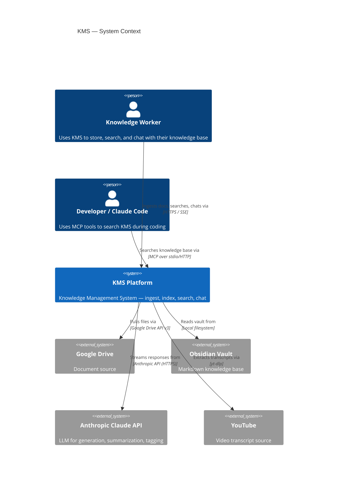
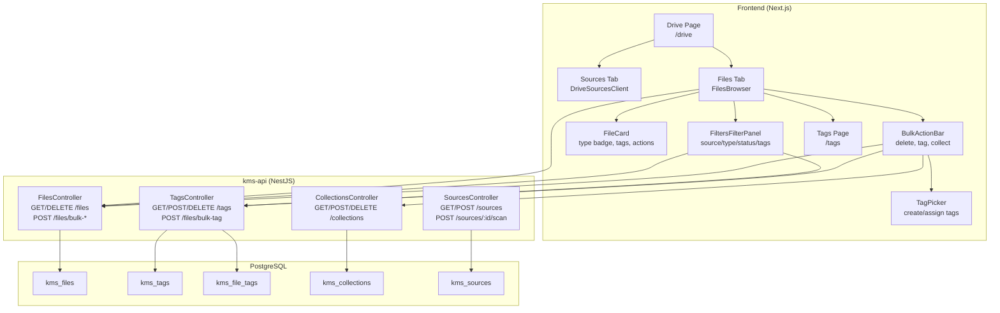
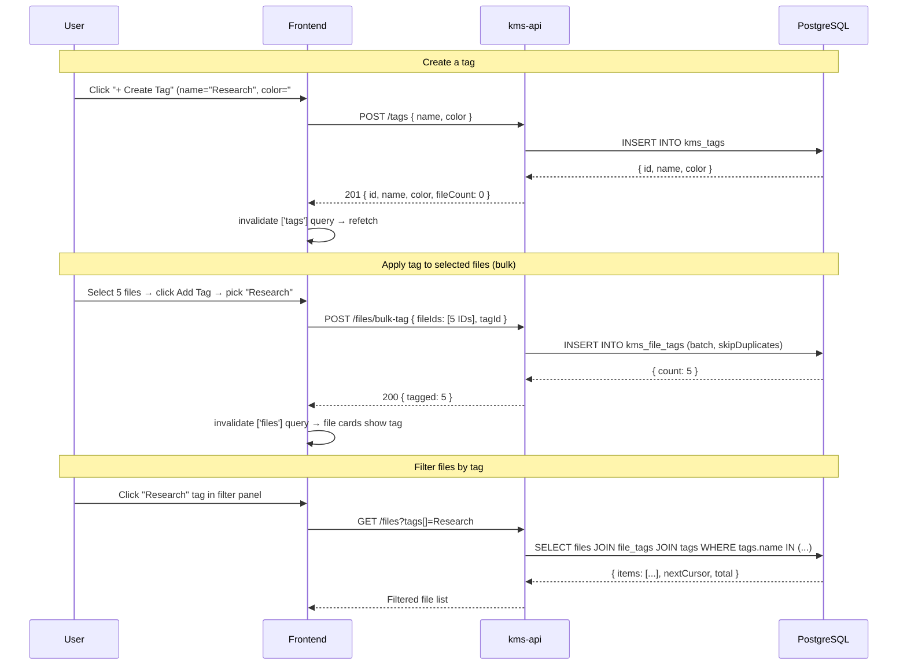
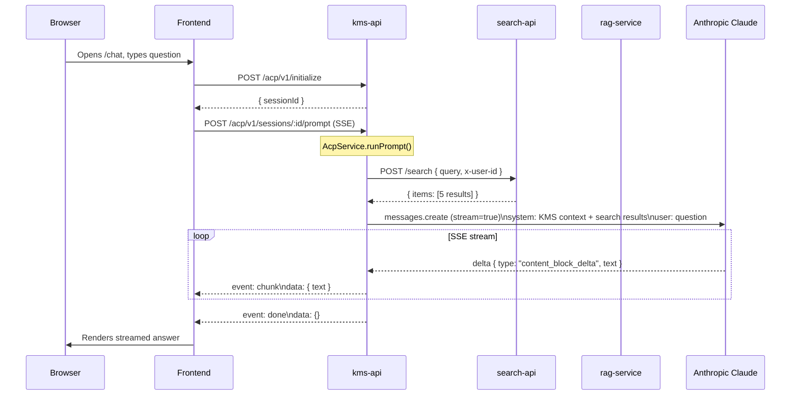

# KMS System Architecture

## 1. High-Level System Context (C4 Level 1)

## 2. Container Diagram (C4 Level 2)

```mermaid
C4Container
  title KMS — Containers

  Person(user, "User", "Web browser")

  Container(frontend, "Frontend", "Next.js 14, React, Tailwind", "Drive browser, chat, search UI")
  Container(kms_api, "kms-api", "NestJS 11 / Fastify", "REST API: auth, sources, files, ACP gateway, workflow engine")
  Container(search_api, "search-api", "NestJS 11 / Fastify", "Read-only hybrid search: BM25 + semantic + RRF")
  Container(rag_service, "rag-service", "FastAPI / Python", "RAG pipeline, tiered retrieval, SSE chat, LangGraph")
  Container(scan_worker, "scan-worker", "Python / aio-pika", "AMQP consumer: file discovery, connector dispatch")
  Container(embed_worker, "embed-worker", "Python / aio-pika", "AMQP consumer: text extraction, BGE-M3 embedding")
  Container(dedup_worker, "dedup-worker", "Python / aio-pika", "AMQP consumer: SHA-256 + semantic dedup")
  Container(graph_worker, "graph-worker", "Python / aio-pika", "AMQP consumer: Neo4j entity extraction")
  Container(url_agent, "url-agent", "FastAPI / Python", "YouTube transcript + web page extraction (port 8004)")
  Container(voice_app, "voice-app", "FastAPI / Python", "Audio transcription via Whisper (port 8003)")

  ContainerDb(postgres, "PostgreSQL 16", "Database", "Users, files, sources, collections, tags, chunks")
  ContainerDb(qdrant, "Qdrant", "Vector DB", "1024-dim BGE-M3 dense vectors for semantic search")
  ContainerDb(neo4j, "Neo4j", "Graph DB", "Entity relationships, knowledge graph")
  ContainerDb(redis, "Redis", "Cache / Queue", "Session store, scan locks, BullMQ job queue")
  ContainerDb(rabbitmq, "RabbitMQ", "Message Broker", "kms.scan, kms.embed, kms.dedup, kms.graph queues")

  Rel(user, frontend, "Uses", "HTTPS")
  Rel(frontend, kms_api, "Calls", "REST/JSON, SSE")
  Rel(frontend, rag_service, "Streams chat", "SSE / HTTP")
  Rel(kms_api, search_api, "Proxies search", "HTTP fetch")
  Rel(kms_api, rabbitmq, "Publishes scan jobs", "AMQP")
  Rel(kms_api, redis, "Session store, BullMQ", "Redis protocol")
  Rel(kms_api, postgres, "Reads/writes", "Prisma / pg")
  Rel(rag_service, search_api, "Retrieves context", "HTTP fetch")
  Rel(rag_service, postgres, "LangGraph state", "asyncpg")
  Rel(scan_worker, rabbitmq, "Consumes kms.scan", "AMQP")
  Rel(scan_worker, rabbitmq, "Publishes kms.embed", "AMQP")
  Rel(embed_worker, rabbitmq, "Consumes kms.embed", "AMQP")
  Rel(embed_worker, qdrant, "Upserts vectors", "HTTP")
  Rel(embed_worker, postgres, "Updates file status", "asyncpg")
  Rel(graph_worker, rabbitmq, "Consumes kms.graph", "AMQP")
  Rel(graph_worker, neo4j, "Writes entities", "Bolt")
  Rel(url_agent, rabbitmq, "Publishes kms.embed", "AMQP")
  Rel(kms_api, url_agent, "Triggers ingest", "HTTP fetch")
```

## 3. Drive File Management — Component Diagram

## 4. Tag System Data Flow

## 5. ACP + RAG Chat Flow (End-to-End)

