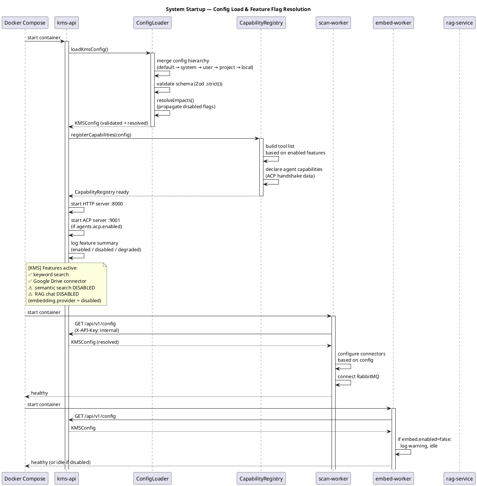
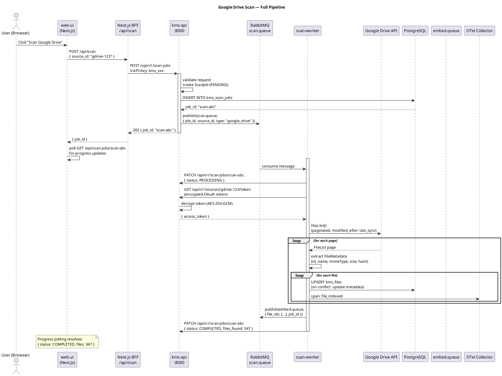
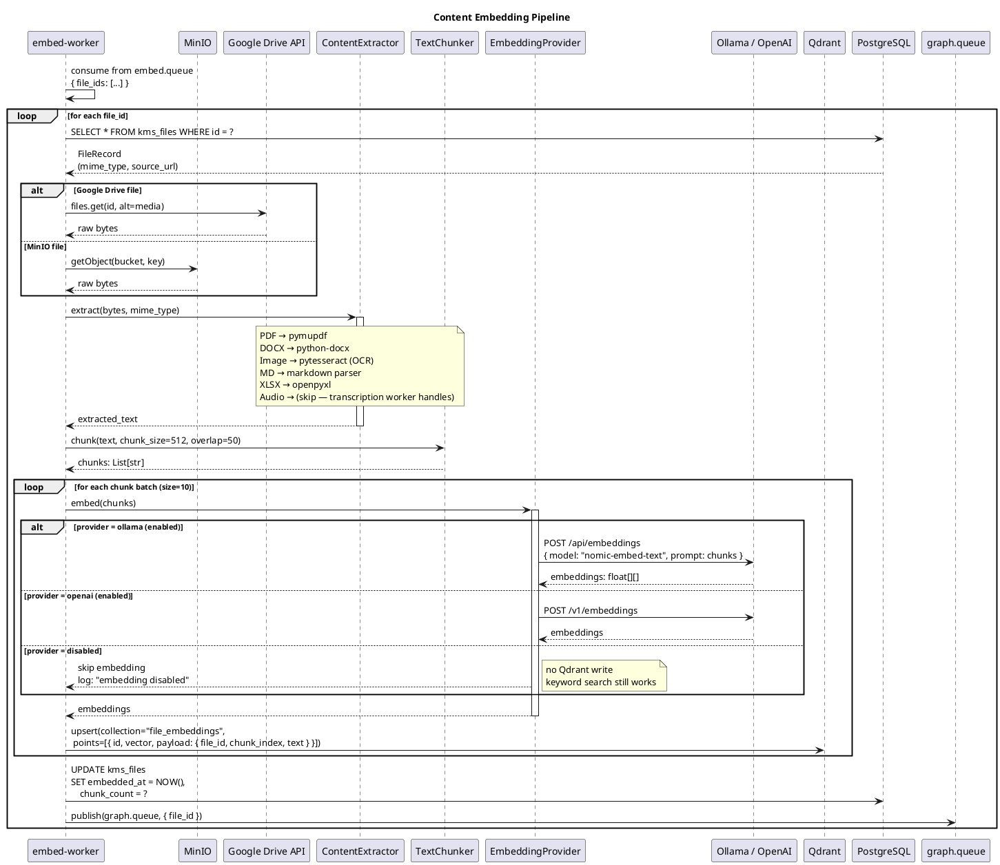
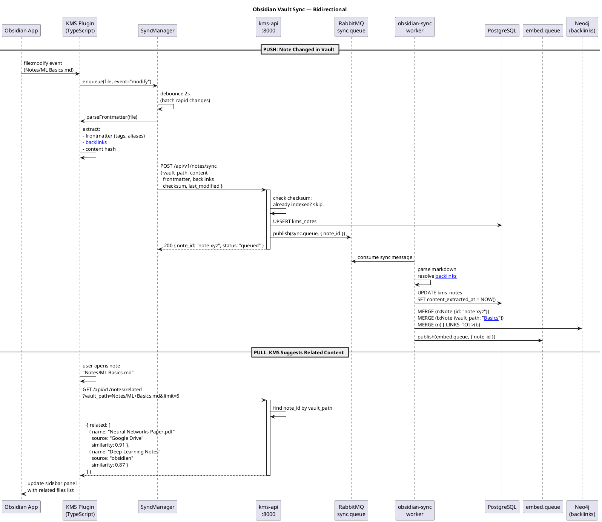
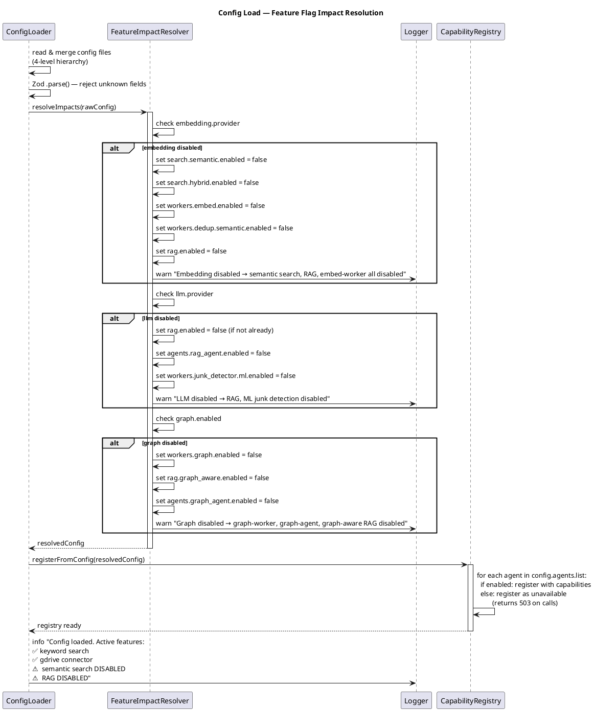
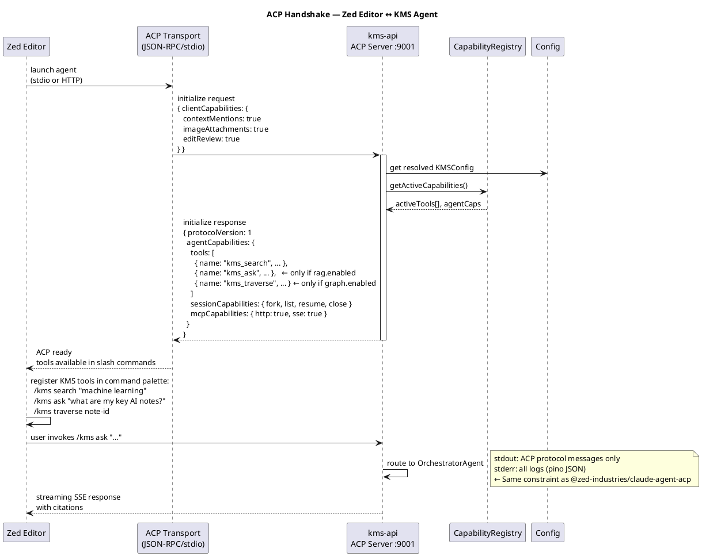

# Sequence Diagrams — Knowledge Base System

**Version**: 1.0
**Date**: 2026-03-17
**Format**: PlantUML (render at plantuml.com or via VS Code extension)

---

## 1. System Startup & Config Load



---

## 2. Google Drive Scan Flow



---

## 3. Content Embedding Pipeline



---

## 4. Hybrid Search Flow

```plantuml
@startuml search
title Hybrid Search — Keyword + Semantic + RRF Ranking

actor "User" as U
participant "web-ui" as UI
participant "BFF /api/search" as BFF
participant "search-api\n:8001" as SA
participant "Redis Cache" as RC
participant "PostgreSQL\n(FTS)" as PG
participant "Qdrant\n(Vectors)" as QD
participant "EmbeddingProvider" as EP

U -> UI : type search query:\n"machine learning fundamentals"
UI -> BFF : POST /api/search\n{ query, filters, page }
BFF -> SA : POST /api/v1/search\n(forwards with API key)

activate SA
SA -> RC : GET cache:search:hash(query+filters)
alt Cache hit (5 min TTL)
  RC --> SA : cached SearchResult
  SA --> BFF : 200 (from cache)
else Cache miss
  SA -> SA : validate + parse request

  par Parallel execution
    SA -> PG : SELECT * FROM kms_files\nWHERE to_tsvector('english', content)\n  @@ plainto_tsquery(?)\nORDER BY ts_rank DESC\nLIMIT 50
    PG --> SA : keyword_results: [{id, rank, ...}]
  and
    alt semantic search enabled
      SA -> EP : embed(query)
      EP --> SA : query_vector: float[]
      SA -> QD : search(\n  collection="file_embeddings",\n  vector=query_vector,\n  limit=50,\n  filter=source_filter\n)
      QD --> SA : semantic_results: [{id, score, ...}]
    else semantic disabled
      SA -> SA : semantic_results = []
    end
  end

  SA -> SA : RRF merge:\nscore = Σ 1/(k + rank_i)\n(keyword weight=0.4, semantic weight=0.6)

  SA -> SA : apply filters\n(file_type, source, date_range)
  SA -> SA : paginate (limit=20)

  SA -> RC : SET cache:search:hash\n(TTL: 300s)
  SA --> BFF : 200 SearchResult[]
end
deactivate SA

BFF --> UI : search results
UI -> UI : render results\nwith file previews

@enduml
```

---

## 5. RAG Question-Answering Flow

```plantuml
@startuml rag
title RAG Chat — Graph-Aware Q&A with Citations

actor "User" as U
participant "web-ui\n(Chat UI)" as UI
participant "BFF /api/agents" as BFF
participant "kms-api\nOrchestrator" as ORCH
participant "search-api" as SA
participant "graph-api" as GA
participant "rag-service\n:8002" as RAG
participant "Qdrant" as QD
participant "Neo4j" as N4J
participant "LLM Provider\n(Ollama/OpenRouter)" as LLM
participant "Redis\n(conversation)" as RC

U -> UI : "What are the key concepts in my ML notes?"
UI -> BFF : POST /api/agents/run\n{ input: [{role:"user", content:"..."}]\n  session_id: "sess-abc"\n  stream: true }
BFF -> ORCH : POST /api/v1/agents/orchestrator/runs

activate ORCH
ORCH -> ORCH : classifyIntent()\n→ type: "question"
ORCH -> RC : GET session:sess-abc\n(conversation history)
RC --> ORCH : previous_turns[]

par Parallel context gathering
  ORCH -> SA : POST /api/v1/search\n{ query, stream: false }
  SA --> ORCH : search_results (top 10)
and
  ORCH -> GA : POST /api/v1/graph/traverse\n{ query_entities, depth: 3 }
  GA -> N4J : MATCH path from entities...\nLIMIT 20
  N4J --> GA : graph_paths[]
  GA --> ORCH : graph_context
end

ORCH -> RAG : POST /api/v1/rag/ask\n{ question, search_results\n  graph_context, history\n  stream: true }
deactivate ORCH

activate RAG
RAG -> RAG : build prompt:\n  - system context\n  - graph community summaries\n  - top-K chunks\n  - conversation history
RAG -> QD : search chunks by query vector\n(top 5 per result)
QD --> RAG : relevant chunks[]

RAG -> LLM : stream completion\n(context + question)
loop streaming tokens
  LLM --> RAG : token
  RAG --> BFF : SSE: data: {"token": "..."}
  BFF --> UI : stream token
  UI -> UI : render token in chat
end

RAG -> RAG : extract citations\nfrom generated text
RAG --> BFF : SSE: data: {"citations": [...], "done": true}
BFF --> UI : final citations
deactivate RAG

RAG -> RC : SET session:sess-abc\n(append turn, TTL: 24h)

UI -> UI : render answer + citation cards\n(click citation → open file)

@enduml
```

---

## 6. Obsidian Sync Flow



---

## 7. Feature Flag Config Load & Impact Propagation



---

## 8. ACP Handshake (Editor Integration)


