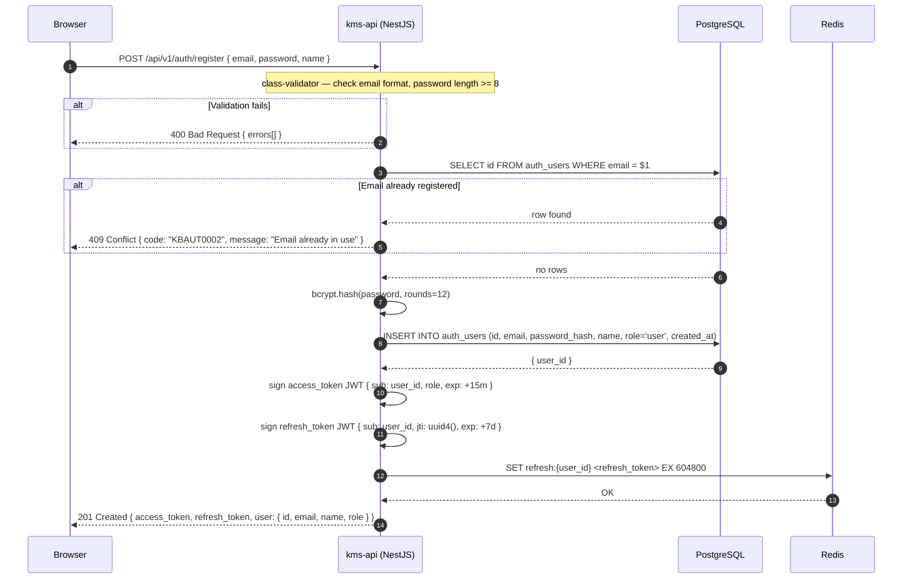

# 01 — User Registration

## Overview

A new user submits their credentials via the browser. `kms-api` validates input,
enforces email uniqueness, hashes the password with bcrypt, persists the user row,
issues a JWT access token (15-minute TTL) and a refresh token (7-day TTL), stores
the refresh token in Redis, and returns the full auth payload with 201 Created.

## Participants

| Alias | Service |
|-------|---------|
| `BR` | Browser |
| `A` | kms-api (NestJS) |
| `DB` | PostgreSQL (`auth_users` table) |
| `RD` | Redis |

## Sequence Diagram

## Notes

1. **Input validation** uses `class-validator` decorators on the `RegisterDto`. Any constraint violation returns 400 with a structured `errors[]` array before any DB call is made.
2. **Email uniqueness** is checked with a SELECT before the INSERT. A unique index on `auth_users.email` also enforces this at the DB level as a race-condition guard.
3. **Password hashing** uses `bcrypt` with `rounds=12`. The plaintext password is never stored or logged.
4. **JWT access token** is short-lived (15 minutes) and contains `sub` (user UUID) and `role`. It is signed with the `JWT_SECRET` environment variable using HS256.
5. **Refresh token** is a separate JWT with a `jti` (JWT ID) claim. It is stored in Redis under `refresh:{user_id}` with a 7-day TTL. The stored value is the full token string.
6. **Response shape** returns both tokens alongside the non-sensitive user fields. The password hash is never included in any response DTO.

## Error Flows

| Step | Failure | Handling |
|------|---------|----------|
| Validation | Missing field / bad email format | 400 Bad Request with field-level errors |
| Email check | Email already exists | 409 Conflict — `KBAUT0002` |
| bcrypt | Unexpected hash failure | 500 Internal Server Error — logged with PinoLogger |
| DB INSERT | Unexpected DB error | 500 Internal Server Error — logged with PinoLogger |
| Redis SET | Redis unavailable | Log warning and continue — access token still usable for 15 min |

## Dependencies

- `kms-api`: `AuthController`, `AuthService`, `UsersService`
- `PostgreSQL`: `auth_users` table
- `Redis`: `refresh:{user_id}` key (TTL 7 days)
