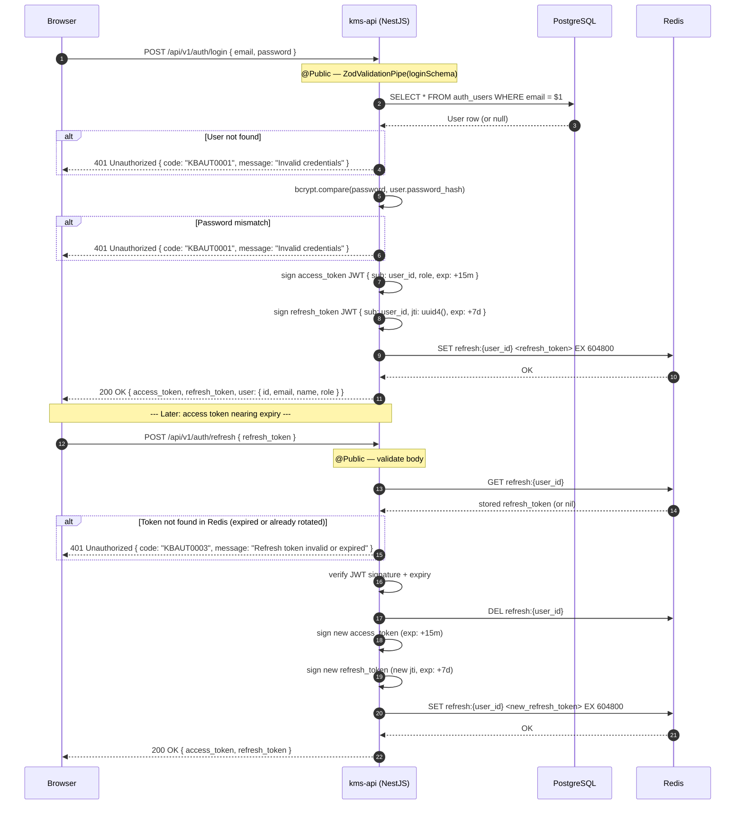

# 02 — User Login + JWT Refresh

## Overview

A registered user authenticates with email and password. `kms-api` verifies
credentials against the stored bcrypt hash, generates a JWT access token
(15-minute TTL) and refresh token (7-day TTL), and stores the refresh token
in Redis. A separate refresh sub-flow lets the client rotate both tokens without
re-authenticating; the old refresh token is deleted and a new pair is issued.

## Participants

| Alias | Service |
|-------|---------|
| `BR` | Browser |
| `A` | kms-api (NestJS) |
| `DB` | PostgreSQL (`auth_users` table) |
| `RD` | Redis |

## Sequence Diagram

## Notes

1. **Login** uses `@Public()` — the global `JwtAuthGuard` is bypassed. Input validated by `ZodValidationPipe` before any DB query.
2. **bcrypt.compare** is always called when a user row is found. The same 401 error code is returned for both user-not-found and wrong-password to prevent user enumeration.
3. **Refresh token rotation**: the old Redis key is deleted before the new pair is issued, so each refresh token can only be used once. A second use of the same token returns 401.
4. **Redis key**: `refresh:{user_id}`. Only one active refresh token per user — a new login overwrites any existing key. Multi-device scenarios should store per-device tokens using a `jti`-scoped key.
5. **Access token** is verified by `JwtAuthGuard` on every protected route. It is stateless; there is no revocation mechanism for access tokens within their 15-minute window.
6. `POST /api/v1/auth/logout` should `DEL refresh:{user_id}` to invalidate the refresh token immediately.

## Error Flows

| Step | Condition | HTTP | Error Code |
|------|-----------|------|------------|
| Login | User not found | 401 | KBAUT0001 |
| Login | Wrong password | 401 | KBAUT0001 |
| Login | DB unavailable | 500 | — |
| Refresh | Token missing from Redis | 401 | KBAUT0003 |
| Refresh | JWT signature invalid | 401 | KBAUT0003 |
| Refresh | JWT expired (and Redis TTL also expired) | 401 | KBAUT0003 |

## Dependencies

- `kms-api`: `AuthController`, `AuthService`
- `PostgreSQL`: `auth_users` table
- `Redis`: `refresh:{user_id}` key (TTL 7 days)
