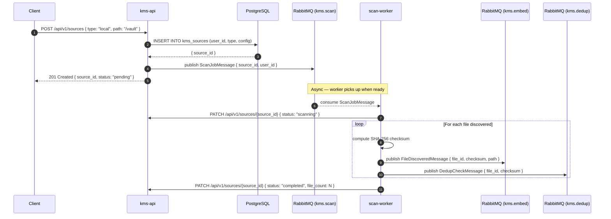

# Flow: Source Connect and File Scan

## Overview

A user connects a file source (local folder, Google Drive) to KMS. kms-api persists the source, publishes a scan job to RabbitMQ. scan-worker discovers files, computes SHA-256 checksums, and publishes `file.discovered` events for downstream processing.

## Sequence Diagram

## Error Flows

| Step | Failure | Handling |
|---|---|---|
| DB insert fails | Source creation fails | 500 returned to client, no queue message published |
| Scan worker crashes | Message nack'd → requeue | connect_robust() reconnects; stale `scanning` source reset on restart |
| File unreadable | Logged, skipped, count decremented | Partial scan still completes |
| kms-api PATCH unreachable | Worker retries 3x with backoff | Source status may stay `scanning` — monitor via job health check |

## Dependencies

- `kms-api`: Source CRUD endpoints
- `RabbitMQ`: `kms.scan` (input), `kms.embed` (output), `kms.dedup` (output)
- `scan-worker`: File connector + SHA-256 checksum computation
- `PostgreSQL`: `kms_sources` table
