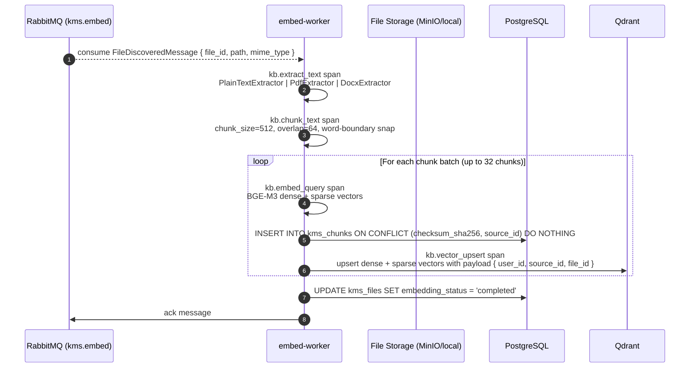

# Flow: File Embedding Pipeline

## Overview

After scan-worker publishes a `FileDiscoveredMessage`, embed-worker extracts text from the file, splits it into overlapping chunks, generates BGE-M3 embeddings, and upserts them into Qdrant. A PostgreSQL record is created for each chunk.

## Sequence Diagram



## Error Flows

| Step | Failure | Handling |
|---|---|---|
| Text extraction fails | `ExtractionError` raised | `nack(requeue=False)` — routes to DLQ; file marked `extraction_failed` |
| BGE-M3 model unavailable | `EmbeddingError` (retryable) | `nack(requeue=True)` — requeued with backoff |
| Qdrant unavailable | `retryable=True` | `nack(requeue=True)` — retried up to 3x |
| DB upsert conflict | `ON CONFLICT DO NOTHING` | Idempotent — already indexed |

## Chunk Storage Schema

```sql
CREATE TABLE kms_chunks (
    id UUID PRIMARY KEY DEFAULT gen_random_uuid(),
    file_id UUID NOT NULL,
    source_id UUID NOT NULL,
    user_id UUID NOT NULL,
    chunk_index INT NOT NULL,
    content TEXT NOT NULL,
    checksum_sha256 CHAR(64) NOT NULL,
    token_count INT,
    created_at TIMESTAMPTZ DEFAULT NOW(),
    UNIQUE (checksum_sha256, source_id)
);
```

## Dependencies

- `RabbitMQ`: `kms.embed` queue (input)
- `embed-worker`: BGE-M3 model via `FlagEmbedding`
- `PostgreSQL`: `kms_chunks` table
- `Qdrant`: `kms_chunks` collection (1024-dim, INT8 quantized)
