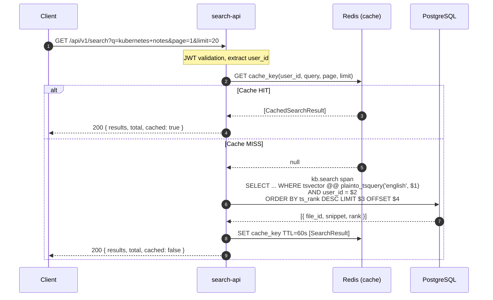

# Flow: Keyword Search

## Overview

A user performs a keyword search. search-api is read-only and executes full-text search against PostgreSQL's GIN tsvector index, returning ranked results with snippet highlights. Redis caches frequent queries.

## Sequence Diagram



## PostgreSQL Query

```sql
SELECT
    f.id,
    f.name,
    f.mime_type,
    f.created_at,
    ts_headline('english', c.content, plainto_tsquery('english', $1),
        'MaxFragments=2, FragmentDelimiter=...') AS snippet,
    ts_rank(c.search_vector, plainto_tsquery('english', $1)) AS rank
FROM kms_chunks c
JOIN kms_files f ON f.id = c.file_id
WHERE
    c.search_vector @@ plainto_tsquery('english', $1)
    AND c.user_id = $2
ORDER BY rank DESC
LIMIT $3 OFFSET $4;
```

## Error Flows

| Step | Failure | Handling |
|---|---|---|
| Redis unavailable | Skip cache, proceed to DB | Logged as warning, query executes normally |
| DB unavailable | 503 Service Unavailable | `/health/ready` already shows degraded |
| Empty query | 400 Bad Request | Zod validation rejects before handler |
| Page out of range | Empty results array | Not an error, `total` shows actual count |

## Dependencies

- `search-api`: NestJS read-only service, port 8001
- `PostgreSQL`: GIN index on `kms_chunks.search_vector`
- `Redis`: Query result cache (TTL 60s)
