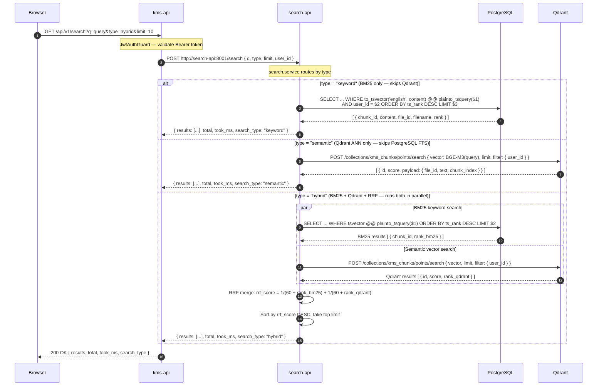

# 06 — Hybrid Search

## Overview

A client sends a search request through `kms-api`, which proxies it to `search-api`.
`search-api` runs BM25 keyword search against PostgreSQL full-text search and dense
semantic search against Qdrant in parallel, then fuses the ranked lists with
Reciprocal Rank Fusion (RRF, k=60). Three modes are supported: `keyword` (BM25
only), `semantic` (Qdrant ANN only), and `hybrid` (both + RRF). The result is
returned as a ranked list with scores, file metadata, and a `took_ms` envelope.

## Participants

| Alias | Service |
|-------|---------|
| `BR` | Browser |
| `A` | kms-api |
| `SA` | search-api |
| `DB` | PostgreSQL (FTS tsvector) |
| `QD` | Qdrant |

## Sequence Diagram

## Notes

1. `search-api` is **read-only** — it performs no writes and holds no auth state. It accepts `user_id` as a trusted internal parameter passed by `kms-api` after JWT validation.
2. PostgreSQL FTS uses a `tsvector` column on `kms_chunks.content` backed by a GIN index. The `plainto_tsquery` function handles multi-word queries without requiring the caller to format tsquery syntax.
3. Qdrant vector search uses BGE-M3 dense embeddings at 1024 dimensions. The query embedding is generated within `search-api` (not delegated to embed-worker) on the hot path.
4. RRF is computed in-memory in `search-api` once both result sets are collected. The fusion constant `k=60` dampens the impact of high ranks in either list.
5. `keyword` mode skips Qdrant entirely; `semantic` mode skips PostgreSQL FTS. Only `hybrid` runs both legs in parallel.
6. `took_ms` is measured from when `search-api` receives the request to when it begins serialising — it excludes kms-api proxy latency.

## Error Flows

| Step | Failure | Handling |
|------|---------|----------|
| JWT invalid | `JwtAuthGuard` throws | 401 Unauthorized |
| search-api unreachable | `httpx.ConnectError` in kms-api | 503 Service Unavailable |
| Qdrant timeout (>5s) | Semantic leg times out | Falls back to BM25-only results with `search_type: "keyword"` |
| Empty query string | Validation error in search-api | 400 Bad Request |

## Dependencies

- `kms-api`: JWT auth, proxy to search-api
- `search-api`: BM25 + Qdrant search, RRF fusion
- `PostgreSQL`: FTS tsvector on `kms_chunks`
- `Qdrant`: Dense ANN search (`kms_chunks` collection, 1024-dim BGE-M3)
