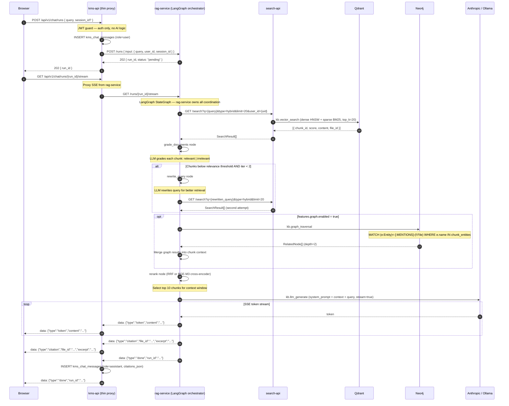

# Flow: RAG Chat Completion

## Overview

> **Implementation note (2026-03-18):** This diagram documents the **planned future state**
> where `kms-api` proxies chat requests to `rag-service` (LangGraph) and `rag-service`
> calls `search-api`.  The **current implementation** in `AcpService` / `AcpToolRegistry`
> has `kms-api` calling `search-api` directly (no hop to `rag-service` in the ACP prompt
> flow) and then calling `AnthropicAdapter` for generation.  Update this diagram once the
> rag-service orchestration refactor is complete.  See `FOR-e2e-flows.md` for the
> current actual flow.

A user sends a chat query. `kms-api` validates the JWT and proxies to `rag-service` — it performs no orchestration. `rag-service` runs a **LangGraph StateGraph** that orchestrates all sub-agents internally: hybrid retrieval via `search-api`, optional graph expansion via Neo4j, relevance grading, query rewriting, and LLM generation. Response is streamed token-by-token via SSE through `kms-api` to the browser.

See [ADR-0013](../decisions/0013-orchestrator-pattern.md) for why orchestration lives in Python, and [ADR-0012](../decisions/0012-acp-protocol.md) for the run-lifecycle protocol.

## Sequence Diagram



## LangGraph StateGraph

```
[retrieve]
    ↓
[grade_documents]  ← LLM: relevant / irrelevant per chunk
    │                    (iter < 2 AND any irrelevant?)
    │ yes: all relevant              │ no: retry
    ↓                                ↓
[graph_expand]               [rewrite_query]
(optional, feature-flag)             ↓
    ↓                           [retrieve]  ← loop back
[rerank]
    ↓
[generate]  ← Anthropic Claude / Ollama, streaming SSE
```

**State shape (`GraphState`):**

```python
class GraphState(TypedDict):
    query: str
    rewritten_query: str | None
    chunks: list[SearchResult]
    graded_chunks: list[SearchResult]
    graph_nodes: list[RelatedNode]
    context: str
    answer: str
    citations: list[Citation]
    session_id: str
    user_id: str
    iteration: int  # rewrite loop counter, max 2
```

## Error Flows

| Step | Failure | Handling |
|------|---------|----------|
| `search-api` unreachable | `httpx.ConnectError` | Raise `SearchUnavailableError` → SSE `{"type":"error","code":"KBRAG0003"}` |
| LLM unreachable | `anthropic.APIConnectionError` | Return retrieved context as plain text without generation |
| Neo4j timeout | `asyncio.TimeoutError` (5s) | Skip graph expansion, continue with Qdrant results only |
| No relevant chunks after 2 rewrites | Low score threshold | SSE `{"type":"error","code":"KBRAG0006"}` — no relevant content |
| `rag-service` crash | `fetch` throws in kms-api | kms-api returns 502 to browser |

## OTel Custom Spans (in rag-service)

| Span name | Attributes |
|-----------|------------|
| `kb.vector_search` | `query`, `top_k`, `search_type` |
| `kb.graph_traversal` | `entity_count`, `depth` |
| `kb.llm_generate` | `model`, `provider`, `prompt_tokens` |
| `kb.rag_grade` | `chunk_count`, `relevant_count`, `iteration` |

## Redis Keys

| Key | Value | TTL |
|-----|-------|-----|
| `kms:rag:run:{run_id}` | Run state JSON (status, chunks, answer) | 10 min |
| `kms:chat:session:{session_id}:context` | Last N messages for context window | 30 min |

## Dependencies

| Service | Role |
|---------|------|
| `kms-api` | JWT auth, message persistence, SSE proxy |
| `rag-service` | **LangGraph orchestrator** — owns all AI logic |
| `search-api` | Hybrid keyword + vector search (called by rag-service) |
| `Qdrant` | Dense + sparse vector store |
| `Neo4j` | Graph traversal (optional, feature-flagged) |
| `Anthropic API / Ollama` | LLM generation |
| `Redis` | Run state cache, session context cache |
| `PostgreSQL` | Chat session and message persistence |
