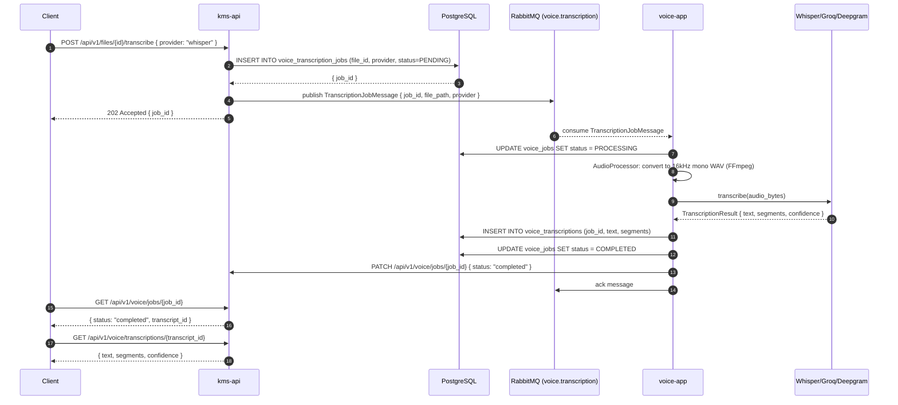

# Flow: Voice Transcription

## Overview

A user uploads an audio/video file for transcription. voice-app receives the job via RabbitMQ, converts to 16kHz WAV, selects the best available transcription provider (Whisper → Groq → Deepgram), and stores the transcript. kms-api is notified and links the transcript to the originating file.

## Sequence Diagram



## Error Flows

| Step | Failure | Handling |
|---|---|---|
| FFmpeg conversion fails | Audio format unsupported | Job marked FAILED with error message |
| Primary provider fails | Fallback chain: Whisper → Groq → Deepgram | `is_available()` check before each attempt |
| All providers unavailable | Job FAILED after 3 retries | nack → DLQ |
| Job timeout (60 min) | Job monitor marks FAILED | Background `job_monitor.py` sweeps stale PROCESSING jobs |

## Provider Selection

```python
# Provider fallback chain
FALLBACK_ORDER = ["whisper", "groq", "deepgram"]

async def select_provider(requested: str) -> TranscriptionProvider:
    providers = [requested] + [p for p in FALLBACK_ORDER if p != requested]
    for name in providers:
        provider = factory.get(name)
        if await provider.is_available():
            return provider
    raise NoProviderAvailableError()
```

## Dependencies

- `kms-api`: File management, job status endpoints
- `RabbitMQ`: `voice.transcription` queue (input), `voice.dlq` (dead letter)
- `voice-app`: FastAPI transcription service, port 8003
- `FFmpeg`: Audio conversion (system dependency)
- `PostgreSQL`: `voice_jobs`, `voice_transcriptions` tables
