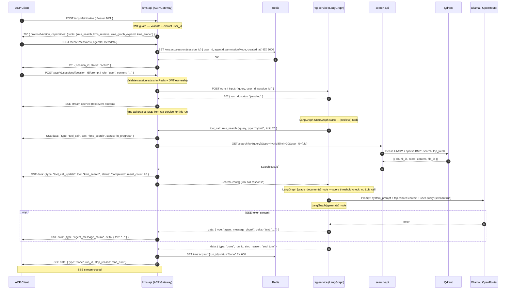

# Flow: ACP Gateway — Session Lifecycle and Prompt Flow

## Overview

An external ACP client (e.g., Zed editor, Claude Desktop) connects to KMS over HTTP using the Agent Communication Protocol (JSON-RPC 2.0 over HTTP with NDJSON SSE). `kms-api` acts as the ACP gateway: it authenticates the client via JWT, manages session state in Redis, and proxies the prompt to `rag-service` which runs the LangGraph orchestrator. Tool calls emitted by LangGraph are dispatched back through `kms-api`'s ACP tool router. Streaming tokens are forwarded to the client as `agent_message_chunk` SSE events until a `done` event closes the stream.

See [ADR-0012](../decisions/0012-acp-protocol.md) for the ACP protocol adoption decision and [ADR-0013](../decisions/0013-orchestrator-pattern.md) for why orchestration lives in `rag-service`.

## Participants

| Alias | Service | Port |
|-------|---------|------|
| `CLI` | ACP Client (Zed / Claude Desktop / curl) | — |
| `GW` | kms-api (ACP Gateway) | 8000 |
| `RD` | Redis | 6379 |
| `RS` | rag-service (LangGraph orchestrator) | 8002 |
| `SA` | search-api | 8001 |
| `QD` | Qdrant | 6333 |
| `LLM` | Ollama / OpenRouter | — |

## Sequence Diagram



## LangGraph StateGraph (rag-service)

```
[retrieve]           ← calls kms_search tool via GW
    ↓
[grade_documents]    ← score threshold, no LLM call
    │ all relevant              │ below threshold AND iter < 2
    ↓                           ↓
[graph_expand]           [rewrite_query]
(feature-flagged)              ↓
    ↓                      [retrieve]  ← loop back (max 2 iterations)
[rerank]
    ↓
[generate]           ← LLM streaming, emits agent_message_chunk events
```

## Error Flows

| Step | Condition | Behaviour |
|------|-----------|-----------|
| 1 | JWT missing or expired | `401 Unauthorized` — no session created |
| 3 | Session limit exceeded per user | `429 Too Many Requests` — `KBGEN0003` |
| 7 | `rag-service` unreachable on POST /runs | `GW` returns SSE `{ type: "error", code: "KBRAG0001" }` and closes stream |
| 12 | `search-api` unreachable | RS raises `SearchUnavailableError` → SSE `{ type: "error", code: "KBRAG0003" }` |
| 12 | Qdrant timeout (>5 s) | SA returns empty results; RS continues with 0 chunks, LLM informed |
| 19 | LLM unreachable | RS returns retrieved context as plain text without generation; stop_reason: "fallback" |
| 19 | No relevant chunks after 2 rewrites | SSE `{ type: "error", code: "KBRAG0006" }` — no relevant content found |
| Any | Session not found in Redis | `404 Not Found` — `KBGEN0004` |

## OTel Custom Spans

| Span name | Owner | Attributes |
|-----------|-------|------------|
| `kb.acp.initialize` | kms-api | `user_id`, `agent_id` |
| `kb.acp.session.create` | kms-api | `session_id`, `permission_mode` |
| `kb.acp.prompt` | kms-api | `session_id`, `run_id` |
| `kb.tool_call.kms_search` | kms-api | `query`, `result_count`, `latency_ms` |
| `kb.vector_search` | search-api | `query`, `top_k`, `search_type` |
| `kb.llm_generate` | rag-service | `model`, `provider`, `prompt_tokens` |

## Redis Keys

| Key | Value | TTL |
|-----|-------|-----|
| `kms:acp:session:{session_id}` | Session JSON (`user_id`, `agentId`, `permissionMode`) | 60 min |
| `kms:acp:run:{run_id}:status` | Run terminal status (`done`, `error`) | 10 min |
| `kms:rag:run:{run_id}` | Full run state JSON (chunks, answer, citations) | 10 min |

## Dependencies

| Service | Role |
|---------|------|
| `kms-api` | ACP gateway — JWT auth, session lifecycle, SSE proxy, tool dispatch |
| `rag-service` | LangGraph orchestrator — owns all AI logic, emits tool calls and token chunks |
| `search-api` | Hybrid BM25 + vector search, called by kms-api on behalf of `kms_search` tool |
| `Qdrant` | Dense + sparse vector store |
| `Redis` | ACP session state, run status cache |
| `Ollama / OpenRouter` | LLM generation (streaming) |
