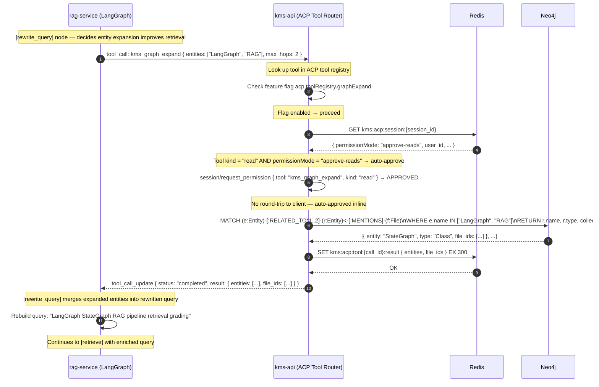
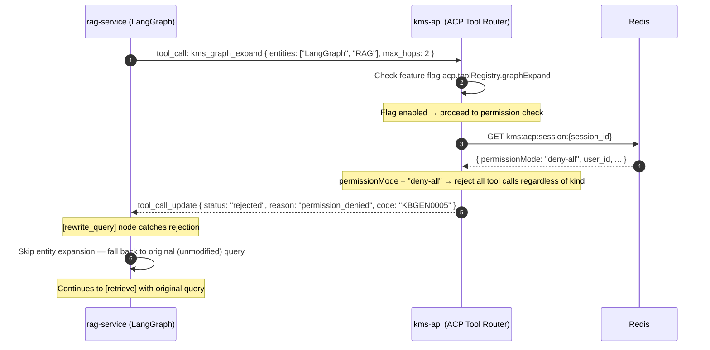

# Flow: ACP Tool Dispatch — kms_graph_expand

## Overview

When `rag-service`'s LangGraph `[rewrite_query]` node determines that entity-level context would improve retrieval, it emits a `kms_graph_expand` tool call. `kms-api`'s ACP tool router receives the call, checks the feature flag (`acp.toolRegistry.graphExpand`), resolves the session's `permissionMode` from Redis, and either auto-approves (read tool + `approve-reads` mode) or rejects (deny-all mode). On approval, kms-api runs a Cypher traversal on Neo4j and returns related entities and file IDs back to LangGraph for an enriched second-pass query.

See [ADR-0012](../decisions/0012-acp-protocol.md) for the permission model design.

## Participants

| Alias | Service | Port |
|-------|---------|------|
| `RS` | rag-service (LangGraph orchestrator) | 8002 |
| `TR` | kms-api (ACP Tool Router) | 8000 |
| `RD` | Redis (permission + session state) | 6379 |
| `N4` | Neo4j | 7687 |

## Sequence Diagram — Happy Path (permissionMode: approve-reads)



## Sequence Diagram — Fallback Path (permissionMode: deny-all)



## Permission Mode Reference

| permissionMode | Read tools | Write tools | Behaviour |
|----------------|-----------|-------------|-----------|
| `approve-reads` | Auto-approved inline | Rejected | All `kind: "read"` tools proceed without user prompt |
| `approve-all` | Auto-approved inline | Auto-approved inline | All registered tools proceed without user prompt |
| `deny-all` | Rejected | Rejected | No tool calls executed; LangGraph falls back to base query |
| `prompt-user` | Forwarded to client for approval | Forwarded to client for approval | Requires round-trip SSE event to ACP client (not shown here) |

## ACP Tool Registry Entry — kms_graph_expand

```json
{
  "name": "kms_graph_expand",
  "kind": "read",
  "description": "Traverse the KMS knowledge graph from seed entities up to max_hops, returning related entity names and associated file IDs.",
  "inputSchema": {
    "type": "object",
    "properties": {
      "entities": { "type": "array", "items": { "type": "string" } },
      "max_hops": { "type": "integer", "minimum": 1, "maximum": 3 }
    },
    "required": ["entities", "max_hops"]
  }
}
```

## Error Flows

| Step | Condition | Behaviour |
|------|-----------|-----------|
| 3 | Feature flag `acp.toolRegistry.graphExpand` is `false` | `TR` returns `tool_call_update { status: "rejected", reason: "tool_disabled", code: "KBGEN0006" }` |
| 4 | Session not found in Redis (expired or invalid) | `TR` returns `404` to `RS`; LangGraph falls back to original query |
| 8 | Neo4j unreachable | `TR` catches `Neo4jServiceUnavailable`; returns `tool_call_update { status: "error", code: "KBWRK0004" }`; LangGraph falls back |
| 8 | Neo4j query exceeds 5 s timeout | `asyncio.TimeoutError` in tool handler; same fallback as unreachable |
| 8 | Zero entities matched in graph | Returns `{ entities: [], file_ids: [] }` with `status: "completed"` — empty result is valid |
| Any | Tool call payload fails schema validation | `TR` returns `400 Bad Request` with `KBGEN0002`; LangGraph logs and falls back |

## OTel Custom Spans

| Span name | Owner | Attributes |
|-----------|-------|------------|
| `kb.acp.tool_dispatch` | kms-api | `tool_name`, `session_id`, `permission_mode` |
| `kb.acp.permission_check` | kms-api | `tool_kind`, `permission_mode`, `decision` |
| `kb.graph_traversal` | kms-api | `entity_count`, `max_hops`, `result_count`, `latency_ms` |

## Redis Keys

| Key | Value | TTL |
|-----|-------|-----|
| `kms:acp:session:{session_id}` | Session JSON including `permissionMode` | 60 min (rolling) |
| `kms:acp:tool:{call_id}:result` | Serialised tool result for deduplication / replay | 5 min |

## Dependencies

| Service | Role |
|---------|------|
| `kms-api` | ACP tool router — feature flag check, permission resolution, Neo4j execution |
| `rag-service` | LangGraph orchestrator — emits tool calls, consumes results, applies fallback logic |
| `Neo4j` | Knowledge graph store — Cypher traversal for entity expansion |
| `Redis` | Session permission state, tool result cache |
