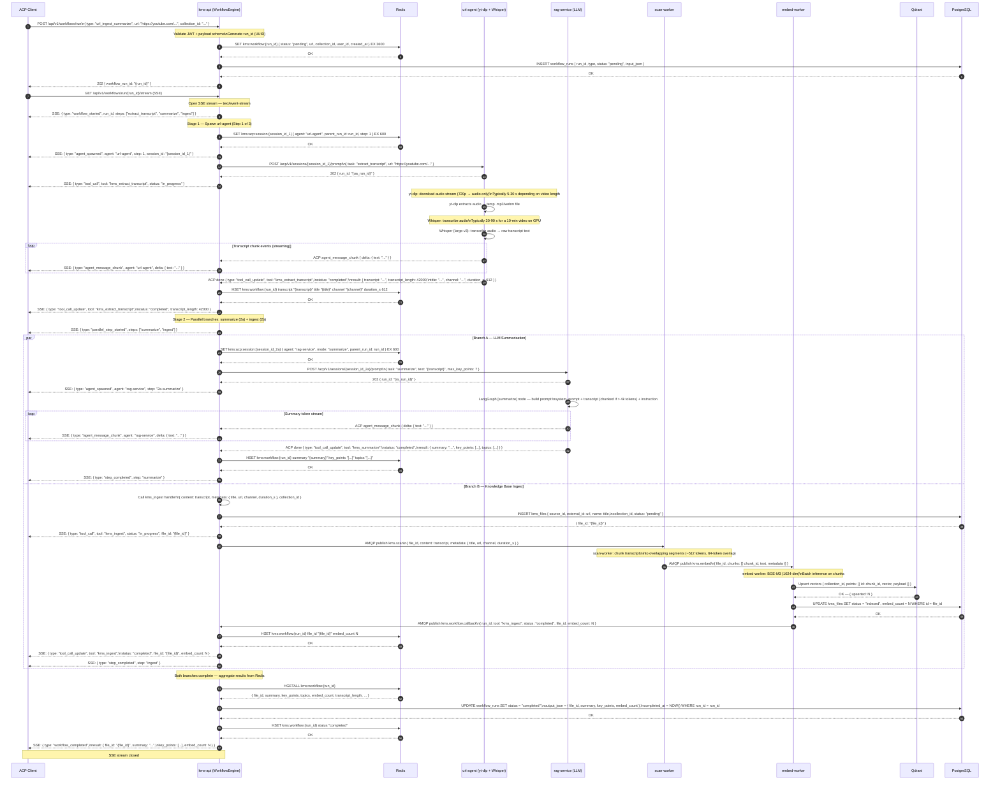

# Flow: YouTube URL Ingest & Summarize Workflow

## Overview

A user submits a YouTube URL through the ACP client or REST frontend. `kms-api`'s WorkflowEngine creates a tracked run, streams progress over SSE, then executes two sequential stages: (1) transcript extraction via `url-agent` (yt-dlp + Whisper), and (2) parallel branches — LLM summarization via `rag-service` and knowledge-base ingestion via the scan/embed pipeline. The workflow completes by aggregating both branch outputs and returning `{ file_id, summary, key_points, embed_count }` over the SSE stream.

## Participants

| Alias | Service | Port |
|-------|---------|------|
| `CLI` | Browser / ACP Client | — |
| `WE` | kms-api (WorkflowEngine + REST gateway) | 8000 |
| `RD` | Redis (workflow state + ACP sessions) | 6379 |
| `UA` | url-agent (FastAPI — yt-dlp + Whisper) | 8005 |
| `RS` | rag-service (FastAPI — LLM summarization) | 8002 |
| `SW` | scan-worker (AMQP consumer) | — |
| `EW` | embed-worker (AMQP consumer) | — |
| `QD` | Qdrant (vector store) | 6333 |
| `PG` | PostgreSQL (files + workflow run persistence) | 5432 |

## Sequence Diagram — Happy Path

## Error Flows

| Step | Condition | Behaviour |
|------|-----------|-----------|
| 1 | YouTube URL is malformed or not a YouTube domain | `WE` returns `400 Bad Request` `KBWFL0001` before creating run; no SSE stream opened |
| 1 | JWT missing or expired | `WE` returns `401 Unauthorized`; no run created |
| 11–14 | `url-agent` unreachable (port 8005 down) | `WE` emits SSE `{ type: "error", code: "KBWFL0002", step: "extract_transcript" }`; workflow run marked `failed` in PG + Redis; stream closed |
| 15–18 | yt-dlp fails (private video, geo-block, removed video) | `UA` returns ACP error `{ status: "error", reason: "yt_dlp_failed" }`; `WE` emits SSE `{ type: "error", code: "KBWFL0003", message: "Video unavailable" }`; run marked `failed` |
| 19–21 | Whisper transcription fails (OOM, model load error) | `UA` returns ACP error `{ status: "error", reason: "whisper_failed" }`; `WE` emits SSE `{ type: "error", code: "KBWFL0004" }`; run marked `failed`; no partial ingest attempted |
| Branch A | LLM (Ollama / OpenRouter) unreachable during summarization | `RS` returns ACP done with `stop_reason: "fallback"`; `WE` emits SSE `{ type: "step_completed", step: "summarize", fallback: true }`; summary omitted from final result; ingest branch continues unaffected |
| Branch A | LLM returns empty or malformed summary JSON | `WE` logs warning; emits `step_completed` with `summary: null, key_points: []`; workflow still completes |
| Branch B | AMQP `kms.scan` publish timeout (> 10 s) | `WE` emits SSE `{ type: "error", code: "KBWFL0005", step: "ingest" }`; `file_id` created in PG with `status: "failed"`; summarization result still returned if Branch A completed |
| Branch B | embed-worker dead / no consumer on `kms.embed` | Message remains in queue; `WE` polls `kms.workflow.callback` with 120 s timeout; on timeout emits SSE `{ type: "error", code: "KBWFL0006", step: "ingest" }` |
| Branch B | Qdrant upsert fails | `EW` nacks message (requeue); retries up to 3×; on exhaustion publishes dead-letter; `WE` callback receives `status: "error"` |
| Any | Redis unreachable during workflow state write | `WE` falls back to in-memory run state for duration of stream; logs `KBWFL0007`; no SSE error to client |

## OTel Custom Spans

| Span name | Owner | Attributes |
|-----------|-------|------------|
| `kb.workflow.run` | kms-api | `run_id`, `workflow_type`, `url` |
| `kb.workflow.step.extract_transcript` | kms-api | `run_id`, `transcript_length`, `duration_s`, `latency_ms` |
| `kb.workflow.step.summarize` | kms-api | `run_id`, `key_point_count`, `fallback`, `latency_ms` |
| `kb.workflow.step.ingest` | kms-api | `run_id`, `file_id`, `embed_count`, `latency_ms` |
| `kb.url_agent.yt_dlp` | url-agent | `url`, `video_duration_s`, `audio_size_bytes` |
| `kb.url_agent.whisper` | url-agent | `model`, `audio_duration_s`, `transcript_length` |
| `kb.embed.batch` | embed-worker | `file_id`, `chunk_count`, `model`, `latency_ms` |

## Redis Keys

| Key | Value | TTL |
|-----|-------|-----|
| `kms:workflow:{run_id}` | Workflow run state hash (status, transcript, summary, key_points, file_id, embed_count) | 60 min |
| `kms:acp:session:{session_id_1}` | url-agent ACP session JSON | 10 min |
| `kms:acp:session:{session_id_2a}` | rag-service ACP session JSON (summarize mode) | 10 min |

## Dependencies

| Service | Role |
|---------|------|
| `kms-api` | WorkflowEngine — run lifecycle, Redis state, SSE streaming, AMQP publish for ingest |
| `url-agent` | yt-dlp audio extraction + Whisper transcription; exposes ACP session interface |
| `rag-service` | LLM summarization via LangGraph; invoked in summarize mode via ACP |
| `scan-worker` | Chunks transcript text into overlapping segments for embedding |
| `embed-worker` | BGE-M3 (1024-dim) batch inference; upserts vectors to Qdrant |
| `Qdrant` | Dense + sparse vector store for semantic search over transcript chunks |
| `PostgreSQL` | Persistent storage for `workflow_runs` and `kms_files` records |
| `Redis` | Transient workflow state, ACP session metadata |
| `RabbitMQ` | AMQP transport for `kms.scan`, `kms.embed`, `kms.workflow.callback` queues |
