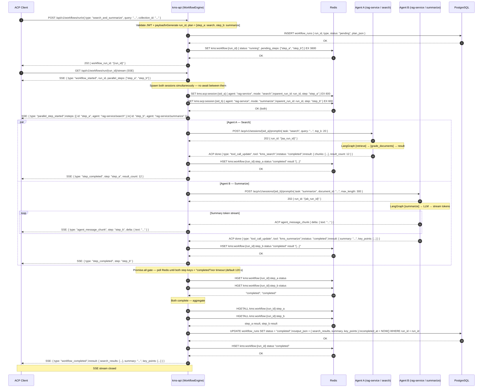
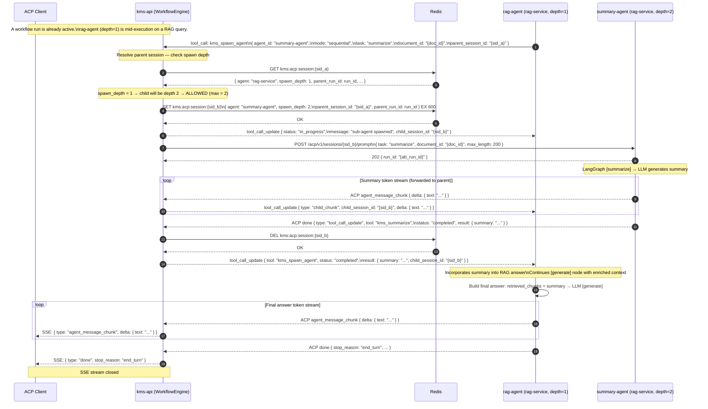
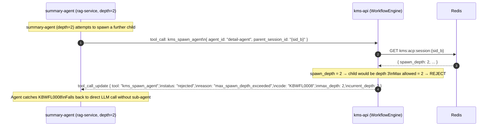

# Flow: Multi-Agent Parallel Spawn

## Overview

This diagram covers two complementary spawn patterns in the KMS Agentic Platform:

- **Sub-diagram A** — Orchestrator-controlled parallel spawn: `WorkflowEngine` directly creates two ACP sessions simultaneously, waits with `Promise.all` semantics backed by Redis, and aggregates results once both complete.
- **Sub-diagram B** — Agent-initiated sub-agent spawn (emergent): a running agent calls the `kms_spawn_agent` tool to delegate work to a child agent, with spawn-depth enforcement (`depth ≤ 2` allowed; `depth 3` rejected as `KBWFL0008`).

See [ADR-0013](../decisions/0013-orchestrator-pattern.md) for why orchestration lives in `kms-api` WorkflowEngine rather than inside individual agents.

## Participants

| Alias | Service | Port |
|-------|---------|------|
| `CLI` | ACP Client (Browser / Zed / curl) | — |
| `WE` | kms-api (WorkflowEngine) | 8000 |
| `RD` | Redis (workflow + session state) | 6379 |
| `AA` | Agent A — rag-service (search / RAG mode) | 8002 |
| `AB` | Agent B — rag-service (summarize mode) | 8002 |
| `PG` | PostgreSQL (workflow run persistence) | 5432 |

---

## Sub-diagram A — Orchestrator-Controlled Parallel Spawn

The WorkflowEngine is the sole coordinator. It spawns both agents, monitors completion via Redis, and emits the aggregated SSE result to the client. Agents are unaware of each other.

---

## Sub-diagram B — Agent-Initiated Sub-Agent Spawn (Emergent)

An already-running agent calls `kms_spawn_agent` to delegate work to a child agent. The WorkflowEngine enforces a maximum spawn depth of 2 to prevent unbounded recursion.

### Spawn Depth Rules

| Caller depth | Requested child depth | Decision |
|---|---|---|
| 0 (orchestrator) | 1 | Allowed |
| 1 (primary agent) | 2 | Allowed |
| 2 (child agent) | 3 | **REJECTED** — `KBWFL0008` |

### Spawn Depth Enforcement — Rejection Path (depth 3)

## Error Flows

| Step | Condition | Behaviour |
|------|-----------|-----------|
| Sub-A step 7–8 | Either agent unreachable (port 8002 down) | `WE` marks the failing step as `error` in Redis; emits SSE `{ type: "step_error", step, code: "KBWFL0002" }`; remaining parallel step continues; aggregation produces partial result |
| Sub-A step 25 | Promise.all gate timeout (120 s) exceeded | `WE` emits SSE `{ type: "error", code: "KBWFL0009", message: "parallel step timeout" }`; marks run `failed` in PG; partial results discarded |
| Sub-A step 16 | Agent B LLM unreachable | `AB` returns ACP done with `stop_reason: "fallback"`; `WE` emits `step_completed` with `summary: null`; workflow still completes with partial result |
| Sub-B step 2 | `parent_session_id` not found in Redis (expired) | `WE` returns `tool_call_update { status: "rejected", reason: "session_not_found", code: "KBGEN0004" }`; calling agent falls back to direct LLM |
| Sub-B step 2 | `agent_id` not registered in ACP agent registry | `WE` returns `tool_call_update { status: "rejected", reason: "unknown_agent", code: "KBWFL0010" }` |
| Sub-B step 12 | Child session Redis write fails | `WE` returns `tool_call_update { status: "error", code: "KBWFL0007" }`; parent agent falls back |
| Sub-B step 16 | Child agent times out (> 60 s) | `WE` returns `tool_call_update { status: "error", reason: "child_timeout", code: "KBWFL0011" }`; child session cleaned from Redis |
| Sub-B step 22 | spawn_depth = 2 → child would be depth 3 | `KBWFL0008` — see rejection path diagram above |

## OTel Custom Spans

| Span name | Owner | Attributes |
|-----------|-------|------------|
| `kb.workflow.parallel_spawn` | kms-api | `run_id`, `step_count`, `step_ids` |
| `kb.workflow.step` | kms-api | `run_id`, `step_id`, `agent`, `latency_ms`, `status` |
| `kb.workflow.parallel_gate` | kms-api | `run_id`, `wait_ms`, `completed_steps`, `timed_out` |
| `kb.acp.spawn_agent` | kms-api | `parent_session_id`, `child_session_id`, `agent_id`, `spawn_depth`, `decision` |
| `kb.acp.spawn_depth_check` | kms-api | `spawn_depth`, `max_depth`, `allowed` |

## Redis Keys

| Key | Value | TTL |
|-----|-------|-----|
| `kms:workflow:{run_id}` | Top-level workflow state hash (status, plan) | 60 min |
| `kms:workflow:{run_id}:step_a` | Step A result hash (status, result JSON) | 60 min |
| `kms:workflow:{run_id}:step_b` | Step B result hash (status, result JSON) | 60 min |
| `kms:acp:session:{sid}` | ACP session JSON including `spawn_depth`, `parent_session_id` | 10 min |

## Dependencies

| Service | Role |
|---------|------|
| `kms-api` | WorkflowEngine — parallel session management, spawn depth enforcement, SSE fan-out, Promise.all gate |
| `rag-service` | Runs all agent logic (search mode, summarize mode) — multiple ACP sessions can target the same service |
| `Redis` | Workflow step state, ACP session metadata including `spawn_depth` |
| `PostgreSQL` | Persistent workflow run record — status, plan, output |
