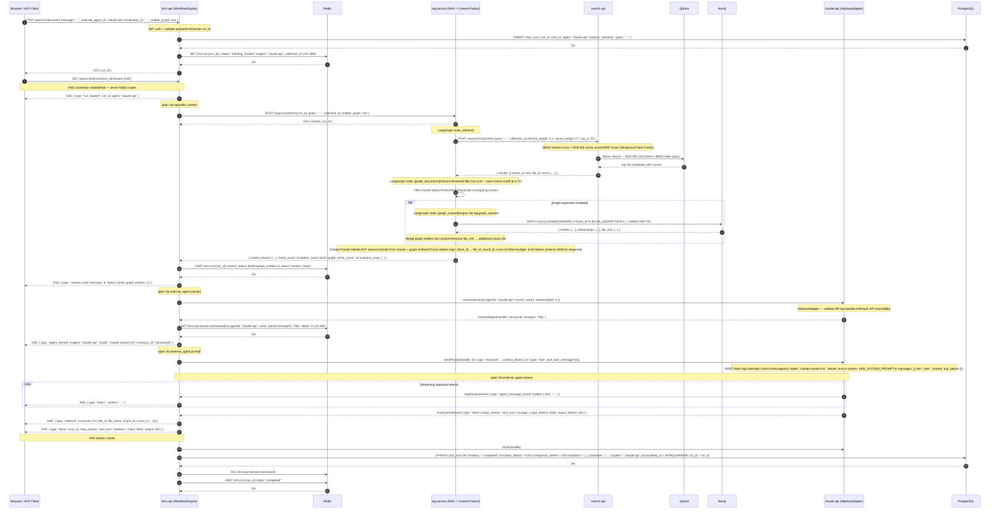
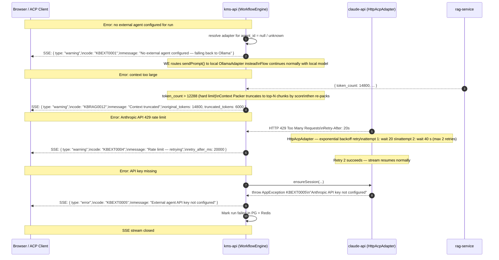

# Flow: RAG → Claude Code Context Pipeline

## Overview

This diagram covers the end-to-end flow for a user question that is answered by first building an optimal RAG context from the private knowledge base and then passing that context to an external agent (Claude API) via the `HttpAcpAdapter`. The external agent streams its answer back grounded in the retrieved private knowledge. Graph expansion is shown as an optional node that enriches the context with entity relationships before packing.

The external agent used in this diagram is `claude-api` (Anthropic API wrapped in ACP protocol envelope, `HttpAcpAdapter`). The same flow applies to `claude-code` and `codex` using `StdioAcpAdapter` — only the `ExternalAgentAdapter → Agent` segment differs.

See [ADR-0023](../decisions/0023-external-agent-adapter.md) for the adapter pattern.
See [ADR-0021](../decisions/0021-workflow-engine.md) for WorkflowEngine run state management.

## Participants

| Alias | Service | Port |
|-------|---------|------|
| `CLI` | Browser / ACP Client | — |
| `WE` | kms-api (ACP Gateway + WorkflowEngine) | 8000 |
| `RD` | Redis (session state, context cache) | 6379 |
| `RAG` | rag-service (RAG pipeline + Context Packer) | 8002 |
| `SRCH` | search-api (hybrid search) | 8001 |
| `QD` | Qdrant (vector search) | 6333 |
| `NEO` | Neo4j (graph expansion) | 7687 |
| `EXT` | claude-api adapter (HttpAcpAdapter → Anthropic API) | — |
| `PG` | PostgreSQL (run persistence) | 5432 |

---

## Main Flow

---

## Error Flows

---

## OTel Spans

| Span name | Owner | Key attributes |
|-----------|-------|---------------|
| `kb.rag.build_context` | kms-api | `run_id`, `collection_id`, `chunk_count`, `token_count` |
| `kb.rag.retrieve` | rag-service | `run_id`, `query_len`, `top_k`, `result_count` |
| `kb.rag.grade_documents` | rag-service | `run_id`, `before_count`, `after_count`, `threshold` |
| `kb.rag.graph_expand` | rag-service | `run_id`, `entity_count`, `file_ref_count` |
| `kb.external_agent.session` | kms-api | `run_id`, `agent_id`, `transport`, `session_id` |
| `kb.external_agent.prompt` | kms-api | `run_id`, `session_id`, `prompt_blocks`, `context_tokens` |
| `kb.external_agent.stream` | kms-api | `run_id`, `session_id`, `output_tokens`, `stop_reason` |

## Redis Keys

| Key | Value | TTL |
|-----|-------|-----|
| `kms:run:{run_id}` | Run state hash (status, agent, context_tokens, graph_entities) | 60 min |
| `kms:acp:session:{sessionId}` | ACP session JSON (agentId, transport, depth, runId, userId) | 10 min |

## Dependencies

| Service | Role |
|---------|------|
| `kms-api` | WorkflowEngine — run lifecycle, SSE emission, adapter resolution, citation forwarding |
| `rag-service` | RAG pipeline (LangGraph) — retrieve, grade, graph_expand, Context Packer |
| `search-api` | BM25 + BGE-M3 hybrid search with RRF fusion |
| `Qdrant` | Vector store — BGE-M3 1024-dim embeddings |
| `Neo4j` | Graph store — entity relationships and cross-document file references |
| `HttpAcpAdapter` | Wraps Anthropic API in ACP protocol envelope; handles streaming, retry, token accounting |
| `Redis` | Run state, ACP session metadata |
| `PostgreSQL` | Persistent run record — query, answer, citations, token usage |
