# Flow: MCP Server — Claude Code Live Tool Calls

## Overview

This diagram covers the flow where Claude Code (running inside an IDE such as Zed or Cursor) discovers KMS as an MCP server and autonomously calls KMS tools during a live coding session to ground its code generation in private knowledge base content. The user asks Claude to implement a feature; Claude reasons that it should look up team-specific patterns and ADRs before generating code, calls the MCP tools, and returns an implementation grounded in the team's actual conventions.

**MCP vs ACP — key difference this diagram illustrates:**

| Dimension | MCP (this diagram) | ACP (diagrams 09–13) |
|-----------|--------------------|----------------------|
| Session lifecycle | Stateless — each tool call is independent | Full session lifecycle (open → prompt → stream → close) |
| Communication style | Synchronous request/response | Streaming, event-driven |
| Primary purpose | Tool-call focused — give the agent access to data | Agent-to-agent orchestration, sub-task delegation |
| Permission model | JWT on each request | Session token + ACP permission scopes |
| Sub-agent spawning | Not supported | Supported via `kms_spawn_agent` |
| State | None — KMS does not track MCP call sessions | WorkflowEngine tracks full run state in Redis + PG |

KMS exposes MCP at `/mcp/v1/` inside `kms-api`. The MCP feature is gated by the `mcp.enabled` feature flag in `.kms/config.json`.

See [ADR-0023](../decisions/0023-external-agent-adapter.md) for the external agent adapter pattern (the inverse direction: KMS calling out to Claude Code).

## Participants

| Alias | Service | Port |
|-------|---------|------|
| `CC` | Claude Code (IDE agent — Zed / Cursor / VS Code) | — |
| `WE` | kms-api (MCP Server at `/mcp/v1/`) | 8000 |
| `SRCH` | search-api (hybrid search) | 8001 |
| `QD` | Qdrant (vector search) | 6333 |
| `NEO` | Neo4j (graph expansion) | 7687 |

---

## Main Flow — Discovery + Grounded Code Generation

```mermaid
sequenceDiagram
    autonumber
    participant CC as Claude Code (IDE agent)
    participant WE as kms-api (MCP Server)
    participant SRCH as search-api
    participant QD as Qdrant
    participant NEO as Neo4j

    Note over CC: IDE startup — reads MCP server config\n{ url: "http://localhost:8000/mcp/v1/", auth: "Bearer {jwt}" }

    CC->>WE: GET /mcp/v1/tools\nAuthorization: Bearer {jwt}
    Note over WE: JWT auth check\nFeature flag check: mcp.enabled = true

    WE-->>CC: 200 { tools: [\n  { name: "kms_search",\n    description: "Hybrid BM25+vector search over the knowledge base",\n    inputSchema: { query, type, collection_id, limit } },\n  { name: "kms_retrieve",\n    description: "Retrieve all chunks for a specific file by ID",\n    inputSchema: { file_id } },\n  { name: "kms_graph_expand",\n    description: "Expand a set of chunks to related entities and documents via the knowledge graph",\n    inputSchema: { chunk_ids, depth, limit } }\n] }

    Note over CC: Tool manifest cached for session\nClaude now knows KMS tools are available

    Note over CC: User in Zed: "implement the authentication\nflow for our API"
    Note over CC: Internal reasoning:\n"I should search the knowledge base for authentication patterns\nbefore generating code — this team may have custom conventions"

    CC->>WE: POST /mcp/v1/tools/call\nAuthorization: Bearer {jwt}\n{ tool: "kms_search",\n  input: { query: "authentication JWT patterns",\n           type: "hybrid", limit: 5 } }
    Note over WE: JWT auth check\nFeature flag: mcp.enabled\nTool validation: input matches kms_search schema\nspan: kb.mcp.tool_call { tool: "kms_search" }

    WE->>SRCH: POST /search/v1/hybrid\n{ query: "authentication JWT patterns",\n  top_k: 5 }
    SRCH->>QD: BGE-M3 vector search + BM25\nRRF fusion
    QD-->>SRCH: top-5 candidates
    SRCH-->>WE: { results: [\n  { text: "...", file_id: "auth-patterns-md", score: 0.94 },\n  { text: "...", file_id: "adr-0001-id", score: 0.91 },\n  ...\n] }

    WE-->>CC: 200 { results: [\n  { text: "Use @UseGuards(JwtAuthGuard)...",\n    file_id: "auth-patterns-md",\n    file_name: "docs/auth-patterns.md",\n    score: 0.94 },\n  { text: "JWT RS256 chosen over HS256...",\n    file_id: "adr-0001-id",\n    file_name: "docs/decisions/0001-jwt-auth.md",\n    score: 0.91 },\n  ...\n] }

    Note over CC: Internal reasoning:\n"The team uses JwtAuthGuard + RS256.\nI should retrieve the full ADR to understand the key\nrotation and expiry conventions before writing code."

    CC->>WE: POST /mcp/v1/tools/call\nAuthorization: Bearer {jwt}\n{ tool: "kms_retrieve",\n  input: { file_id: "adr-0001-id" } }
    Note over WE: JWT auth check + tool validation\nspan: kb.mcp.tool_call { tool: "kms_retrieve" }

    WE->>QD: Retrieve all chunks for file_id = "adr-0001-id"\nordered by chunk_index
    QD-->>WE: { chunks: [ ...full ADR content... ] }

    WE-->>CC: 200 { chunks: [\n  { text: "# ADR-0001 — JWT Auth...", chunk_index: 0 },\n  { text: "RS256 private key rotation every 90 days...", chunk_index: 1 },\n  { text: "Access token TTL: 15 min, Refresh: 7 days...", chunk_index: 2 },\n  ...\n] }

    Note over CC: Internal reasoning:\n"Now I have the full ADR. I also see it references\n'passport-jwt strategy' — I should search for the\nPassport configuration pattern."

    CC->>WE: POST /mcp/v1/tools/call\nAuthorization: Bearer {jwt}\n{ tool: "kms_search",\n  input: { query: "passport-jwt strategy NestJS configuration",\n           type: "hybrid", limit: 3 } }
    Note over WE: JWT auth check + tool validation\nspan: kb.mcp.tool_call { tool: "kms_search" }

    WE->>SRCH: hybrid search
    SRCH->>QD: search
    QD-->>SRCH: results
    SRCH-->>WE: results
    WE-->>CC: 200 { results: [{ text: "PassportModule.register({ defaultStrategy: 'jwt' })...", ... }] }

    Note over CC: Sufficient context gathered.\nGenerating implementation grounded in team conventions.
    Note over CC: Generated code uses:\n- @UseGuards(JwtAuthGuard) from auth-patterns.md\n- RS256 from ADR-0001\n- PassportModule config from search result

    CC-->>CC: Return code to user with inline citations:\n"Based on your team's auth patterns in\ndocs/auth-patterns.md and ADR-0001"
```



---

## Error Flows

```mermaid
sequenceDiagram
    autonumber
    participant CC as Claude Code (IDE agent)
    participant WE as kms-api (MCP Server)

    Note over CC,WE: Error: MCP feature flag disabled

    CC->>WE: GET /mcp/v1/tools\nAuthorization: Bearer {jwt}
    Note over WE: JWT valid\nFeature flag: mcp.enabled = false
    WE-->>CC: 403 { code: "KBEXT0009",\nmessage: "MCP server is not enabled on this instance" }
    Note over CC: Claude Code shows warning:\n"KMS MCP tools unavailable — proceeding without knowledge base"

    Note over CC,WE: Error: tool not found

    CC->>WE: POST /mcp/v1/tools/call\n{ tool: "kms_unknown_tool", input: {} }
    Note over WE: JWT valid, mcp.enabled\nTool "kms_unknown_tool" not in registry
    WE-->>CC: 404 { code: "KBEXT0010",\nmessage: "Tool 'kms_unknown_tool' not found",\navailable_tools: ["kms_search", "kms_retrieve", "kms_graph_expand"] }

    Note over CC,WE: Error: tool input validation failed

    CC->>WE: POST /mcp/v1/tools/call\n{ tool: "kms_search",\n  input: { limit: 500 } }
    Note over WE: JWT valid, mcp.enabled, tool found\nInput validation: limit must be 1–50, query is required
    WE-->>CC: 422 { code: "KBEXT0011",\nmessage: "Tool input validation failed",\nerrors: [\n  { field: "query", message: "required" },\n  { field: "limit", message: "must be ≤ 50" }\n] }

    Note over CC,WE: Error: JWT expired

    CC->>WE: POST /mcp/v1/tools/call\nAuthorization: Bearer {expired_jwt}
    Note over WE: JWT signature valid but exp < now()
    WE-->>CC: 401 { code: "KBAUT0003",\nmessage: "JWT token has expired" }
    Note over CC: IDE prompts user to re-authenticate;\nMCP calls resume after token refresh
```

---

## OTel Spans

| Span name | Owner | Key attributes |
|-----------|-------|---------------|
| `kb.mcp.tool_discovery` | kms-api | `user_id`, `tool_count` |
| `kb.mcp.tool_call` | kms-api | `user_id`, `tool`, `latency_ms`, `result_count` |
| `kb.mcp.auth_check` | kms-api | `user_id`, `outcome` (`allowed` / `denied`) |
| `kb.search.hybrid` | search-api | `query_len`, `top_k`, `result_count`, `bm25_weight`, `vector_weight` |

## Error Code Reference

| Code | HTTP status | Condition |
|------|-------------|-----------|
| `KBEXT0009` | 403 | MCP feature flag (`mcp.enabled`) is false |
| `KBEXT0010` | 404 | Tool name not found in MCP tool registry |
| `KBEXT0011` | 422 | Tool input fails JSON Schema validation |
| `KBAUT0003` | 401 | JWT expired |
| `KBAUT0001` | 401 | JWT missing or malformed |

## Dependencies

| Service | Role |
|---------|------|
| `kms-api` | MCP server — tool manifest, JWT auth, feature flag enforcement, tool dispatch |
| `search-api` | Hybrid BM25 + BGE-M3 vector search with RRF fusion |
| `Qdrant` | Vector store — BGE-M3 1024-dim embeddings; chunk retrieval by file_id |
| `Neo4j` | Graph store — used by `kms_graph_expand` tool only |
