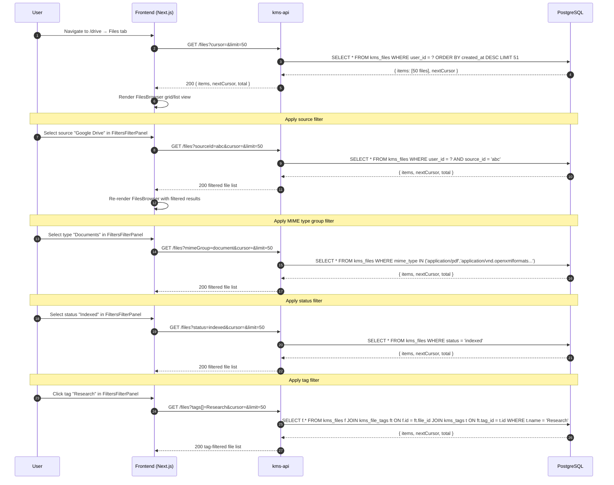
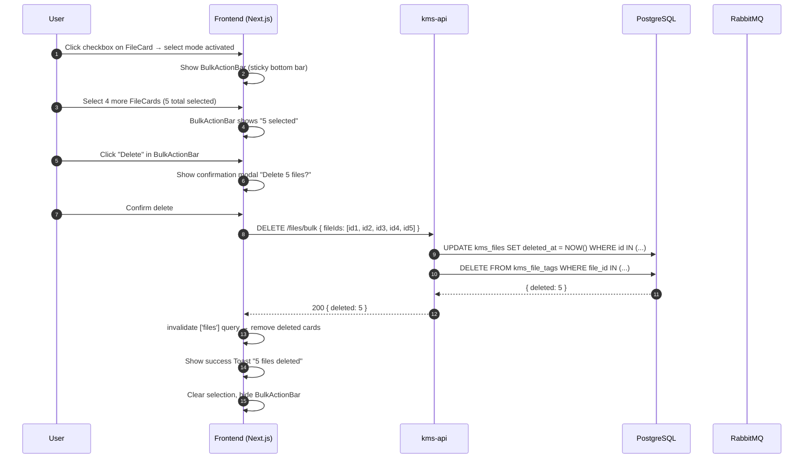
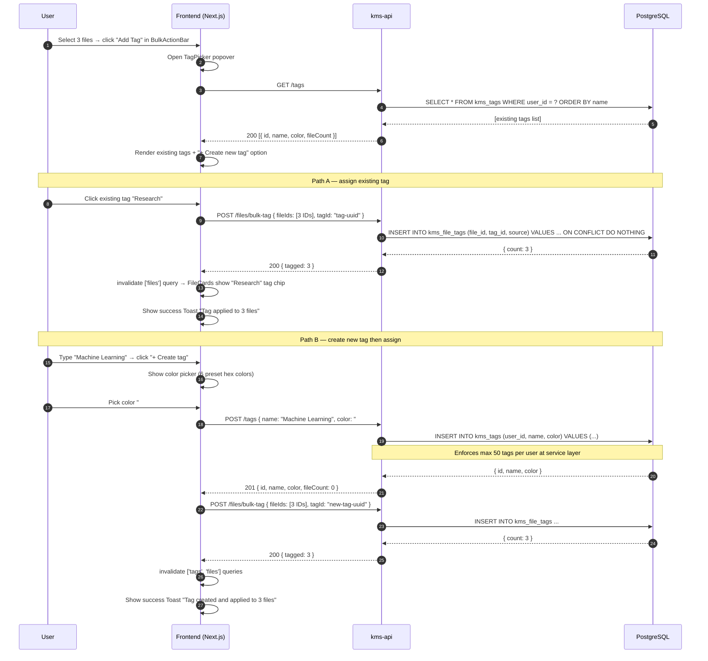
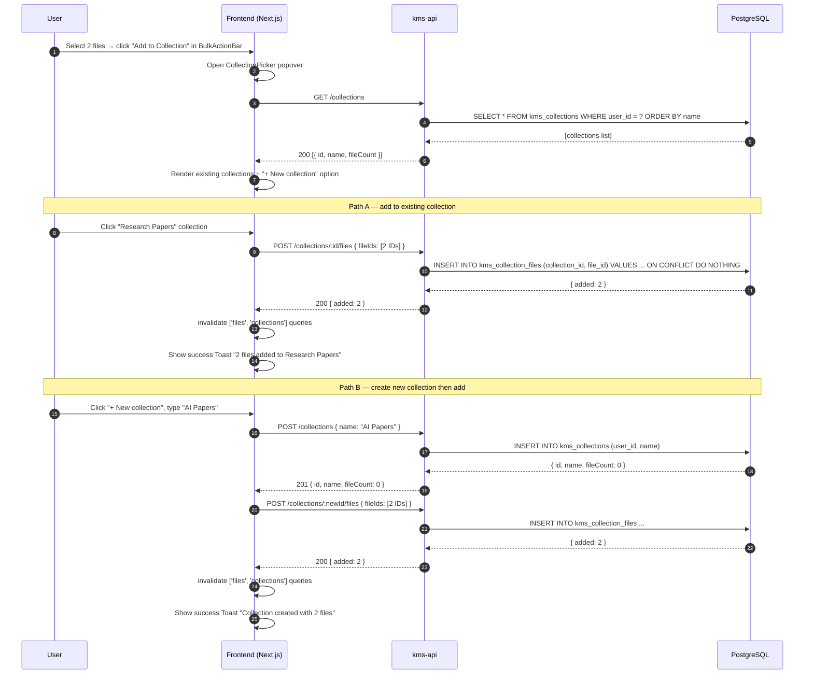

# Flow: Drive File Browser Interactions

## Overview

A user navigates to the Drive page (`/drive`) to browse, filter, and manage indexed files. This diagram covers the four primary interaction flows: paginated file listing with filters, multi-select and bulk delete, tag creation and assignment, and moving files to a collection.

## Sequence Diagram

### 1. File Listing with Filters

### 2. Multi-Select and Bulk Delete

### 3. Tag Creation and Assignment

### 4. Moving Files to a Collection

## Error Flows

| Step | Failure | Handling |
|------|---------|----------|
| GET /files | DB timeout | 500 returned; UI shows error state with retry button |
| Bulk delete — partial | Some files already deleted | API skips missing IDs; returns `{ deleted: N }` with actual count |
| POST /tags — limit exceeded | User already has 50 tags | 422 KBFIL0010; UI shows inline error "Tag limit reached (50/50)" |
| POST /files/bulk-tag — tag not found | Tag deleted concurrently | 404 KBFIL0011; TagPicker refreshes tag list |
| POST /collections/:id/files — collection not found | Collection deleted concurrently | 404; CollectionPicker refreshes collection list |

## Dependencies

- `kms-api`: `FilesController`, `TagsController`, `CollectionsController`
- `PostgreSQL`: `kms_files`, `kms_tags`, `kms_file_tags`, `kms_collections`, `kms_collection_files`
- `Frontend`: `FilesBrowser`, `FiltersFilterPanel`, `FileCard`, `BulkActionBar`, `TagPicker`, `CollectionPicker`
- `TanStack Query`: cache invalidation via `queryClient.invalidateQueries(['files'])`, `['tags']`, `['collections']`
