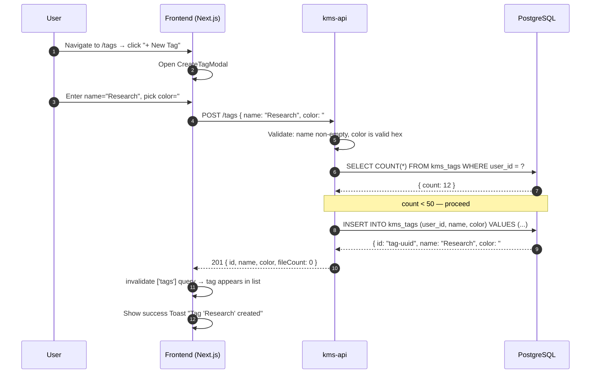
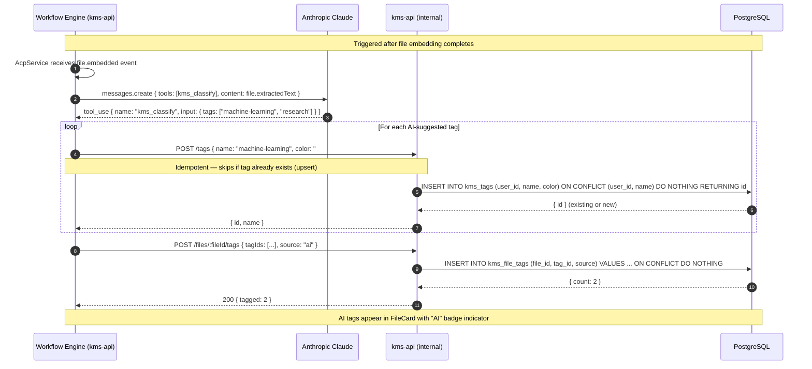
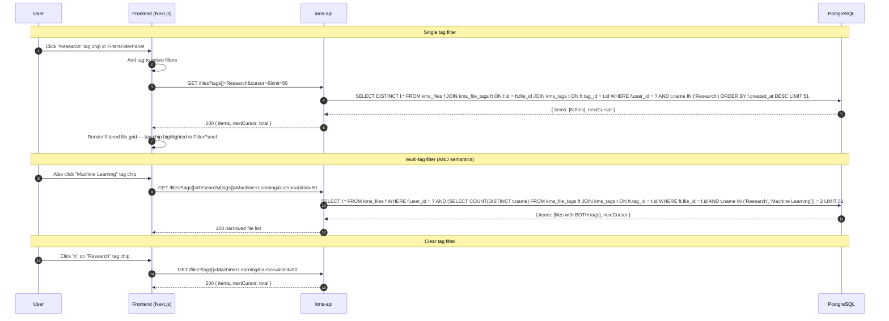
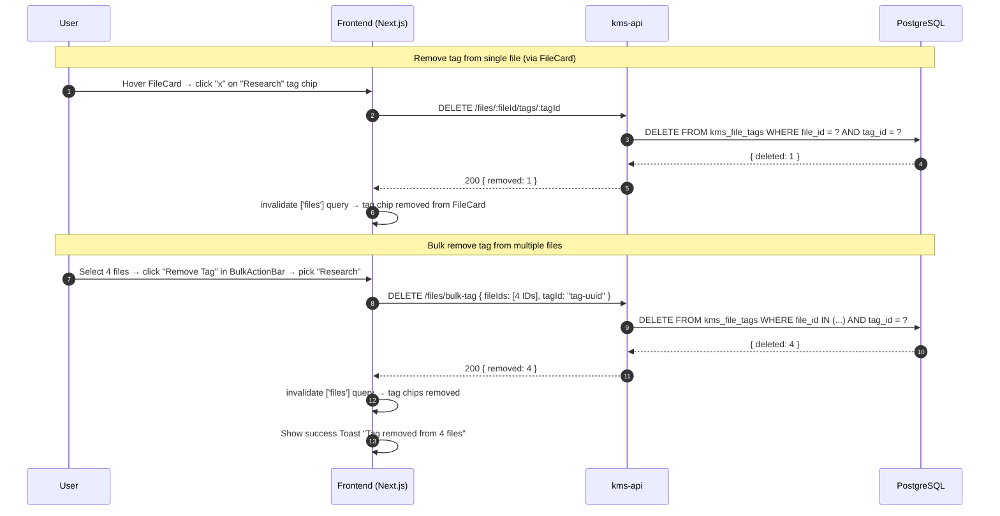
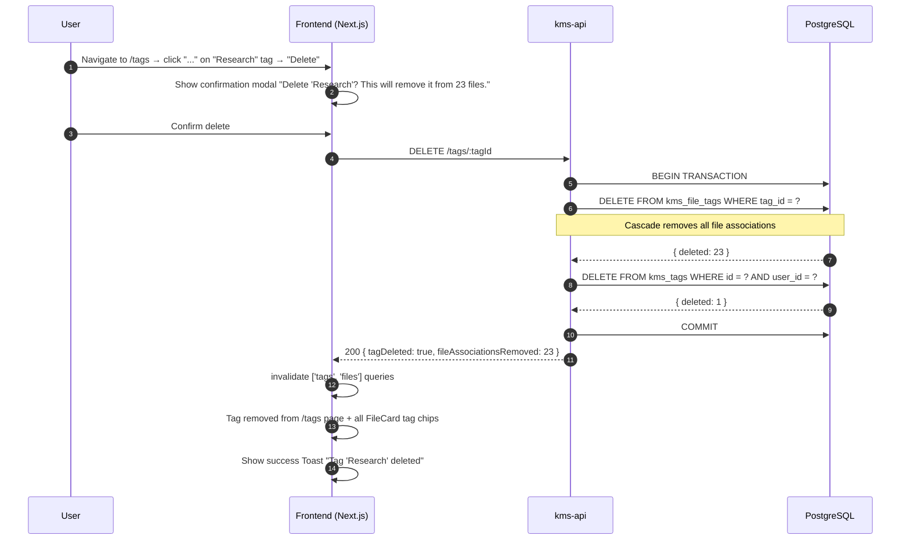

# Flow: Tag System Lifecycle

## Overview

The tag system supports two tag sources: manual tags created by users via the UI, and AI tags written by the workflow engine via the `kms_classify` tool (M14 agentic workflow). Both share the same `kms_tags` / `kms_file_tags` schema with a `source` discriminator. This diagram covers the full tag lifecycle: create, AI auto-tag, filter, remove from files, and delete.

## Sequence Diagrams

### 1. Create Tag (Manual)

### 2. AI Auto-Tagging via kms_classify Tool (M14 Agentic Workflow)

### 3. Filter Files by Tag

### 4. Remove Tag from Files

### 5. Delete Tag (Cascade)

## Error Flows

| Step | Failure | Handling |
|------|---------|----------|
| POST /tags — limit exceeded | User has 50 tags | 422 KBFIL0010; UI shows "Tag limit reached (50/50)" inline error |
| POST /tags — duplicate name | Tag with same name exists | 409 KBFIL0012; UI shows "Tag name already exists" inline error |
| kms_classify — tag limit | AI tags would exceed 50 | Workflow skips new tag creation; logs warning via structlog |
| DELETE /tags/:id — not found | Tag deleted concurrently | 404 KBFIL0011; /tags page refreshes silently |
| DELETE /tags/:id — wrong user | Tag belongs to other user | 403 KBGEN0003; never surfaces in UI (defensive guard) |
| Transaction failure on delete | DB error mid-cascade | Full rollback; 500 returned; file_tags intact |

## Dependencies

- `kms-api`: `TagsController`, `TagsService`, `FilesController`
- `PostgreSQL`: `kms_tags (id, user_id, name, color)`, `kms_file_tags (file_id, tag_id, source)`
- `Frontend`: `TagPicker`, `FiltersFilterPanel`, `FileCard`, `BulkActionBar`, `/tags` page
- `Workflow Engine` (M14): `kms_classify` Anthropic tool, `AcpService`
- `TanStack Query`: invalidations on `['tags']` and `['files']` after every mutation
