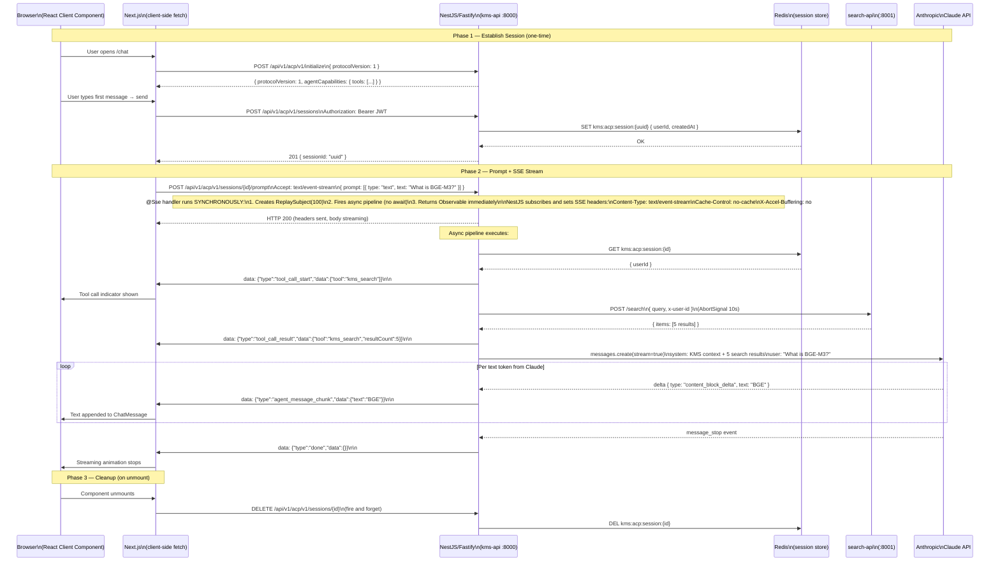

# Sequence 18: ACP SSE Streaming Flow

## Full sequence diagram:

## Key Implementation Notes

### Why fetch not EventSource
`EventSource` is browser-native SSE but only supports GET. ACP prompt is POST with JSON body.
Solution: `fetch(POST, { Accept: 'text/event-stream' })` + read `response.body` as `ReadableStream`.

### Why ReplaySubject(100)
NestJS `@Sse` subscribes to the Observable AFTER the handler returns.
The async pipeline starts immediately and may emit events before subscription.
`ReplaySubject(100)` buffers emissions — late subscriber receives all buffered events.

### Proxy buffering
Nginx and other reverse proxies buffer responses by default.
The `X-Accel-Buffering: no` header (set by Fastify `onSend` hook) disables nginx buffering for SSE routes.

### Authentication on SSE endpoint
JWT is validated by the global `JwtAuthGuard` before the `@Sse` handler runs.
The session ID (not the JWT) is used to look up `userId` inside the pipeline.
This means the JWT must be valid but `req.user.id` is not used directly in the SSE handler.
