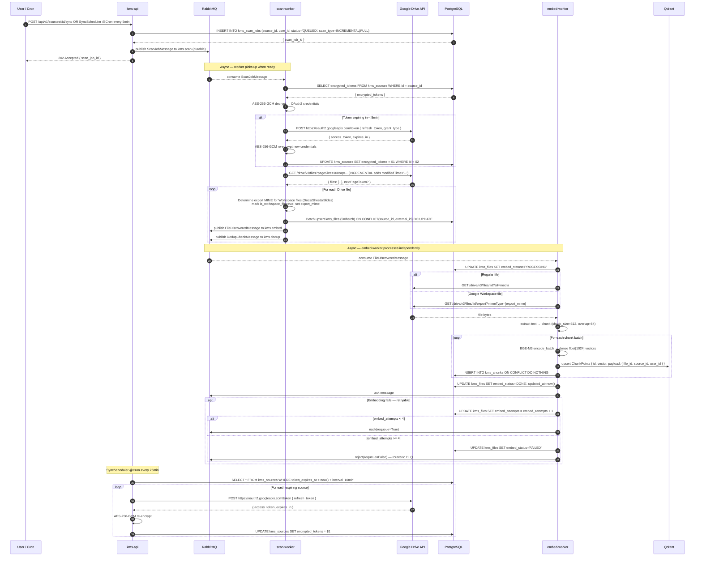

# 19 — Google Drive Sync

## Overview

After a Google Drive source is connected via OAuth, a sync can be triggered
manually (via `POST /sources/:id/sync`) or automatically by a `SyncScheduler`
cron every 5 minutes. `kms-api` creates a `kms_scan_jobs` record and publishes a
`ScanJobMessage` to `kms.scan`. The `scan-worker` decrypts OAuth tokens, lists
Drive files (with optional time filter for incremental scans), batch-upserts file
records into `kms_files`, and fans out messages to `kms.embed` and `kms.dedup`.
The `embed-worker` downloads content, chunks it, generates BGE-M3 embeddings, and
upserts to Qdrant. A separate background `SyncScheduler` cron every 25 minutes
refreshes tokens that are nearing expiry.

## Participants

| Alias | Service |
|-------|---------|
| `UC` | User / Cron (SyncScheduler) |
| `A` | kms-api |
| `MQ` | RabbitMQ |
| `SW` | scan-worker |
| `GD` | Google Drive API |
| `DB` | PostgreSQL |
| `EW` | embed-worker |
| `QD` | Qdrant |

## Sequence Diagram

## Notes

1. **Incremental scan** passes a `modifiedTime>'...'` filter to the Drive files list API, using the `last_synced_at` timestamp of the previous scan job. Full scan omits the filter.
2. **Google Workspace files** (Docs, Sheets, Slides) cannot be downloaded directly — they are exported via the Drive export endpoint using the `export_mime` field set by scan-worker (`text/plain` for Docs, `text/csv` for Sheets).
3. **Batch upsert** uses `ON CONFLICT(source_id, external_id) DO UPDATE` so incremental scans update changed files without duplicating rows.
4. **Token refresh in scan-worker** happens inline when the current access token is within 5 minutes of expiry. The re-encrypted token is written back to `kms_sources` so the next worker that picks up a message gets fresh credentials.
5. **`embed_attempts`** is incremented per failed embed attempt. At 4 attempts the file is moved to `FAILED` status and the message is dead-lettered. This prevents infinite retry loops.
6. **SyncScheduler** in kms-api runs a separate cron every 25 minutes as a proactive sweep, refreshing tokens for any source whose access token will expire in the next 10 minutes.

## Failure Paths

| Step | Failure | Handling |
|------|---------|----------|
| Token decrypt | Corrupt credentials | `ConnectorError(retryable=False)` → `reject()` → DLQ |
| Drive API 401 | Token expired | scan-worker refreshes inline then retries |
| Drive API 403 | Quota exceeded | `ConnectorError(retryable=True)` → `nack(requeue=True)` with backoff |
| Extraction fails | Unsupported MIME / corrupt file | `ExtractionError(retryable=False)` → `reject()` → DLQ |
| BGE-M3 OOM | Model unavailable | `EmbeddingError(retryable=True)` → `nack` up to 4 attempts |
| Qdrant down | Connection error | `retryable=True` → `nack(requeue=True)` |

## Dependencies

- `kms-api`: Scan job creation, queue publish, SyncScheduler cron
- `scan-worker`: Drive file discovery, batch upsert, queue fanout
- `embed-worker`: Content extraction, BGE-M3 embedding, Qdrant upsert
- `Google Drive API`: File listing, content download, export, token refresh
- `PostgreSQL`: `kms_scan_jobs`, `kms_sources`, `kms_files`, `kms_chunks`
- `RabbitMQ`: `kms.scan`, `kms.embed`, `kms.dedup` (durable, with DLQ)
- `Qdrant`: Dense vector storage (`kms_chunks` collection, 1024-dim)
