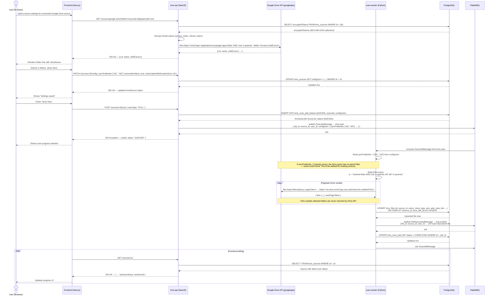

# Sequence Diagram 21 — Folder Selective Sync

## Overview

Shows how a user selects specific Google Drive folders to sync, how the configuration is persisted, and how the scan-worker uses `syncFolderIds` to filter Drive queries.

## Key Design Points

| Aspect | Detail |
|--------|--------|
| Token decryption | `KmsSource.encryptedTokens` stores AES-256-GCM ciphertext; decrypted in-process, never logged |
| Empty `syncFolderIds` | No `parents` filter applied — full Drive scan (backward-compatible default) |
| Drive query scope | Filter applied at Drive API level; out-of-scope files are never fetched or stored |
| Config propagation | `configJson` is included in the RabbitMQ message so scan-worker needs no extra DB read |
| Upsert strategy | `ON CONFLICT (source_id, drive_file_id)` ensures idempotent re-scans |
