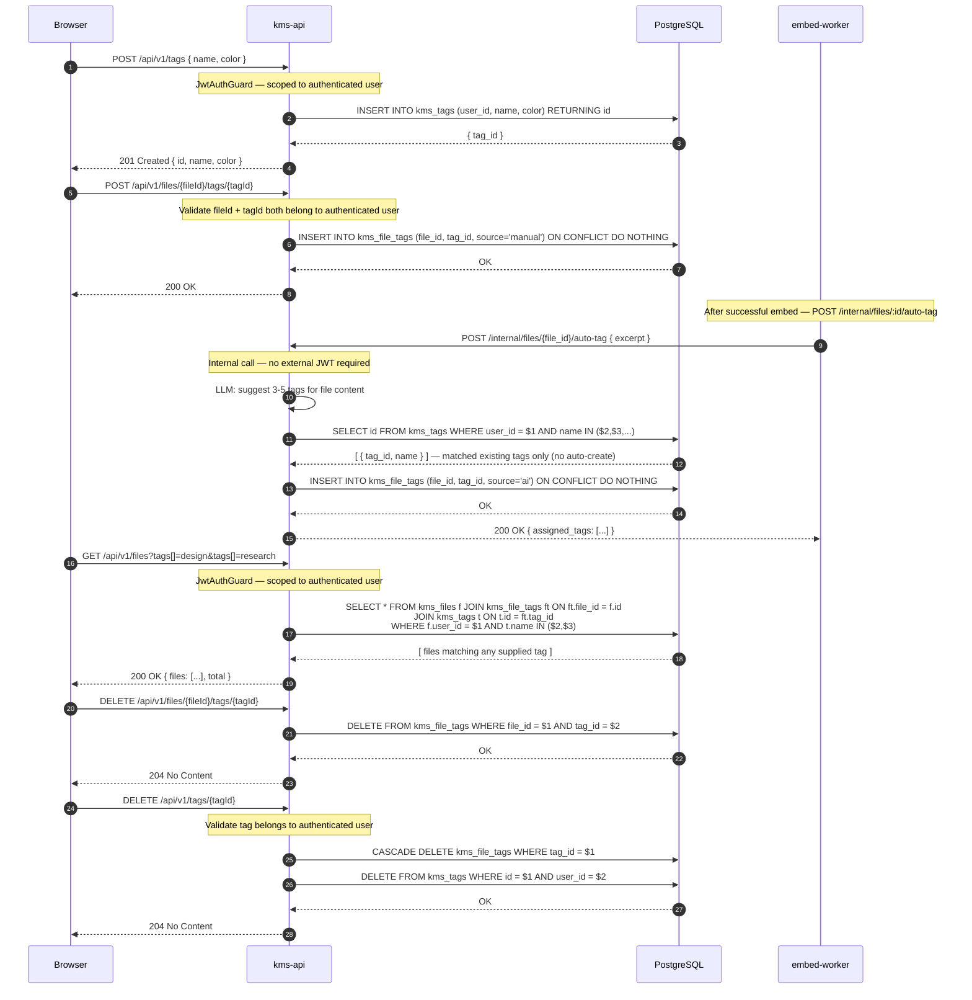

# 21 — Tag System

## Overview

The tag system supports both manual and AI-driven file classification. Users can
create named/coloured tags, assign them to files, and filter file listings by tag.
After embedding succeeds, `embed-worker` can invoke an LLM to suggest tags that
are automatically assigned with `source='ai'`. Deleting a tag cascade-deletes all
its file associations via the `kms_file_tags` join table.

**Note**: The tag REST endpoints and AI auto-tag path are described in the PRD and
schema but are not yet fully implemented in `kms-api`. This diagram documents the
intended design.

## Participants

| Alias | Service |
|-------|---------|
| `BR` | Browser |
| `A` | kms-api |
| `DB` | PostgreSQL (`kms_tags`, `kms_file_tags`) |
| `EW` | embed-worker |

## Sequence Diagram

## Notes

1. **Tag scope**: tags are per-user — `kms_tags(user_id, name)` has a unique constraint. Two users can have tags with the same name without collision.
2. **AI auto-tag** is feature-flagged. `embed-worker` calls `POST /internal/files/:id/auto-tag` after a successful embed. The LLM suggests 3–5 tag names; `kms-api` maps them to existing `kms_tags` rows for the user. No new tags are created automatically.
3. **`source` column** in `kms_file_tags` is `ENUM('manual', 'ai')`. This allows the UI to distinguish user-assigned tags from AI-suggested ones.
4. **Tag filtering** uses ANY (OR) semantics — files matching at least one of the supplied tags are returned. AND semantics would require a `HAVING COUNT(DISTINCT t.name) = N` clause.
5. **Cascade delete**: the `ON DELETE CASCADE` foreign key on `kms_file_tags.tag_id` removes all file associations when a tag is deleted. Files themselves are not affected.
6. **`ON CONFLICT DO NOTHING`** on `INSERT INTO kms_file_tags` makes re-assignment idempotent — assigning the same tag twice has no effect.

## Error Flows

| Step | Failure | HTTP | Handling |
|------|---------|------|----------|
| Create tag | Duplicate name for user | 409 | `ON CONFLICT(user_id, name)` unique index |
| Assign tag | fileId or tagId not owned by user | 404 | Ownership check before INSERT |
| AI auto-tag | LLM unavailable | — | Logged as WARN, skipped — non-fatal |
| AI auto-tag | No matching tags in DB | — | No-op — auto-tag never creates tags |
| Delete tag | tagId not found or wrong owner | 404 | Ownership check before DELETE |

## Dependencies

- `kms-api`: Tag CRUD endpoints, file-tag assignment, internal auto-tag endpoint
- `embed-worker`: Triggers AI auto-tag after successful embedding
- `PostgreSQL`: `kms_tags`, `kms_file_tags` tables
- LLM (Ollama / OpenRouter): Tag suggestion via `kms-api` — feature-flagged
