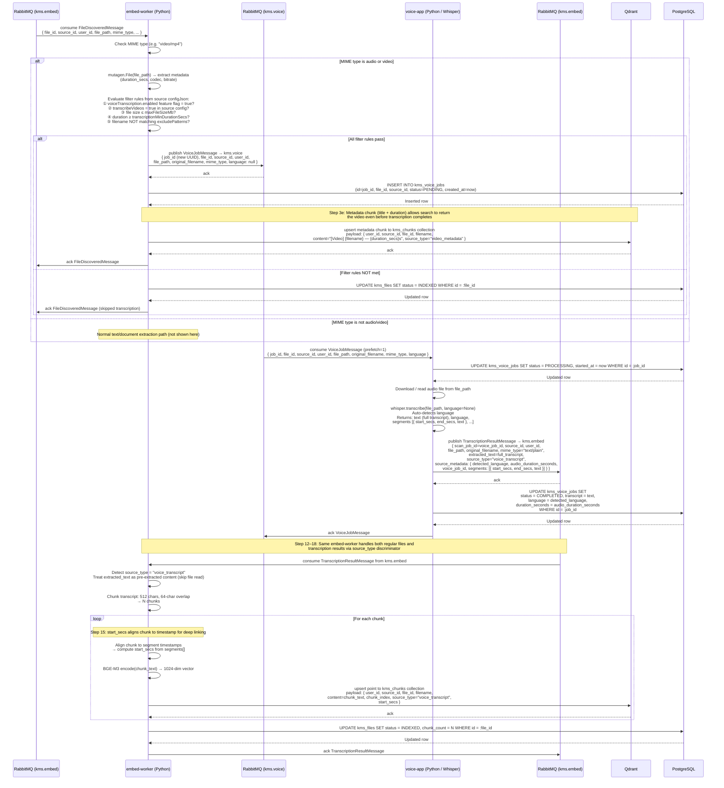

# Sequence Diagram 22 — Video Transcription Pipeline

## Overview

Shows the fully automated pipeline that takes a video/audio file from discovery through Whisper transcription to Qdrant indexing. No user interaction is involved — the pipeline is driven entirely by AMQP messages.

## Key Design Points

| Aspect | Detail |
|--------|--------|
| Filter evaluation | All 5 rules must pass; any failure routes the file to `INDEXED` (skipped) without retrying |
| Prefetch = 1 | voice-app processes one transcription at a time to avoid GPU/CPU memory exhaustion |
| Language detection | `language=None` passed to Whisper; auto-detected language stored in `kms_voice_jobs.language` |
| Metadata pre-indexing | Step 3e indexes a short metadata chunk immediately so search can surface the file during transcription |
| Timestamp alignment | Chunk→segment alignment uses `segments[].start_secs` to enable deep-link playback |
| Source type discriminator | `source_type="voice_transcript"` tells embed-worker to skip file extraction and use `extracted_text` directly |
| Idempotency | Qdrant upsert by point ID ensures re-runs don't duplicate chunks |
