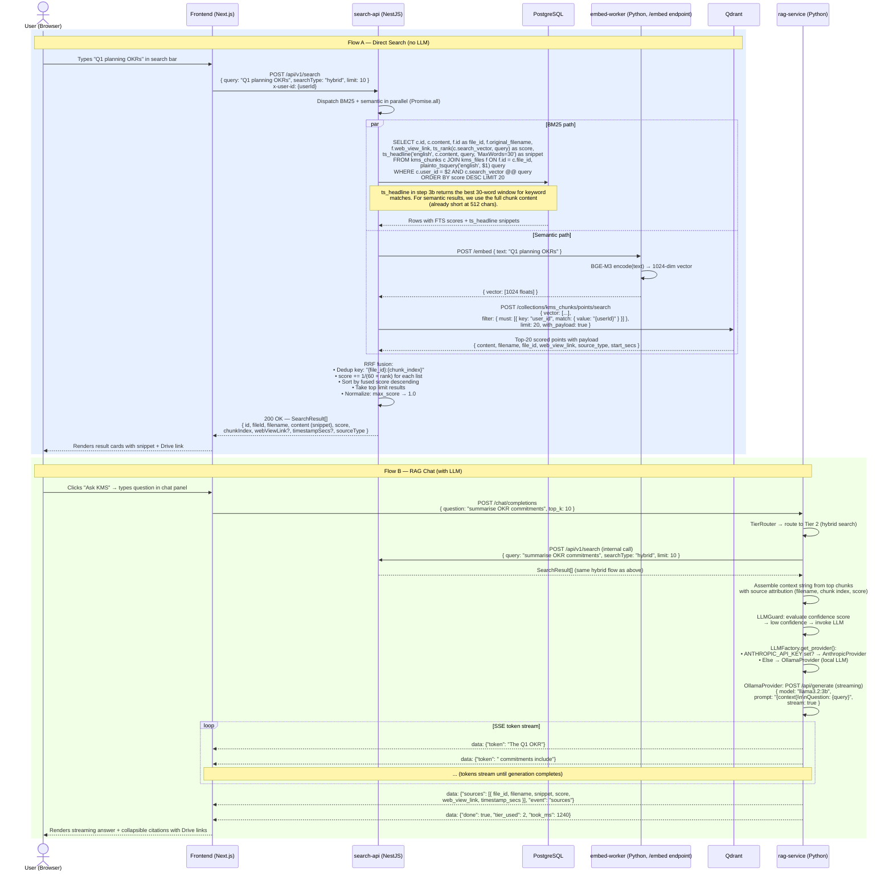

# Sequence Diagram 23 — Hybrid Search (Real Mode) with Citations

## Overview

Two flows are shown:
- **Flow A — Direct Search**: User searches from the search bar; results are returned as ranked cards (no LLM).
- **Flow B — RAG Chat**: User asks a question in the chat panel; rag-service retrieves chunks, optionally invokes an LLM, and streams a cited answer.

## Key Design Points

| Aspect | Detail |
|--------|--------|
| Parallelism | BM25 and semantic queries run concurrently via `Promise.all`; total latency = `max(bm25, semantic)` not their sum |
| RRF constant (k=60) | Standard Reciprocal Rank Fusion constant; smooths rank differences between the two lists |
| Dedup key | `{file_id}:{chunk_index}` ensures the same chunk appearing in both BM25 and semantic results is merged, not doubled |
| Score normalization | Dividing by max fused score maps results to [0, 1] for consistent UI rendering |
| BM25 snippet | `ts_headline` extracts the most relevant 30-word window; semantic results use full chunk text (512 chars max) |
| LLM provider fallback | `AnthropicProvider` preferred; `OllamaProvider` (local Llama) used when no Anthropic key is configured |
| SSE sources event | Citations are emitted as a dedicated SSE event after the final token so the frontend can render them separately |
| `start_secs` / `timestamp_secs` | Enables deep-link playback into video/audio files for voice transcript chunks |
