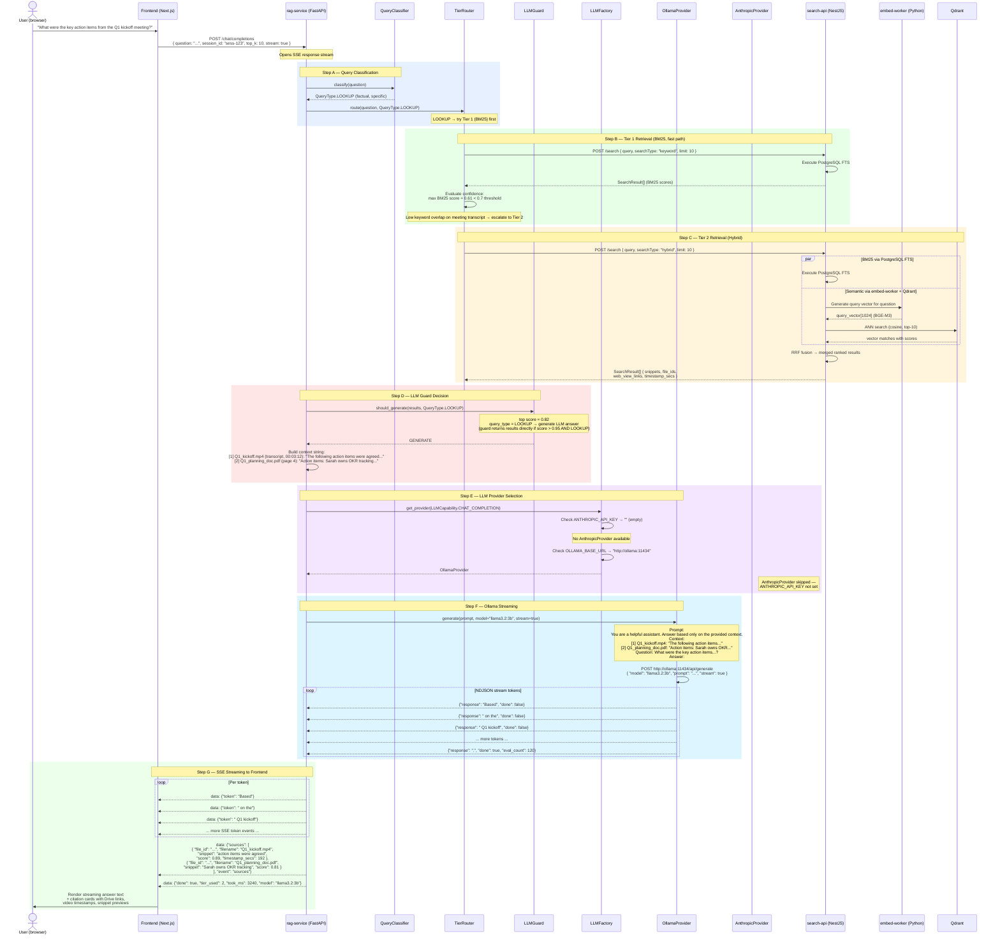

# Sequence Diagram 24 — RAG with Local LLM (Ollama)

**Flow**: User asks a factual question → tiered retrieval → Ollama streaming answer with source citations

## Notes

> **Step 16 — LLMFactory provider selection**: LLMFactory checks `ANTHROPIC_API_KEY` first — if present, uses Claude (cloud). Empty key forces Ollama (local-only mode). This allows zero-config local deployment without changing any application code.

> **Step 20 — Video timestamp deep-linking**: `timestamp_secs` in the source citation allows the frontend to deep-link to the exact moment in a video (e.g., appending `?t=192` to the Google Drive URL), so users can jump directly to the relevant portion of the Q1 kickoff recording.

> **Step 14 — LLMGuard short-circuit**: LLMGuard returns retrieval results directly (no LLM call) when `top score > 0.95 AND query_type = LOOKUP` — saves latency and avoids unnecessary LLM inference for high-confidence factual lookups where the snippet itself is the answer.
