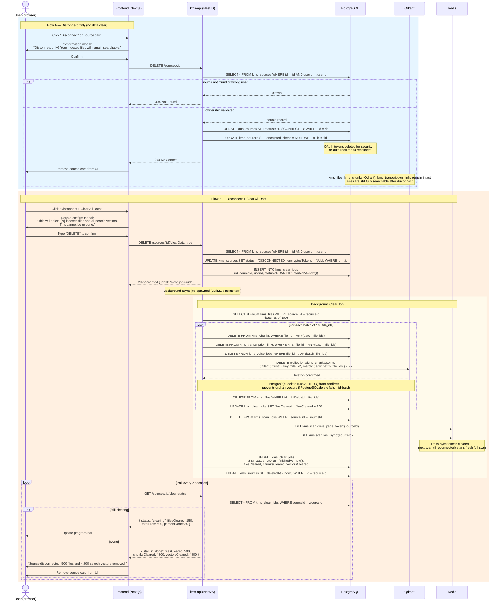

# Sequence Diagram 25 — Source Disconnect & Clear Data

**Flow**: Two paths — disconnect only (keeps indexed files) vs. disconnect + clear all data (wipes files, vectors, Redis tokens)

## Notes

> **Step 9b — Qdrant batch delete**: Qdrant delete uses a payload filter on `file_id` (not point IDs) — safer for batch operations because point IDs may not be tracked in PostgreSQL, whereas `file_id` is always stored as a vector payload field.

> **Step 9d-9e — Redis delta-sync tokens**: Redis keys `kms:scan:drive_page_token:{sourceId}` and `kms:scan:last_sync:{sourceId}` are cleared so that if the source is later reconnected, the next scan starts a fresh full scan from scratch rather than attempting an incremental delta from a stale checkpoint.

> **Step 10 — Poll-based progress**: Poll-based progress (not WebSocket) keeps the implementation simple. 500 files with ~10 chunks each clear in under 5 seconds in practice, so polling at 2-second intervals provides sufficient UX feedback without the overhead of maintaining a persistent connection.

> **Step 9b — Delete ordering**: Qdrant delete runs before the corresponding PostgreSQL `kms_files` delete within each batch. This prevents orphan vectors: if the PostgreSQL delete fails mid-batch, the job can be retried and the Qdrant filter-delete is idempotent (deleting already-deleted points is a no-op).
