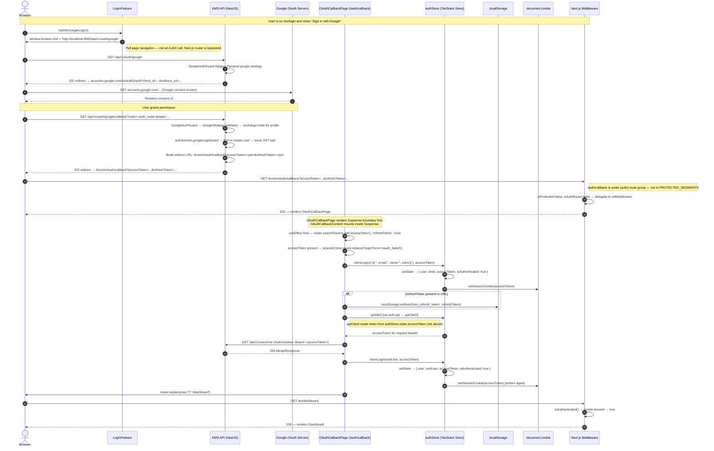
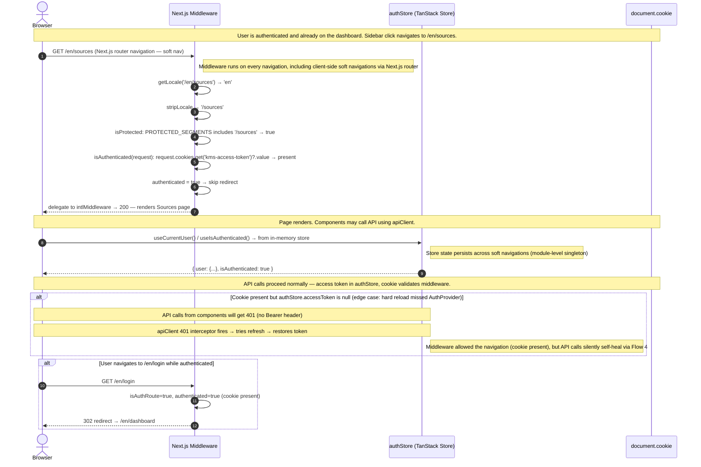

# SEQ-frontend-auth — Frontend Authentication Flows

**Status**: Current as of 2026-03-22
**Source files**:
- `frontend/middleware.ts`
- `frontend/lib/stores/auth.store.ts`
- `frontend/lib/api/client.ts`
- `frontend/lib/api/auth.api.ts`
- `frontend/lib/hooks/auth/use-login.ts`
- `frontend/components/features/auth/AuthProvider.tsx`
- `frontend/components/features/auth/LoginFeature.tsx`
- `frontend/app/[locale]/(auth)/auth/callback/page.tsx`
- `kms-api/src/modules/auth/auth.controller.ts`

---

## Token Architecture Overview

Before reading the individual flows, understanding **where each token lives** and **why** is critical. Several bugs stem from confusion between these layers.

| Token | Storage | Who reads it | TTL |
|-------|---------|-------------|-----|
| Access token (JWT) | `authStore.state.accessToken` (in-memory only) | `apiClient` request interceptor via `tokenProvider.getAccessToken()` | ~15 min (backend-configured) |
| Access token (cookie) | `document.cookie` → `kms-access-token` | `Next.js middleware` — for server-side route protection | 7 days (intentionally longer than JWT TTL) |
| Refresh token | `localStorage['kms_refresh_token']` | `AuthProvider.restoreSession()` and `apiClient.refresh()` | 7 days |

**Critical distinction**: The `kms-access-token` cookie is **not** used for API authentication. Axios reads the in-memory store. The cookie is used exclusively by the `Next.js middleware` to decide whether to redirect a navigation request. The two values are kept in sync by `setSessionCookie()`, called inside both `login()` and `setAccessToken()` in `auth.store.ts`.

**Token provider registration**: `AuthProvider.tsx` registers `apiClient.setTokenProvider()` at **module load time** (outside the component function). `use-login.ts` also registers it. Because `setTokenProvider()` overwrites the previous registration, the last import to execute wins. Both registrations are functionally identical, so this is safe — but `OAuthCallbackPage` must **not** re-register a provider, or it would replace the one that writes the cookie.

---

## Flow 1: Email/Password Login

### Mermaid Diagram

```mermaid
sequenceDiagram
    autonumber
    actor Browser
    participant Middleware as Next.js Middleware
    participant LoginFeature
    participant useLogin as useLogin hook
    participant authApi as auth.api (login fn)
    participant apiClient as apiClient (KmsApiClient)
    participant KmsAPI as KMS API (POST /auth/login)
    participant authStore as authStore (TanStack Store)
    participant LS as localStorage
    participant Cookie as document.cookie

    Note over Browser,Cookie: User is unauthenticated — no kms-access-token cookie

    Browser->>Middleware: GET /en/dashboard (navigate to protected page)
    Middleware->>Middleware: isAuthenticated() → cookie absent → false
    Middleware-->>Browser: 302 redirect → /en/login?next=/en/dashboard

    Browser->>Middleware: GET /en/login?next=/en/dashboard
    Middleware->>Middleware: isAuthRoute=true, authenticated=false → allow
    Middleware-->>Browser: 200 — renders LoginFeature

    Note over Browser,LoginFeature: User fills email/password and submits

    Browser->>LoginFeature: handleSubmit({ email, password })
    LoginFeature->>useLogin: mutateAsync({ email, password })
    useLogin->>authApi: loginApi(credentials)
    authApi->>apiClient: post('/auth/login', credentials)
    apiClient->>apiClient: requestInterceptor → tokenProvider.getAccessToken() → null (no token yet)
    Note right of apiClient: No Authorization header added — /auth/login is @Public()
    apiClient->>KmsAPI: POST /api/v1/auth/login { email, password }
    KmsAPI->>KmsAPI: authService.login() → validate credentials → issue JWT pair
    KmsAPI-->>apiClient: 200 { tokens: { accessToken, refreshToken, expiresIn, tokenType }, user: {...} }
    apiClient-->>authApi: LoginApiResponse
    authApi-->>useLogin: AuthResponse { accessToken, refreshToken, expiresIn }
    useLogin-->>LoginFeature: authResponse (mutateAsync resolves)

    LoginFeature->>LS: localStorage.setItem('kms_refresh_token', authResponse.refreshToken)

    LoginFeature->>authStore: storeLogin({ id:'', email, name:'', roles:[] }, accessToken)
    authStore->>authStore: setState → { user: shell, accessToken, isAuthenticated: true }
    authStore->>Cookie: setSessionCookie(accessToken) → document.cookie = 'kms-access-token=<token>; path=/; SameSite=Lax; max-age=604800'

    LoginFeature->>authApi: getMe()
    authApi->>apiClient: get('/users/me')
    apiClient->>apiClient: requestInterceptor → tokenProvider.getAccessToken() → accessToken
    apiClient->>KmsAPI: GET /api/v1/users/me (Authorization: Bearer <accessToken>)
    KmsAPI-->>apiClient: 200 MeApiResponse { id, email, firstName, lastName, role, ... }
    apiClient-->>authApi: MeApiResponse
    authApi-->>LoginFeature: User { id, email, name, roles }

    LoginFeature->>authStore: storeLogin(realUser, accessToken)
    authStore->>authStore: setState → { user: realUser, accessToken, isAuthenticated: true }
    authStore->>Cookie: setSessionCookie(accessToken) [written again — ensures consistency]

    LoginFeature->>LoginFeature: queryClient.setQueryData(ME_QUERY_KEY, user)
    LoginFeature->>Browser: router.push(next ?? '/en/dashboard')

    Browser->>Middleware: GET /en/dashboard
    Middleware->>Middleware: isAuthenticated() → cookie 'kms-access-token' present → true
    Middleware-->>Browser: 200 — renders Dashboard
```

### Step-by-Step Explanation

| Step | What happens | What MUST be true |
|------|-------------|------------------|
| 1–3 | Middleware checks `kms-access-token` cookie. Missing → redirect to `/login?next=...` | Cookie must be absent for this path to execute |
| 4–5 | Auth route with no cookie — middleware allows through | `isAuthRoute=true`, `authenticated=false` |
| 6 | `handleSubmit` called from `LoginForm.onSubmit` | Form validation must pass before this fires |
| 7–10 | `mutateAsync` → `loginApi` → `apiClient.post('/auth/login', ...)` | No `Authorization` header is added — `/auth/login` is `@Public()`, but if a stale token exists in the store it will be sent harmlessly |
| 11–13 | KMS API validates credentials, issues JWT pair | Responds with `{ tokens: { accessToken, refreshToken, ... }, user: { ... } }` — the response shape differs from the `AuthResponse` type; `auth.api.ts` maps `res.tokens.*` to the flat `AuthResponse` shape |
| 14 | `refreshToken` written to `localStorage` | **Must happen before navigation** — without it, the next page reload cannot restore the session |
| 15–17 | `storeLogin(shellUser, accessToken)` — sets in-memory token AND writes `kms-access-token` cookie | **Cookie write is the critical gate for middleware.** If `setSessionCookie()` silently fails (e.g., `document` is undefined in SSR), the next navigation will be rejected by middleware |
| 18–23 | `getMe()` fetches the real user profile using the just-set token | The request interceptor reads `authStore.state.accessToken` which was set in step 16. If the store update hasn't propagated yet, this call would go without a token and return 401 |
| 24–26 | `storeLogin(realUser, accessToken)` overwrites the shell user | Cookie is written a second time — this is intentional to keep store and cookie consistent |
| 27 | TanStack Query cache seeded | Prevents a network round-trip when other components call `useMe()` |
| 28 | `router.push(next ?? '/en/dashboard')` | `?next=` from the original redirect is honoured here |
| 29–31 | Middleware sees the cookie → allows access to dashboard | **Session is established** |

### Critical Path

The following steps MUST succeed for the session cookie to be set and the user to reach the dashboard:

1. `POST /auth/login` returns 200 with `tokens.accessToken`
2. `auth.api.ts` correctly maps `res.tokens.accessToken` (not `res.accessToken`) → if the mapping breaks, `authResponse.accessToken` is `undefined`
3. `storeLogin(shellUser, accessToken)` executes before `router.push()` → this writes the cookie that middleware checks
4. `setSessionCookie()` runs in a browser context (`document !== undefined`) → always true for client components, but matters if the call ever migrates to a Server Component

### Failure Modes

| Failure | Symptom | Root cause |
|---------|---------|-----------|
| `POST /auth/login` returns 401 | Login form shows error message from `useLogin.error` | Wrong credentials |
| `POST /auth/login` returns 429 | Form shows error; rate limit is 10 requests/60 s | Throttle guard on the endpoint |
| `auth.api.ts` mapping is wrong | `authResponse.accessToken` is `undefined`; `storeLogin` stores `undefined`; cookie value is the string `"undefined"` | Backend changed response shape from `tokens.accessToken` to `accessToken` |
| `getMe()` returns 401 | User proceeds to dashboard with shell user `{ id:'', email, name:'', roles:[] }` | Access token missing or wrong; getMe failure is swallowed — user still reaches dashboard |
| Cookie not written (`document` undefined) | Middleware rejects next navigation → redirect loop to `/login` | Code somehow called in SSR context |
| `localStorage` blocked (private mode) | `refreshToken` not saved; session dies on next page reload | Silent failure — no error shown |

### Debug Checklist

1. **Network tab** → find `POST /api/v1/auth/login` → verify status 200, response has `tokens.accessToken` (not a flat `accessToken`)
2. **Network tab** → find `GET /api/v1/users/me` → verify status 200; check `Authorization: Bearer <token>` header is present
3. **Application tab → Cookies** → verify `kms-access-token` cookie appears immediately after login POST completes
4. **Application tab → Local Storage** → verify `kms_refresh_token` is present after login
5. **Console** → check for `document.cookie` errors or `localStorage` security exceptions
6. **Network tab → Redirects** → verify the request after `router.push` hits `/en/dashboard` and returns 200 (not another 302 to `/login`)

---

## Flow 2: Google OAuth Login

### Mermaid Diagram



### Step-by-Step Explanation

| Step | What happens | What MUST be true |
|------|-------------|------------------|
| 1–2 | `handleGoogleLogin()` sets `window.location.href` — a **hard navigation**, not `router.push()` | Full page unload; the React app is destroyed. No in-memory state survives. |
| 3–4 | Passport's `GoogleAuthGuard` intercepts the GET and immediately redirects to Google | The handler body in `googleLogin()` is never reached |
| 5–7 | Google consent screen; user grants permission | Google redirects back to the registered callback URI with `?code=...` |
| 8–10 | `GoogleStrategy.validate()` exchanges the auth code, looks up or creates the user in the DB, calls `authService.googleLogin()` | `req.user` must be populated by the strategy before `googleCallback()` runs |
| 11 | Backend builds `redirectUrl = /kms/en/auth/callback?accessToken=...&refreshToken=...` using hardcoded `/kms/en` prefix | **Tokens are passed in the URL query string — visible in browser history and server logs** |
| 12–14 | Middleware checks `/auth/callback` — it is NOT in `PROTECTED_SEGMENTS` and NOT in `AUTH_SEGMENTS`, so middleware passes through | If `/auth/callback` were in `AUTH_SEGMENTS`, an already-authenticated user would be bounced to `/dashboard` before the callback page could set the cookie |
| 15–16 | `OAuthCallbackPage` renders `Suspense` first; `OAuthCallbackContent` mounts inside it. `useSearchParams()` requires the Suspense boundary — without it, `searchParams` is `null` during static rendering and the callback page immediately redirects to `/login?error=oauth_failed` | The Suspense wrapper is mandatory |
| 17 | `useEffect` runs — reads `accessToken` and `refreshToken` from URL | `useEffect` only runs client-side, after hydration. The URL params are safe to read here. |
| 18–20 | `storeLogin(shellUser, accessToken)` — stores token in memory AND writes cookie | Same as email/password flow — this is the critical gate for middleware |
| 21–22 | `refreshToken` persisted to `localStorage` | Enables session restoration on future page reloads |
| 23–26 | `getMe()` fetches real user profile | `AuthProvider` has already registered `setTokenProvider()` at module load time — the token is available immediately in `authStore.state.accessToken` |
| 27–29 | `storeLogin(realUser, accessToken)` overwrites shell | Cookie written a second time |
| 30 | `router.replace(next ?? '/dashboard')` | `?next=` in the callback URL would come from the backend preserving it; currently the controller hardcodes `/kms/en/auth/callback` without forwarding `?next=` — so fallback to `/dashboard` is always used |

### Critical Path

1. KMS API `googleCallback` handler must successfully call `authService.googleLogin(req.user)` — `req.user` must be populated by `GoogleStrategy`
2. Redirect URL must include both `accessToken` and `refreshToken` as query params
3. `OAuthCallbackPage` must be wrapped in `Suspense` — `useSearchParams()` crashes without it during static rendering
4. `storeLogin(shellUser, accessToken)` inside `useEffect` must execute before `router.replace()` — this writes the session cookie
5. The `AuthProvider` token provider (registered at module scope of `AuthProvider.tsx`) must be in place before `getMe()` is called from the callback page — it is, because `AuthProvider` is in the root layout which mounts before any child page

### Failure Modes

| Failure | Symptom | Root cause |
|---------|---------|-----------|
| `accessToken` absent from callback URL | Immediate redirect to `/login?error=oauth_failed` | `authService.googleLogin()` threw; or `req.user` was null (GoogleStrategy failed) |
| `useSearchParams()` without Suspense | `searchParams` is `null` during static render → instant redirect to `/login?error=oauth_failed` before any token is read | The `<Suspense>` wrapper around `OAuthCallbackContent` is removed |
| `storeLogin()` not called before `router.replace()` | Cookie not set; middleware rejects navigation to dashboard → redirect loop | `useEffect` dependency changes cause early return, or error thrown before `storeLogin` line |
| `getMe()` fails with 401 | User proceeds with shell user `{ id:'', email:'', ... }` | Access token malformed or already expired |
| `setTokenProvider` overridden in callback page | Cookie no longer written on `setAccessToken` calls (silent refresh broken for rest of session) | A developer adds `apiClient.setTokenProvider()` inside `OAuthCallbackContent` |
| Backend hardcodes `/kms/en` locale in redirect | Users with non-`en` locale are redirected to `/kms/en/auth/callback` instead of `/kms/fr/auth/callback` | Locale detection is not wired into `googleCallback` |

### Debug Checklist

1. **Network tab** → find `GET /api/v1/auth/google` → verify 302 redirect to `accounts.google.com`
2. **Network tab** → find `GET /api/v1/auth/google/callback` → verify 302 to `/kms/en/auth/callback?accessToken=...`
3. **URL bar** → on the `/auth/callback` page, verify `accessToken` and `refreshToken` are present in the query string
4. **Application tab → Cookies** → verify `kms-access-token` appears within milliseconds of the callback page mounting (before `getMe()` returns)
5. **Application tab → Local Storage** → verify `kms_refresh_token` appears
6. **Console** → check for React `useSearchParams` suspension errors (indicates missing Suspense boundary)
7. **Network tab** → find `GET /api/v1/users/me` → verify `Authorization: Bearer` header present

---

## Flow 3: Session Restoration on Page Reload

### Mermaid Diagram

```mermaid
sequenceDiagram
    autonumber
    actor Browser
    participant Middleware as Next.js Middleware
    participant AuthProvider
    participant apiClient as apiClient (KmsApiClient)
    participant KmsAPI as KMS API
    participant authStore as authStore (TanStack Store)
    participant LS as localStorage
    participant Cookie as document.cookie

    Note over Browser,Cookie: User reloads the page (F5 / Cmd+R). In-memory authStore is wiped — accessToken = null.
    Note over Browser,Cookie: BUT: kms-access-token cookie persists (7-day max-age) and kms_refresh_token is in localStorage.

    Browser->>Middleware: GET /en/dashboard (page reload)
    Middleware->>Middleware: isAuthenticated() → reads 'kms-access-token' cookie → still present → true
    Middleware-->>Browser: 200 — allows navigation to dashboard

    Note over Browser,AuthProvider: React tree mounts. AuthProvider.useEffect fires.

    AuthProvider->>authStore: useCurrentUser() → null (store was reset on page load)
    AuthProvider->>AuthProvider: queryClient.getQueryData(ME_QUERY_KEY) → undefined (cache cleared)
    AuthProvider->>LS: localStorage.getItem('kms_refresh_token') → <refreshToken>

    alt No refresh token in localStorage
        AuthProvider->>AuthProvider: early return — no session to restore
        Note right of AuthProvider: User stays on page but API calls will fail with 401 (no in-memory token)
    end

    AuthProvider->>KmsAPI: POST /kms/api/v1/auth/refresh { refreshToken } [raw fetch, not apiClient]
    Note right of AuthProvider: Uses fetch() directly — bypasses apiClient to avoid triggering the 401 interceptor before token is ready

    alt Refresh fails (401 / network error)
        KmsAPI-->>AuthProvider: 401 Unauthorized (token expired or revoked)
        AuthProvider->>AuthProvider: alreadyRecovered = !!authStore.state.accessToken → false
        AuthProvider->>Cookie: document.cookie = 'kms-access-token=; max-age=0' [clear cookie]
        AuthProvider->>LS: localStorage.removeItem('kms_refresh_token')
        Note right of AuthProvider: Next navigation will find no cookie → middleware redirects to /login
    end

    KmsAPI-->>AuthProvider: 200 { accessToken, refreshToken, expiresIn, tokenType }

    AuthProvider->>authStore: storeSetAccessToken(accessToken)
    authStore->>authStore: setState → { ...prev, accessToken }
    authStore->>Cookie: setSessionCookie(accessToken) [refreshes cookie with new access token value]

    AuthProvider->>LS: localStorage.setItem('kms_refresh_token', newRefreshToken)

    AuthProvider->>KmsAPI: GET /api/v1/users/me via getMe() → apiClient.get('/users/me')
    Note right of AuthProvider: apiClient request interceptor now reads the just-set accessToken
    KmsAPI-->>AuthProvider: 200 MeApiResponse

    AuthProvider->>authStore: storeLogin(realUser, accessToken)
    authStore->>authStore: setState → { user: realUser, accessToken, isAuthenticated: true }
    authStore->>Cookie: setSessionCookie(accessToken) [written third time — ensures consistency]

    AuthProvider->>AuthProvider: queryClient.setQueryData(ME_QUERY_KEY, user)

    Note over Browser,Cookie: Session fully restored. Components subscribed to authStore re-render with user data.
```

### Step-by-Step Explanation

| Step | What happens | What MUST be true |
|------|-------------|------------------|
| 1–3 | Middleware runs **before** any React code. The `kms-access-token` cookie (7-day TTL) is still present from the previous login. Middleware allows the request through. | The cookie must not have expired (7 days) and must not have been cleared by a prior `logout()` |
| 4–6 | React tree mounts. `AuthProvider.useEffect` runs. `useCurrentUser()` returns `null` — the TanStack Store module is re-evaluated fresh on page load. | `currentUser === null` is the trigger for the restoration attempt |
| 7 | `localStorage.getItem('kms_refresh_token')` — reads the persisted refresh token | If absent (user cleared storage, private mode, or never logged in), `AuthProvider` exits early. The page renders, but API calls fail with 401 because `authStore.state.accessToken` is null |
| 8–10 | `restoreSession()` calls `fetch('/kms/api/v1/auth/refresh', { method: 'POST', body: JSON.stringify({ refreshToken }) })` directly — **not via `apiClient`** | Using raw `fetch` avoids a race with the 401 interceptor. If `apiClient` were used and an API call fired first (before this refresh completed), the interceptor would also try to refresh, causing two concurrent refresh calls |
| 11–14 | On refresh failure, the code checks `authStore.state.accessToken` before clearing storage. If the `apiClient` 401 interceptor already recovered (racing condition), `alreadyRecovered` is `true` and the cookie is not cleared | This prevents `AuthProvider` from destroying a session that the `apiClient` interceptor just established |
| 15 | `storeSetAccessToken(accessToken)` — updates the in-memory store AND writes the cookie | The cookie is updated to hold the new access token value. The old stale token value is overwritten. |
| 16 | Rotated `refreshToken` written to `localStorage` | Token rotation — the old refresh token is now invalid on the backend |
| 17–18 | `getMe()` runs via `apiClient`. The request interceptor reads `authStore.state.accessToken` which was set in step 15. | The `storeSetAccessToken` call in step 15 must complete synchronously before `getMe()` fires — it does, because both are in the same `async/await` chain |
| 19–22 | `storeLogin(realUser, accessToken)` — replaces the partial state set by `storeSetAccessToken` with a full authenticated state including `user` and `isAuthenticated: true` | Components using `useIsAuthenticated()` only become `true` here, not after `storeSetAccessToken` |
| 23 | TanStack Query cache seeded | Prevents redundant `useMe()` network calls after restore |

### Critical Path

1. `kms-access-token` cookie must be present when the page loads — middleware gate
2. `kms_refresh_token` must be in `localStorage` — without it, `AuthProvider` exits early and the user sees a logged-out state
3. `POST /auth/refresh` must return 200 with a new `accessToken`
4. `storeSetAccessToken(accessToken)` must execute before `getMe()` — ensures the request interceptor has a token

### Failure Modes

| Failure | Symptom | Root cause |
|---------|---------|-----------|
| Cookie absent on reload (e.g., expired or cleared) | Middleware immediately redirects to `/login` | Cookie TTL (7 days) expired, or `logout()` was called, or user cleared cookies |
| `kms_refresh_token` absent from `localStorage` | Page renders but `authStore.state.accessToken = null`. API calls made by components will return 401. User sees empty/broken dashboard | `localStorage` cleared between sessions; private browsing mode |
| Refresh token rejected by backend (401) | Cookie and `localStorage` cleared → next navigation redirects to `/login`. User effectively logged out. | Refresh token expired (7 days) or server revoked it (e.g., logout from another device) |
| Race: `apiClient` 401 interceptor fires before `AuthProvider.restoreSession()` completes | Both `AuthProvider` and `apiClient` attempt to call `/auth/refresh` | `alreadyRecovered` check prevents double-clear. Whichever wins sets the token. The loser's refresh call may return 401 (the winner rotated the refresh token), but `alreadyRecovered` prevents the cookie from being cleared. |
| `getMe()` fails after successful refresh | `authStore.state.user` remains `null`; `authStore.state.isAuthenticated` remains `false` (set by `storeSetAccessToken`, not `storeLogin`) | Components using `useIsAuthenticated()` see `false`; user may see login UI despite having a valid token |

### Debug Checklist

1. **Before reload** — Application tab → Cookies: confirm `kms-access-token` exists with non-zero max-age
2. **Before reload** — Application tab → Local Storage: confirm `kms_refresh_token` exists
3. **After reload, Network tab** → look for `POST /kms/api/v1/auth/refresh` — verify 200 response with new tokens
4. **After reload, Network tab** → look for `GET /api/v1/users/me` — verify `Authorization: Bearer` header and 200 response
5. **Application tab → Cookies** → verify `kms-access-token` value has changed after refresh (token rotation)
6. **Console** → check for `"refresh failed"` errors from `AuthProvider`
7. **React DevTools** → inspect `authStore` state — should show `{ user: {...}, accessToken: '...', isAuthenticated: true }`

---

## Flow 4: Silent Token Refresh on 401

### Mermaid Diagram

```mermaid
sequenceDiagram
    autonumber
    actor Browser
    participant apiClient as apiClient (KmsApiClient)
    participant KmsAPI as KMS API
    participant LS as localStorage
    participant authStore as authStore (TanStack Store)
    participant Cookie as document.cookie

    Note over Browser,Cookie: Access token has expired (e.g. 15-min TTL elapsed). User performs an action that triggers an API call.
    Note over Browser,Cookie: isRefreshing=false, refreshQueue=[]

    Browser->>apiClient: any API call (e.g. get('/sources'))
    apiClient->>apiClient: requestInterceptor → getAccessToken() → stale/expired accessToken
    apiClient->>KmsAPI: GET /api/v1/sources (Authorization: Bearer <expired_token>)
    KmsAPI-->>apiClient: 401 Unauthorized

    apiClient->>apiClient: responseErrorInterceptor: status=401, _retried=false, tokenProvider present
    apiClient->>apiClient: originalRequest._retried = true

    alt A second API call fires concurrently (isRefreshing=true)
        Note over apiClient: isRefreshing=true → push to refreshQueue
        apiClient->>apiClient: new Promise → push { resolve, reject } to refreshQueue
        Note right of apiClient: This request waits until the first refresh completes
    end

    apiClient->>apiClient: isRefreshing = true
    apiClient->>LS: localStorage.getItem('kms_refresh_token') → refreshToken
    apiClient->>KmsAPI: POST /api/v1/auth/refresh { refreshToken } [raw axios.post, not this.http]
    Note right of apiClient: Uses bare axios.post() to avoid triggering this interceptor recursively

    alt No refresh token in localStorage
        apiClient->>apiClient: throw Error('No refresh token available')
        apiClient->>authStore: tokenProvider.onAuthFailure() → storeLogout()
        authStore->>authStore: setState → initialState
        authStore->>Cookie: clearSessionCookie() → max-age=0
        apiClient->>Browser: throw ApiError('Session expired. Please log in again.', 401)
        Note right of Browser: Component catches ApiError; user sees error. Next navigation → middleware redirects to /login.
    end

    KmsAPI-->>apiClient: 200 { accessToken: newToken, refreshToken: newRefreshToken, ... }

    apiClient->>LS: localStorage.setItem('kms_refresh_token', newRefreshToken)

    apiClient->>authStore: tokenProvider.setAccessToken(newToken) → storeSetAccessToken(newToken)
    authStore->>authStore: setState → { ...prev, accessToken: newToken }
    authStore->>Cookie: setSessionCookie(newToken)

    apiClient->>apiClient: flush refreshQueue — resolve all queued requests with newToken
    apiClient->>apiClient: isRefreshing = false, refreshQueue = []

    apiClient->>KmsAPI: GET /api/v1/sources (Authorization: Bearer <newToken>) [retry original]
    KmsAPI-->>apiClient: 200 { ...sources data... }
    apiClient-->>Browser: resolved with sources data (transparent to caller)

    Note over Browser,Cookie: Caller receives data as if the 401 never happened.
```

### Step-by-Step Explanation

| Step | What happens | What MUST be true |
|------|-------------|------------------|
| 1–4 | API call made; request interceptor injects the stale token; backend rejects with 401 | The token must be in `authStore.state.accessToken` — if it's `null`, no `Authorization` header is set and the 401 is not from a stale token but from a missing one |
| 5–6 | `responseErrorInterceptor` catches the 401. Guards: `status === 401 && !_retried && tokenProvider !== null`. Sets `_retried = true` on the original request config. | `_retried` flag prevents infinite retry loops if the refresh itself returns 401 |
| 7–9 | Concurrent 401s: if `isRefreshing` is already `true`, the second request is pushed to `refreshQueue` as a Promise. It will be resolved/rejected once the first refresh completes. | The queue pattern prevents multiple simultaneous calls to `/auth/refresh` |
| 10 | `isRefreshing = true` — prevents any further concurrent refresh attempts | Flag is module-level on the `KmsApiClient` instance (singleton) |
| 11–12 | `this.refresh()` reads `localStorage['kms_refresh_token']` and calls `axios.post('/auth/refresh', { refreshToken })` using bare `axios.post` — **not `this.http`** | Using bare `axios` avoids triggering `this.http`'s request interceptor (which would add a Bearer header) and response interceptor (which would catch another 401 and recurse) |
| 13–18 | If `localStorage` has no refresh token, `refresh()` throws. `onAuthFailure()` calls `storeLogout()` → clears both the store and the cookie. The 401 error is re-thrown to the caller. | After this, the next page navigation triggers middleware redirect to `/login` |
| 19–20 | Refresh succeeds. `newRefreshToken` persisted to `localStorage` (rotation). | Old refresh token is now invalid on the backend. Must persist the new one before the next 401. |
| 21–23 | `tokenProvider.setAccessToken(newToken)` → `storeSetAccessToken(newToken)` → updates in-memory store AND writes cookie | This is the moment the session is silently re-established |
| 24–26 | `refreshQueue` is flushed — all queued requests receive the new token and retry with it. `isRefreshing` reset. | Queued requests never saw the 401 from the caller's perspective |
| 27–29 | Original request retried with the new token. Returns data normally. | Caller's `await apiClient.get(...)` simply resolves with data — the 401 is transparent |

### Critical Path

1. `localStorage['kms_refresh_token']` must exist when the 401 fires
2. `POST /auth/refresh` must return 200
3. `tokenProvider.setAccessToken()` must call `storeSetAccessToken()` — which calls `setSessionCookie()` — so that the cookie is also updated
4. The original request must have `_retried = false` (i.e., this is the first 401 for this request)

### Failure Modes

| Failure | Symptom | Root cause |
|---------|---------|-----------|
| `localStorage['kms_refresh_token']` absent | All API calls fail; `storeLogout()` called → cookie cleared → next navigation redirects to `/login` | Session restoration (`AuthProvider`) never ran (page was never fully loaded with a valid session), or localStorage was cleared |
| Refresh endpoint returns 401 | Same as above — `onAuthFailure()` → logout | Refresh token expired or revoked |
| Refresh endpoint returns 5xx | Same — `refreshErr` is caught, `onAuthFailure()` called | Backend error |
| `tokenProvider` is null | 401 is not retried; `ApiError` thrown immediately with the original 401 | `setTokenProvider()` was never called — indicates `AuthProvider` or `use-login.ts` never imported |
| A 401 on the `/auth/refresh` call itself | Would match `status === 401` check but `_retried` is not set on this request (it's a bare `axios.post`, not through `this.http`) | The response interceptor is only on `this.http` — the bare `axios.post` call does not go through it |
| Two concurrent 401s during an already-in-flight refresh | Both are queued correctly; both resolve when refresh completes | Works correctly via `refreshQueue` |

### Debug Checklist

1. **Network tab** → find the failing API call → verify it returns 401 and is immediately followed by `POST /api/v1/auth/refresh`
2. **Network tab** → find `POST /api/v1/auth/refresh` → verify 200 and new `accessToken` in response
3. **Network tab** → find the original request retried — it should appear again immediately after the refresh with the new token in the `Authorization` header
4. **Application tab → Local Storage** → after the flow, verify `kms_refresh_token` value has changed (rotation)
5. **Application tab → Cookies** → verify `kms-access-token` value has changed after refresh
6. **Console** → check for `ApiError('Session expired. Please log in again.')` — indicates refresh failed
7. **Network tab** → if you see the same API call 3+ times with 401s, the `_retried` guard is not working — check for multiple `KmsApiClient` instances

---

## Flow 5: Protected Route Navigation (Sidebar Click)

### Mermaid Diagram



### Step-by-Step Explanation

| Step | What happens | What MUST be true |
|------|-------------|------------------|
| 1 | Next.js router triggers a navigation. Despite being a client-side soft navigation, the Next.js middleware still runs on the Edge. | Middleware runs for ALL navigations matching the `matcher` config — not just hard loads |
| 2–6 | Middleware extracts locale, strips it, checks if the path is in `PROTECTED_SEGMENTS` | `/sources` is in `PROTECTED_SEGMENTS`. `isProtected = true`. |
| 7 | `isAuthenticated()` reads `request.cookies.get('kms-access-token')?.value` — the cookie is sent with every request including soft navigations | The cookie must be present. It does NOT validate the JWT — that is the backend's job. Middleware only checks for presence. |
| 8 | Middleware passes the request to `intlMiddleware` (next-intl), which handles locale routing | No redirect occurs |
| 9–11 | Page renders. Client components reading from `authStore` see the in-memory state, which persists across soft navigations (the module singleton is not re-evaluated). | Soft navigations do NOT reset `authStore` — unlike hard reloads |
| 12–14 | Edge case: if `authStore.state.accessToken` is null but the cookie is present (e.g., `AuthProvider` refresh is still in flight), API calls from the page will get 401. The 401 interceptor handles recovery transparently. | This is the "race window" between middleware allowing the navigation and `AuthProvider` completing its restoration |

### Critical Path

1. `kms-access-token` cookie must be present — this is the only thing middleware checks
2. For API calls to succeed after navigation, `authStore.state.accessToken` must be non-null — either set by `AuthProvider` restore or by the 401 interceptor's own refresh

### Failure Modes

| Failure | Symptom | Root cause |
|---------|---------|-----------|
| Cookie expired or cleared between soft navigations | Middleware rejects — 302 to `/login?next=<current path>`. User loses their place. | 7-day TTL expired; or `logout()` was called on another tab |
| `authStore.state.accessToken` is null (cookie present) | Page renders, but all API calls fail with 401 → silent refresh (Flow 4) fires → heals automatically | Common during the `AuthProvider` restoration window on page load. Transparent to user. |
| `authStore.state.accessToken` is null AND no refresh token | All API calls fail with 401; refresh fails; `storeLogout()` called → cookie cleared → next navigation redirects to `/login` | `localStorage` was cleared while the cookie was still valid |
| Navigating to `/login` while authenticated | Middleware immediately redirects to `/dashboard` | Expected behaviour — prevents logged-in users from accidentally hitting the login page |

### Debug Checklist

1. **Network tab** → find the navigation request (e.g., `GET /en/sources`) → verify 200, not 302
2. **Application tab → Cookies** → verify `kms-access-token` is present at the time of navigation
3. If redirected to login unexpectedly: **Application tab → Cookies** → check if cookie is present; if absent, check when it was cleared (correlate with logout or expiry)
4. **React DevTools → Components** → check `authStore` state after navigation — `accessToken` should be non-null
5. If API calls fail after navigation: **Network tab** → look for `POST /api/v1/auth/refresh` — confirms 401 interceptor is working (Flow 4)
6. **Middleware logs** (if you add logging): check `isAuthenticated()` return value and the `pathWithoutLocale` being tested

---

## Cross-Flow Reference: Where the Session Cookie is Written

The `kms-access-token` cookie is written by exactly three code paths, all inside `auth.store.ts`:

| Action | Triggered by | When |
|--------|-------------|------|
| `login(user, token)` → `setSessionCookie(token)` | `LoginFeature.handleSubmit()`, `OAuthCallbackContent.useEffect()`, `AuthProvider.restoreSession()` after `getMe()` succeeds | Full user object + token available |
| `setAccessToken(token)` → `setSessionCookie(token)` | `AuthProvider.restoreSession()` immediately after refresh, `apiClient` 401 interceptor via `tokenProvider.setAccessToken()` | Token available but user object not yet fetched |
| `logout()` → `clearSessionCookie()` | `AuthProvider` on refresh failure (when `!alreadyRecovered`), `apiClient` 401 interceptor `onAuthFailure()` | Session invalidated |

The cookie is never written by `OAuthCallbackContent` directly — it goes through `storeLogin()` which calls `setSessionCookie()` internally.

## Cross-Flow Reference: Token Provider Registration

`apiClient.setTokenProvider()` is called at module scope in two places:

1. **`AuthProvider.tsx`** (line 31 — outside the component function)
2. **`use-login.ts`** (line 22 — outside the hook function)

Both registrations are identical. The last one to execute wins. Since both call `storeSetAccessToken` and `storeLogout`, the behaviour is the same regardless of which registration is active. The key invariant is that **at least one registration must have executed** before any `apiClient` call is made — this is guaranteed by the module import order (both files are imported before any API call is possible in the auth flow).

`OAuthCallbackPage` explicitly does **not** call `setTokenProvider()` — doing so would install a version that sets the access token but does not write the session cookie, breaking middleware auth for the rest of the session.
