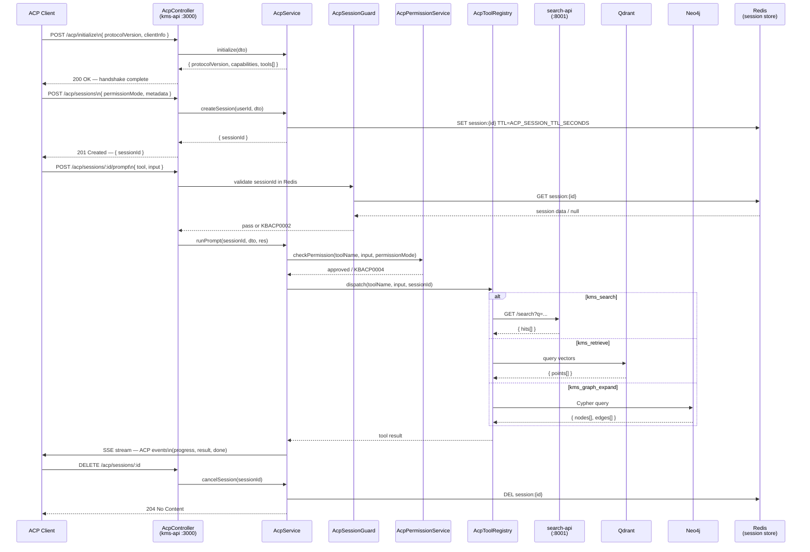

# FOR-acp-integration.md — ACP Knowledge Agent Protocol

## 1. Business Use Case

ACP (Agent Client Protocol) exposes KMS capabilities as a structured set of tools that external AI agents can call over a standard JSON-RPC 2.0 / NDJSON-over-HTTP transport. It solves the problem of allowing third-party orchestrators (LangChain, AutoGen, custom agents) to perform search, retrieval, graph expansion, embedding, and ingestion inside KMS without needing bespoke API integrations for each capability. Sessions are Redis-backed with per-user TTLs, enabling stateful multi-turn agent interactions while keeping the KMS core API unchanged. The permission model (`approve-all`, `approve-reads`, `deny-all`) lets operators gate destructive tools (ingest) independently from read-only ones (search, retrieve) without code changes.

---

## 2. Flow Diagram

---

## 3. Code Structure

| File | Responsibility |
|------|---------------|
| `kms-api/src/modules/acp/acp.module.ts` | NestJS DI wiring; imports `SessionModule`, `RedisModule`, `QueueModule`; exports `AcpService` |
| `kms-api/src/modules/acp/acp.controller.ts` | HTTP endpoints: `POST /acp/initialize`, `POST /acp/sessions`, `POST /acp/sessions/:id/prompt`, `DELETE /acp/sessions/:id` |
| `kms-api/src/modules/acp/acp.service.ts` | Orchestrates session lifecycle and tool dispatch; streams SSE events to response |
| `kms-api/src/modules/acp/acp-tool.registry.ts` | Static registry of all ACP tools; feature-flag gated; routes `dispatch()` calls to tool handlers |
| `kms-api/src/modules/acp/acp-session.store.ts` | Redis-backed session CRUD; enforces `ACP_MAX_SESSIONS_PER_USER` and TTL |
| `kms-api/src/modules/acp/acp-permission.service.ts` | Evaluates `ACP_PERMISSION_MODE` against tool name and input; throws `KBACP0004` on deny |
| `kms-api/src/modules/acp/acp-event.emitter.ts` | SSE helper: serialises ACP events (`progress`, `result`, `error`, `done`) to NDJSON lines on `res` |
| `kms-api/src/modules/acp/dto/initialize-acp.dto.ts` | `InitializeAcpDto` — `protocolVersion: string`, `clientInfo: ClientInfoDto` |
| `kms-api/src/modules/acp/dto/create-session.dto.ts` | `CreateSessionDto` — `permissionMode?: PermissionMode`, `metadata?: Record<string, unknown>` |
| `kms-api/src/modules/acp/dto/prompt-session.dto.ts` | `PromptSessionDto` — `tool: string`, `input: Record<string, unknown>`, `requestId?: string` |
| `kms-api/src/modules/acp/guards/acp-session.guard.ts` | `CanActivate` guard; reads `:id` from route params; looks up Redis; throws `KBACP0002` on miss |

---

## 4. Key Methods

| Method | Description | Signature |
|--------|-------------|-----------|
| `AcpService.initialize` | Validates protocol version against `ACP_PROTOCOL_VERSION`; reads feature flags to build capability list; throws `KBACP0001` when `ACP_ENABLED=false`, `KBACP0010` on version mismatch | `initialize(dto: InitializeAcpDto): Promise<AcpCapabilitiesResponse>` |
| `AcpService.createSession` | Checks per-user session count against `ACP_MAX_SESSIONS_PER_USER`; creates Redis key `session:{uuid}` with TTL; throws `KBACP0007` on rate limit | `createSession(userId: string, dto: CreateSessionDto): Promise<{ sessionId: string }>` |
| `AcpService.runPrompt` | Acquires session lock (serial execution); calls `AcpPermissionService.checkPermission`; calls `AcpToolRegistry.dispatch`; pipes events to SSE stream via `AcpEventEmitter`; releases lock on completion or error | `runPrompt(sessionId: string, dto: PromptSessionDto, res: FastifyReply): Promise<void>` |
| `AcpService.cancelSession` | Signals abort to any in-flight prompt via AbortController stored in session; deletes Redis key; returns 204 | `cancelSession(sessionId: string): Promise<void>` |
| `AcpToolRegistry.dispatch` | Looks up tool by name in the static registry; throws `KBACP0003` on unknown tool; throws `KBACP0005` on input validation failure; invokes handler and returns result | `dispatch(toolName: string, input: Record<string, unknown>, sessionId: string): Promise<AcpToolResult>` |
| `AcpToolRegistry.getEnabledTools` | Returns all tools whose feature flags are truthy in `.kms/config.json`; called by `initialize` to advertise capabilities | `getEnabledTools(): AcpToolDefinition[]` |
| `AcpPermissionService.checkPermission` | Maps `permissionMode` to allow/deny decision; `approve-all` passes everything; `approve-reads` blocks `kms_ingest` and `kms_embed`; `deny-all` blocks all; throws `KBACP0004` on deny | `checkPermission(toolName: string, input: Record<string, unknown>, mode: PermissionMode): void` |
| `AcpSessionStore.create` | Writes `session:{id}` JSON blob to Redis with `EX ACP_SESSION_TTL_SECONDS`; increments per-user counter | `create(userId: string, data: SessionData): Promise<string>` |
| `AcpSessionStore.get` | Fetches and parses session JSON; returns `null` on miss (guard converts to 401) | `get(sessionId: string): Promise<SessionData \| null>` |
| `AcpSessionStore.delete` | Removes `session:{id}` key and decrements per-user counter atomically via Lua script | `delete(sessionId: string): Promise<void>` |
| `AcpEventEmitter.sendProgress` | Writes `{"type":"progress","data":{...}}\n` NDJSON line to SSE response | `sendProgress(res: FastifyReply, data: ProgressPayload): void` |
| `AcpEventEmitter.sendResult` | Writes `{"type":"result","data":{...}}\n` NDJSON line; called once per tool invocation | `sendResult(res: FastifyReply, data: AcpToolResult): void` |
| `AcpEventEmitter.sendDone` | Writes `{"type":"done"}\n` and flushes; marks end of SSE stream | `sendDone(res: FastifyReply): void` |
| `AcpSessionGuard.canActivate` | Extracts `sessionId` from `req.params.id`; calls `AcpSessionStore.get`; attaches session to `req` for downstream handlers; throws `KBACP0002` on null | `canActivate(context: ExecutionContext): Promise<boolean>` |

---

## 5. Error Cases

| Error Code | HTTP Status | Description | Handling |
|------------|-------------|-------------|----------|
| `KBACP0001` | 503 | `ACP_ENABLED` feature flag is `false` in `.kms/config.json` | Return immediately from `initialize()`; client must not proceed |
| `KBACP0002` | 401 | Session ID missing from request or key not found in Redis (expired or invalid) | Thrown by `AcpSessionGuard`; client must create a new session |
| `KBACP0003` | 404 | Tool name supplied in prompt request does not exist in the registry | Client should re-call `initialize` to get updated tool list |
| `KBACP0004` | 403 | Tool call blocked by `ACP_PERMISSION_MODE` (e.g. `kms_ingest` called under `approve-reads`) | Client must switch to a session with a higher-privilege permission mode or use a different tool |
| `KBACP0005` | 422 | Tool input fails class-validator rules defined in the tool's input schema | Client must fix the input payload before retrying |
| `KBACP0006` | 503 | Downstream service (search-api, Qdrant, Neo4j, embed-worker) returned an error or timed out | Retryable; client should back off and retry; KMS logs the downstream error with full trace |
| `KBACP0007` | 429 | User has reached `ACP_MAX_SESSIONS_PER_USER` concurrent sessions | Client must cancel or wait for an existing session to expire before creating a new one |
| `KBACP0008` | 409 | Session already has an active in-flight prompt (serial execution enforced) | Client must wait for the current prompt to complete or call `DELETE /acp/sessions/:id` to cancel it |
| `KBACP0009` | 503 | SSE stream broken before `done` event was sent (client disconnect or write failure) | Abort controller fires; session lock is released; session remains valid for retry |
| `KBACP0010` | 400 | `protocolVersion` in `InitializeAcpDto` does not match the server's supported version | Client must upgrade to the advertised `protocolVersion` returned in the error body |

---

## 6. Configuration

| Variable | Description | Default |
|----------|-------------|---------|
| `ACP_ENABLED` | Master on/off switch for the entire ACP module. When `false`, all `/acp/*` endpoints return `KBACP0001`. | `false` |
| `ACP_TRANSPORT` | Transport mechanism. Only `"http"` (NDJSON-over-HTTP SSE) is supported in the current implementation. | `"http"` |
| `ACP_SESSION_TTL_SECONDS` | Redis TTL for session keys. Sessions older than this are automatically expired; subsequent requests receive `KBACP0002`. | `3600` |
| `ACP_PERMISSION_MODE` | Default permission policy applied to all new sessions unless overridden in `CreateSessionDto`. Values: `approve-all`, `approve-reads`, `deny-all`. | `"approve-reads"` |
| `ACP_MAX_SESSIONS_PER_USER` | Maximum number of concurrent open sessions per user. Exceeding this triggers `KBACP0007`. | `10` |
| `ACP_TOOL_SEARCH_ENABLED` | Feature gate for the `kms_search` tool. Disabled tools are excluded from the capabilities list returned by `initialize`. | `true` (when `ACP_ENABLED=true`) |
| `ACP_TOOL_RETRIEVE_ENABLED` | Feature gate for the `kms_retrieve` tool (direct Qdrant vector query). | `true` (when `ACP_ENABLED=true`) |
| `ACP_TOOL_EMBED_ENABLED` | Feature gate for the `kms_embed` tool. Requires the embed-worker HTTP endpoint to be reachable. | `true` (when `ACP_ENABLED=true`) |
| `ACP_TOOL_GRAPH_EXPAND_ENABLED` | Feature gate for the `kms_graph_expand` tool. Requires a live Neo4j instance. | `false` |
| `ACP_TOOL_INGEST_ENABLED` | Feature gate for the `kms_ingest` tool. Considered high-risk as it publishes to the `kms.scan` queue. | `false` |
