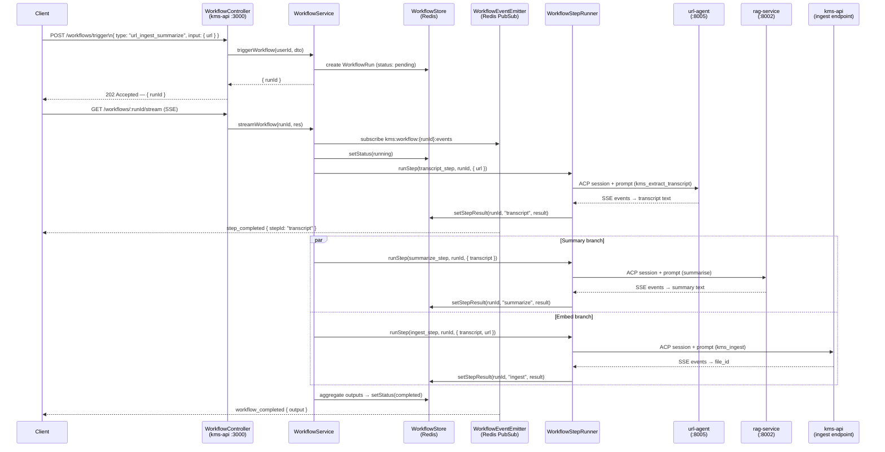

# FOR-agentic-workflows.md — KMS Agentic Workflows

## 1. Business Use Case

The Workflow Engine enables KMS to orchestrate multi-step agentic pipelines across internal and external agents — coordinating transcript extraction, document embedding, graph enrichment, and RAG summarisation into a single coherent run. Without it, callers would need to sequence these steps themselves, handle partial failures, and manage per-step retries; the engine centralises that responsibility behind a single `POST /workflows/trigger` endpoint. Runs are persisted in Redis with a 30-day TTL so that progress is resumable and SSE streams can be replayed by reconnecting clients. A static agent registry gated by feature flags means new agents can be introduced (or disabled) without touching orchestration logic.

---

## 2. Flow Diagram

YouTube URL ingestion happy path — from client trigger to workflow completion:



---

## 3. Code Structure

### kms-api — Workflow module

| File | Responsibility |
|------|---------------|
| `kms-api/src/modules/workflow/workflow.module.ts` | NestJS DI wiring; imports `RedisModule`, `AcpModule`, `QueueModule`; exports `WorkflowService` |
| `kms-api/src/modules/workflow/workflow.controller.ts` | REST endpoints: `POST /workflows/trigger`, `GET /workflows/:runId`, `GET /workflows/:runId/stream`, `DELETE /workflows/:runId` |
| `kms-api/src/modules/workflow/workflow.service.ts` | `WorkflowEngine` — creates runs, drives the step state machine, handles parallel branches, aggregates outputs |
| `kms-api/src/modules/workflow/workflow-step.runner.ts` | Creates an ACP session with the target agent, sends the step prompt, collects SSE events, returns the structured result |
| `kms-api/src/modules/workflow/workflow.store.ts` | Redis-backed CRUD for `WorkflowRun`; stores run JSON and per-step results as Redis hashes with `WORKFLOW_STATE_TTL_SECONDS` TTL |
| `kms-api/src/modules/workflow/workflow-event.emitter.ts` | SSE multiplexer; publishes events to `kms:workflow:{runId}:events` Redis PubSub channel; serialises events to NDJSON |
| `kms-api/src/modules/workflow/agent.registry.ts` | Static registry of all known agents; feature-flag gated; exposes `getAgent(agentId)` and `checkHealth()` |
| `kms-api/src/modules/workflow/workflow.types.ts` | TypeScript types: `WorkflowDefinition`, `WorkflowStep`, `WorkflowRun`, `WorkflowStepRun`, `WorkflowStatus` |
| `kms-api/src/modules/workflow/workflow-definitions/index.ts` | Registry of all built-in workflow type identifiers; maps type string → `WorkflowDefinition` |
| `kms-api/src/modules/workflow/workflow-definitions/url-ingest-summarize.ts` | Definition for `url_ingest_summarize` — transcript extraction → parallel summary + embed steps |
| `kms-api/src/modules/workflow/workflow-definitions/file-summarize.ts` | Definition for `file_summarize` — retrieves existing file chunks → RAG summary step |
| `kms-api/src/modules/workflow/dto/trigger-workflow.dto.ts` | `TriggerWorkflowDto` — `type: string`, `input: Record<string, unknown>` |
| `kms-api/src/modules/workflow/dto/workflow-run.dto.ts` | `WorkflowRunDto` — serialised `WorkflowRun` for REST responses |

### services/url-agent — FastAPI agent

| File | Responsibility |
|------|---------------|
| `services/url-agent/app/main.py` | FastAPI app entrypoint; mounts ACP client adapter; registers tool handlers; configures telemetry |
| `services/url-agent/app/config.py` | Pydantic `Settings`: `YT_DLP_PATH`, `WHISPER_MODEL`, `MAX_TRANSCRIPT_CHARS`, service URLs |
| `services/url-agent/app/handlers/transcript_handler.py` | Handles `kms_extract_transcript` ACP tool — dispatches to YouTube or web-page extractor based on URL |
| `services/url-agent/app/handlers/fetch_handler.py` | Handles `kms_fetch_url` ACP tool — fetches arbitrary web pages via httpx + readability-lxml |
| `services/url-agent/app/extractors/youtube.py` | yt-dlp audio download + Whisper transcription pipeline; enforces `MAX_TRANSCRIPT_CHARS` limit |
| `services/url-agent/app/extractors/web_page.py` | httpx GET + readability-lxml main-content extraction; returns plain-text article body |
| `services/url-agent/app/models/messages.py` | Pydantic input/output schemas for all tool handlers |
| `services/url-agent/requirements.txt` | Python dependencies: `fastapi`, `aio-pika`, `yt-dlp`, `openai-whisper`, `httpx`, `readability-lxml` |

---

## 4. Key Methods

| Method | Description | Signature |
|--------|-------------|-----------|
| `WorkflowService.triggerWorkflow` | Validates workflow type exists; checks per-user concurrent run count against `WORKFLOW_MAX_CONCURRENT`; creates `WorkflowRun` in Redis with `pending` status; fires async `runWorkflow` without awaiting; returns `{ runId }` | `triggerWorkflow(userId: string, dto: TriggerWorkflowDto): Promise<{ runId: string }>` |
| `WorkflowService.runWorkflow` | State-machine driver: iterates over `WorkflowDefinition.steps`; resolves `input_map` from prior step results; groups steps by `parallel_with` and executes parallel groups concurrently via `Promise.allSettled`; on completion calls `aggregateOutputs` and sets `completed`; on any fatal error sets `failed` | `runWorkflow(runId: string): Promise<void>` |
| `WorkflowService.cancelWorkflow` | Loads run from Redis; sends ACP cancel to every active session ID stored in the run; sets status to `cancelled`; publishes `workflow_cancelled` event | `cancelWorkflow(runId: string, userId: string): Promise<void>` |
| `WorkflowService.streamWorkflow` | Sets SSE headers on `res`; subscribes to Redis PubSub channel `kms:workflow:{runId}:events`; pipes each NDJSON line to response; closes subscription and response on `workflow_completed`, `workflow_failed`, or client disconnect | `streamWorkflow(runId: string, res: FastifyReply): Promise<void>` |
| `WorkflowStepRunner.runStep` | Calls `AgentRegistry.getAgent(step.agent_id)`; opens an ACP session on the agent's `endpointUrl`; sends the step `task` as an ACP prompt with resolved `input`; collects all `progress` and `result` SSE events; enforces `timeout_seconds` via `AbortController`; returns structured `WorkflowStepRun` result | `runStep(step: WorkflowStep, runId: string, input: Record<string, unknown>): Promise<WorkflowStepRun>` |
| `AgentRegistry.getAgent` | Looks up agent by `agentId` in the static registry; verifies the agent's feature flag is enabled in `.kms/config.json`; throws `KBWFL0003` if not registered or unhealthy | `getAgent(agentId: string): AgentDescriptor` |
| `AgentRegistry.checkHealth` | Iterates all registered agents; fires a `GET /health` against each `endpointUrl`; updates the in-memory health map; called on a periodic timer and on every `getAgent` call | `checkHealth(): Promise<void>` |
| `WorkflowStore.setStepResult` | Updates the Redis hash `workflow:{runId}:steps` with `stepId` → serialised `WorkflowStepRun`; extends TTL on the parent run key | `setStepResult(runId: string, stepId: string, result: WorkflowStepRun): Promise<void>` |
| `WorkflowStore.getRunStatus` | Reads and deserialises the full `WorkflowRun` JSON from Redis; returns `null` on miss (caller converts to `KBWFL0004`) | `getRunStatus(runId: string): Promise<WorkflowRun \| null>` |

---

## 5. Error Cases

| Error Code | HTTP Status | Description | Handling |
|------------|-------------|-------------|----------|
| `KBWFL0001` | 503 | `WORKFLOW_ENABLED` feature flag is `false` in `.kms/config.json` | Return immediately from `triggerWorkflow`; client must not proceed until flag is enabled |
| `KBWFL0002` | 400 | `type` supplied in `TriggerWorkflowDto` does not exist in the workflow-definitions registry | Client must supply a valid workflow type; call `GET /workflows/types` for the available list |
| `KBWFL0003` | 503 | Agent ID referenced in a workflow step is not registered in `AgentRegistry` or failed its most recent health check | Operator must start the agent service and ensure it passes `GET /health`; workflow run is marked `failed` |
| `KBWFL0004` | 404 | `runId` does not exist in Redis (expired after `WORKFLOW_STATE_TTL_SECONDS` or never created) | Client must trigger a new workflow run |
| `KBWFL0005` | 409 | A workflow run with the same user + type + input hash is already in `running` or `pending` status | Client must wait for or cancel the existing run; idempotency key is logged for debugging |
| `KBWFL0006` | 408 | A step exceeded `timeout_seconds` (default: `WORKFLOW_STEP_TIMEOUT_SECONDS`); `AbortController` fires | Step is marked `failed`; parent run transitions to `failed`; client receives `step_timeout` event over SSE |
| `KBWFL0007` | 500 | The target agent returned a non-`result` terminal ACP event (agent-side error) | Retried up to `retry.max` times with `retry.backoff_ms` delay; after all retries exhausted the run is marked `failed` |
| `KBWFL0008` | 400 | A step attempted to spawn a sub-agent that itself triggered another sub-agent, exceeding depth 2 | Rejected immediately; parent step receives a `depth_limit_exceeded` error payload |
| `KBWFL0009` | 429 | User already has `WORKFLOW_MAX_CONCURRENT` runs in `pending` or `running` status | Client must wait for an existing run to complete or cancel one before triggering a new one |
| `KBWFL0010` | 400 | `input` in `TriggerWorkflowDto` is missing a field required by the target `WorkflowDefinition` | Client must supply all required fields; error body lists the missing field names |
| `KBWFL0011` | 503 | `url-agent` health check failed or `URL_AGENT_ENABLED` is `false` | Operator must start `url-agent` and set `URL_AGENT_ENABLED=true`; workflows requiring `url-agent` are blocked |
| `KBWFL0012` | 422 | URL supplied to `url-agent` is neither a recognised YouTube URL nor a fetchable web page | Client must supply a valid YouTube or HTTP/HTTPS URL |
| `KBWFL0013` | 413 | Extracted transcript exceeds `MAX_TRANSCRIPT_CHARS`; `url-agent` rejects it before returning to the engine | Client must use a shorter video or increase `MAX_TRANSCRIPT_CHARS` if the deployment allows it |
| `KBWFL0014` | 409 | `cancelWorkflow` was called while the run was in progress | Run is marked `cancelled`; all active ACP sessions receive an abort signal; client receives `workflow_cancelled` event |
| `KBWFL0015` | 500 | Output aggregation in `runWorkflow` failed because one or more parallel branches produced incompatible or missing results | Partial results are preserved in Redis for debugging; run status is set to `failed`; error body includes the step IDs that succeeded |

---

## 6. Configuration

| Variable | Description | Default |
|----------|-------------|---------|
| `WORKFLOW_ENABLED` | Master on/off switch. When `false`, all `/workflows/*` endpoints return `KBWFL0001`. Must also be `true` in `.kms/config.json`. | `false` |
| `WORKFLOW_MAX_CONCURRENT` | Maximum number of `pending` or `running` workflow runs allowed per user simultaneously. Exceeding this triggers `KBWFL0009`. | `3` |
| `WORKFLOW_STEP_TIMEOUT_SECONDS` | Default per-step timeout in seconds applied when a `WorkflowStep` does not specify `timeout_seconds`. | `300` |
| `WORKFLOW_STATE_TTL_SECONDS` | Redis TTL for all `WorkflowRun` keys. After expiry `getRunStatus` returns `null` and `GET /workflows/:runId` returns `KBWFL0004`. | `2592000` (30 days) |
| `URL_AGENT_URL` | Base URL of the `url-agent` FastAPI service. Used by `AgentRegistry` as the `endpointUrl` for agent ID `url-agent`. | `http://url-agent:8005` |
| `URL_AGENT_ENABLED` | Feature flag for the `url-agent`. When `false`, `AgentRegistry.getAgent("url-agent")` throws `KBWFL0003`. | `false` |
| `YT_DLP_PATH` | Absolute path to the `yt-dlp` binary inside the `url-agent` container. | `/usr/local/bin/yt-dlp` |
| `WHISPER_MODEL` | Whisper model size used by `url-agent` for audio transcription. Larger models increase accuracy but increase latency. Valid values: `tiny`, `base`, `small`, `medium`, `large`. | `base` |
| `MAX_TRANSCRIPT_CHARS` | Maximum character length of a transcript returned by `url-agent`. Transcripts exceeding this length trigger `KBWFL0013`. | `100000` |

---

## 7. How to Add a New Skill / Agent

Follow these four steps to wire a new capability into the Workflow Engine.

### Step 1 — Create the FastAPI agent service

Create a new directory `services/my-agent/` following the same structure as `services/url-agent/`.

```
services/my-agent/
├── app/
│   ├── main.py          — FastAPI app; configure_telemetry(); register tool handlers
│   ├── config.py        — Pydantic Settings (base URL, secrets, model paths)
│   ├── handlers/
│   │   └── my_handler.py — implements the ACP tool logic
│   ├── models/
│   │   └── messages.py  — Pydantic input/output schemas
│   └── ...
└── requirements.txt
```

In `main.py`, follow the mandatory ACP lifespan pattern — `configure_telemetry(app)` must be called before any route import, and the ACP session endpoint must be mounted at `POST /acp/sessions`:

```python
# services/my-agent/app/main.py
from contextlib import asynccontextmanager
from fastapi import FastAPI
from app.config import Settings
from app.handlers.my_handler import handle_my_tool

settings = Settings()

@asynccontextmanager
async def lifespan(app: FastAPI):
    configure_telemetry(app)        # OTel — must be first
    yield

app = FastAPI(lifespan=lifespan)

@app.post("/acp/sessions/{session_id}/prompt")
async def prompt(session_id: str, body: AcpPromptRequest) -> StreamingResponse:
    return StreamingResponse(handle_my_tool(body), media_type="application/x-ndjson")

@app.get("/health")
async def health():
    return {"status": "ok"}
```

### Step 2 — Implement the task handler

Create `services/my-agent/app/handlers/my_handler.py`. The handler receives an ACP prompt, runs the domain logic, and yields NDJSON-encoded ACP events:

```python
# services/my-agent/app/handlers/my_handler.py
import structlog
from app.models.messages import MyToolInput, MyToolOutput

logger = structlog.get_logger(__name__)

async def handle_my_tool(body: AcpPromptRequest):
    """Handle the kms_my_tool ACP tool call.

    Args:
        body: ACP prompt request containing tool name and input fields.

    Yields:
        NDJSON-encoded ACP events: progress, result, done.
    """
    log = logger.bind(tool=body.tool, session_id=body.session_id)
    log.info("my_tool.started")

    try:
        validated = MyToolInput(**body.input)
        # --- domain logic ---
        result = await run_my_logic(validated)
        yield acp_event("progress", {"message": "processing complete"})
        yield acp_event("result", MyToolOutput(data=result).model_dump())
        yield acp_event("done", {})
        log.info("my_tool.completed")
    except MyDomainError as exc:
        log.error("my_tool.failed", error=str(exc), retryable=exc.retryable)
        yield acp_event("error", {"code": exc.code, "message": str(exc)})
```

Use `structlog.get_logger(__name__).bind(...)` — never `logging.getLogger()`. Raise a typed subclass of `KMSWorkerError` for all domain failures so retryability is explicit.

### Step 3 — Register in AgentRegistry

**a. Add the agent to `.kms/config.json`:**

```json
{
  "agents": {
    "my-agent": {
      "enabled": true,
      "endpointUrl": "http://my-agent:8006",
      "capabilities": ["kms_my_tool"]
    }
  }
}
```

**b. Add a constant and descriptor in `agent.registry.ts`:**

```typescript
// kms-api/src/modules/workflow/agent.registry.ts
const MY_AGENT_ID = 'my-agent';

// Inside AgentRegistry.buildRegistry():
if (config.agents['my-agent']?.enabled) {
  registry.set(MY_AGENT_ID, {
    agentId: MY_AGENT_ID,
    endpointUrl: config.agents['my-agent'].endpointUrl,
    capabilities: config.agents['my-agent'].capabilities,
    healthy: false,   // updated by checkHealth()
  });
}
```

**c. Add the service to `docker-compose.kms.yml`** so it starts with the stack:

```yaml
my-agent:
  build: ./services/my-agent
  ports:
    - "8006:8006"
  environment:
    - MY_AGENT_SETTING=${MY_AGENT_SETTING}
```

### Step 4 — Define a WorkflowDefinition

Create `kms-api/src/modules/workflow/workflow-definitions/my-workflow.ts`:

```typescript
// kms-api/src/modules/workflow/workflow-definitions/my-workflow.ts
import { WorkflowDefinition } from '../workflow.types';

export const myWorkflow: WorkflowDefinition = {
  type: 'my_workflow',
  steps: [
    {
      id: 'run_my_tool',
      agent_id: 'my-agent',
      task: 'Run my domain logic on the provided input',
      input_map: {
        // maps TriggerWorkflowDto.input fields → step input fields
        source_data: 'source_data',
      },
      retry: { max: 2, backoff_ms: 1000 },
      timeout_seconds: 120,
    },
    {
      id: 'summarize_result',
      agent_id: 'rag-service',
      task: 'Summarise the output produced in the previous step',
      input_map: {
        // references prior step result via "$steps.run_my_tool.output"
        content: '$steps.run_my_tool.output.data',
      },
      parallel_with: [],   // runs sequentially after run_my_tool
    },
  ],
};
```

Register it in the index:

```typescript
// kms-api/src/modules/workflow/workflow-definitions/index.ts
import { myWorkflow } from './my-workflow';

export const WORKFLOW_DEFINITIONS: Record<string, WorkflowDefinition> = {
  url_ingest_summarize: urlIngestSummarize,
  file_summarize:       fileSummarize,
  my_workflow:          myWorkflow,   // add here
};
```

After these four steps, `POST /workflows/trigger` with `{ "type": "my_workflow", "input": { "source_data": "..." } }` will route through the new agent automatically.
