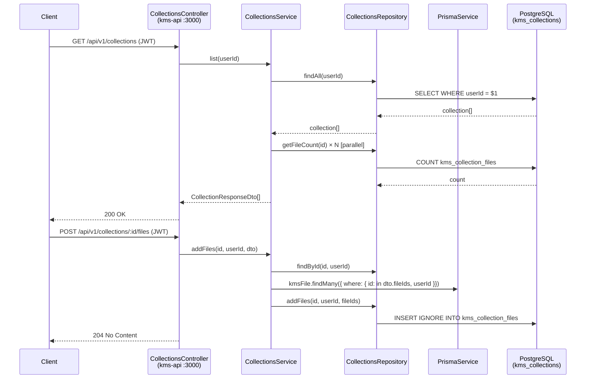

# FOR-collections.md — Collections Module

## 1. Business Use Case

Collections are named, user-owned groupings of KMS files that let users organise and curate subsets of their knowledge base. They solve the problem of scope control: instead of searching across all ingested content, users or RAG pipelines can target a specific collection (e.g. "Q3 Research", "Client Docs") to get more precise results. Collections are multi-tenant — every DB operation is hard-scoped to `userId` so cross-user access is structurally impossible. The module exposes a standard CRUD REST API under `api/v1/collections` and a membership API (`POST /:id/files`, `DELETE /:id/files/:fileId`) for adding and removing files.

---

## 2. Flow Diagram

---

## 3. Code Structure

| File | Responsibility |
|------|---------------|
| `kms-api/src/modules/collections/collections.controller.ts` | HTTP layer — routes, Swagger decorators, `@CurrentUser` injection |
| `kms-api/src/modules/collections/collections.service.ts` | Business logic — CRUD, file membership, `isDefault` guard, DTO mapping |
| `kms-api/src/modules/collections/collections.repository.ts` | DB access — all Prisma calls for `kms_collections` and `kms_collection_files` |
| `kms-api/src/modules/collections/collections.service.spec.ts` | Jest unit tests for all service methods and error branches |
| `kms-api/src/modules/collections/dto/` | Zod/class-validator DTOs: `CreateCollectionDto`, `UpdateCollectionDto`, `AddFilesToCollectionDto`, `CollectionResponseDto` |

---

## 4. Key Methods

| Method | Class | Description |
|--------|-------|-------------|
| `list(userId)` | `CollectionsService` | Returns all collections with computed `fileCount` for the user |
| `get(id, userId)` | `CollectionsService` | Returns one collection; throws `DAT0000` (NOT_FOUND) if not owned |
| `create(userId, dto)` | `CollectionsService` | Creates a new collection; returns with `fileCount: 0` |
| `update(id, userId, dto)` | `CollectionsService` | Partial update (name, description, color, icon); ownership verified first |
| `delete(id, userId)` | `CollectionsService` | Deletes collection; throws `DAT0002` (CONFLICT) if `isDefault = true` |
| `addFiles(collectionId, userId, dto)` | `CollectionsService` | Validates all fileIds belong to user; upserts membership rows |
| `removeFile(collectionId, userId, fileId)` | `CollectionsService` | Removes single file from collection; no-op if already absent |
| `findAll(userId)` | `CollectionsRepository` | `SELECT * FROM kms_collections WHERE userId = $1` |
| `findById(id, userId)` | `CollectionsRepository` | Ownership-scoped lookup; returns `null` if foreign or missing |
| `getFileCount(id)` | `CollectionsRepository` | `COUNT(*)` from `kms_collection_files` |
| `addFiles(id, userId, fileIds)` | `CollectionsRepository` | Bulk insert with duplicate-skip (createMany skipDuplicates) |

---

## 5. Error Cases

| Error Code | HTTP Status | Description | Handling |
|------------|-------------|-------------|---------|
| `DAT0000` (NOT_FOUND) | 404 | Collection not found or belongs to a different user | Thrown by `get`, `update`, `delete`, `addFiles`, `removeFile` |
| `DAT0002` (CONFLICT) | 409 | Attempt to delete the default collection | Thrown by `delete` when `isDefault === true` |
| `DAT0000` (NOT_FOUND) | 404 | One or more `fileIds` not found for this user in `addFiles` | Throws with missing file UUID in message |
| `VAL*` | 400 | DTO validation failure (e.g. missing `name`, invalid UUID) | Handled by global validation pipe before reaching service |

---

## 6. Configuration

| Env Var / Constant | Description | Default |
|--------------------|-------------|---------|
| `DATABASE_URL` | PostgreSQL connection string used by PrismaService | required |
| `isDefault` field | Prisma schema field guarding default collection deletion | `false` on creation |

> **Note on N+1**: `list()` currently fetches file counts with `Promise.all` (one query per collection). This is acceptable for typical collection counts (< 50) but should be replaced with a single `GROUP BY` aggregate query if users accumulate many collections.
