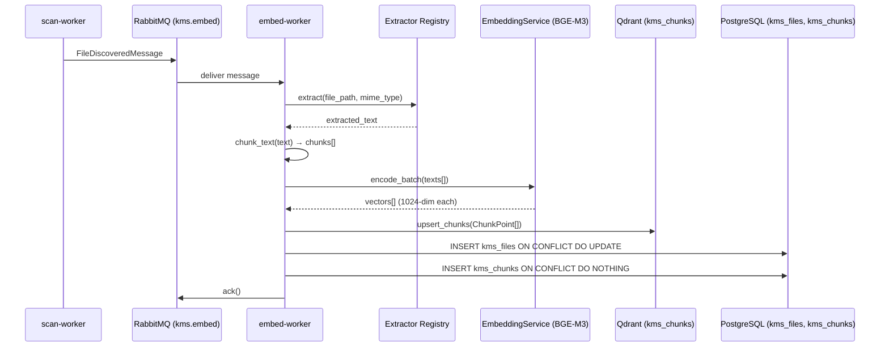

# FOR-embedding — BGE-M3 Embedding Pipeline: embed-worker, Qdrant, FlagEmbedding

## 1. Business Use Case

The embedding pipeline converts plain text chunks extracted from files into 1024-dimensional dense vectors using the `BAAI/bge-m3` model, then upserts them into a Qdrant collection for approximate nearest-neighbour (ANN) retrieval. This is the foundation of semantic search and RAG in KMS. ADR-0009 documents why BGE-M3 was chosen over alternatives.

---

## 2. Flow Diagram



---

## 3. Code Structure

| File | Responsibility |
|------|---------------|
| `app/handlers/embed_handler.py` | AMQP handler: orchestrates all 6 pipeline steps |
| `app/extractors/registry.py` | MIME-type → Extractor mapping; `get_extractor(mime)` |
| `app/extractors/base.py` | `BaseExtractor` abstract class |
| `app/extractors/{pdf,docx,csv,...}.py` | Concrete extractors per file type |
| `app/chunkers/text_chunker.py` | `chunk_text(text)` — sliding window with overlap |
| `app/services/embedding_service.py` | `EmbeddingService.encode_batch()` — BGE-M3 via FlagEmbedding |
| `app/services/qdrant_service.py` | `QdrantService` — collection management + upsert |
| `app/models/messages.py` | `FileDiscoveredMessage`, `TextChunk` Pydantic models |

---

## 4. Key Methods

| Method | Description | Signature |
|--------|-------------|-----------|
| `get_extractor` | Return extractor for a MIME type, or None | `get_extractor(mime_type: str | None) -> BaseExtractor | None` |
| `BaseExtractor.extract` | Extract text from a file path | `async extract(file_path: Path) -> str` |
| `chunk_text` | Split text into overlapping chunks | `chunk_text(text: str, size: int = 512, overlap: int = 50) -> list[TextChunk]` |
| `EmbeddingService.encode_batch` | Encode texts to BGE-M3 vectors | `async encode_batch(texts: list[str]) -> list[list[float]]` |
| `QdrantService.ensure_collection` | Create collection if missing | `async ensure_collection() -> None` |
| `QdrantService.upsert_chunks` | Upsert chunk vectors into Qdrant | `async upsert_chunks(chunks: list[ChunkPoint]) -> None` |

---

## 5. Error Cases

| Error Code | Description | Handling |
|------------|-------------|----------|
| `KBWRK0401` | `ExtractionError` — extractor raised exception | `nack(requeue=True)` for transient; `reject` for corrupt file |
| `KBWRK0402` | `ChunkingError` — chunker raised exception | `nack(requeue=True)` |
| `KBWRK0403` | `EmbeddingError` — BGE-M3 model failure | `nack(requeue=True)` (OOM is transient) |
| `KBWRK0404` | `QdrantError` — Qdrant connection/write failure | `nack(requeue=True)` |
| Unknown MIME type | No extractor registered | Log + skip (return empty text); ack the message |
| File not on disk | File deleted between scan and embed | Log warning + skip; ack the message |

---

## 6. Configuration

| Env Var | Description | Default |
|---------|-------------|---------|
| `EMBEDDING_ENABLED` | Enable/disable BGE-M3 encoding step | `true` |
| `MOCK_EMBEDDING` | Return zero vectors (no model load) | `false` |
| `EMBEDDING_MODEL` | FlagEmbedding model name | `BAAI/bge-m3` |
| `EMBEDDING_BATCH_SIZE` | Chunks per encode_batch call | `32` |
| `MOCK_QDRANT` | Skip Qdrant upsert (dev mode) | `true` |
| `QDRANT_URL` | Qdrant HTTP endpoint | `http://localhost:6333` |
| `EMBED_QUEUE` | RabbitMQ queue name | `kms.embed` |

---

## Supported File Types

| MIME Type | Extractor | Notes |
|-----------|-----------|-------|
| `text/plain` | `PlainTextExtractor` | UTF-8 with `errors=replace` |
| `application/pdf` | `PdfExtractor` | pdfminer.six; falls back to OCR if text-free |
| `application/vnd.openxmlformats-officedocument.wordprocessingml.document` | `DocxExtractor` | python-docx |
| `application/vnd.openxmlformats-officedocument.spreadsheetml.sheet` | `XlsxExtractor` | openpyxl |
| `text/csv` / `application/csv` | `CsvExtractor` | Raw text passthrough |
| `text/markdown` | `MarkdownExtractor` | markdown → HTML → text |
| `text/html` | `HtmlExtractor` | BeautifulSoup |
| `image/png`, `image/jpeg`, etc. | `ImageExtractor` | Tesseract OCR |

---

## Qdrant Payload Schema

Each `ChunkPoint` stored in the `kms_chunks` collection carries:

```json
{
  "user_id": "uuid",
  "source_id": "uuid",
  "file_id": "uuid",
  "filename": "report.pdf",
  "mime_type": "application/pdf",
  "content": "chunk text for snippet display",
  "chunk_index": 3
}
```

The `user_id` field is used by search-api to enforce access control at query time.
