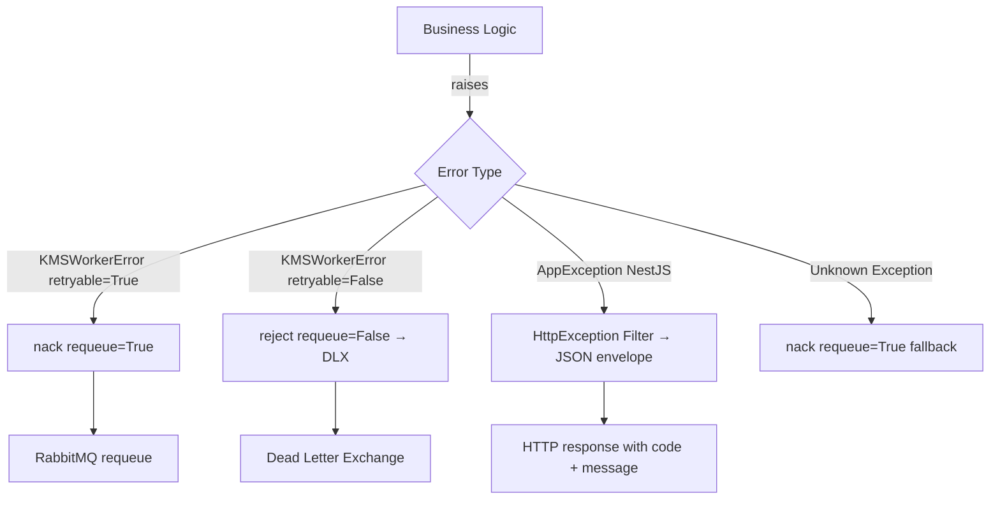

# FOR-error-handling — AppException (NestJS) and KMSWorkerError (Python) Patterns

## 1. Business Use Case

KMS uses typed error hierarchies in all services so error codes are stable, machine-readable, and drive automated retry/reject decisions in AMQP workers. Raw `Exception` re-raises or untyped errors are DoD violations. Every error carries a `KB{DOMAIN}{4-DIGIT}` code and a human-readable message. In NestJS, `AppException` produces consistent JSON error envelopes. In Python workers, `KMSWorkerError.retryable` drives AMQP ack/nack/reject.

---

## 2. Flow Diagram



---

## 3. Code Structure

| File | Responsibility |
|------|---------------|
| `services/*/app/utils/errors.py` | Python typed error hierarchy per service |
| `packages/@kb/errors/` | NestJS `AppException` base + KB error codes |
| `kms-api/src/common/filters/` | NestJS `AllExceptionsFilter` — converts AppException to JSON |

---

## 4. Key Methods

| Method | Description | Signature |
|--------|-------------|-----------|
| `KMSWorkerError.__init__` | Base Python worker error | `(message, code: str, retryable: bool = True)` |
| `AppException` | NestJS base error | `new AppException(code, message, httpStatus)` |
| `message.nack(requeue=True)` | Retry via requeue | aio-pika call |
| `message.reject(requeue=False)` | Terminal — send to DLX | aio-pika call |

---

## 5. Error Cases

### Python Error Code Namespaces

| Namespace | Service | Range |
|-----------|---------|-------|
| `KBWRK01xx` | scan-worker | 0101–0199 |
| `KBWRK02xx` | dedup-worker | 0201–0299 |
| `KBWRK03xx` | graph-worker | 0301–0399 |
| `KBWRK04xx` | embed-worker | 0401–0499 |
| `KBRAG0xxx` | rag-service | 0001–0099 |
| `KBAUT0xxx` | auth | 0001–0099 |
| `KBFIL0xxx` | files | 0001–0099 |
| `KBSRC0xxx` | sources | 0001–0099 |
| `KBSCH0xxx` | search | 0001–0099 |

### Assigned Error Codes

| Code | Description |
|------|-------------|
| `KBWRK0101` | `FileDiscoveryError` — connector failed to list files |
| `KBWRK0102` | `ConnectorError` — source connector auth/connect failure |
| `KBWRK0103` | `QueuePublishError` — downstream queue publish failed |
| `KBWRK0104` | `ScanJobFailedError` — terminal scan job configuration error |
| `KBWRK0201` | `HashLookupError` — Redis hash lookup/write failure |
| `KBWRK0202` | `DatabaseError` — asyncpg kms_file_duplicates failure |
| `KBWRK0301` | `ChunkLoadError` — asyncpg chunk load failure |
| `KBWRK0302` | `NERExtractionError` — spaCy NER failure |
| `KBWRK0303` | `Neo4jWriteError` — Cypher write failure |
| `KBWRK0304` | `StatusUpdateError` — PG status update failure |
| `KBRAG0001` | `RetrievalError` — embedding/Qdrant unavailable |
| `KBRAG0002` | `LLMUnavailableError` — LLM provider unreachable |
| `KBRAG0003` | `SearchUnavailableError` — search-api unreachable |
| `KBRAG0004` | `QueryTooLongError` — query > 500 chars |
| `KBRAG0005` | `GeneratorError` — all LLM providers failed |
| `KBRAG0006` | `NoRelevantContentError` — retrieval returned nothing |
| `KBRAG0007` | `RunNotFoundError` — run ID not in store |

---

## 6. Configuration

No configuration required for error codes — they are constants in `errors.py` per service.

---

## Python Pattern (canonical)

```python
class KMSWorkerError(Exception):
    def __init__(self, message: str, code: str, retryable: bool = True) -> None:
        super().__init__(message)
        self.code = code
        self.retryable = retryable

class FileDiscoveryError(KMSWorkerError):
    def __init__(self, source_id: str, reason: str, retryable: bool = True) -> None:
        super().__init__(
            f"File discovery failed for source {source_id}: {reason}",
            code="KBWRK0101",
            retryable=retryable,
        )
```

## NestJS Pattern (canonical)

```typescript
import { AppException } from '@kb/errors';

// In service:
throw new AppException('KBFIL0001', 'File not found', 404);

// In exception filter (auto-applied globally):
// → HTTP 404 { "error": { "code": "KBFIL0001", "message": "File not found" } }
```

## AMQP Dispatch Pattern

```python
try:
    await self._do_work(job)
    await message.ack()
except KMSWorkerError as e:
    if e.retryable:
        await message.nack(requeue=True)
    else:
        await message.reject(requeue=False)
except Exception as e:
    # Unknown errors are treated as transient
    await message.nack(requeue=True)
```
