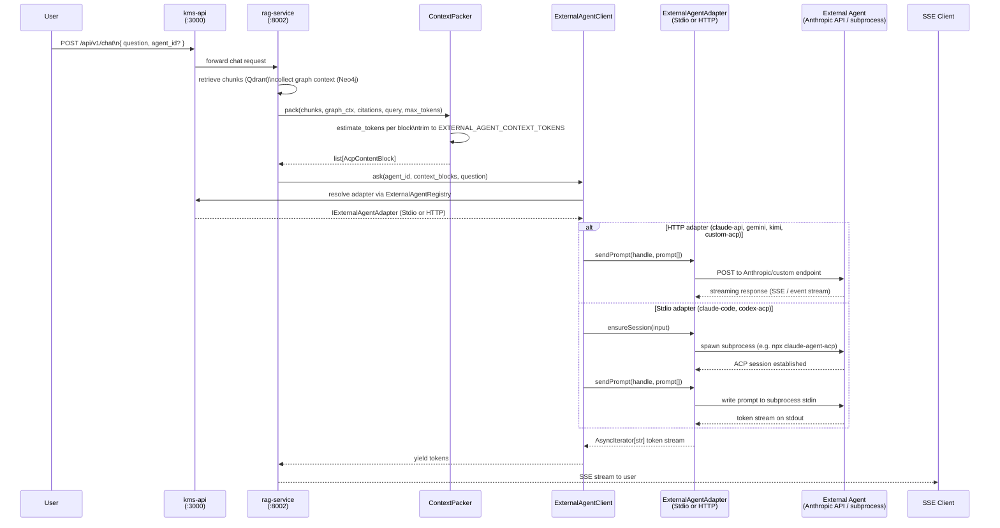

# FOR-external-agent-integration.md — KMS External Agent Integration

## 1. Business Use Case

KMS External Agent Integration solves two distinct but complementary problems in a single module. First, it allows KMS to act as a **client** to any ACP-compatible external agent (Claude Code, Codex, Gemini, Kimi, or a custom endpoint), forwarding user queries together with RAG-packed context so that a best-in-class LLM handles the final generation step rather than the internal rag-service model. Second, it allows KMS to act as an **MCP server**, exposing its search, retrieve, and graph-expansion capabilities as callable tools to external orchestrators such as Claude Code's `/mcp` integration.

Without this module, every LLM integration would require a bespoke adapter in `rag-service`, and external tools like Claude Code would have no standardised way to invoke KMS capabilities. The module introduces a single `ExternalAgentAdapterFactory` that selects either a subprocess (`StdioAcpAdapter`) or HTTP (`HttpAcpAdapter`) transport based on config, an `ExternalAgentRegistry` that reads `.kms/config.json` so agents can be added or removed without code changes, and an `McpService` that bridges MCP tool-call requests onto the existing ACP tool registry.

---

## 2. Flow Diagram

End-to-end happy path — from user chat message to streamed tokens:



---

## 3. Code Structure

### kms-api — External Agent module

| File | Responsibility |
|------|---------------|
| `kms-api/src/modules/acp/external-agent/external-agent.module.ts` | NestJS DI wiring; imports `ConfigModule`, `RedisModule`; exports `ExternalAgentRegistry`, `ExternalAgentAdapterFactory` |
| `kms-api/src/modules/acp/external-agent/external-agent-adapter.factory.ts` | Reads agent config from `ExternalAgentRegistry`; returns a `StdioAcpAdapter` for `type: "stdio"` agents or `HttpAcpAdapter` for `type: "http"` agents |
| `kms-api/src/modules/acp/external-agent/stdio-acp-adapter.ts` | Spawns a subprocess (e.g. `npx claude-agent-acp`) via Node `child_process`; manages the ACP session lifecycle over stdin/stdout; enforces `EXTERNAL_AGENT_SUBPROCESS_POOL` concurrency limit |
| `kms-api/src/modules/acp/external-agent/http-acp-adapter.ts` | Issues `POST` requests to an ACP-over-HTTP endpoint (Anthropic API, Gemini, Kimi, or `CUSTOM_ACP_ENDPOINT`); reads the response as an SSE event stream; injects the correct API key from env |
| `kms-api/src/modules/acp/external-agent/external-agent.registry.ts` | Reads `externalAgents.agents` from `.kms/config.json` at startup; caches the config + adapter instance per `agentId`; throws `KBEXT0002` on unknown `agentId` |
| `kms-api/src/modules/acp/external-agent/external-agent-session.manager.ts` | Tracks active `ExternalAgentHandle` objects per user; enforces `EXTERNAL_AGENT_SUBPROCESS_POOL`; runs a background health-check loop calling `ExternalAgentRegistry.healthCheckAll()` |
| `kms-api/src/modules/acp/external-agent/types.ts` | TypeScript interfaces: `IExternalAgentAdapter`, `ExternalAgentHandle`, `ExternalAgentConfig`, `AcpContentBlock` |

### kms-api — MCP server module

| File | Responsibility |
|------|---------------|
| `kms-api/src/modules/mcp/mcp.module.ts` | NestJS DI wiring; imports `AcpModule`, `ExternalAgentModule`; exports `McpService` |
| `kms-api/src/modules/mcp/mcp.controller.ts` | `GET /mcp/v1/tools` returns tool manifest JSON; `POST /mcp/v1/tools/call` dispatches to `McpService.callTool` |
| `kms-api/src/modules/mcp/mcp.service.ts` | Bridges incoming MCP tool-call requests onto `AcpToolRegistry.dispatch`; enforces `MCP_TOOLS` allowlist; throws `KBEXT0008` for unlisted tools |
| `kms-api/src/modules/mcp/dto/mcp-tool-call.dto.ts` | `McpToolCallDto` — `toolName: string`, `input: Record<string, unknown>`, `requestId?: string` |
| `kms-api/src/modules/mcp/dto/mcp-tool-manifest.dto.ts` | `McpToolManifestDto` — serialised JSON schema array for all enabled tools |

### rag-service — Context packing and external agent client

| File | Responsibility |
|------|---------------|
| `rag-service/app/services/context_packer.py` | Formats RAG chunks and graph context into `AcpContentBlock` resource blocks; enforces `EXTERNAL_AGENT_CONTEXT_TOKENS` token budget using tiktoken; preserves citation metadata |
| `rag-service/app/services/external_agent_client.py` | ACP client that connects to the `ExternalAgentAdapter` in `kms-api`; sends `context_blocks + question`; returns an `AsyncIterator[str]` of streamed tokens |

---

## 4. Key Methods

### NestJS (kms-api)

| Method | Description | Signature |
|--------|-------------|-----------|
| `ExternalAgentAdapterFactory.create` | Resolves the correct adapter class from the agent's `type` field (`"stdio"` or `"http"`); instantiates and returns an `IExternalAgentAdapter` bound to the agent's config; throws `KBEXT0001` when `EXTERNAL_AGENTS_ENABLED=false` | `create(agentId: string): IExternalAgentAdapter` |
| `StdioAcpAdapter.ensureSession` | Checks the subprocess pool count against `EXTERNAL_AGENT_SUBPROCESS_POOL`; spawns the subprocess command from config if no session exists for this user; establishes the ACP handshake over stdin/stdout; stores the resulting `ExternalAgentHandle`; throws `KBEXT0005` on pool exhaustion | `ensureSession(input: { userId: string; agentId: string }): Promise<ExternalAgentHandle>` |
| `HttpAcpAdapter.sendPrompt` | Serialises `prompt[]` (array of `AcpContentBlock`) into the provider's request format; POSTs to the Anthropic API or `CUSTOM_ACP_ENDPOINT` with the correct bearer token; returns an `AsyncIterable` over the raw SSE event stream; throws `KBEXT0006` on non-2xx response | `sendPrompt(handle: ExternalAgentHandle, prompt: AcpContentBlock[]): AsyncIterable<string>` |
| `ExternalAgentRegistry.getAgent` | Looks up `agentId` in the in-memory registry built from `.kms/config.json`; returns the cached config + adapter; throws `KBEXT0002` if the agent is not registered or its feature flag is `false` | `getAgent(agentId: string): { config: ExternalAgentConfig; adapter: IExternalAgentAdapter }` |
| `ExternalAgentRegistry.healthCheckAll` | Iterates all registered agents; for HTTP agents fires `GET` to the agent's health endpoint; for Stdio agents checks whether the subprocess is still running; updates the in-memory health map; called by `ExternalAgentSessionManager` on a periodic timer | `healthCheckAll(): Promise<void>` |
| `McpService.getToolManifest` | Reads all tools enabled in `AcpToolRegistry.getEnabledTools()`; filters against the `MCP_TOOLS` allowlist; serialises each tool's input schema to JSON Schema draft-07; returns an array of `McpToolManifestDto`; throws `KBEXT0009` when `MCP_ENABLED=false` | `getToolManifest(): Promise<McpToolManifestDto[]>` |
| `McpService.callTool` | Validates `toolName` against the `MCP_TOOLS` allowlist (throws `KBEXT0008` on violation); creates an ephemeral ACP session for `userId`; calls `AcpToolRegistry.dispatch(toolName, input, sessionId)`; cleans up the session; returns the tool result | `callTool(toolName: string, input: Record<string, unknown>, userId: string): Promise<AcpToolResult>` |

### Python (rag-service)

| Method | Description | Signature |
|--------|-------------|-----------|
| `ContextPacker.pack` | Converts RAG chunks and graph context into a flat list of `AcpContentBlock` resource blocks; calls `estimate_tokens` on each block; drops lowest-priority blocks (graph nodes before citations, citations before body chunks) until the total fits within `max_tokens`; preserves citation order and source metadata | `pack(chunks: list[RagChunk], graph_ctx: GraphContext, citations: list[Citation], query: str, max_tokens: int) -> list[AcpContentBlock]` |
| `ContextPacker.estimate_tokens` | Returns the tiktoken `cl100k_base` token count for `text`; used by `pack` to budget each block | `estimate_tokens(text: str) -> int` |
| `ExternalAgentClient.ask` | Resolves the correct `agent_id` (falls back to `EXTERNAL_AGENT_DEFAULT` when `None`); serialises `context_blocks` and `question` into an ACP prompt request; sends to `kms-api/acp`; yields each streamed token string as it arrives; raises `ExternalAgentError` (code `KBEXT0006`) on upstream failure | `ask(agent_id: str \| None, context_blocks: list[AcpContentBlock], question: str) -> AsyncIterator[str]` |

---

## 5. Error Cases

| Error Code | HTTP Status | Description | Handling |
|------------|-------------|-------------|----------|
| `KBEXT0001` | 503 | `EXTERNAL_AGENTS_ENABLED` is `false` in env or `.kms/config.json`; the entire external-agent module is inactive | Return immediately; client must not attempt any external-agent operation until the flag is enabled |
| `KBEXT0002` | 404 | `agentId` is not present in the `ExternalAgentRegistry` or its feature flag is `false` | Client should call `GET /api/v1/external-agents` for the current list of registered agents; operator must add the entry to `.kms/config.json` |
| `KBEXT0003` | 503 | The external agent failed its most recent health check; `ExternalAgentRegistry.healthCheckAll` marked it unhealthy | Operator must verify the agent binary or endpoint is reachable; the health map is refreshed every 60 s |
| `KBEXT0004` | 400 | The `protocolVersion` returned by the external agent during the ACP handshake does not match the version KMS expects | Operator must upgrade or pin the agent binary/image to the supported ACP version |
| `KBEXT0005` | 429 | `EXTERNAL_AGENT_SUBPROCESS_POOL` concurrent subprocess sessions are already open for this user | Client must wait for an existing session to complete or timeout (`EXTERNAL_AGENT_TIMEOUT_MS`) before retrying |
| `KBEXT0006` | 502 | The external agent's HTTP endpoint or subprocess returned a non-success response or a malformed event stream | Retryable; client should back off; full error payload from the upstream provider is logged with traceid |
| `KBEXT0007` | 408 | The external agent session did not complete within `EXTERNAL_AGENT_TIMEOUT_MS` | Session is terminated; `AbortController` fires; client receives `timeout` SSE event; may retry immediately with a shorter context |
| `KBEXT0008` | 403 | `McpService.callTool` was called with a tool name not in the `MCP_TOOLS` allowlist | Client must consult `GET /mcp/v1/tools` for the current allowlist; operator can expand `MCP_TOOLS` to enable additional tools |
| `KBEXT0009` | 503 | `MCP_ENABLED` is `false`; all `/mcp/v1/*` endpoints are inactive | Operator must set `MCP_ENABLED=true` and restart kms-api |
| `KBEXT0010` | 422 | `ContextPacker.pack` produced zero blocks after token-budget trimming; the query context was too large even after all optional blocks were dropped | Reduce `EXTERNAL_AGENT_CONTEXT_TOKENS` or increase the budget; rag-service logs the original block count and token total |
| `KBEXT0011` | 500 | The Stdio adapter subprocess exited unexpectedly before the prompt completed | Session is torn down; `ExternalAgentSessionManager` removes the handle; a fresh `ensureSession` call will spawn a new subprocess |
| `KBEXT0012` | 400 | The API key required by the agent (identified by `requiresKey` in config) is not set in the environment | Operator must set the relevant env var (e.g. `ANTHROPIC_API_KEY`); error body names the missing variable |

---

## 6. Configuration

| Variable | Description | Default |
|----------|-------------|---------|
| `EXTERNAL_AGENTS_ENABLED` | Master on/off switch for the External Agent module. When `false`, `ExternalAgentAdapterFactory.create` throws `KBEXT0001` and all downstream calls are blocked. | `false` |
| `EXTERNAL_AGENT_DEFAULT` | Agent ID used by `ExternalAgentClient.ask` when the caller passes `None` as `agent_id`. Must match a key in `externalAgents.agents` in `.kms/config.json`. | `claude-api` |
| `EXTERNAL_AGENT_CONTEXT_TOKENS` | Maximum token budget passed to `ContextPacker.pack`. Blocks are dropped (graph first, then citations, then body) until the total fits. | `50000` |
| `ANTHROPIC_API_KEY` | Bearer token for the Anthropic API. Required when any agent uses `type: "http"` with provider `anthropic` or when `StdioAcpAdapter` spawns `claude-agent-acp`. | — |
| `ANTHROPIC_MODEL` | Anthropic model ID used by `HttpAcpAdapter` for `claude-api` and `claude-code` adapters. | `claude-sonnet-4-6` |
| `OPENAI_API_KEY` | Bearer token for the OpenAI API. Required when a `codex` agent is registered. | — |
| `GOOGLE_API_KEY` | API key for Google AI. Required when a `gemini` agent is registered. | — |
| `KIMI_API_KEY` | API key for Moonshot / Kimi. Required when a `kimi` agent is registered. | — |
| `CUSTOM_ACP_ENDPOINT` | Base URL for the `custom-acp` agent type. `HttpAcpAdapter` POSTs to `{CUSTOM_ACP_ENDPOINT}/acp/sessions`. | — |
| `MCP_ENABLED` | Enables the MCP server endpoints (`/mcp/v1/*`). When `false`, `McpService.getToolManifest` throws `KBEXT0009`. | `false` |
| `MCP_TOOLS` | Comma-separated list of ACP tool names exposed via the MCP server. Tools not in this list are rejected with `KBEXT0008`. | `search,retrieve,graphExpand` |
| `EXTERNAL_AGENT_SUBPROCESS_POOL` | Maximum number of concurrent subprocess-based agent sessions allowed per user. Exceeding this triggers `KBEXT0005`. | `3` |
| `EXTERNAL_AGENT_TIMEOUT_MS` | Milliseconds before an external agent session is considered timed out and aborted. Triggers `KBEXT0007`. | `120000` |

---

## 7. How to Add a New External Agent

Follow these steps to register a new ACP-compatible agent in KMS. No code changes are required for standard HTTP agents; Stdio agents need a subprocess command available in the container image.

### Step 1 — Add the entry to `.kms/config.json`

Open `.kms/config.json` and add a new key under `externalAgents.agents`. Use the agent's provider name as the ID.

**HTTP agent (e.g. a custom OpenAI-compatible endpoint):**

```json
{
  "externalAgents": {
    "agents": {
      "my-agent": {
        "enabled": true,
        "type": "http",
        "endpoint": "https://api.my-provider.com/v1",
        "requiresKey": "MY_AGENT_API_KEY",
        "model": "my-model-v1"
      }
    }
  }
}
```

**Stdio agent (e.g. a locally installed ACP-compatible CLI):**

```json
{
  "externalAgents": {
    "agents": {
      "my-agent": {
        "enabled": true,
        "type": "stdio",
        "command": "npx my-agent-acp --mode acp",
        "requiresKey": "MY_AGENT_API_KEY"
      }
    }
  }
}
```

Field reference:

| Field | Required | Description |
|-------|----------|-------------|
| `enabled` | yes | Set to `false` to disable without removing the entry. |
| `type` | yes | `"http"` for HTTP ACP endpoints; `"stdio"` for subprocess agents. |
| `endpoint` | HTTP only | Base URL of the ACP-over-HTTP service. `HttpAcpAdapter` appends `/acp/sessions`. |
| `command` | Stdio only | Shell command that `StdioAcpAdapter` spawns. Must write ACP NDJSON to stdout. |
| `requiresKey` | yes | Name of the env var holding the API key. `ExternalAgentAdapterFactory` throws `KBEXT0012` at startup if this var is unset. |
| `model` | optional | Model override forwarded in the HTTP request body. Falls back to `ANTHROPIC_MODEL` for Anthropic-compatible providers. |

### Step 2 — Set the required API key

Add the env var named in `requiresKey` to your `.env` file (local) or the relevant secrets store (production):

```bash
MY_AGENT_API_KEY=sk-...
```

For Stdio agents, ensure the subprocess binary is installed inside the `kms-api` container image. Add it to the `kms-api` Dockerfile:

```dockerfile
RUN npm install -g my-agent-acp
```

### Step 3 — Restart kms-api

`ExternalAgentRegistry` reads `.kms/config.json` at startup. A restart is required to pick up new entries:

```bash
docker compose -f docker-compose.kms.yml restart kms-api
```

After restart, confirm the agent appears in the registry:

```bash
curl http://localhost:3000/api/v1/external-agents
```

The response lists all registered agents with their `enabled` status and most recent health-check result.

### Step 4 — Test the agent

Use the test endpoint to send a probe prompt and verify the adapter is wired correctly:

```bash
curl -X POST http://localhost:3000/api/v1/external-agents/test \
  -H "Content-Type: application/json" \
  -d '{ "agent_id": "my-agent" }'
```

A successful response streams a short `Hello from KMS` prompt through the adapter and returns `{ "status": "ok", "agent_id": "my-agent" }`. If the agent is unreachable or the key is missing, the error body contains the relevant `KBEXT` code and a description.

### Step 5 — Set as the default agent (optional)

To route all chat requests to the new agent unless the caller specifies otherwise, update `EXTERNAL_AGENT_DEFAULT`:

```bash
EXTERNAL_AGENT_DEFAULT=my-agent
```

Alternatively, callers can select the agent per-request by passing `agent_id` in the chat request body.
