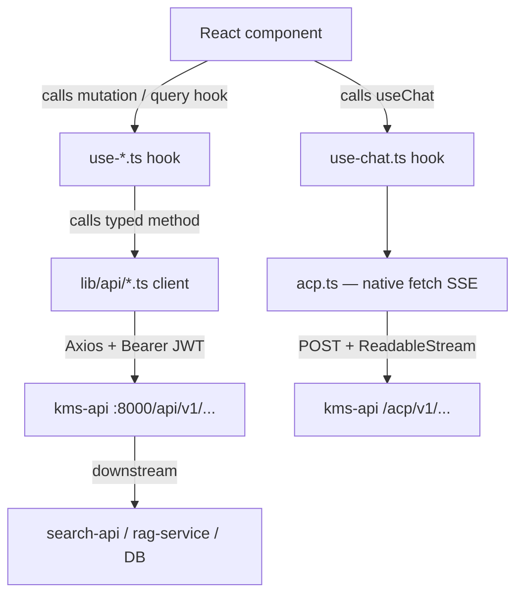

# FOR-frontend-api-patterns.md

## 1. Business Use Case

The KMS frontend (Next.js 15 App Router) talks to two backend services: `kms-api`
(port 8000, NestJS — auth, sources, files, collections, search proxy, ACP) and the ACP
SSE stream.  Every UI feature needs a typed API client and a TanStack Query hook.  This
guide defines the canonical pattern so that all five feature areas (chat, sources,
search, collections, files) follow the same structure.

---

## 2. Flow Diagram



---

## 3. Code Structure

| File | Responsibility |
|------|----------------|
| `frontend/lib/api/client.ts` | Singleton `KmsApiClient` (Axios): JWT injection, auto-refresh on 401, typed `ApiError` |
| `frontend/lib/api/acp.ts` | ACP-specific client using **native fetch** (not Axios) for SSE streaming |
| `frontend/lib/api/sources.ts` | `kmsSourcesApi` + `localSourcesApi` — source CRUD and OAuth initiation |
| `frontend/lib/api/search.ts` | `searchApi.search()` — proxied to `search-api` via `kms-api /search` |
| `frontend/lib/api/collections.ts` | `collectionsApi` — collections CRUD and file membership |
| `frontend/lib/api/files.ts` | `filesApi` + `tagsApi` — file CRUD, bulk actions, tag management |
| `frontend/lib/hooks/use-chat.ts` | ACP session lifecycle + SSE streaming state machine |
| `frontend/lib/hooks/use-sources.ts` | TanStack Query wrappers for sources + scan mutations |
| `frontend/lib/hooks/use-search.ts` | Debounce-safe search query hook with `staleTime` |
| `frontend/lib/hooks/use-collections.ts` | Collections CRUD + file membership mutations |
| `frontend/lib/hooks/use-files.ts` | Cursor-paginated file list + tag mutations |

---

## 4. Key Methods

### 4a — Adding a New API Client (`frontend/lib/api/*.ts`)

```typescript
// Always import the shared apiClient
import { apiClient } from './client';

// Export a typed object (not a class) with method-per-endpoint
export const myDomainApi = {
  list: (): Promise<MyType[]> => apiClient.get<MyType[]>('/my-domain'),
  create: (payload: CreatePayload): Promise<MyType> =>
    apiClient.post<MyType>('/my-domain', payload),
  update: (id: string, payload: Partial<CreatePayload>): Promise<MyType> =>
    apiClient.patch<MyType>(`/my-domain/${id}`, payload),
  delete: (id: string): Promise<void> => apiClient.delete<void>(`/my-domain/${id}`),
};
```

**Rules:**
- All methods return `Promise<T>` — never `Promise<AxiosResponse<T>>`.
- Use `apiClient.get/post/patch/delete` from `client.ts`. Never instantiate a new Axios instance.
- For SSE endpoints (ACP prompt), use native `fetch` with `Accept: text/event-stream` (see `acp.ts`).

### 4b — Adding a React Query Hook (`frontend/lib/hooks/use-*.ts`)

```typescript
'use client'; // Required — hooks use browser APIs (React state)

import { useQuery, useMutation, useQueryClient } from '@tanstack/react-query';
import { myDomainApi } from '../api/my-domain';

// READ — useQuery
export function useMyDomainList() {
  return useQuery({
    queryKey: ['my-domain'],
    queryFn: myDomainApi.list,
    staleTime: 30_000,   // Avoid re-fetching within 30 s for stable data
  });
}

// WRITE — useMutation
export function useCreateMyDomain() {
  const qc = useQueryClient();
  return useMutation({
    mutationFn: (payload: CreatePayload) => myDomainApi.create(payload),
    onSuccess: () => qc.invalidateQueries({ queryKey: ['my-domain'] }),
  });
}
```

**Rules:**
- All hook files start with `'use client'` directive.
- `queryKey` must be stable and unique. Nest resource IDs: `['my-domain', id]`.
- Use `invalidateQueries` on success — never manually update the cache with `setQueryData` unless absolutely necessary.
- For polling (e.g. scan progress), use `refetchInterval: enabled ? 5_000 : false` and pass an `enabled` flag.

### 4c — Handling Loading and Error States in Components

```tsx
// Always destructure all three: data, isLoading, error
const { data, isLoading, error } = useMyDomainList();

if (isLoading) return <SkeletonList />;
if (error) return <ErrorBanner message={(error as ApiError).message} />;
return <MyList items={data} />;
```

**Rules:**
- Show skeleton loaders for async data — never a blank screen.
- Display the `ApiError.message` string (never `.code` or raw `.details`) in the UI.
- Do not propagate stack traces. `ApiError` is always thrown with a human-readable `.message`.

---

## 5. Error Cases

| Error | HTTP Status | Description | Handling |
|-------|-------------|-------------|----------|
| `ApiError (401)` | 401 | Token expired or missing | `client.ts` auto-refreshes once; on second 401 calls `onAuthFailure()` → logout |
| `ApiError (403)` | 403 | Forbidden (wrong user scope) | Display "Access denied" message |
| `ApiError (404)` | 404 | Resource not found | Display "Not found" message, redirect if needed |
| `ApiError (5xx)` | 500/502/503 | Backend or downstream failure | Display "Something went wrong. Try again." |
| SSE stream error | — | `event.type === 'error'` from ACP | Show error inside the assistant message bubble; reset session ref |
| Network failure | 0 | `axios.isNetworkError` | Display "Network error. Check your connection." |

---

## 6. Configuration

| Variable | Description | Default |
|----------|-------------|---------|
| `NEXT_PUBLIC_API_URL` | Base URL for `kms-api` (no path suffix) | `http://localhost:8000` |
| `NEXT_PUBLIC_KMS_API_URL` | Full base URL with `/api/v1` for ACP client | `http://localhost:8000/api/v1` |

**Note:** `client.ts` uses `NEXT_PUBLIC_API_URL` and appends `/api/v1` internally.
`acp.ts` uses `NEXT_PUBLIC_KMS_API_URL` directly (it already includes `/api/v1`).
Both variables must be set in `.env.local` for local development.

---

## TypeScript Type Alignment

Frontend DTOs in `lib/api/*.ts` must stay in sync with backend response DTOs in
`kms-api/src/modules/*/dto/*.ts`.  Key rules:

1. **Field names**: Use `camelCase` on both sides (NestJS `class-transformer` handles
   snake_case serialisation automatically).
2. **Optional fields**: Use `field?: string | null` on frontend for fields that the
   backend may omit (e.g. `lastSyncedAt`, `externalId`).
3. **Enums**: Duplicate enum string literals in the frontend type file (not in a shared
   package) to avoid coupling the frontend build to the NestJS codebase.
4. **Pagination**: Use `nextCursor?: string` + `total: number` for cursor-paged
   responses (`files`, future collections). Use plain arrays for small bounded lists
   (`sources`, `tags`, `collections`).

When a backend DTO changes (added field, renamed field, changed type), update:
- `frontend/lib/api/*.ts` type definition
- Any component that destructures the type
- This guide's Code Structure table if the file responsibility changed
