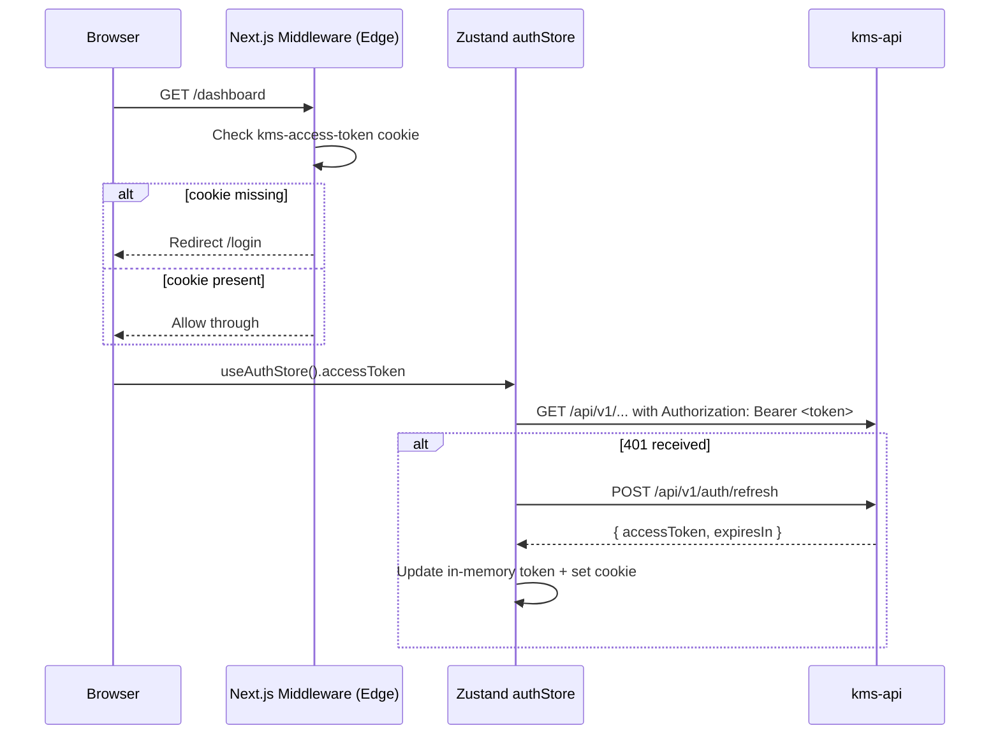

# FOR-frontend-auth.md — Frontend Auth Integration

> **Stub** — detailed content to be filled in. See `FOR-auth-strategy.md` for the token strategy and dual-token architecture.

---

## 1. Business Use Case

The Next.js frontend must authenticate users, protect routes, and silently refresh access tokens without interrupting the user experience. This guide covers the React/Next.js implementation layer: auth store, middleware route guards, login/logout flows, and protected-page patterns.

---

## 2. Flow Diagram

---

## 3. Code Structure

| File | Responsibility |
|------|---------------|
| `frontend/src/store/auth.store.ts` | Zustand store — holds `accessToken`, `user`, `isAuthenticated`; exposes `login()`, `logout()`, `refreshToken()` |
| `frontend/src/middleware.ts` | Next.js Edge middleware — checks `kms-access-token` cookie; redirects unauthenticated requests to `/login` |
| `frontend/src/lib/api/auth.api.ts` | API client functions: `loginApi()`, `registerApi()`, `refreshTokenApi()`, `logoutApi()` |
| `frontend/src/hooks/use-auth.ts` | React hook — wraps `useAuthStore`, provides `user`, `isLoading`, `login()`, `logout()` |
| `frontend/src/app/(auth)/login/page.tsx` | Login page — calls `useAuth().login()`, redirects to `/dashboard` on success |
| `frontend/src/app/(protected)/layout.tsx` | Protected layout — client-side auth check as secondary guard |

---

## 4. Key Methods

| Method | Description | Signature |
|--------|-------------|-----------|
| `authStore.login()` | Calls login API, stores tokens, sets session cookie | `(email: string, password: string) => Promise<void>` |
| `authStore.logout()` | Clears in-memory token, removes cookie, calls logout API | `() => Promise<void>` |
| `authStore.refreshToken()` | Uses `localStorage` refresh token to get new access token | `() => Promise<void>` |
| `useAuth()` | React hook wrapping auth store | `() => { user, isAuthenticated, isLoading, login, logout }` |

---

## 5. Error Cases

| Error Code | HTTP | Description | Handling |
|------------|------|-------------|----------|
| `KBAUT0002` | 401 | Invalid credentials | Show inline error on login form |
| `KBAUT0003` | 401 | Access token expired | Trigger silent refresh via `authStore.refreshToken()` |
| `KBAUT0004` | 401 | Refresh token expired | Clear state, redirect to `/login` |
| `KBAUT0005` | 403 | Insufficient permissions | Show 403 page or redirect to `/dashboard` |

---

## 6. Configuration

| Env Var / Constant | Description | Default |
|--------------------|-------------|---------|
| `NEXT_PUBLIC_API_URL` | Base URL for kms-api | `http://localhost:3000` |
| `kms-access-token` | Session cookie name | hardcoded |
| `kms_refresh_token` | localStorage key for refresh token | hardcoded |
| Access token TTL | JWT expiry for access token | 15 minutes |
| Refresh token TTL | JWT expiry for refresh token | 7 days |
