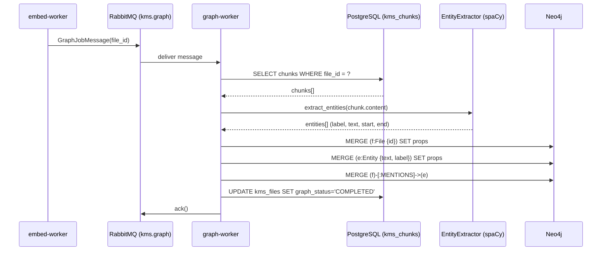

# FOR-graph — Neo4j Knowledge Graph: graph-worker, Entity Extraction, Leiden Communities

## 1. Business Use Case

The graph-worker builds a knowledge graph in Neo4j from processed file chunks. It extracts named entities (people, organisations, concepts) using spaCy NER, creates entity nodes and MENTIONS/RELATED_TO edges, and runs Leiden community detection to cluster related entities. This graph layer enriches semantic search results by surfacing related documents that vector similarity alone would miss.

---

## 2. Flow Diagram



---

## 3. Code Structure

| File | Responsibility |
|------|---------------|
| `app/handlers/graph_handler.py` | AMQP handler: orchestrates load → extract → write → status |
| `app/extractors/entity_extractor.py` | spaCy NER wrapper; `extract(text)` → list of entities |
| `app/db/neo4j_service.py` | `Neo4jService` — Cypher MERGE/CREATE operations |
| `app/models/messages.py` | `GraphJobMessage` Pydantic model |
| `app/utils/errors.py` | `ChunkLoadError`, `NERExtractionError`, `Neo4jWriteError`, `StatusUpdateError` |
| `app/config.py` | Neo4j URI, auth, spaCy model name, queue settings |

---

## 4. Key Methods

| Method | Description | Signature |
|--------|-------------|-----------|
| `EntityExtractor.extract` | Run spaCy NER on text | `extract(text: str) -> list[Entity]` |
| `Neo4jService.merge_file` | MERGE File node in Neo4j | `async merge_file(file_id, filename, source_id, user_id) -> None` |
| `Neo4jService.merge_entities` | MERGE Entity nodes + MENTIONS edges | `async merge_entities(file_id, entities: list[Entity]) -> None` |
| `Neo4jService.close` | Close the Neo4j driver | `async close() -> None` |
| `GraphHandler.handle` | Process one GraphJobMessage | `async handle(message: IncomingMessage) -> None` |

---

## 5. Error Cases

| Error Code | Description | Handling |
|------------|-------------|----------|
| `KBWRK0301` | `ChunkLoadError` — asyncpg query failed | `nack(requeue=True)` (transient) |
| `KBWRK0302` | `NERExtractionError` — spaCy model failure | `reject(requeue=False)` (deterministic) |
| `KBWRK0303` | `Neo4jWriteError` — Cypher write failed | `nack(requeue=True)` (transient) |
| `KBWRK0304` | `StatusUpdateError` — PG status update failed | `nack(requeue=True)` (transient) |

---

## 6. Configuration

| Env Var | Description | Default |
|---------|-------------|---------|
| `NEO4J_URI` | Bolt connection URI | `bolt://localhost:7687` |
| `NEO4J_USER` | Neo4j username | `neo4j` |
| `NEO4J_PASSWORD` | Neo4j password | `password` |
| `SPACY_MODEL` | spaCy NER model name | `en_core_web_sm` |
| `GRAPH_QUEUE` | RabbitMQ queue name | `kms.graph` |
| `DATABASE_URL` | PostgreSQL URL for chunk loading | required |

---

## Neo4j Graph Schema

```
(:File {id, filename, source_id, user_id, created_at})
  -[:MENTIONS]->
(:Entity {text, label, source_id, user_id, mention_count})

(:Entity)-[:RELATED_TO {weight}]->(:Entity)  ← added by Leiden community pass
```

**Entity labels** (spaCy defaults):
- `PERSON` — named people
- `ORG` — organisations and companies
- `GPE` — countries, cities
- `CONCEPT` — noun chunks (custom extension)
- `PRODUCT` — product names

---

## Leiden Community Detection

After entity extraction, a scheduled job (outside the worker) runs the Leiden algorithm over the Neo4j entity graph to produce `(:Community)` nodes. Each entity is assigned to a community, enabling collection-level organisation of related documents.

See `docs/architecture/sequence-diagrams/` for the graph traversal flow used by search-api.
