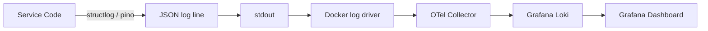

# FOR-logging — Structured Logging: nestjs-pino (NestJS) and structlog (Python)

## 1. Business Use Case

KMS enforces structured logging everywhere so that logs are machine-parseable, correlatable by trace ID, and consistent across all 8 services. Unstructured `console.log` or `print()` calls are a DoD violation. Structured logs feed into the OTel collector → Grafana Loki pipeline for centralised log querying.

---

## 2. Flow Diagram



---

## 3. Code Structure

| Layer | Logger | Import Pattern |
|-------|--------|---------------|
| NestJS service | nestjs-pino | `@InjectPinoLogger(ClassName.name) private readonly logger: PinoLogger` |
| NestJS controller | nestjs-pino | Same as service |
| Python FastAPI | structlog | `logger = structlog.get_logger(__name__)` |
| Python worker | structlog | `logger = structlog.get_logger(__name__)` |
| Python handler | structlog | `log = logger.bind(field=value)` per-request logger |

---

## 4. Key Methods

| Method | Description | Signature |
|--------|-------------|-----------|
| `logger.bind(**kwargs)` | Create child logger with extra fields | `log = logger.bind(user_id=uid, file_id=fid)` |
| `log.info(msg, **fields)` | Emit INFO-level structured log | `log.info("Processing file", step="extract")` |
| `log.warning(msg, **fields)` | Emit WARNING-level log | `log.warning("Retry attempt", attempt=3)` |
| `log.error(msg, **fields)` | Emit ERROR-level log | `log.error("Job failed", code="KBWRK0101", error=str(e))` |
| `log.debug(msg, **fields)` | Emit DEBUG-level log (dev only) | `log.debug("Cache hit", key=cache_key)` |

---

## 5. Error Cases

| Violation | Correct Alternative |
|-----------|-------------------|
| `print("debug:", value)` | `logger.debug("Debug value", value=value)` |
| `logging.getLogger(__name__)` | `structlog.get_logger(__name__)` |
| `new Logger()` in NestJS | `@InjectPinoLogger(ClassName.name)` |
| Logging PII (email, token) | Log only IDs and non-sensitive metadata |
| String interpolation in log | Pass fields as kwargs: `log.info("msg", user_id=uid)` |

---

## 6. Configuration

| Env Var | Description | Default |
|---------|-------------|---------|
| `LOG_LEVEL` | Minimum log level (debug/info/warning/error) | `info` |
| `LOG_FORMAT` | Output format: `json` or `console` | `json` (production) |
| `OTEL_EXPORTER_OTLP_ENDPOINT` | OTel collector for log export | `http://otel-collector:4317` |

---

## Mandatory Log Fields

Every log record must include:

| Field | Source | Example |
|-------|--------|---------|
| `service` | Configured at startup | `"scan-worker"` |
| `trace_id` | OTel auto-injected | `"4bf92f3577b34da6a3ce929d0e0e4736"` |
| `level` | Logger call level | `"info"` |
| `timestamp` | Auto-generated | `"2026-03-18T12:00:00Z"` |

Additional context fields (bound at handler level):

| Field | When | Example |
|-------|------|---------|
| `scan_job_id` | scan-worker handler | `"uuid-..."` |
| `source_id` | scan/embed/graph handlers | `"uuid-..."` |
| `file_id` | embed/graph handlers | `"uuid-..."` |
| `user_id` | all handlers | `"uuid-..."` |
| `run_id` | rag-service | `"uuid-..."` |

---

## Python structlog Setup (in telemetry.py)

```python
import structlog

def configure_structlog() -> None:
    structlog.configure(
        processors=[
            structlog.contextvars.merge_contextvars,
            structlog.stdlib.add_log_level,
            structlog.stdlib.add_logger_name,
            structlog.processors.TimeStamper(fmt="iso"),
            structlog.processors.JSONRenderer(),
        ],
        wrapper_class=structlog.BoundLogger,
        context_class=dict,
        logger_factory=structlog.PrintLoggerFactory(),
    )
```

## NestJS pino Setup (in app.module.ts)

```typescript
LoggerModule.forRoot({
  pinoHttp: {
    level: process.env.LOG_LEVEL ?? 'info',
    transport: process.env.NODE_ENV !== 'production'
      ? { target: 'pino-pretty' }
      : undefined,
  },
}),
```
