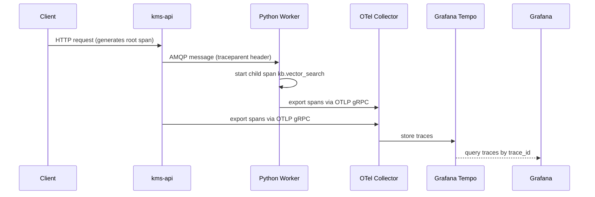

# FOR-observability — OTel Tracing, Custom Spans, Health Checks, Prometheus

## 1. Business Use Case

KMS is instrumented end-to-end with OpenTelemetry so every request from the frontend through the NestJS API to the Python workers can be traced in Grafana. Custom spans mark significant I/O boundaries (DB queries, Qdrant upserts, LLM calls) so latency outliers can be diagnosed without reading logs.

---

## 2. Flow Diagram



---

## 3. Code Structure

| File | Responsibility |
|------|---------------|
| `app/telemetry.py` (Python) | `configure_telemetry(service_name)` — SDK init, OTLP exporter |
| `src/instrumentation.ts` (NestJS) | `import './instrumentation'` — auto-instrumentation at line 1 of main.ts |
| `infra/otel-collector/` | OTel Collector config — receives OTLP, exports to Tempo |
| `infra/grafana/` | Grafana dashboards for traces + metrics |

---

## 4. Key Methods

| Method | Description | Signature |
|--------|-------------|-----------|
| `configure_telemetry` | Set up OTel SDK (Python) | `configure_telemetry(service_name: str) -> None` |
| `tracer.start_as_current_span` | Create custom child span | `with tracer.start_as_current_span("kb.my_span") as span:` |
| `span.set_attribute` | Add key-value to span | `span.set_attribute("query", query[:100])` |
| `span.record_exception` | Attach exception to span | `span.record_exception(exc)` |

---

## 5. Error Cases

| Violation | Impact | Fix |
|-----------|--------|-----|
| OTel configured AFTER route imports | Auto-instrumentation misses DB/HTTP calls | Move `configure_telemetry()` to first line of main.py |
| No span for LLM call | LLM latency invisible in Tempo | Add `tracer.start_as_current_span("kb.llm_generate")` |
| PII in span attributes | Data privacy risk | Log only IDs; never log content, emails, tokens |

---

## 6. Configuration

| Env Var | Description | Default |
|---------|-------------|---------|
| `OTEL_EXPORTER_OTLP_ENDPOINT` | OTel collector gRPC endpoint | `http://otel-collector:4317` |
| `OTEL_SERVICE_NAME` | Service name in traces | per-service (set in telemetry.py) |
| `OTEL_TRACES_EXPORTER` | Exporter type | `otlp` |
| `OTEL_RESOURCE_ATTRIBUTES` | Extra resource tags | `deployment.environment=production` |

---

## Python OTel Setup (canonical telemetry.py)

```python
from opentelemetry import trace
from opentelemetry.exporter.otlp.proto.grpc.trace_exporter import OTLPSpanExporter
from opentelemetry.sdk.resources import Resource, SERVICE_NAME
from opentelemetry.sdk.trace import TracerProvider
from opentelemetry.sdk.trace.export import BatchSpanProcessor
from opentelemetry.instrumentation.fastapi import FastAPIInstrumentor
from opentelemetry.instrumentation.asyncpg import AsyncPGInstrumentor
from opentelemetry.instrumentation.aio_pika import AioPikaInstrumentor

def configure_telemetry(service_name: str) -> None:
    resource = Resource.create({SERVICE_NAME: service_name})
    provider = TracerProvider(resource=resource)
    provider.add_span_processor(BatchSpanProcessor(OTLPSpanExporter()))
    trace.set_tracer_provider(provider)

    FastAPIInstrumentor().instrument()
    AsyncPGInstrumentor().instrument()
    AioPikaInstrumentor().instrument()

tracer = trace.get_tracer(__name__)
```

## Custom Span Naming Convention

All KMS custom spans use the `kb.` prefix:

| Span Name | Used In | Attributes |
|-----------|---------|------------|
| `kb.tiered_retrieve` | rag-service retrieve node | `query`, `user_id`, `tier_used`, `result_count` |
| `kb.rag_grade` | rag-service grade_documents node | `relevant_count` |
| `kb.rag_generate` | rag-service generate node | `llm_guard_decision`, `answer_len` |
| `kb.vector_search` | rag-service (legacy) | `query`, `chunk_count` |
| `kb.embed_file` | embed-worker | `filename`, `chunk_count` |
| `kb.graph_extract` | graph-worker | `file_id`, `entity_count` |

## Health Check Endpoints (all services)

Every service exposes two health endpoints:

```
GET /health/live    → 200 {"status": "live"}
GET /health/ready   → 200 {"status": "ready"} or 503 {"status": "not_ready"}
```

The readiness probe checks that:
- FastAPI services: DB pool + Redis client are initialised
- Worker services: the background worker asyncio.Task is alive (not `.done()`)
