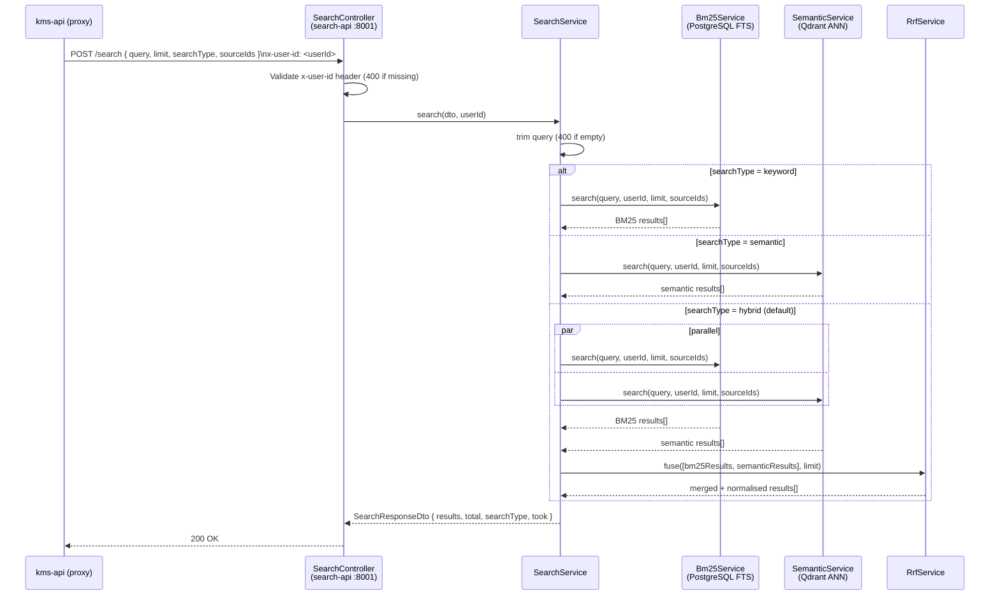

# FOR-search-api.md — Hybrid Search Service (search-api)

## 1. Business Use Case

`search-api` is a dedicated read-only NestJS 11 (Fastify) service on port 8001 that executes
hybrid document search for the KMS platform. It decouples the high-throughput search path from
`kms-api` so that search latency and scaling characteristics can be tuned independently. The
service implements three retrieval strategies: BM25 keyword search via PostgreSQL full-text search,
semantic ANN search via Qdrant, and a Reciprocal Rank Fusion (RRF, k=60) merge that combines both
lists into a single deduplicated ranking. Callers choose the mode per request; `hybrid` is the
default. Authentication is delegated to `kms-api`: the request must carry an `x-user-id` header
that `kms-api` injects after verifying the JWT — `search-api` never holds JWT secrets.

---

## 2. Flow Diagram

---

## 3. Code Structure

| File | Responsibility |
|------|----------------|
| `search-api/src/search/search.controller.ts` | HTTP entry point — validates `x-user-id` header, delegates to SearchService, exposes dev-only `/search/seed` |
| `search-api/src/search/search.service.ts` | Orchestrates the three-stage pipeline; routes to keyword/semantic/hybrid branches |
| `search-api/src/search/bm25.service.ts` | PostgreSQL full-text search (`tsvector`/`tsquery`) scoped to `userId` and optional `sourceIds` |
| `search-api/src/search/semantic.service.ts` | Qdrant ANN search with BGE-M3 1024-dim vectors, user-scoped payloads |
| `search-api/src/search/rrf.service.ts` | Reciprocal Rank Fusion merge — deduplicates by `{fileId}:{chunkIndex}`, normalises scores to [0,1] |
| `search-api/src/search/keyword.service.ts` | BM25 ranking helper; used by `Bm25Service` for scoring |
| `search-api/src/search/dto/search-request.dto.ts` | Validated input DTO: `query`, `limit` (≤50), `searchType`, `sourceIds[]` |
| `search-api/src/search/dto/search-response.dto.ts` | Output DTO: `results[]`, `total`, `searchType`, `took` (ms) |
| `search-api/src/config/config.module.ts` | ConfigModule with Joi schema validation for `DATABASE_URL`, `QDRANT_URL`, etc. |
| `search-api/src/main.ts` | Bootstrap — Fastify adapter, pino logger, Swagger (non-prod), ValidationPipe |

---

## 4. Key Methods

| Method | Class | Description | Signature |
|--------|-------|-------------|-----------|
| `search` | `SearchService` | Orchestrates full pipeline; routes on `searchType` | `search(dto: SearchRequestDto, userId: string): Promise<SearchResponseDto>` |
| `search` | `Bm25Service` | Executes PostgreSQL FTS query, returns ranked results | `search(query: string, userId: string, limit: number, sourceIds?: string[]): Promise<SearchResult[]>` |
| `search` | `SemanticService` | Queries Qdrant ANN index, returns scored chunks | `search(query: string, userId: string, limit: number, sourceIds?: string[]): Promise<SearchResult[]>` |
| `fuse` | `RrfService` | Merges N ranked lists via RRF (k=60), normalises [0,1] | `fuse(lists: SearchResult[][], limit: number): SearchResult[]` |

---

## 5. Error Cases

| Condition | HTTP | Description | Handling |
|-----------|------|-------------|----------|
| `x-user-id` header missing or blank | 400 | Header is required; `kms-api` always injects it | `SearchController` throws `HttpException(400)` before calling service |
| `query` is empty or whitespace-only | 400 | Guard in `SearchService.search()` trims and rejects | `HttpException('Search query must not be empty', 400)` |
| Underlying search stage throws unexpectedly | 500 | Full error is logged; clean 500 surfaced to caller | `HttpException('Search pipeline encountered an error', 500)` |
| `POST /search/seed` called in production | 403 | Dev-only seed endpoint must not be reachable in prod | `HttpException('Seed endpoint is disabled in production', 403)` |

---

## 6. Configuration

| Env Var | Description | Default |
|---------|-------------|---------|
| `DATABASE_URL` | PostgreSQL connection string for BM25 (Prisma) | required |
| `QDRANT_URL` | Qdrant HTTP base URL for semantic search | `http://qdrant:6333` |
| `QDRANT_COLLECTION` | Qdrant collection name holding BGE-M3 embeddings | `kms_chunks` |
| `PORT` | Service listen port | `8001` |
| `NODE_ENV` | `development` / `production` (gates seed endpoint) | `development` |
| `LOG_LEVEL` | Pino log level | `info` |
| `MOCK_BM25` | Set `true` to return 5 canonical mock results (no DB needed) | `false` |
| `MOCK_SEMANTIC` | Set `true` to return 5 canonical mock results (no Qdrant needed) | `false` |
