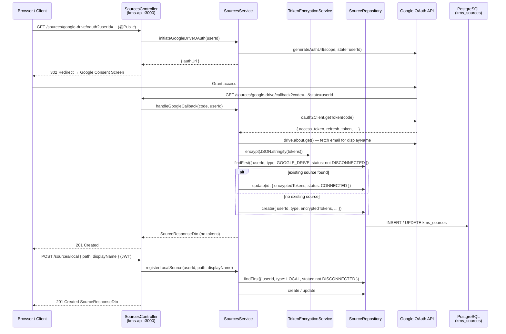

# FOR-sources.md — Sources Module

## 1. Business Use Case

The Sources module manages connections between users and their external knowledge repositories: local filesystem folders, Obsidian vaults, and Google Drive. It solves the onboarding problem: before any file can be ingested, the user must register a source so the scan-worker knows where to look and what credentials to use. The module handles the full OAuth 2.0 flow for Google Drive (initiate → callback → token exchange → encryption → persistence) and provides simple path-based registration for local and Obsidian sources. OAuth tokens are AES-256 encrypted before storage and are never returned in any response DTO or log line — this is a hard security invariant enforced in `SourcesService.toResponseDto`.

---

## 2. Flow Diagram

---

## 3. Code Structure

| File | Responsibility |
|------|---------------|
| `kms-api/src/modules/sources/sources.controller.ts` | HTTP layer — list, get, disconnect, OAuth initiate/callback, local and Obsidian registration |
| `kms-api/src/modules/sources/sources.service.ts` | Business logic — full CRUD plus OAuth flow, token encryption, reconnect-vs-create decision |
| `kms-api/src/modules/sources/token-encryption.service.ts` | AES-256-GCM encryption/decryption of OAuth credentials |
| `kms-api/src/database/repositories/source.repository.ts` | Prisma access for `kms_sources` — findByUserId, findByIdAndUserId, findFirst, create, update, disconnect |
| `kms-api/src/modules/sources/dto/sources.dto.ts` | `SourceResponseDto`, `RegisterLocalSourceRequestDto`, `RegisterObsidianVaultRequestDto`, Zod schemas, `OAuthInitiateResponseDto` |

---

## 4. Key Methods

| Method | Class | Description |
|--------|-------|-------------|
| `listSources(userId)` | `SourcesService` | Returns all sources for user; tokens stripped via `toResponseDto` |
| `getSource(id, userId)` | `SourcesService` | Ownership-scoped get; throws `DAT0000` if not found |
| `initiateGoogleDriveOAuth(userId)` | `SourcesService` | Builds Google consent URL; embeds userId in `state` param |
| `handleGoogleCallback(code, userId)` | `SourcesService` | Exchanges code for tokens, fetches Drive email, encrypts and persists tokens; supports reconnect flow |
| `disconnectSource(id, userId)` | `SourcesService` | Sets status to DISCONNECTED; idempotent |
| `registerLocalSource(userId, path, displayName)` | `SourcesService` | Creates LOCAL source or reconnects existing same-path source |
| `registerObsidianVault(userId, vaultPath, displayName)` | `SourcesService` | Creates OBSIDIAN source; stores both `metadata.path` and `metadata.vaultPath` |
| `getDecryptedTokens(sourceId, userId)` | `SourcesService` | Internal-only: decrypts OAuth tokens for use by scan-worker. Never exposed via controller. |
| `refreshAccessToken(sourceId, userId)` | `SourcesService` | Calls googleapis token refresh and persists updated encrypted credentials |
| `encrypt(plaintext)` | `TokenEncryptionService` | AES-256-GCM encrypt; returns base64 ciphertext |
| `decrypt(ciphertext)` | `TokenEncryptionService` | AES-256-GCM decrypt; returns plaintext JSON string |

---

## 5. Error Cases

| Error Code | HTTP Status | Description | Handling |
|------------|-------------|-------------|---------|
| `DAT0000` (NOT_FOUND) | 404 | Source not found or belongs to different user | Thrown by `getSource`, `disconnectSource`, `getDecryptedTokens` |
| `AUT0016` (OAUTH_FAILED) via `BadRequestException` | 400 | Google token exchange failed (invalid/expired code) | Caught in `handleGoogleCallback`; logs error and re-throws as `BadRequestException` |
| `BadRequestException` | 400 | Missing `code` or `userId` in OAuth callback | Guard in `handleGoogleCallback` before calling googleapis |
| `FeatureFlagGuard` rejection | 403 | `googleDrive` feature flag disabled | Enforced on `GET /sources/google-drive/oauth` and `callback` routes |
| `DAT0000` | 404 | `encryptedTokens` field is null (source created without tokens) | Thrown by `getDecryptedTokens` |

> **Security Note**: `SourcesService.handleGoogleCallback` uses raw `BadRequestException` rather than a typed `AppError`. This should be refactored to use `ErrorFactory` with `AUT0016` for consistency with the project error handling pattern (Gate 8 gap).

---

## 6. Configuration

| Env Var / Constant | Description | Default |
|--------------------|-------------|---------|
| `GOOGLE_CLIENT_ID` | Google OAuth 2.0 client ID | required for Google Drive |
| `GOOGLE_CLIENT_SECRET` | Google OAuth 2.0 client secret | required for Google Drive |
| `GOOGLE_REDIRECT_URI` | OAuth callback URL registered with Google Cloud Console | `http://localhost:8000/api/v1/sources/google-drive/callback` |
| `TOKEN_ENCRYPTION_KEY` | 32-byte AES-256 key for encrypting OAuth tokens | required when Google Drive is enabled |
| `googleDrive` feature flag | `.kms/config.json` flag — gates Google Drive OAuth endpoints | `false` (opt-in) |

> **Feature flag guard**: both Google Drive OAuth endpoints are decorated with `@RequireFeature('googleDrive')` + `@UseGuards(FeatureFlagGuard)`. When the flag is `false`, the endpoints return 403 before any service logic runs.
