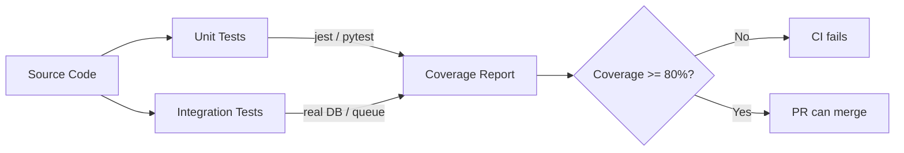

# FOR-testing — Jest Unit Tests (NestJS) and pytest (Python) Patterns

## 1. Business Use Case

KMS requires 80% minimum test coverage (90% for critical paths: auth, search, job lifecycle). Tests are the only way to verify that changes to one service don't silently break another. This guide documents the test conventions for both NestJS (Jest) and Python (pytest) services.

---

## 2. Flow Diagram



---

## 3. Code Structure

### Python Services

| Path | Purpose |
|------|---------|
| `services/{service}/tests/__init__.py` | Make tests a package |
| `services/{service}/tests/conftest.py` | Shared fixtures (DB pool, mock channel, etc.) |
| `services/{service}/tests/test_{module}.py` | Unit tests per module |
| `services/{service}/pyproject.toml` | pytest config: `asyncio_mode = "auto"` |

### NestJS Services

| Path | Purpose |
|------|---------|
| `kms-api/src/**/*.spec.ts` | Unit tests co-located with source |
| `kms-api/test/*.e2e-spec.ts` | E2E integration tests |
| `search-api/src/**/*.spec.ts` | search-api unit tests |

---

## 4. Key Methods

### Python pytest Patterns

| Pattern | Usage |
|---------|-------|
| `@pytest.fixture` | Shared setup (DB pool mock, AMQP mock) |
| `pytest.mark.asyncio` | Mark async tests (or use `asyncio_mode = "auto"`) |
| `unittest.mock.AsyncMock` | Mock async functions/methods |
| `unittest.mock.patch` | Patch module-level globals |
| `pytest.raises(SomeError)` | Assert that an exception is raised |

### NestJS Jest Patterns

| Pattern | Usage |
|---------|-------|
| `Test.createTestingModule()` | Create isolated NestJS module for unit test |
| `jest.fn()` | Mock synchronous functions |
| `jest.spyOn(service, 'method')` | Spy on service method calls |
| `supertest` | HTTP E2E testing against real FastAPI/Fastify server |

---

## 5. Error Cases

| Mistake | Impact | Fix |
|---------|--------|-----|
| Mocking your own DB in integration tests | Tests pass even when real SQL is broken | Use real asyncpg pool with test DB |
| No test for error branches | Error paths untested → silent regressions | Add `pytest.raises` for each error type |
| Async test without `asyncio_mode=auto` | Tests hang or are silently skipped | Set `asyncio_mode = "auto"` in pyproject.toml |
| Test depends on test execution order | Flaky tests in CI | Use fixtures + teardown; never share state |

---

## 6. Configuration

| Setting | File | Value |
|---------|------|-------|
| `asyncio_mode` | `pyproject.toml` | `"auto"` |
| `testpaths` | `pyproject.toml` | `["tests"]` |
| Coverage threshold | CI config / `pyproject.toml` | `--cov-fail-under=80` |
| Jest timeout | `jest.config.ts` | `30000` ms |

---

## Python Test File Template

```python
"""Tests for {module}."""
import pytest
from unittest.mock import AsyncMock, MagicMock, patch

from app.handlers.my_handler import MyHandler
from app.utils.errors import KMSWorkerError


@pytest.fixture
def mock_channel():
    """Mock aio-pika channel for handler tests."""
    channel = AsyncMock()
    channel.default_exchange.publish = AsyncMock()
    return channel


@pytest.fixture
def handler(mock_channel):
    return MyHandler(channel=mock_channel)


class TestMyHandler:
    async def test_handle_success(self, handler):
        message = MagicMock()
        message.body = b'{"key": "value"}'
        message.ack = AsyncMock()
        await handler.handle(message)
        message.ack.assert_called_once()

    async def test_handle_malformed_message_dead_letters(self, handler):
        message = MagicMock()
        message.body = b'not-json'
        message.reject = AsyncMock()
        await handler.handle(message)
        message.reject.assert_called_once_with(requeue=False)

    async def test_handle_retryable_error_nacks(self, handler):
        message = MagicMock()
        message.body = b'{"key": "value"}'
        message.nack = AsyncMock()
        with patch.object(handler, '_do_work', side_effect=KMSWorkerError("fail", "KBWRK0101", retryable=True)):
            await handler.handle(message)
        message.nack.assert_called_once_with(requeue=True)
```

## Mock Strategy (mandatory)

| Always mock | Never mock |
|-------------|------------|
| External HTTP APIs (Ollama, OpenRouter, Google OAuth) | Your own DB in integration tests |
| `Date.now()` / `datetime.now()` | RabbitMQ in consumer integration tests |
| File system in unit tests | Business logic under test |
| BGE-M3 model in unit tests (use `MOCK_EMBEDDING=true`) | Error handling paths |
| Qdrant in unit tests (use `MOCK_QDRANT=true`) | Config loading |
