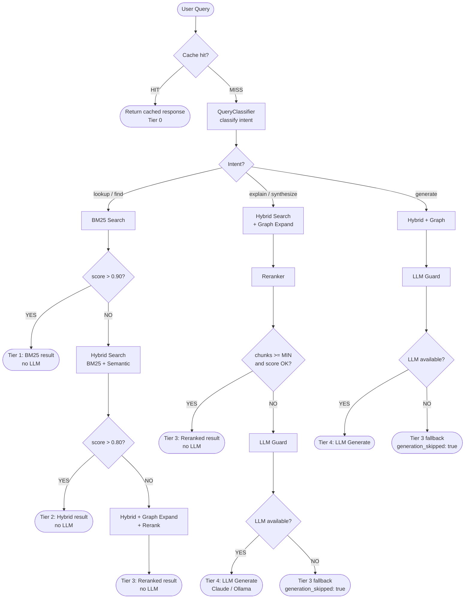

# FOR-tiered-retrieval.md — KMS Tiered Retrieval Feature Guide

> **Scope**: RAG pipeline — `services/rag-service/`
> **Related PRD**: `docs/prd/PRD-M10-rag-chat.md`, addendum at `docs/prd/PRD-M10-rag-chat-tiered-addendum.md`
> **Error codes**: `KBRAG0008` – `KBRAG0012`

---

## 1. Business Use Case

KMS should NOT call an LLM for every query. Most knowledge base queries — factual lookup, concept search, document retrieval — are answered perfectly well by returning the highest-scored retrieval result with citations. Routing every query through an LLM wastes latency and compute budget, and makes KMS completely non-functional when no LLM is configured.

The Tiered Retrieval system solves this by:

1. **Classifying query intent** — is this a lookup, a find, an explanation request, a synthesis task, or a generation request?
2. **Routing to the cheapest tier** that can satisfy the query — most queries resolve at Tier 1 or Tier 2 without touching an LLM.
3. **Guarding LLM escalation** — only synthesize/generate intents with low retrieval confidence ever reach Tier 4.

**Impact targets:**
- 65% of queries answered at Tier 1–2 (< 150ms p95, no LLM)
- p95 latency for retrieval queries: ~150ms (down from ~5s)
- LLM is optional — `llm.enabled: false` (default) still gives a fully functional KMS

---

## 2. Code Structure

```
services/rag-service/app/
├── services/
│   ├── query_classifier.py      # Rule-based intent classifier (lookup/find/explain/synthesize/generate)
│   ├── tier_router.py           # Routes query to correct tier based on intent + confidence scores
│   ├── llm_guard.py             # Checks LLM availability before escalating to Tier 4
│   ├── response_builder.py      # Builds tier-appropriate response shape
│   └── reranker.py              # Cross-encoder reranking for Tier 3 (sentence-transformers)
├── graph/
│   ├── nodes.py                 # UPDATED — new QueryClassifyNode + TierRouterNode
│   │                            #   replace old retrieve → grade → rewrite chain
│   └── state.py                 # UPDATED — GraphState gains: intent, tier, confidence,
│                                #   generation_skipped fields
└── config.py                    # UPDATED — new RAG_TIER* env vars (see §6)
```

### Dependency additions (`requirements.txt`)

```
sentence-transformers>=2.6.0     # cross-encoder reranking (Tier 3)
```

The reranker model (`cross-encoder/ms-marco-MiniLM-L-6-v2`) is CPU-friendly (~85 MB). It is only loaded if `RAG_RERANKER_ENABLED=true`.

---

## 3. Key Methods

All classes use Google-style docstrings. Public methods are documented below.

### `QueryClassifier` (`query_classifier.py`)

```python
class QueryClassifier:
    def classify(self, query: str) -> QueryIntent:
        """Classify query intent using rule-based signal matching.

        No model required. Runs in ~5ms.

        Args:
            query: Raw user query string.

        Returns:
            QueryIntent: One of "lookup" | "find" | "explain" |
                         "synthesize" | "generate".
        """

    def has_signal(self, query: str, signals: list[str]) -> bool:
        """Check if any signal phrase appears in the lowercased query.

        Args:
            query: Raw user query string.
            signals: List of lowercase signal phrases to match against.

        Returns:
            True if any signal phrase is found as a substring.
        """
```

**Intent signal table:**

| Intent | Example signals | Example queries |
|--------|----------------|-----------------|
| `lookup` | `"what is"`, `"define"`, `"meaning of"`, `"who is"` | "What is BGE-M3?" |
| `find` | `"find"`, `"search"`, `"show me"`, `"list"`, `"where is"` | "Find all files about onboarding" |
| `explain` | `"explain"`, `"how does"`, `"why does"`, `"describe"` | "Explain the scan pipeline" |
| `synthesize` | `"compare"`, `"summarize"`, `"contrast"`, `"overview"` | "Compare the two auth approaches" |
| `generate` | `"write"`, `"draft"`, `"create"`, `"generate"` | "Write a summary of Q1 notes" |

Queries with no matched signal default to `"find"`.

---

### `TierRouter` (`tier_router.py`)

```python
class TierRouter:
    def route(
        self,
        intent: QueryIntent,
        search_results: list[SearchResult],
    ) -> Tier:
        """Determine the cheapest tier that can answer the query.

        Args:
            intent: Classified query intent.
            search_results: Results from initial BM25 or hybrid search.

        Returns:
            Tier: Integer 0–4 representing the selected tier.
        """

    def confidence(self, results: list[SearchResult]) -> float:
        """Compute RRF-normalized confidence score for the top result.

        Args:
            results: Ordered list of search results (highest score first).

        Returns:
            Float in [0.0, 1.0]. Returns 0.0 if results is empty.
        """
```

**Routing decision table:**

| Intent | Top score > `TIER1_THRESHOLD` | Top score > `TIER2_THRESHOLD` | Route |
|--------|------------------------------|------------------------------|-------|
| `lookup` or `find` | Yes | — | Tier 1 |
| `lookup` or `find` | No | Yes | Tier 2 |
| `lookup` or `find` | No | No | Tier 3 |
| `explain` | — | Yes + chunks >= `TIER3_MIN_CHUNKS` | Tier 3 (no LLM) |
| `explain` | — | No | Tier 4 via LLM Guard |
| `synthesize` or `generate` | — | — | Tier 4 via LLM Guard |

---

### `LlmGuard` (`llm_guard.py`)

```python
class LlmGuard:
    def available_provider(self) -> LlmProvider | None:
        """Return the first available LLM provider.

        Checks in order: external agent (Claude API) → Ollama → None.
        Does not make network calls — reads from config flags only.

        Returns:
            LlmProvider instance, or None if no LLM is configured/available.
        """

    def should_skip(
        self,
        intent: QueryIntent,
        chunks: list[SearchResult],
    ) -> bool:
        """Decide whether to skip LLM generation even if a provider is available.

        Skips if intent is lookup/find/explain AND sufficient chunks
        are available (>= RAG_TIER3_MIN_CHUNKS with score > TIER2_THRESHOLD).

        Args:
            intent: Classified query intent.
            chunks: Retrieved and (optionally) reranked chunks.

        Returns:
            True if LLM generation should be bypassed.
        """
```

---

### `ResponseBuilder` (`response_builder.py`)

```python
class ResponseBuilder:
    def build_retrieval_response(
        self,
        chunks: list[SearchResult],
        citations: list[Citation],
        tier: Tier,
        intent: QueryIntent,
    ) -> ChatResponse:
        """Build a response answered entirely from retrieval (no LLM).

        Sets generation_skipped=True, answer_type="retrieval", content=None.

        Args:
            chunks: Retrieved document chunks.
            citations: Source file citations extracted from chunks.
            tier: Tier that answered the query (1–3).
            intent: Classified query intent (for response metadata).

        Returns:
            ChatResponse with tier, generation_skipped, chunks, citations.
        """

    def build_generated_response(
        self,
        content: str,
        citations: list[Citation],
        tier: Tier,
        tokens: int,
    ) -> ChatResponse:
        """Build a response that includes LLM-generated content.

        Sets generation_skipped=False, answer_type="generated".

        Args:
            content: Generated text from LLM.
            citations: Source citations used as context.
            tier: Always Tier 4.
            tokens: Total tokens consumed (prompt + completion).

        Returns:
            ChatResponse with content, citations, tier, token count.
        """
```

---

### `Reranker` (`reranker.py`)

```python
class Reranker:
    def rerank(
        self,
        query: str,
        chunks: list[SearchResult],
        top_k: int,
    ) -> list[SearchResult]:
        """Score and rerank chunks using a cross-encoder model.

        Uses `cross-encoder/ms-marco-MiniLM-L-6-v2` via sentence-transformers.
        Falls back to score-based ranking if model is not loaded (KBRAG0010).

        Args:
            query: Original user query string.
            chunks: Candidate chunks from hybrid search.
            top_k: Number of top chunks to return after reranking.

        Returns:
            Reranked list of up to top_k SearchResult objects.
        """
```

---

## 4. Error Cases

| Code | HTTP | Condition | Behavior |
|------|------|-----------|----------|
| `KBRAG0008` | 503 | All search tiers failed — no results returned from any search path | Raise immediately, do not attempt LLM |
| `KBRAG0009` | 200 | Query answered at retrieval tier, LLM skipped | Normal 200 response; `generation_skipped: true` in body |
| `KBRAG0010` | 200 | Reranker model not loaded (Tier 3) | Falls back to score-based ranking; logs warning; does not raise |
| `KBRAG0011` | 400 | Query too short to classify (< 3 tokens after tokenization) | Defaults to Tier 2 hybrid search; `intent: "find"` in response |
| `KBRAG0012` | 200 | Context built but LLM unavailable at Tier 4 | Returns Tier 3 result with `generation_skipped: true`, note in response |

All errors use `KMSWorkerError` subclasses with `.code` and `.retryable` as required by `docs/development/FOR-error-handling.md`.

**Example error class:**

```python
class SearchTiersExhaustedError(KMSWorkerError):
    """All search tiers returned zero results for the query."""

    code = "KBRAG0008"
    retryable = False
    http_status = 503
```

---

## 5. Configuration

All variables are loaded via `rag-service/app/config.py` (`pydantic-settings`).

```bash
# Tier routing thresholds
RAG_TIER1_BM25_THRESHOLD=0.90        # BM25 score to route to Tier 1 directly
RAG_TIER2_HYBRID_THRESHOLD=0.80      # Hybrid RRF score to route to Tier 2 directly
RAG_TIER3_MIN_CHUNKS=2               # Min relevant chunks before skipping LLM for explain queries

# Reranker
RAG_RERANKER_MODEL=cross-encoder/ms-marco-MiniLM-L-6-v2   # Cross-encoder model (CPU-friendly)
RAG_RERANKER_ENABLED=false           # Feature flag — set true to enable cross-encoder reranking

# Search sizing
RAG_DEFAULT_TOP_K=10                 # Chunks to fetch before reranking
RAG_RERANKED_TOP_K=3                 # Chunks to keep after reranking

# Cache
RAG_CACHE_TTL_SECONDS=3600           # Result cache TTL (Redis)
```

Secrets and LLM provider config remain in the existing `rag-service/app/config.py` fields.

---

## 6. Flow Diagram



---

## 7. Threshold Tuning Guide

Threshold defaults (`0.90` / `0.80`) are calibrated for a medium-sized mixed-content knowledge base. Adjust them based on your KB characteristics.

### KB Size

| KB size | Recommended BM25 threshold | Recommended hybrid threshold | Rationale |
|---------|---------------------------|------------------------------|-----------|
| Small (< 1K docs) | `0.75` | `0.65` | Low noise — fewer false positives, can be more permissive |
| Medium (1K–10K docs) | `0.90` | `0.80` | Defaults — balanced precision/recall |
| Large (> 10K docs) | `0.92` | `0.85` | More candidate noise — higher bar needed to be confident in top result |

### Content Type

| Content type | Adjustment | Rationale |
|---|---|---|
| Technical docs (code, API specs, changelogs) | Increase BM25 weight in hybrid scorer | Exact keyword matches (function names, error codes) are highly discriminative |
| Prose docs (meeting notes, discussions, narratives) | Increase semantic weight in hybrid scorer | Paraphrase and meaning matter more than exact terms |
| Mixed (most real KBs) | Keep defaults | Balanced hybrid scoring handles both |

Hybrid weight is set in `search-api` scoring config — see `search-api/` for the `bm25_weight` / `semantic_weight` parameters.

### Measuring Tier Distribution

Run query log analysis after 1–2 weeks of production traffic:

```python
# Pseudo-query against your observability store (Prometheus / structured logs)
SELECT tier, COUNT(*) as n, COUNT(*) * 100.0 / SUM(COUNT(*)) OVER () AS pct
FROM rag_query_log
GROUP BY tier
ORDER BY tier;
```

**Target distribution for a healthy KB:**

| Tier | Target % | If too high | If too low |
|------|----------|-------------|------------|
| 0 (Cache) | ~15% | Fine — cache is working | Increase `RAG_CACHE_TTL_SECONDS` |
| 1 (BM25) | ~20% | Lower `TIER1_BM25_THRESHOLD` | Raise `TIER1_BM25_THRESHOLD` |
| 2 (Hybrid) | ~30% | Lower `TIER2_HYBRID_THRESHOLD` | Raise `TIER2_HYBRID_THRESHOLD` |
| 3 (Hybrid+Graph) | ~25% | Normal — no LLM cost | Check reranker KBRAG0010 logs |
| 4 (Generate) | ~10% | Raise both thresholds | LLM may be misconfigured or disabled |

**Warning signs:**
- Tier 4 > 30%: thresholds are too low or query intent classifier is over-indexing on `synthesize`/`generate` — check signal phrase table.
- Tier 1+2 < 30%: embedding quality may be low, or BM25 index is stale — re-index and re-tune.
- Tier 3 fallbacks with `generation_skipped: true` spiking: LLM provider is down or misconfigured.

### When to Re-tune

Re-run threshold calibration whenever:
- KB size doubles
- A new major content type is ingested (e.g., adding code files to a prose-only KB)
- Embedding model is changed (BGE-M3 is the default; changing models changes score distributions)
- User feedback indicates answers are too shallow (raise thresholds → more LLM) or too slow (lower thresholds → less LLM)
