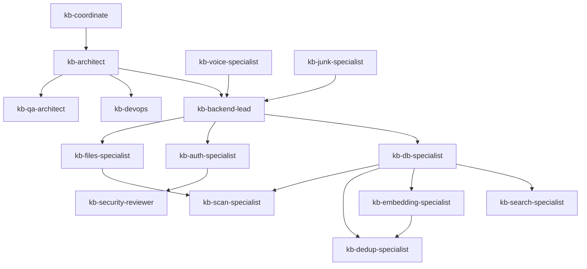

# KMS Knowledge Graph — Skill Graph

**Version**: 1.0
**Last Updated**: 2026-03-16

---

## What a Skill Graph Is

The **Skill Graph** is a subgraph of the full KMS Knowledge Graph. It contains only Skill nodes, AgentGroup nodes, MCPTool nodes, Community nodes, Component nodes, and the edges that connect them: `SKILL_COVERS`, `PART_OF_GROUP`, `USES_TOOL`, `PREREQUISITE`, and `HANDLES`.

The Skill Graph answers three questions:

1. **Routing**: Given a file I am about to edit, which skills should I activate?
2. **Gap Detection**: Which areas of the codebase have no skill coverage and therefore no expert agent available?
3. **Dependency Ordering**: When starting a multi-agent task, in what order should skills be activated so that each skill has the prerequisite context it needs?

The Skill Graph is data-driven. Skills are not hard-coded into any routing logic. Any agent that can query Neo4j can discover which skills are relevant for a given file or community.

---

## The KMS Skill Graph Diagram

The following diagram shows all known kb-* skills, their group membership, their community coverage, and their prerequisite chains.

```
                         ┌─────────────────────────┐
                         │      ORCHESTRATOR        │
                         │                          │
                         │  ┌──────────────────┐    │
                         │  │  kb-coordinate   │    │
                         │  │  (Coordinator)   │    │
                         │  └────────┬─────────┘    │
                         └───────────┼──────────────┘
                                     │ PREREQUISITE (all domain skills depend on this)
              ┌──────────────────────┼─────────────────────────────┐
              │                      │                             │
              ▼                      ▼                             ▼
┌─────────────────────┐  ┌─────────────────────┐  ┌─────────────────────┐
│    ARCHITECTURE     │  │      BACKEND        │  │       DEVOPS        │
│                     │  │                     │  │                     │
│  ┌───────────────┐  │  │  ┌───────────────┐  │  │  ┌───────────────┐  │
│  │ kb-architect  │  │  │  │kb-backend-lead│  │  │  │   kb-devops   │  │
│  │   (System     │  │  │  │  (NestJS API  │  │  │  │  (Docker /    │  │
│  │   Design)     │  │  │  │   Services)   │  │  │  │  OTel / CI)   │  │
│  └───────────────┘  │  │  └───────┬───────┘  │  │  └───────────────┘  │
│                     │  │          │           │  │                     │
└─────────────────────┘  │  ┌───────▼───────┐  │  └─────────────────────┘
                         │  │  kb-db-       │  │
                         │  │  specialist   │  │
                         │  │  (PostgreSQL  │  │
                         │  │  Prisma ORM)  │  │
                         │  └───────────────┘  │
                         │                     │
                         └─────────────────────┘

┌──────────────────────────────────────────────────────────────────────────┐
│                              DOMAIN SPECIALISTS                           │
│                                                                           │
│  ┌─────────────────┐  ┌─────────────────┐  ┌─────────────────┐           │
│  │ kb-search-      │  │ kb-embedding-   │  │ kb-dedup-       │           │
│  │ specialist      │  │ specialist      │  │ specialist      │           │
│  │                 │  │                 │  │                 │           │
│  │ COVERS:         │  │ COVERS:         │  │ COVERS:         │           │
│  │ HybridSearch    │  │ EmbeddingPipe   │  │ Deduplication   │           │
│  │ Core            │  │ line            │  │ Core            │           │
│  └─────────────────┘  └─────────────────┘  └─────────────────┘           │
│                                                                           │
│  ┌─────────────────┐  ┌─────────────────┐  ┌─────────────────┐           │
│  │ kb-scan-        │  │ kb-voice-       │  │ kb-junk-        │           │
│  │ specialist      │  │ specialist      │  │ specialist      │           │
│  │                 │  │                 │  │                 │           │
│  │ COVERS:         │  │ COVERS:         │  │ COVERS:         │           │
│  │ FileScanning    │  │ Transcription   │  │ JunkDetection   │           │
│  │ Core            │  │ Core            │  │ Core            │           │
│  └─────────────────┘  └─────────────────┘  └─────────────────┘           │
│                                                                           │
│  ┌─────────────────┐  ┌─────────────────┐                                │
│  │ kb-auth-        │  │ kb-files-       │                                │
│  │ specialist      │  │ specialist      │                                │
│  │                 │  │                 │                                │
│  │ COVERS:         │  │ COVERS:         │                                │
│  │ AuthCore        │  │ FilesCRUD       │                                │
│  │                 │  │ Sources         │                                │
│  └─────────────────┘  └─────────────────┘                                │
└──────────────────────────────────────────────────────────────────────────┘

┌──────────────────────────────────────────────────────────────────────────┐
│                                QUALITY                                    │
│                                                                           │
│  ┌─────────────────┐  ┌─────────────────┐                                │
│  │ kb-qa-architect │  │ kb-security-    │                                │
│  │                 │  │ reviewer        │                                │
│  │ COVERS:         │  │                 │                                │
│  │ All communities │  │ COVERS:         │                                │
│  │ (test strategy) │  │ AuthCore (sec.) │                                │
│  └─────────────────┘  └─────────────────┘                                │
└──────────────────────────────────────────────────────────────────────────┘
```

---

## Skill-to-Community Mapping

The following table maps each skill to the Code Communities it covers and lists the key files in each community.

| Skill | Group | Code Communities Covered | Key Files |
|-------|-------|--------------------------|-----------|
| **kb-coordinate** | orchestrator | All (routing only; no deep coverage) | `docs/agents/orchestrator/` |
| **kb-architect** | architecture | All (architecture overview) | `docs/architecture/01-system-overview/`, `docker-compose.yml` |
| **kb-backend-lead** | backend | AuthCore, FilesCRUD, SourcesManagement, HybridSearchCore (secondary) | `kms-api/src/modules/`, `kms-api/src/app.module.ts` |
| **kb-db-specialist** | backend | AuthCore (schema), FilesCRUD (schema), DeduplicationCore (Neo4j) | `kms-api/prisma/schema.prisma`, `kms-api/src/database/`, `dedup-worker/app/neo4j_client.py` |
| **kb-search-specialist** | domain | HybridSearchCore | `search-api/src/search.service.ts`, `search-api/src/repositories/qdrant.repository.ts`, `search-api/src/repositories/postgres.repository.ts` |
| **kb-embedding-specialist** | domain | EmbeddingPipeline | `embedding-worker/app/embedder.py`, `embedding-worker/app/processors/`, `embedding-worker/app/chunker.py` |
| **kb-dedup-specialist** | domain | DeduplicationCore | `dedup-worker/app/hasher.py`, `dedup-worker/app/similarity.py`, `dedup-worker/app/neo4j_client.py` |
| **kb-scan-specialist** | domain | FileScanningCore | `scan-worker/app/sources/google_drive.py`, `scan-worker/app/sources/local_fs.py`, `scan-worker/app/consumer.py` |
| **kb-voice-specialist** | domain | TranscriptionCore | `voice-app/backend/app/services/transcription/`, `voice-app/backend/app/workers/consumer.py` |
| **kb-junk-specialist** | domain | JunkDetectionCore | `junk-detector/app/classifier.py`, `junk-detector/app/rules.py` |
| **kb-auth-specialist** | backend | AuthCore | `kms-api/src/modules/auth/auth.service.ts`, `kms-api/src/modules/auth/auth.guard.ts`, `kms-api/src/common/decorators/` |
| **kb-files-specialist** | domain | FilesCRUD, SourcesManagement | `kms-api/src/modules/files/`, `kms-api/src/modules/sources/` |
| **kb-devops** | devops | All (infrastructure) | `docker-compose.yml`, `docker-compose.prod.yml`, `kms-api/Dockerfile`, `embedding-worker/Dockerfile` |
| **kb-qa-architect** | quality | All (test strategy) | `kms-api/test/`, `embedding-worker/tests/`, `search-api/test/` |
| **kb-security-reviewer** | quality | AuthCore | `kms-api/src/modules/auth/`, `docs/guides/Backend/07_SECURITY_GUIDE.md` |

---

## SKILL_COVERS Edge Details

These are the canonical `SKILL_COVERS` edges in the Skill Graph with their weights and coverage types:

```
Skill                    Community                  Weight  Coverage Type
─────────────────────    ────────────────────────   ──────  ─────────────
kb-search-specialist  → HybridSearchCore            1.00    primary
kb-search-specialist  → EmbeddingPipeline           0.60    secondary
kb-embedding-specialist → EmbeddingPipeline         1.00    primary
kb-embedding-specialist → DeduplicationCore         0.50    peripheral
kb-dedup-specialist   → DeduplicationCore           1.00    primary
kb-scan-specialist    → FileScanningCore            1.00    primary
kb-scan-specialist    → SourcesManagement           0.70    secondary
kb-voice-specialist   → TranscriptionCore           1.00    primary
kb-junk-specialist    → JunkDetectionCore           1.00    primary
kb-auth-specialist    → AuthCore                    1.00    primary
kb-files-specialist   → FilesCRUD                  1.00    primary
kb-files-specialist   → SourcesManagement           0.80    primary
kb-backend-lead       → AuthCore                   0.70    secondary
kb-backend-lead       → FilesCRUD                  0.70    secondary
kb-backend-lead       → SourcesManagement           0.70    secondary
kb-backend-lead       → HybridSearchCore            0.50    secondary
kb-db-specialist      → AuthCore                   0.80    secondary
kb-db-specialist      → FilesCRUD                  0.80    secondary
kb-db-specialist      → DeduplicationCore           0.70    secondary
kb-qa-architect       → HybridSearchCore            0.60    peripheral
kb-qa-architect       → EmbeddingPipeline           0.60    peripheral
kb-qa-architect       → DeduplicationCore           0.60    peripheral
kb-qa-architect       → FileScanningCore            0.60    peripheral
kb-security-reviewer  → AuthCore                   0.90    primary
```

---

## PREREQUISITE Chain

The `PREREQUISITE` edges define a partial order for skill activation. When activating skill B, skill A should be read/activated first because B's work depends on A's context.

```
Skill Activation Order (read from bottom to top: leaves depend on roots)

Level 0 (root — no prerequisites):
  kb-coordinate
  kb-architect

Level 1 (depend on coordinate/architect):
  kb-backend-lead     → PREREQUISITE → kb-architect
  kb-devops           → PREREQUISITE → kb-architect
  kb-qa-architect     → PREREQUISITE → kb-architect

Level 2 (depend on backend-lead):
  kb-db-specialist    → PREREQUISITE → kb-backend-lead
  kb-auth-specialist  → PREREQUISITE → kb-backend-lead
  kb-files-specialist → PREREQUISITE → kb-backend-lead

Level 3 (depend on db-specialist):
  kb-search-specialist    → PREREQUISITE → kb-db-specialist
  kb-embedding-specialist → PREREQUISITE → kb-db-specialist
  kb-dedup-specialist     → PREREQUISITE → kb-db-specialist
  kb-scan-specialist      → PREREQUISITE → kb-db-specialist

Level 4 (lateral dependencies):
  kb-dedup-specialist → PREREQUISITE → kb-embedding-specialist
    (dedup operates on embeddings; needs embedding knowledge)
  kb-scan-specialist  → PREREQUISITE → kb-files-specialist
    (scan worker feeds into files domain)
  kb-security-reviewer → PREREQUISITE → kb-auth-specialist
    (security review requires auth context)
```

**Graph representation (Mermaid):**


---

## Routing Algorithm

When an agent starts working on a file, the following algorithm determines which skills to activate:

### Step 1: Resolve Community

```cypher
MATCH (f:File {path: $file_path})-[:MEMBER_OF]->(c:Community)
RETURN c.id, c.name, c.service
```

If the file is not yet in the graph, fall back to path-pattern heuristics:
- Path contains `search-api/` → `HybridSearchCore`
- Path contains `embedding-worker/` → `EmbeddingPipeline`
- Path contains `dedup-worker/` → `DeduplicationCore`
- Path contains `scan-worker/` → `FileScanningCore`
- Path contains `voice-app/` → `TranscriptionCore`
- Path contains `kms-api/src/modules/auth/` → `AuthCore`
- Path contains `kms-api/src/modules/files/` → `FilesCRUD`

### Step 2: Find Candidate Skills

```cypher
MATCH (c:Community {id: $community_id})
      <-[sc:SKILL_COVERS]-(s:Skill)
OPTIONAL MATCH (s)-[:SKILL_COVERS_DOC]->(doc:DocPage)-[:DOCUMENTS]->(c)
WITH s, sc.weight AS community_weight, count(DISTINCT doc) AS doc_count
RETURN s.name,
       (community_weight * 0.6) + (toFloat(doc_count) / 5.0 * 0.4) AS rank_score
ORDER BY rank_score DESC
```

### Step 3: Apply PREREQUISITE Ordering

For each candidate skill returned, follow the `PREREQUISITE` chain to determine activation order:

```cypher
MATCH path = (skill:Skill {name: $skill_name})-[:PREREQUISITE*0..4]->(prereq:Skill)
RETURN [n IN nodes(path) | n.name] AS activation_chain
ORDER BY length(path) DESC
LIMIT 1
```

The longest path gives the full activation chain from root to leaf. Activate root first.

### Step 4: Rank and Select Top-N

- If single-community task: activate the `primary` skill + its prerequisite chain (typically 3-4 skills)
- If cross-community task: activate all `primary` skills for involved communities + shared prerequisites
- Cap at 5 active skills to avoid context bloat
- Always include `kb-architect` for cross-boundary changes
- Always include `kb-qa-architect` for any task involving new public API endpoints

### Ranking Formula

```
rank_score = (community_weight × 0.6) + (doc_coverage × 0.4)

where:
  community_weight = sc.weight from SKILL_COVERS edge (0.0–1.0)
  doc_coverage     = min(doc_count / 5, 1.0)  // Normalize: 5+ docs = max coverage
```

---

## Skill Gap Analysis

Communities with no primary skill coverage are gaps in the agent system. Currently, the following are flagged:

| Community | Service | Coverage Status | Suggested Skill |
|-----------|---------|-----------------|-----------------|
| WebUICore | web-ui | No primary skill defined | `kb-frontend-specialist` (future) |
| ObservabilityCore | cross-service | No primary skill defined | `kb-observability-specialist` (future) |
| JunkDetectionCore | junk-detector | `kb-junk-specialist` (defined but sparse coverage) | Expand `kb-junk-specialist` |

**Note on WebUICore:**

The `web-ui` service (Next.js frontend) has a growing codebase but no dedicated frontend skill. The `docs/guides/agent_rules.md` file contains frontend architecture rules (Adapter Pattern, Server/Client boundary strategy, Form system). A `kb-frontend-specialist` skill could be created to cover:
- Community: `WebUICore`
- Key files: `web-ui/src/`, `web-ui/app/`
- Prerequisite: `kb-architect`
- MCPTools: browser automation tools

---

## HANDLES Edges (Skill → Infrastructure)

Each skill that operates or configures infrastructure has `HANDLES` edges:

| Skill | Handles | Responsibility |
|-------|---------|----------------|
| kb-devops | Service:kms-api | deploy, scale |
| kb-devops | Service:search-api | deploy, scale |
| kb-devops | Service:embedding-worker | deploy, scale |
| kb-devops | Service:rabbitmq | configure |
| kb-devops | Service:postgres | configure, backup |
| kb-devops | Service:qdrant | configure |
| kb-devops | Service:neo4j | configure |
| kb-devops | Service:redis | configure |
| kb-devops | Service:minio | configure |
| kb-search-specialist | Database:qdrant | configure (collections, indexes) |
| kb-embedding-specialist | Database:qdrant | configure (vector size, HNSW params) |
| kb-dedup-specialist | Database:neo4j | configure (constraints, indexes) |
| kb-db-specialist | Database:postgresql | schema, migrations |
| kb-auth-specialist | Config:OAuthConfig | configure |

---

## Skill Evolution

### Adding a New Skill

When a new domain emerges (e.g., a new service is built or a new community is detected), a new skill should be created:

1. **Create the skill document** in `docs/agents/<group>/<skill-name>.md`
2. **Add the Skill node** to the graph with name, group, description
3. **Add SKILL_COVERS edges** to the relevant Community nodes with appropriate weights
4. **Add PART_OF_GROUP edge** to the correct AgentGroup
5. **Add PREREQUISITE edges** to establish position in the dependency chain
6. **Add USES_TOOL edges** for any MCP tools the skill will use
7. **Update this document** with the new skill in the mapping table

### Extending an Existing Skill

When a skill's scope expands to cover a new community (e.g., `kb-embedding-specialist` now also owns chunking algorithm documentation):

1. Add a new `SKILL_COVERS` edge with appropriate weight and coverage type
2. Update `SKILL_COVERS_DOC` edges if the skill now references new documentation
3. Update the mapping table in this document
4. Verify no skill gap is created in the community being vacated

### Community Splits

When a community grows large enough to warrant splitting (e.g., `EmbeddingPipeline` splits into `TextExtractionCore` and `VectorizationCore`):

1. Run community detection again on the updated codebase
2. Create two new Community nodes
3. Migrate MEMBER_OF edges from old community to new communities
4. Update SKILL_COVERS edges: the existing skill may cover both, or a new specialist skill may be needed
5. Update DOCUMENTS edges so DocPages point to the correct new community
6. Deprecate the old Community node (do not delete; keep for historical tracing)

---

## Using the Skill Graph in Practice

### For Claude Code Sessions

At the start of a coding session on a specific file:

1. Look up the file in the graph: `MATCH (f:File {path: $path})`
2. If not found, use path heuristics to identify community
3. Run the routing query from Step 2 above
4. Copy the top-ranked skill's document into your context
5. Follow the prerequisite chain to load architecture context first

### For Multi-Agent Orchestration

When `kb-coordinate` receives a complex task:

1. Identify which communities are involved (by parsing the task description or file list)
2. Run the routing query for each community
3. Build the prerequisite-ordered activation list
4. Dispatch sub-tasks to each specialist skill in order
5. Collect results and synthesize in the coordinator context

### For Documentation Tasks

When a documentation skill (`kb-architect` or `kb-qa-architect`) writes documentation:

1. Check which community needs documentation (Pattern 10 from QUERY-PATTERNS.md)
2. Identify which skill should OWN the new DocPage
3. After writing, add `DOCUMENTS` and `SKILL_COVERS_DOC` edges
4. Update coverage metrics

---

## Related Documentation

- [README.md](./README.md) — Knowledge Graph overview and motivation
- [NODE-TAXONOMY.md](./NODE-TAXONOMY.md) — Skill, Community, AgentGroup node definitions
- [EDGE-TAXONOMY.md](./EDGE-TAXONOMY.md) — SKILL_COVERS, PREREQUISITE, HANDLES edge definitions
- [QUERY-PATTERNS.md](./QUERY-PATTERNS.md) — Skill routing query patterns (Patterns 3, 12)
- [docs/agents/](../agents/) — Skill definition documents
