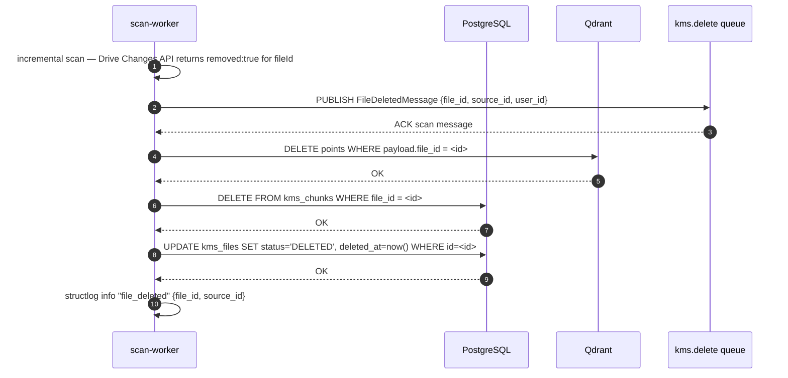

# Backlog: File Deletion Sync

**Type**: Bug / Data Quality Gap
**Priority**: HIGH
**Effort**: S (1 day)
**Status**: Backlog — not started
**Created**: 2026-03-23

---

## Problem

When a file is deleted from Google Drive, the Drive Changes API returns `removed: true` for that `fileId` in the next incremental scan poll. The `scan-worker` currently does **not** handle this case — the deletion is silently ignored.

Result: deleted files remain indefinitely in:
- `kms_files` — stale file record with outdated metadata
- `kms_chunks` — orphaned chunk rows, taking up DB space
- Qdrant — stale vector points returned in search results

This is a data quality defect: users searching their knowledge base will receive results pointing to files that no longer exist in Google Drive.

---

## Required Behaviour

The following steps must be implemented in the order listed:

1. **scan-worker: detect removed files**
   - During incremental scan processing, check each change item for `removed: true`
   - For each removed `fileId`, determine the corresponding `kms_files` row

2. **Dispatch deletion event**
   - Option A (preferred): publish a `FileDeletedMessage` to queue `kms.delete`; a new lightweight delete-worker (or the scan-worker itself inline) handles the cleanup steps below
   - Option B (inline): handle deletion synchronously within scan-worker before ACK-ing the scan message
   - Decision pending — see Decisions section

3. **Delete Qdrant points**
   - Filter Qdrant collection by payload field `file_id = <id>`
   - Delete all matching points

4. **Delete chunk rows**
   - `DELETE FROM kms_chunks WHERE file_id = <id>`

5. **Handle `kms_files` row**
   - **Preferred (soft delete)**: `UPDATE kms_files SET status = 'DELETED', deleted_at = now() WHERE id = <id>`
   - Keeps metadata for audit trail (when was the file removed from Drive?)
   - Hard delete with cascade is acceptable if audit trail is not required — decision pending

---

## Acceptance Criteria

- [ ] scan-worker detects `removed: true` change items and does not skip them silently
- [ ] Qdrant points for the deleted file are removed (search no longer returns them)
- [ ] `kms_chunks` rows for the deleted file are removed
- [ ] `kms_files` row is soft-deleted (status = DELETED) with `deleted_at` timestamp
- [ ] Deletion events are logged with structured log (file_id, source_id, user_id, timestamp)
- [ ] If Qdrant or DB delete fails, the operation is retried (not silently ignored)
- [ ] Unit tests cover: removed=true detection, Qdrant delete call, DB soft-delete
- [ ] `kms_files` with status DELETED are excluded from all search and listing queries

---

## Schema Changes

```sql
-- kms_files already has a status enum; add DELETED value if not present
-- Add deleted_at column for audit trail
ALTER TABLE kms_files
  ADD COLUMN IF NOT EXISTS deleted_at TIMESTAMPTZ NULL;

-- Existing status enum must include 'DELETED'
-- (check current enum values before migration)
```

---

## Open Decisions

| # | Question | Options | Decision |
|---|---------|---------|----------|
| 1 | Handle deletion inline in scan-worker or via dedicated `kms.delete` queue? | Inline (simpler), New queue (cleaner separation) | Pending |
| 2 | Soft delete or hard delete `kms_files`? | Soft (audit trail), Hard (simpler) | Soft delete preferred |
| 3 | Should `kms_chunks` hard-delete cascade or be explicit? | CASCADE FK, Explicit DELETE | Explicit DELETE to control order |

---

## Related

- scan-worker: `services/scan-worker/`
- embed-worker: `services/embed-worker/` (embeds may already be in-flight when deletion is processed — handle gracefully)
- Qdrant collection: see `PRD-M04-embedding-pipeline.md`
- File status enum: `kms-api/prisma/schema.prisma`

---

## User Stories

| As a... | I want to... | So that... |
|---------|-------------|-----------|
| Registered user | I want files I delete from Google Drive to disappear from my knowledge base | So that I do not receive search results for content that no longer exists |
| Registered user | I want the deletion to propagate automatically without manual intervention | So that my knowledge base stays in sync with my Drive without extra effort |
| Admin | I want deleted file metadata retained with a `deleted_at` timestamp | So that I can audit when files were removed from user sources |

---

## Out of Scope

- Real-time deletion (sub-second propagation) — incremental scan polling cadence applies
- Deletion of files removed from non-Drive sources (local folder connector, future connectors handle this separately)
- Recovering or restoring a deleted file from within the KMS UI
- Cascading deletion of parent collection when all files are deleted

---

## Happy Path Flow



---

## Error Flows

| Scenario | Behaviour |
|----------|-----------|
| `fileId` in Drive change not found in `kms_files` | Log warning `KBWRK0020` with `file_id`; skip silently (already cleaned up or never indexed) |
| Qdrant delete call fails | Raise retryable `KMSWorkerError` with `KBWRK0021`; `nack(requeue=True)`; retry after backoff |
| DB chunk delete fails | Raise retryable error `KBWRK0022`; rollback is not needed (idempotent DELETE) |
| DB soft-delete of `kms_files` fails | Raise retryable error `KBWRK0023`; chunks already deleted — log warning and retry |
| embed-worker processes a message for an already-deleted file | embed-worker checks `kms_files.status`; if `DELETED`, `reject()` message and skip without embedding |

---

## Edge Cases

| Case | Handling |
|------|----------|
| Embed-worker has a queued `kms.embed` message for the file when deletion arrives | embed-worker performs a pre-embed status check; finds `DELETED`; rejects message |
| File deleted and re-uploaded with the same name in Drive | Drive assigns a new `fileId`; treated as a new file — deletion of old `fileId` proceeds normally |
| Partial deletion (Qdrant deleted, DB delete fails mid-way) | Qdrant delete is idempotent on retry; explicit chunk DELETE before file soft-delete ensures correct order |
| User deletes source while deletion is in-flight | `kms_files.source_id` FK — if source is soft-deleted first, cascade soft-deletes all files; deletion worker finds file already in DELETED state and skips |
| Concurrent deletion messages for the same `file_id` | `UPDATE ... WHERE status != 'DELETED'` makes soft-delete idempotent; second message is a no-op |

---

## Integration Contracts

| Component | API / Payload |
|-----------|--------------|
| `FileDeletedMessage` (AMQP) | `{ file_id: uuid, source_id: uuid, user_id: uuid, drive_file_id: string, deleted_at: ISO8601 }` |
| RabbitMQ queue | `kms.delete` (new) or inline in `kms.scan` handler (pending decision) |
| Qdrant delete endpoint | `DELETE /collections/{collection}/points` with filter `{ must: [{ key: "file_id", match: { value: "<id>" } }] }` |
| DB soft-delete | `UPDATE kms_files SET status = 'DELETED', deleted_at = $1 WHERE id = $2 AND status != 'DELETED'` |

---

## KB Error Codes

| Code | Meaning |
|------|---------|
| `KBWRK0020` | File ID from Drive change not found in `kms_files` — skip |
| `KBWRK0021` | Qdrant point deletion failed — retryable |
| `KBWRK0022` | `kms_chunks` DELETE failed — retryable |
| `KBWRK0023` | `kms_files` soft-delete UPDATE failed — retryable |
| `KBFIL0020` | File not found or already deleted — returned by API if queried |

---

## Test Scenarios

| # | Scenario | Type | Expected Outcome |
|---|----------|------|-----------------|
| 1 | scan-worker receives change with `removed:true`; verifies Qdrant points deleted | Unit | Qdrant delete called once with correct filter |
| 2 | scan-worker receives change for unknown `fileId` | Unit | Warning logged `KBWRK0020`; no exception raised |
| 3 | Qdrant delete fails; message nacked | Unit | `nack(requeue=True)` called; error logged `KBWRK0021` |
| 4 | Full deletion flow: Drive change → DB soft-delete confirmed | Integration | `kms_files.status = 'DELETED'`, `deleted_at` set, `kms_chunks` count = 0 |
| 5 | Search does not return DELETED files | Integration | `GET /search?q=<term>` returns 0 results for deleted file content |
| 6 | Duplicate deletion message processed twice | Unit | Second UPDATE is a no-op; no error raised |

---

## Non-Functional Requirements

| Concern | Requirement |
|---------|-------------|
| Latency | Deletion propagates within one incremental scan cycle (configurable, default 5 min) |
| Consistency | Qdrant delete happens before DB soft-delete; prevents orphaned vectors |
| Idempotency | All deletion steps must be safe to retry without double-deleting or erroring |
| Observability | Structured log event `file_deleted` with `file_id`, `source_id`, `user_id`, `chunk_count_deleted`, `vector_count_deleted` |

---

## Sequence Diagram

See: `docs/architecture/sequence-diagrams/` — add a sequence diagram covering the Drive deletion event flow through scan-worker → Qdrant → PostgreSQL before implementation begins.
