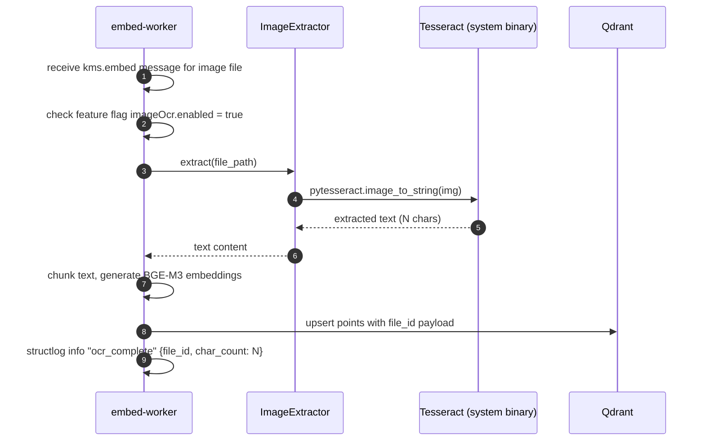

# Backlog: Image OCR in Production

**Type**: Bug / Silent Failure Fix
**Priority**: MEDIUM
**Effort**: XS (2–3 hours)
**Status**: Backlog — not started
**Created**: 2026-03-23

---

## Problem

`ImageExtractor` exists in `services/embed-worker/` and is wired up to handle PNG, JPEG, WebP, GIF, and TIFF files via Tesseract OCR + Pillow. However, **Tesseract is not installed in the embed-worker Docker image**. As a result:

- `pytesseract` import succeeds (the Python package is installed)
- OCR calls silently return empty strings or raise a `TesseractNotFoundError` that is swallowed
- Image files are indexed with zero extracted text — they appear in the knowledge base but produce no search results

This is a silent failure: no error is surfaced to the user, no log message indicates that OCR was skipped, and the file appears to be processed successfully.

---

## Current State

| Component | State |
|-----------|-------|
| `ImageExtractor` class | Exists, logic correct |
| `pytesseract` pip package | Listed in requirements but possibly missing |
| `Pillow` pip package | Listed in requirements but possibly missing |
| `tesseract-ocr` system binary | NOT installed in Docker image |
| `libtesseract-dev` system library | NOT installed in Docker image |
| Feature flag | None — OCR is always attempted, always fails silently |

---

## Required Changes

### 1. embed-worker Dockerfile

Add system package installation before the Python dependency install step:

```dockerfile
RUN apt-get update && apt-get install -y --no-install-recommends \
    tesseract-ocr \
    libtesseract-dev \
    && rm -rf /var/lib/apt/lists/*
```

### 2. embed-worker requirements.txt

Confirm the following are present (add if missing):

```
pytesseract>=0.3.10
Pillow>=10.0.0
```

### 3. Feature flag

Add to `.kms/config.json`:

```json
{
  "features": {
    "imageOcr": {
      "enabled": false,
      "description": "Enable Tesseract OCR for image file extraction. Set true only after verifying Tesseract is installed in the embed-worker image."
    }
  }
}
```

Default `false` until the Docker image rebuild is confirmed and tested with a real PNG file.

### 4. Structured logging

Add a log event in `ImageExtractor` when OCR is skipped due to the feature flag, and when OCR completes (log character count extracted).

---

## Acceptance Criteria

- [ ] embed-worker Docker image builds successfully with `tesseract-ocr` installed
- [ ] `pytesseract` and `Pillow` confirmed in `requirements.txt`
- [ ] `ENABLE_IMAGE_OCR` / `imageOcr.enabled` feature flag added to `.kms/config.json` defaulting to `false`
- [ ] Manual test: upload a PNG file with readable text, verify extracted text is non-empty after re-embedding
- [ ] Log event emitted when OCR runs (character count) and when skipped (flag disabled)
- [ ] No silent empty-string returns — if Tesseract binary is missing and flag is enabled, raise a loud error

---

## Test

Manual test procedure (after Docker rebuild):

```bash
# 1. Enable flag
# Edit .kms/config.json: "imageOcr": { "enabled": true }

# 2. Drop a test image into a synced source folder
# (PNG with visible text, e.g., a screenshot)

# 3. Trigger embed-worker scan
# Watch logs for: "ocr_extracted_chars": N (should be > 0)

# 4. Search for a word that appears in the image text
# Should return the image file as a result
```

---

## Related

- `services/embed-worker/` — `ImageExtractor` class
- `PRD-M03-content-extraction.md` — content extraction pipeline
- `BACKLOG-multimodal-processing.md` — future vision model OCR (this ticket is the prerequisite)
- `.kms/config.json` — feature flags runtime config

---

## User Stories

- As a registered user, I want image files (PNG, JPEG, TIFF) in my knowledge base to be searchable by their text content so that screenshots and scanned documents are as useful as text files.
- As a registered user, I want to be clearly informed if a file type cannot be processed so that I know why an image file returns no search results.
- As a platform operator, I want OCR to be gated by a feature flag so that I can enable it only after verifying the Docker image rebuild.

---

## Out of Scope

- Cloud OCR APIs (Google Vision, AWS Textract) — Tesseract is the only OCR engine in this ticket
- Handwriting recognition — printed text only
- OCR for languages other than English in v1 (Tesseract language packs are a separate concern)
- Vision model captioning of image semantic content — see `BACKLOG-multimodal-processing.md`
- PDF image extraction (PDFs with embedded images handled separately by PDF extractor)

---

## Happy Path Flow



---

## Error Flows

| Scenario | Behaviour |
|----------|-----------|
| `imageOcr.enabled = false` | ImageExtractor returns empty string; log `KBWRK0040` warning "OCR skipped — feature flag disabled" |
| Tesseract binary not found in Docker image | Raise loud `KMSWorkerError(KBWRK0041, retryable=False)` instead of silently returning empty string |
| Image file is corrupt or unreadable by Pillow | Raise `KMSWorkerError(KBWRK0042, retryable=False)`; log `file_id`, exception message |
| OCR produces 0 characters (blank image) | Log `KBWRK0043` info "ocr_empty_result"; file indexed with empty content; no error raised |
| Docker image build fails with Tesseract apt error | CI build fails loudly; deployment blocked until resolved |

---

## Edge Cases

| Case | Handling |
|------|----------|
| Very large image (> 50 MB) | Pillow may OOM; add size check before OCR; reject with `KBWRK0044` if over threshold |
| Image with no readable text (photo, diagram) | OCR returns empty or near-empty string; file indexed; search will not match text queries |
| Feature flag toggled true mid-deployment | Already-indexed image files need re-embedding; trigger via admin re-index endpoint |
| Tesseract returns partial result for multi-page TIFF | Each page processed independently; results concatenated |

---

## Integration Contracts

| Component | API / Payload |
|-----------|--------------|
| Feature flag | `.kms/config.json` → `features.imageOcr.enabled` (bool) |
| `ImageExtractor.extract(path)` | Returns `str` — extracted text or empty string; raises `KMSWorkerError` on hard failures |
| Structured log on success | `{"event": "ocr_complete", "file_id": "<uuid>", "mime_type": "image/png", "char_count": N}` |
| Structured log on skip | `{"event": "ocr_skipped", "file_id": "<uuid>", "reason": "flag_disabled", "code": "KBWRK0040"}` |

---

## KB Error Codes

| Code | Meaning |
|------|---------|
| `KBWRK0040` | OCR skipped — `imageOcr.enabled` feature flag is false |
| `KBWRK0041` | Tesseract binary not found in Docker image — non-retryable |
| `KBWRK0042` | Image file corrupt or unreadable by Pillow — non-retryable |
| `KBWRK0043` | OCR produced zero characters (blank image result) |
| `KBWRK0044` | Image file exceeds size limit for OCR processing |

---

## Test Scenarios

| # | Scenario | Type | Expected Outcome |
|---|----------|------|-----------------|
| 1 | `imageOcr.enabled = true` + valid PNG with text → char_count > 0 | Integration | Non-empty text returned; `ocr_complete` log event |
| 2 | `imageOcr.enabled = false` → `ocr_skipped` log, empty text | Unit | Empty string returned; `KBWRK0040` in log |
| 3 | Tesseract binary missing + flag enabled → loud error | Unit | `KMSWorkerError(KBWRK0041)` raised, not swallowed |
| 4 | Corrupt image file → `KMSWorkerError(KBWRK0042)` | Unit | Error raised with file_id in log; message nacked non-retryable |
| 5 | embed-worker Docker image builds with `tesseract-ocr` installed | CI | `docker build` exits 0; `which tesseract` returns path |
| 6 | Search for word from image content returns the image file | E2E | After re-embed with flag enabled, search returns file |

---

## Non-Functional Requirements

| Concern | Requirement |
|---------|-------------|
| Latency | OCR for a typical screenshot (< 2 MB) completes in < 3 s |
| Docker image size | `tesseract-ocr` + `libtesseract-dev` adds ~25 MB to the embed-worker image — acceptable |
| Feature flag | Default `false`; must be explicitly enabled after Docker image rebuild is verified |
| Silent failure prevention | Any `TesseractNotFoundError` must surface as `KBWRK0041` — never swallowed |

---

## Sequence Diagram

See: `docs/architecture/sequence-diagrams/` — the existing content extraction sequence diagram in `PRD-M03-content-extraction.md` covers the embed pipeline; add an OCR-specific branch showing the `imageOcr.enabled` feature flag check before implementation.
