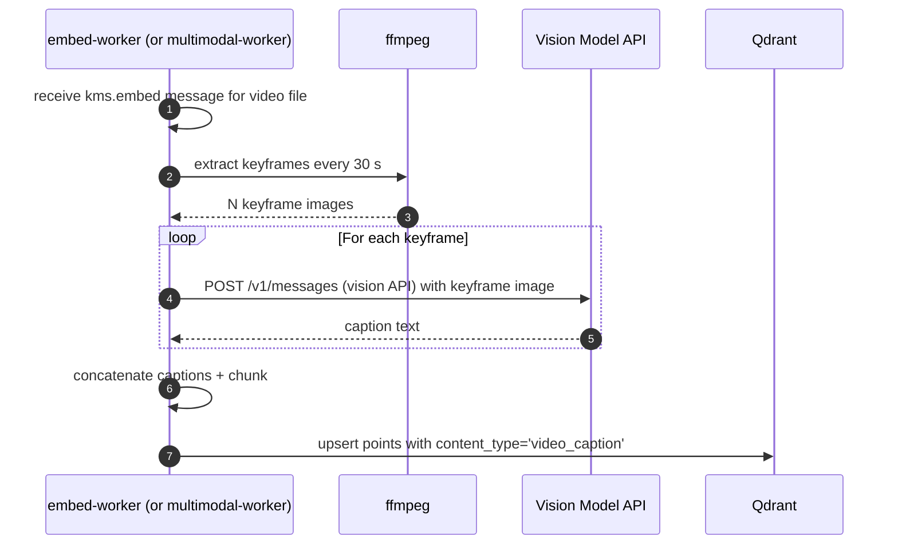

# Backlog: Multimodal Processing (Future)

**Type**: Future Feature — Tracking Only
**Priority**: LOW (backlog)
**Effort**: L (2 weeks)
**Status**: Backlog — do NOT implement in v1
**Created**: 2026-03-23

---

## Overview

This ticket tracks future work to extract semantic meaning from non-text content: video frames, embedded document images, charts, diagrams, and slide decks. None of this should be implemented until the core text extraction, embedding, and search pipeline is stable in production.

The prerequisite for all items in this ticket is that `BACKLOG-image-ocr-production.md` is complete (Tesseract OCR working in the embed-worker Docker image).

---

## Scope

**In scope (future):**
- Video keyframe extraction + image captioning using a vision model
- Slide extraction from PowerPoint (.pptx) and Keynote (.key) files
- Chart and diagram understanding from PDFs with embedded images
- Scene description embedding for video files (to make video content searchable)

**Out of scope for v1:** All items below. Do not implement. Track only.

---

## Feature Breakdown

### 1. Video Keyframe Extraction + Captioning

**Goal:** Make video files searchable by their visual content.

**Approach:**
- Use `ffmpeg` or `opencv-python` to extract keyframes at regular intervals (e.g., every 30 seconds)
- Send keyframe images to a vision model (Claude claude-haiku-4-5 vision API or local LLaVA via Ollama) for caption generation
- Concatenate captions into a single document for embedding
- Store captions in `kms_chunks` with `content_type = 'video_caption'`

**Dependencies:**
- `ffmpeg` in embed-worker Docker image
- Vision model API access (Claude claude-haiku-4-5 costs money per frame; LLaVA is free but lower quality)
- Decision pending: cloud vision API vs local LLaVA

### 2. Slide Extraction from PowerPoint / Keynote

**Goal:** Extract text AND visual content from presentation files.

**Approach:**
- For `.pptx`: use `python-pptx` to extract text per slide + export slide images via LibreOffice headless
- For `.key`: limited support; may require conversion via LibreOffice or iWork export
- Each slide image captioned by vision model
- Per-slide text + captions concatenated for embedding

**Dependencies:**
- LibreOffice headless in embed-worker Docker image (large, ~200 MB)
- `python-pptx` pip package
- Vision model for slide image captioning

### 3. Chart and Diagram Understanding from PDFs

**Goal:** Extract meaning from charts, graphs, and diagrams embedded in PDF files.

**Approach:**
- Current PDF extractor (`pdfplumber` / `PyMuPDF`) extracts text but not embedded images
- Enhance PDF extractor to detect image regions and extract them
- Pass extracted images to vision model for description
- Append descriptions to the chunk text for the surrounding page

**Dependencies:**
- Vision model API access
- `PyMuPDF` (already likely present) image extraction capability

### 4. Scene Description Embedding for Video

**Goal:** Index video files so users can search "meeting where Alice discussed the Q3 roadmap" and find the correct video segment.

**Approach:**
- Extend video keyframe captioning (item 1) to include scene-level summaries
- Generate a per-scene embedding in addition to per-file embedding
- Store scene timestamps + descriptions as separate chunks with `content_type = 'video_scene'`
- Search results for video files show timestamp + scene description snippet

**Dependencies:**
- Item 1 (keyframe extraction) must be complete first
- Chunk schema must support `start_time_ms` and `end_time_ms` fields

---

## Decision Points (Resolve Before Implementation)

| # | Question | Options |
|---|---------|---------|
| 1 | Vision model: cloud vs local? | Claude claude-haiku-4-5 vision (cost per call), LLaVA via Ollama (free, slower, lower quality) |
| 2 | Video captioning granularity? | Per-keyframe (fine, expensive), Per-scene-segment (coarse, cheaper) |
| 3 | Embed-worker image size budget? | Adding ffmpeg + LibreOffice could add 400–600 MB to image size |
| 4 | Separate multimodal-worker service or extend embed-worker? | Extend embed-worker (simpler), New service (cleaner separation) |

---

## Prerequisites (must be done first)

1. `BACKLOG-image-ocr-production.md` — Tesseract OCR working
2. Core search pipeline stable in production
3. Vision model budget approved (if using Claude API)
4. Docker image size budget reviewed

---

## Related

- `BACKLOG-image-ocr-production.md` — immediate predecessor (Tesseract OCR)
- `PRD-M03-content-extraction.md` — base content extraction pipeline
- `PRD-M04-embedding-pipeline.md` — embedding pipeline this extends
- `services/embed-worker/` — where new extractors would live

---

## User Stories

| As a... | I want to... | So that... |
|---------|-------------|-----------|
| Registered user | I want video files in my knowledge base to be searchable by their visual and spoken content | So that I can find meeting recordings by topic without watching the full video |
| Registered user | I want charts and diagrams in PDF documents to be understood and indexed | So that visual information in reports is as searchable as the surrounding text |
| Registered user | I want PowerPoint slides to contribute their text and visual context to search | So that presentation content is fully discoverable |
| Platform operator | I want multimodal processing gated by feature flags with cost controls | So that cloud vision API costs do not exceed approved budget |

---

## Out of Scope for v1 (Do Not Implement)

- All items in this PRD — tracking only until prerequisites are met
- Real-time video processing (batch keyframe extraction only when implemented)
- Audio transcription of video soundtracks (handled by voice-app; this PRD covers visual content only)
- Automatic content moderation of video/image content
- Processing of files already indexed before multimodal support was enabled (re-index as separate admin action)

---

## Happy Path Flow (Reference — for future implementation)

---

## Error Flows

| Scenario | Behaviour |
|----------|-----------|
| ffmpeg not installed in Docker image | Worker raises `KMSWorkerError(KBWRK0050, retryable=False)` at startup; loud failure |
| Vision API call fails (rate limit / network) | Retry with exponential backoff; after 3 failures, `nack(requeue=True)` with `KBWRK0051` |
| Vision API returns empty caption for keyframe | Log `KBWRK0052` warning; skip that keyframe and continue with remaining frames |
| Video file corrupt / unreadable by ffmpeg | Raise `KMSWorkerError(KBWRK0053, retryable=False)`; log `file_id` |
| Cloud vision API budget exceeded | Feature flag `features.multimodal.enabled` toggled false by operator; workers stop calling API |

---

## Edge Cases

| Case | Handling |
|------|----------|
| Video longer than 2 hours | Cap at 240 keyframes max; configurable via `features.multimodal.maxKeyframes` |
| LibreOffice headless not installed for PPTX slide export | Worker raises startup error `KBWRK0054`; falls back to text-only pptx extraction |
| Vision model returns duplicate captions for similar frames | Dedup captions before chunking; avoid redundant embeddings |
| Docker image size exceeds budget after adding ffmpeg + LibreOffice | Create a dedicated `multimodal-worker` service rather than extending embed-worker |

---

## Integration Contracts

| Component | API / Payload |
|-----------|--------------|
| Feature flag | `.kms/config.json` → `features.multimodal.enabled` (bool) |
| AMQP queue | `kms.embed` (reuse) or new `kms.multimodal` queue (pending decision 4) |
| `kms_chunks` new fields | `content_type VARCHAR` — values: `video_caption`, `video_scene`, `slide_text`, `chart_description` |
| `kms_chunks` video fields | `start_time_ms BIGINT NULL`, `end_time_ms BIGINT NULL` — for video scene segments |
| Vision model call | Claude claude-haiku-4-5 vision: `POST https://api.anthropic.com/v1/messages` with `image` content block |

---

## KB Error Codes

| Code | Meaning |
|------|---------|
| `KBWRK0050` | ffmpeg binary not found in Docker image — startup failure |
| `KBWRK0051` | Vision API call failed after retries — retryable nack |
| `KBWRK0052` | Vision API returned empty caption for keyframe — skip warning |
| `KBWRK0053` | Video file corrupt or unreadable by ffmpeg — non-retryable |
| `KBWRK0054` | LibreOffice headless not available — PPTX slide image export skipped |

---

## Test Scenarios

| # | Scenario | Type | Expected Outcome |
|---|----------|------|-----------------|
| 1 | Video file with 3 keyframes → 3 caption chunks in Qdrant | Integration | `content_type='video_caption'`, chunk count = 3 |
| 2 | Vision API fails for one keyframe → that frame skipped, others indexed | Unit | `KBWRK0052` warning; remaining captions indexed |
| 3 | Feature flag disabled → no vision API calls made | Unit | Worker skips multimodal extraction; logs flag disabled |
| 4 | PPTX with 5 slides → 5 `slide_text` chunks | Integration | Each slide produces one chunk with combined text + caption |
| 5 | Search for term from video caption returns video file with timestamp | E2E | Search result includes `start_time_ms` and `end_time_ms` |

---

## Non-Functional Requirements

| Concern | Requirement |
|---------|-------------|
| Cost control | Vision API calls gated by `features.multimodal.enabled` flag; cost per video estimated before enabling by default |
| Latency | Video processing is asynchronous (AMQP consumer); no user-facing SLO — background indexing only |
| Docker image size | If ffmpeg + LibreOffice exceeds 400 MB, create a dedicated `multimodal-worker` service |
| Rate limiting | Vision API calls throttled to stay within Anthropic tier rate limits; configurable concurrency |
| SLO | Multimodal content indexed within 10 minutes of file upload for files under 100 MB |

---

## Sequence Diagram

See: `docs/architecture/sequence-diagrams/` — add a sequence diagram for the video keyframe captioning flow and slide extraction flow before implementation of any item in this PRD. Reference `PRD-M03-content-extraction.md` for the base extraction pipeline diagram.
