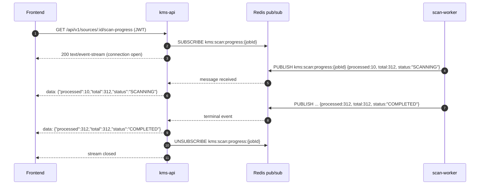

# Backlog: Scan Progress Real-Time Updates

**Type**: UX Enhancement
**Priority**: MEDIUM
**Effort**: M (2–3 days)
**Status**: Backlog — not started
**Created**: 2026-03-23

---

## Problem

When a user connects a Google Drive source and triggers a scan, the source card flips to `SCANNING` status. However, the user has no visibility into how much work has been done. There is no indication of:

- How many files have been discovered
- How many have been processed
- Estimated time remaining
- Whether the scan is making progress or stuck

This creates uncertainty and makes it difficult to distinguish a long-running scan from a broken one.

---

## Proposed Solution

Use Server-Sent Events (SSE) from `kms-api` backed by Redis pub/sub to push real-time progress counts to the frontend without requiring WebSocket infrastructure.

---

## Architecture

```
scan-worker
    │
    │  PUBLISH kms:scan:progress:{jobId}
    │  { processed: 47, total: 312, status: "SCANNING" }
    ▼
Redis pub/sub
    │
    │  SUBSCRIBE kms:scan:progress:{jobId}
    ▼
kms-api SSE endpoint
GET /sources/:id/scan-progress
    │
    │  text/event-stream
    ▼
Frontend EventSource hook
    │
    ▼
SourceCard: progress bar + "47 of 312 files"
```

---

## Required Changes

### scan-worker

- After each file is processed (or in batches of N), publish a progress event to Redis:
  ```
  PUBLISH kms:scan:progress:{jobId} '{"processed":47,"total":312,"status":"SCANNING"}'
  ```
- Publish a final event when scan completes or fails:
  ```
  PUBLISH kms:scan:progress:{jobId} '{"processed":312,"total":312,"status":"COMPLETED"}'
  ```
- `total` may be unknown at start (Drive pagination) — emit `null` until total is known, then fill it in

### kms-api: SSE endpoint

New endpoint:

```
GET /api/v1/sources/:id/scan-progress
```

- Auth: JWT required
- Response: `Content-Type: text/event-stream`
- kms-api subscribes to `kms:scan:progress:{jobId}` for the given source's active job
- Streams each Redis pub/sub message as an SSE `data:` event
- Closes stream when a COMPLETED or FAILED status event is received, or after 10-minute timeout
- Returns 404 if no active scan job for the source
- Returns 200 immediately with current DB state if scan is already completed (no streaming needed)

### kms-api: Redis subscription

- Use existing Redis client (`ioredis` or NestJS `@nestjs/microservices` Redis strategy)
- One subscription per connected SSE client (cleaned up on client disconnect)
- Do not persist progress events — they are ephemeral pub/sub only

### Frontend

- `useSourceScanProgress(sourceId)` hook using native `EventSource` API
- Hook connects to `/api/v1/sources/:id/scan-progress` when source status is `SCANNING`
- Exposes `{ processed, total, percent, status }`
- Disconnects automatically on COMPLETED or FAILED event
- `SourceCard` component renders progress bar and `"{processed} of {total} files"` text when hook is active

---

## Acceptance Criteria

- [ ] `GET /sources/:id/scan-progress` SSE endpoint implemented with JWT auth
- [ ] scan-worker publishes progress events to Redis pub/sub after each file (or batch)
- [ ] Progress event includes `processed`, `total` (nullable), `status`
- [ ] Terminal events (COMPLETED, FAILED) cause SSE stream to close
- [ ] kms-api cleans up Redis subscription on client disconnect (no resource leak)
- [ ] Frontend `SourceCard` shows progress bar and file count while scanning
- [ ] Timeout: SSE connection auto-closes after 10 minutes of inactivity
- [ ] Works when multiple users scan simultaneously (no cross-user event leakage — jobId in channel name prevents this)
- [ ] Unit tests: SSE event serialization, Redis channel naming, hook state transitions
- [ ] Manual test: connect a large Drive source, watch progress update in real time

---

## Non-Functional Requirements

| Concern | Requirement |
|---------|-------------|
| Performance | SSE overhead per connected client: < 1 MB RAM. Redis pub/sub latency: < 100 ms |
| Security | SSE endpoint requires valid JWT. Channel name includes jobId (not guessable without knowing the job) |
| Graceful degradation | If Redis pub/sub is unavailable, endpoint returns 503. Frontend falls back to polling `GET /sources/:id` every 5 seconds |
| Scalability | Multiple kms-api instances: each subscribes to Redis independently — works correctly with no coordination needed |

---

## Open Decisions

| # | Question | Options | Decision |
|---|---------|---------|----------|
| 1 | Publish per-file or batched (every N files)? | Per-file (most accurate), Every 10 files (lower Redis traffic) | Every 10 files preferred |
| 2 | SSE or WebSocket? | SSE (simpler, unidirectional), WebSocket (bidirectional, overkill here) | SSE |
| 3 | Store latest progress in Redis (SETEX) as well as pub/sub? | Yes (new clients can get current state immediately), No (only live events) | Yes — SETEX with 24h TTL for late joiners |

---

## Related

- `services/scan-worker/` — where progress events will be published
- `kms-api/src/modules/sources/` — where SSE endpoint will be added
- `PRD-M02-source-integration.md` — base source scanning feature
- Redis config: `docker-compose.kms.yml` — Redis service already present

---

## User Stories

| As a... | I want to... | So that... |
|---------|-------------|-----------|
| Registered user | I want to see real-time scan progress on a source card | So that I know how many files have been discovered and processed without refreshing the page |
| Registered user | I want to see a progress bar and file count while my Drive source is scanning | So that I can distinguish a healthy long-running scan from a stuck one |
| Admin | I want scan progress updates to be scoped per job and per user | So that one user's scan events are never visible to another user |

---

## Out of Scope

- Persisting historical progress snapshots beyond a 24-hour Redis TTL
- Push notifications (email / browser notification) when a scan completes
- Progress tracking for embed or dedup workers (only scan-worker in this ticket)
- WebSocket-based streaming (SSE is chosen per ADR-0014)

---

## Happy Path Flow



---

## Error Flows

| Scenario | Behaviour |
|----------|-----------|
| Redis pub/sub unavailable when client connects | Return `503 Service Unavailable` with error code `KBSRC0010`; frontend falls back to polling `GET /sources/:id` every 5 s |
| Source has no active scan job | Return `404 Not Found` with error code `KBSRC0011` |
| SSE client disconnects mid-stream | kms-api unsubscribes Redis channel immediately to prevent resource leak |
| scan-worker crashes without publishing COMPLETED event | SSE stream auto-closes after 10-minute timeout; frontend polls for final status |
| scan-worker publishes unknown status value | kms-api forwards event as-is; frontend ignores unknown statuses |

---

## Edge Cases

| Case | Handling |
|------|----------|
| `total` is unknown during initial Drive pagination | Publish `null` for `total`; frontend renders "X files processed" without denominator |
| Multiple browser tabs for same source | Each tab opens its own SSE connection; Redis pub/sub fan-out handles multiple subscribers correctly |
| Concurrent scans from two different users | Channel name includes `jobId` (not just `sourceId`), preventing cross-user event leakage |
| Scan completes before client connects (late joiner) | kms-api reads latest state from Redis SETEX key; streams synthetic COMPLETED event immediately |
| Empty source (0 files found) | Worker publishes `{ processed: 0, total: 0, status: "COMPLETED" }`; frontend shows "0 files" |

---

## Integration Contracts

| Component | API / Payload |
|-----------|--------------|
| SSE endpoint | `GET /api/v1/sources/:id/scan-progress` — `Content-Type: text/event-stream`; JWT required |
| SSE event payload | `data: {"processed":47,"total":312,"status":"SCANNING","jobId":"<uuid>"}` |
| Redis pub/sub channel | `kms:scan:progress:{jobId}` — PUBLISH from scan-worker, SUBSCRIBE in kms-api |
| Redis SETEX key | `kms:scan:latest:{jobId}` — TTL 24 h, stores latest progress JSON for late joiners |
| Terminal statuses | `COMPLETED` or `FAILED` — SSE stream closes after forwarding; scan-worker publishes once |

---

## KB Error Codes

| Code | Meaning |
|------|---------|
| `KBSRC0010` | Scan progress unavailable — Redis pub/sub not reachable |
| `KBSRC0011` | No active scan job found for the given source ID |
| `KBSRC0012` | SSE stream timed out after 10-minute inactivity limit |

---

## Test Scenarios

| # | Scenario | Type | Expected Outcome |
|---|----------|------|-----------------|
| 1 | scan-worker publishes 10 batched events; SSE client receives all 10 in order | Unit | Events forwarded in publication order |
| 2 | SSE client disconnects; Redis subscriber count for channel drops to zero | Integration | No resource leak after disconnect |
| 3 | Redis is unavailable; client calls SSE endpoint | Integration | 503 with `KBSRC0010` returned |
| 4 | COMPLETED event received; stream closes within 1 s | Integration | SSE connection closed, `readyState` = 2 on frontend |
| 5 | Two users scan simultaneously; neither sees the other's events | E2E | Channel isolation via jobId confirmed |
| 6 | `useSourceScanProgress` hook — `total` is `null` for first 3 events | Unit | Hook exposes `percent: null`; no division-by-zero |

---

## Sequence Diagram

See: `docs/architecture/sequence-diagrams/` — add sequence diagram for the scan progress SSE flow before implementation begins.

Reference: ADR-0033 (websocket-file-status) and ADR-0014 (SSE over WebSocket for LLM streaming) inform the transport choice.
