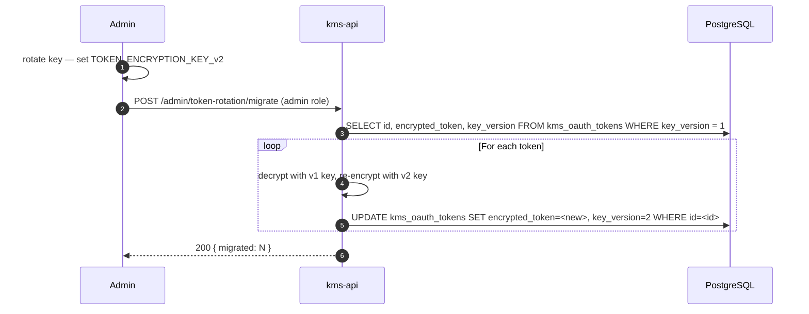

# Backlog: Security Hardening

**Type**: Security / Pre-Production Hardening
**Priority**: HIGH (items 1, 3, 6) / MEDIUM (items 2, 4, 5, 7)
**Effort**: M–L total
**Status**: Backlog — not started
**Created**: 2026-03-23

---

## Overview

This ticket tracks security hardening items that must be addressed before the system handles real user data in production. Items are ordered from highest to lowest urgency. Items marked HIGH must be resolved before any production deployment.

---

## Item 1 — Transcript Encryption at Rest (HIGH)

**Risk:** Transcripts stored in MinIO contain verbatim speech content which may include sensitive personal or business information.

**Required:**
- Enable SSE-S3 (server-side encryption) on the `kms-transcripts` MinIO bucket
- All objects encrypted with AES-256 managed by MinIO KMS
- MinIO configuration: set `MINIO_KMS_SECRET_KEY` or configure MinIO KMS via `MINIO_KMS_KES_ENDPOINT`
- Encryption is transparent to the application — no code change needed, only MinIO config

**Acceptance criteria:**
- [ ] MinIO bucket created with default encryption policy applied
- [ ] Object metadata confirms `x-amz-server-side-encryption: AES256` on all uploads
- [ ] MinIO KMS key is not stored in docker-compose plaintext — use Docker secret or env file excluded from git

**Related:** `PRD-minio-transcript-storage.md`

---

## Item 2 — Audit Log for Transcript Access (MEDIUM)

**Risk:** No record of who accessed which transcript, when, and from where. Required for GDPR compliance and incident investigation.

**Required:**
- Log every `GET /files/:id/transcription/text` call to a dedicated `kms_audit_log` table
- Fields: `id`, `user_id`, `file_id`, `action` (e.g., `TRANSCRIPT_READ`), `ip_address`, `user_agent`, `timestamp`
- Table must be append-only — no UPDATE or DELETE permitted on audit rows
- Expose audit log to admins via `GET /admin/audit-log` (role-gated, admin only)

**Schema:**
```sql
CREATE TABLE kms_audit_log (
    id          UUID PRIMARY KEY DEFAULT gen_random_uuid(),
    user_id     UUID NOT NULL,
    file_id     UUID,
    action      VARCHAR(64) NOT NULL,
    ip_address  INET,
    user_agent  TEXT,
    created_at  TIMESTAMPTZ NOT NULL DEFAULT now()
);

-- No RLS UPDATE/DELETE — enforced at application layer + DB role permissions
CREATE INDEX idx_audit_log_user_id ON kms_audit_log(user_id);
CREATE INDEX idx_audit_log_file_id ON kms_audit_log(file_id);
CREATE INDEX idx_audit_log_created_at ON kms_audit_log(created_at DESC);
```

**Acceptance criteria:**
- [ ] Every transcript text fetch creates an audit row
- [ ] Audit rows cannot be deleted via application API
- [ ] Admin endpoint returns paginated audit log filtered by user_id or file_id

---

## Item 3 — Token Encryption Key Rotation (HIGH)

**Risk:** `TOKEN_ENCRYPTION_KEY` is static. If the key is compromised, all stored OAuth tokens for all users are exposed. There is currently no path to rotate the key without invalidating all connected sources.

**Required:**
- Add key versioning: store `key_version` alongside each encrypted token
- `TOKEN_ENCRYPTION_KEY` becomes `TOKEN_ENCRYPTION_KEY_v1` (current) with a `TOKEN_ENCRYPTION_KEY_v2` for new encryptions
- On access, decrypt using the version stored with the token
- Provide a migration script: re-encrypt all tokens from v1 → v2 in a background job (sources remain connected)
- Once all tokens migrated, retire v1 key

**Acceptance criteria:**
- [ ] `key_version` stored with each encrypted token in DB
- [ ] kms-api can decrypt tokens encrypted with any supported key version
- [ ] Migration script re-encrypts tokens without requiring source reconnection
- [ ] Old key version can be disabled after migration is verified

---

## Item 4 — Rate Limiting on OAuth Endpoints (MEDIUM)

**Risk:** `POST /sources/google-drive/oauth` has no rate limiting. An attacker with a valid JWT could flood this endpoint to exhaust OAuth quota or farm tokens.

**Required:**
- Rate limit: max 5 OAuth connect attempts per user per hour
- Implement using NestJS `@nestjs/throttler` with a custom storage backend (Redis) for distributed enforcement
- Return `429 Too Many Requests` with `Retry-After` header on breach
- Apply the same limit to `POST /auth/refresh` (max 20 per user per hour)

**Acceptance criteria:**
- [ ] 6th OAuth attempt within 1 hour returns 429
- [ ] Rate limit counter stored in Redis (survives kms-api restart)
- [ ] `Retry-After` header present in 429 response
- [ ] Rate limit does not affect other endpoints

---

## Item 5 — PII Detection in Transcripts (MEDIUM)

**Risk:** Voice transcriptions may contain names, email addresses, phone numbers, or other PII. Without detection, the system may inadvertently store and index PII in violation of user expectations or data processing agreements.

**Required:**
- Add optional PII detection pass in voice-app after Whisper transcription completes, before MinIO upload
- Detection options (decide before implementation):
  - Option A: `presidio-analyzer` (Microsoft, open source) — named entity recognition for names, emails, phones, credit cards
  - Option B: Regex patterns only — fast but lower recall
- If PII detected: set `kms_voice_jobs.pii_detected = true` + `pii_entity_types = JSONB`
- Admin UI: filter/list files flagged for PII review
- Feature flag: `features.piiDetection.enabled` — default `false` (adds latency)

**Schema addition:**
```sql
ALTER TABLE kms_voice_jobs
  ADD COLUMN pii_detected BOOLEAN NOT NULL DEFAULT false,
  ADD COLUMN pii_entity_types JSONB NULL;
```

**Acceptance criteria:**
- [ ] PII detection runs as opt-in (feature flag)
- [ ] Transcripts with detected PII are flagged in DB
- [ ] No PII entity text is logged — only entity types and counts
- [ ] False positive rate acceptable for common English proper nouns (validate before enabling by default)

---

## Item 6 — Qdrant Access Control (HIGH)

**Risk:** By default, Qdrant has no authentication. If port 6333 is accidentally exposed (e.g., misconfigured reverse proxy or cloud security group), anyone can read, write, or delete all vector data.

**Required (choose one):**
- Option A (preferred): Enable Qdrant API key auth via `QDRANT__SERVICE__API_KEY` environment variable. Pass key in all Qdrant client calls from embed-worker, dedup-worker, graph-worker, search-api.
- Option B: Ensure port 6333 is bound only to the internal Docker network (`127.0.0.1:6333` or no published port). Sufficient if Qdrant never needs external access.

**Acceptance criteria:**
- [ ] Qdrant port 6333 is NOT published to the host in `docker-compose.kms.yml` for production config
- [ ] (If Option A) API key set; all workers pass key in requests; unauthenticated requests return 401
- [ ] Verified: `curl http://localhost:6333/collections` from outside Docker network returns connection refused or 401

---

## Item 7 — Secret Scanning in CI (MEDIUM)

**Risk:** Developers may accidentally commit secrets (API keys, passwords, JWT secrets) to the repository. No automated check currently prevents this.

**Required:**
- Add `gitleaks` or `trufflehog` as a pre-commit hook (`.pre-commit-config.yaml`)
- Configure to scan staged files before every commit
- Add to CI pipeline: scan full commit history on PRs to main branch
- Add `.gitleaksignore` or equivalent for known false positives (e.g., test fixtures with fake credentials)

**Acceptance criteria:**
- [ ] Pre-commit hook blocks commits containing high-entropy strings matching secret patterns
- [ ] CI job fails PRs that introduce secrets
- [ ] False positive rate is low enough that developers are not blocked on legitimate commits
- [ ] `.env.example` and test fixture files excluded from scanning

---

## Summary Table

| # | Item | Priority | Effort | Blocks Production? |
|---|------|----------|--------|-------------------|
| 1 | Transcript encryption at rest (MinIO SSE-S3) | HIGH | XS | Yes |
| 2 | Audit log for transcript access | MEDIUM | S | No |
| 3 | Token encryption key rotation | HIGH | M | Yes |
| 4 | Rate limiting on OAuth endpoints | MEDIUM | S | No |
| 5 | PII detection in transcripts | MEDIUM | M | No |
| 6 | Qdrant access control | HIGH | XS | Yes |
| 7 | Secret scanning in CI | MEDIUM | XS | No |

---

## Related

- `PRD-minio-transcript-storage.md` — Item 1 depends on MinIO being deployed
- `docs/architecture/ENGINEERING_STANDARDS.md` — security standards
- `kms-api/src/modules/auth/` — token encryption logic (Item 3)
- `docker-compose.kms.yml` — Qdrant service config (Item 6)

---

## User Stories

| As a... | I want to... | So that... |
|---------|-------------|-----------|
| Registered user | I want my voice transcripts encrypted at rest | So that sensitive speech content cannot be read if storage is compromised |
| Registered user | I want the system to limit how many OAuth attempts I can make per hour | So that my account cannot be abused via automated flooding |
| Admin | I want to be able to rotate the token encryption key without forcing users to reconnect sources | So that key compromise does not require a disruptive re-authentication for all users |
| Admin | I want an audit log of every transcript access with user and timestamp | So that I can investigate incidents and demonstrate GDPR compliance |
| Platform operator | I want Qdrant to require an API key from all internal services | So that accidental exposure of port 6333 does not leak all vector data |

---

## Out of Scope

- Full GDPR data-subject-access-request (DSAR) workflow — separate ticket
- End-to-end encryption of file content in PostgreSQL (only transcripts in MinIO are in scope here)
- Multi-factor authentication (MFA) for user login — separate auth hardening ticket
- Penetration testing or third-party security audit

---

## Happy Path Flows

### Item 3: Token Key Rotation (happy path)



### Item 4: Rate Limiting (happy path)

Normal OAuth connect — under limit → 200 returned. Sixth attempt within 1 hour → 429 with `Retry-After` header.

---

## Error Flows

| Item | Scenario | Behaviour |
|------|----------|-----------|
| 3 | Re-encryption fails for one token (DB error) | Log `KBAUT0030`; skip token and continue; report failed count in response |
| 4 | Rate limit exceeded | Return 429 with `{ code: "KBAUT0031", message: "Too many requests", retryAfter: <seconds> }` |
| 1 | MinIO SSE-S3 misconfigured | Upload fails with MinIO error; voice-app raises `KMSWorkerError(KBWRK0030, retryable=False)` |
| 6 | Qdrant API key missing in worker env | Worker startup fails with clear error `KBWRK0031`; container exits non-zero |
| 7 | Gitleaks pre-commit hook detects high-entropy string | Commit blocked; developer prompted to add to `.gitleaksignore` if false positive |

---

## Edge Cases

| Case | Handling |
|------|----------|
| Admin triggers key rotation while a user is actively scanning (token in use) | `key_version` stored per-row; in-flight requests use the version stored at decrypt time — no race condition |
| Rate limit Redis store is unavailable | Fail open with warning log `KBAUT0032`; do not block OAuth if Redis is down |
| PII detection (item 5) adds > 2 s to transcription latency | Feature flag `features.piiDetection.enabled` defaults to `false`; opt-in per deployment |
| Multiple concurrent audit log writes for same file | Append-only table; no UPDATE conflicts |

---

## Integration Contracts

| Item | Component | API / Payload |
|------|-----------|--------------|
| 3 | Token rotation endpoint | `POST /admin/token-rotation/migrate` — admin role; returns `{ migrated: N, failed: N }` |
| 2 | Audit log endpoint | `GET /admin/audit-log?user_id=&file_id=&page=&limit=` — admin role |
| 4 | Rate limit config | `@nestjs/throttler` with Redis store; `THROTTLE_TTL=3600`, `THROTTLE_LIMIT=5` env vars |
| 6 | Qdrant API key | `QDRANT__SERVICE__API_KEY` env var in `docker-compose.kms.yml`; passed via `api-key` header in all Qdrant HTTP calls |

---

## KB Error Codes

| Code | Meaning |
|------|---------|
| `KBAUT0030` | Token re-encryption failed for a specific token during key rotation |
| `KBAUT0031` | Rate limit exceeded on OAuth or auth endpoint |
| `KBAUT0032` | Rate limit Redis store unavailable — fail-open warning |
| `KBWRK0030` | MinIO SSE-S3 configuration error — upload rejected |
| `KBWRK0031` | Qdrant API key missing — worker cannot start |

---

## Test Scenarios

| # | Scenario | Type | Expected Outcome |
|---|----------|------|-----------------|
| 1 | POST /admin/token-rotation/migrate — all tokens re-encrypted | Integration | `key_version = 2` for all rows; tokens still decrypt correctly |
| 2 | 6th OAuth attempt within 1 hour returns 429 | Integration | 429 with `KBAUT0031` code and `Retry-After` header |
| 3 | Qdrant without API key — unauthenticated curl returns 401 | Manual | `curl http://qdrant:6333/collections` returns 401 |
| 4 | Gitleaks blocks commit with fake AWS key in source file | Unit/pre-commit | Commit rejected with secret detection message |
| 5 | Audit log row created on every transcript text fetch | Integration | `kms_audit_log` count increments by 1 per fetch |
| 6 | PII detected in transcript — flag set, entity types logged but not entity text | Unit | `pii_detected=true`, log contains `entity_types` not raw PII strings |

---

## Non-Functional Requirements

| Concern | Requirement |
|---------|-------------|
| Latency (item 4) | Rate limit check adds < 5 ms overhead per request (Redis TTL check) |
| SLO (item 1) | MinIO SSE-S3 encryption must not degrade upload throughput by more than 5% |
| Rate limit | Max 5 OAuth connect attempts per user per hour; max 20 auth refresh attempts per user per hour |
| Audit log retention | `kms_audit_log` rows retained for 90 days minimum; no application-layer DELETE permitted |
| Key rotation | Migration script must process all tokens with zero downtime (users remain logged in) |

---

## Sequence Diagram

See: `docs/architecture/sequence-diagrams/` — add a sequence diagram for the token key rotation flow and for the rate-limited OAuth endpoint before implementation of items 3 and 4.
